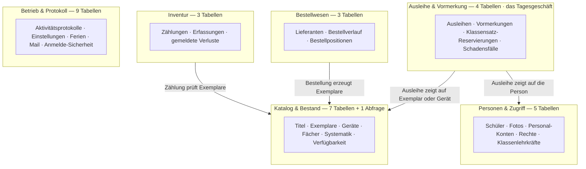
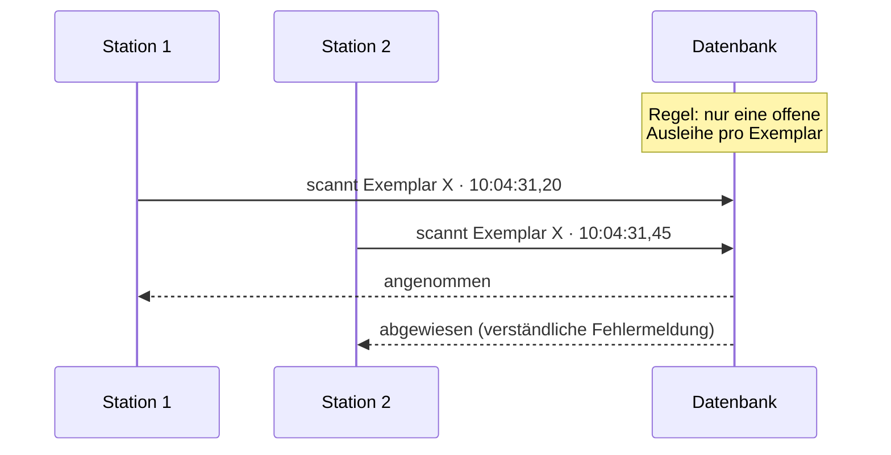
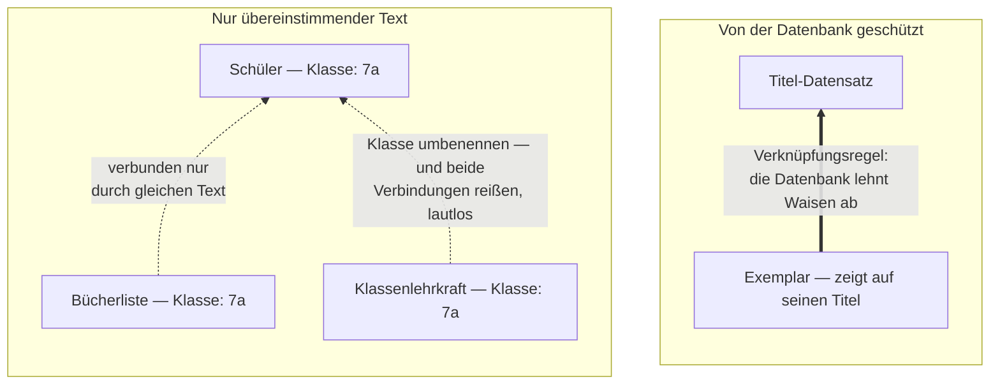

# Schulbibliothek — Prüfbericht zur Datenbankstruktur

> **Datenbank-Prüfung · PostgreSQL · nur lesend, keine Änderungen**

Dieser Bericht untersucht die Datenbank hinter dem selbst gebauten Bibliothekssystem. Die Datenbank ist der Ort, an dem das System alle Informationen speichert: Bücher, Schüler, Ausleihen, Bestellungen. Wir haben ihren Aufbau mit bewährten Regeln des Datenbank-Designs verglichen. Jede Aussage in diesem Bericht wurde gegen die echten Systemdateien geprüft, nicht nur gegen die Diagramme.

| | |
|---|---|
| Erstellt für | **Daniel** |
| Datum | **13.08.2026** |
| Grundlage | **Datenbank-Diagramm + alle 74 Änderungsskripte + Programmcode** |
| Modus | **nur lesend, nichts verändert** |
| Version | **5 — deutsche Fassung; Einstufungen F2/F3/F4 nach Review-Diskussion angepasst** |

> **Hinweis:** Dieselbe Fassung mit gestalteten Diagrammen liegt als [`datenbank-pruefbericht.html`](datenbank-pruefbericht.html) daneben (im Browser öffnen). Diese Markdown-Fassung zeigt GitHub direkt an.

---

## 1 Wie man diesen Bericht liest

Eine Datenbank speichert Informationen in **Tabellen**. Eine Tabelle sieht aus wie eine Excel-Tabelle. Jede **Zeile** ist ein Datensatz, zum Beispiel ein Schüler. Jede **Spalte** ist eine Eigenschaft, zum Beispiel die Klasse des Schülers. Der Bericht benutzt wenige Fachbegriffe. Hier ist ihre Bedeutung:

- **Verknüpfungsregel** — Eine Regel, die zwei Tabellen verbindet (Fachwort: Foreign Key / Fremdschlüssel). Beispiel: Jede Ausleihe muss auf ein echtes Buch zeigen. Die Datenbank lehnt dann Datensätze ab, die ins Leere zeigen. Ohne diese Regel existiert die Verbindung nur in den Köpfen der Programmierer.
- **Prüfregel** — Eine Regel, die die Datenbank bei jedem Datensatz durchsetzt (Fachwort: Constraint). Beispiel: „Ein Bestand darf nicht negativ sein." Die Datenbank lehnt jeden Datensatz ab, der die Regel verletzt.
- **Änderungsskript** — Eine kleine Datei, die den Aufbau der Datenbank verändert (Fachwort: Migration). Das System hat 74 davon. Zusammen erzählen sie die gesamte Entstehungsgeschichte der Datenbank.
- **Gespeicherte Abfrage** — Eine hinterlegte Berechnung, die immer frische Ergebnisse zeigt (Fachwort: View). Beispiel: „Wie viele Exemplare dieses Titels sind gerade verfügbar?"
- **Spezialwert** — Ein normal aussehender Textwert, der heimlich das Verhalten des Programms ändert. Nur der Programmierer weiß, dass er besonders ist. Dieser Bericht findet mehrere davon.

Jeder Befund hat eine Einstufung: **Hoch**, **Mittel** oder **Niedrig**. „Hoch" bedeutet: vor dem Echtbetrieb beheben. Jeder Befund endet mit einer Zeile „Technischer Nachweis". Diese Zeile kann man überspringen; sie erlaubt einem Entwickler, den Befund nachzuprüfen.

---

## 2 Was die Datenbank enthält

Die Datenbank hat **31 Tabellen und 1 gespeicherte Abfrage**. Sie bilden sechs Gruppen: den Katalog, die Personen, die Ausleihe, das Bestellwesen, die Inventur und die Selbstverwaltung des Systems. Der Aufbau folgt durchgehend modernen, sicheren Standards.

| Kennzahl | Wert |
|---|---:|
| Tabellen + gespeicherte Abfrage | 31 + 1 |
| fachliche Gruppen | 6 |
| durchgesetzte Verknüpfungsregeln | ~39 |
| Verbindungen ohne Regel | 6 |
| Änderungsskripte | 74 |
| Sperren gegen Doppelbuchung | 4 |

*Die sechs Gruppen und ihre Verbindungen. Die Ausleihe-Tabellen liegen in der Mitte. Sie zeigen auf den Katalog auf der einen Seite und auf die Personen auf der anderen Seite.*

---

## 3 Was wirklich gut gelöst ist

Zuerst die gute Nachricht. Diese Datenbank ist **deutlich besser**, als man es bei einem Erstlingsprojekt erwarten würde. Mehrere Teile folgen genau dem Muster, das ein erfahrener Datenbank-Designer wählen würde. Einige Teile lösen Probleme, die viele kommerzielle Systeme falsch machen.

**Kein Buch kann doppelt verliehen werden.** Die Datenbank selbst lehnt eine zweite offene Ausleihe für dasselbe Exemplar ab. Das ist wichtig, weil 8 Scanner-Stationen gleichzeitig arbeiten. Scannen zwei Stationen dasselbe Buch in derselben Sekunde, nimmt die Datenbank eine Ausleihe an und weist die andere ab. Das Programm kann diese Regel nicht brechen, auch nicht durch einen Fehler.

**Eine Ausleihe zeigt immer auf etwas Echtes.** Eine Ausleihe betrifft ein Buch *oder* ein Gerät und geht an einen Schüler *oder* eine Lehrkraft mit Konto. Die Datenbank erzwingt „genau eines von beiden". Beide Verbindungen sind echte Verknüpfungsregeln. Viele Systeme lösen das mit losen Textfeldern; dieses macht es richtig.

**Löschen ist durchdacht.** Ein Exemplar mit Ausleih-Geschichte kann man nicht löschen. Löscht man einen Titel, verschwinden seine Exemplare mit. Wird ein Personal-Konto gelöscht, funktionieren die Protokolle weiter. Diese drei Löschverhalten sind über alle ~39 Verknüpfungsregeln einheitlich angewendet.

**Abgegangene Schüler blockieren keine zurückkehrenden.** Schüler werden zunächst nie wirklich gelöscht, sondern als gelöscht markiert. Die Eindeutigkeitsregeln gelten nur für aktive Schüler. Ein Schüler, der geht und wiederkommt, verursacht deshalb keinen Konflikt. Ein Änderungsskript (048) zeigt, dass der Autor genau hier einen versteckten Fehler fand und behob — mit vorbildlicher schriftlicher Begründung.

**Die Datenbank prüft ihre eigenen Daten.** Bestände können nicht negativ werden. Statusfelder akzeptieren nur gültige Werte. Ein ausgesondertes Exemplar braucht einen Aussonderungsgrund. Für jede dieser Regeln gibt es einen automatischen Test, der beweist, dass die Regel schlechte Daten wirklich abweist.

**Verfügbarkeit wird immer frisch berechnet.** „Wie viele Exemplare sind frei?" wird live aus den echten Ausleihen berechnet — nicht als gespeicherte Zahl geführt, die veralten kann. Das ist das sicherere Design. (Eine Ausnahme gibt es — siehe Befund F5.)

**Sorgfalt bei Schülerdaten.** Schülerfotos liegen verschlüsselt in einer eigenen, getrennten Tabelle. Adressen wurden bewusst *nicht* aus dem alten Littera-System übernommen. Das Aktivitätsprotokoll kann nachträglich nicht verändert werden.

**Die Geschichte bleibt wahr.** Eine Bestellung merkt sich den Lieferantennamen zum Bestellzeitpunkt. Ein Verlust-Eintrag merkt sich den Buchtitel. Wird der Lieferant oder das Buch später umbenannt oder gelöscht, zeigt die Geschichte trotzdem, was wirklich war. Das ist absichtlich so und korrekt.

*Die Sperre gegen Doppel-Scans. Scannen zwei Stationen dasselbe Buch, bekommt die langsamere eine verständliche Fehlermeldung. Die Regel lebt in der Datenbank selbst; kein Programmfehler kann sie aushebeln. Dieselbe Sperre schützt Geräte.*

---

## 4 Befunde

Die Befunde sind nach Schwere geordnet. Ein Muster verbindet fast alle: **Wo die Datenbank durchgesetzte Regeln benutzt, ist das Design ausgezeichnet. Wo sie auf ungeschriebene Konventionen setzt, schützt nichts die Daten.** Eine Konvention ist eine Vereinbarung, die nur im Kopf des Programmierers lebt — oder in einem Kommentar.

### F1 — Ein Notizfeld steuert heimlich das Bestellwesen · `Hoch`

Jedes Exemplar hat ein Notizfeld namens `zustand_notiz` („Zustandsnotiz"). Das Personal nutzt es für freien Text, zum Beispiel „Einband beschädigt". Dasselbe Feld hat aber einen versteckten zweiten Job: **Das Bestellwesen schreibt seinen Status hinein.** Wird ein Buch bestellt, steht im Feld „Bestellt…" oder „Im Zulauf…". Das Programm liest das Feld später zurück und sucht nach diesen Wörtern, um bestellte Exemplare zu finden.

Das erzeugt ein echtes Problem. Angenommen, jemand vom Personal tippt eine ganz normale Notiz: „Bestellt am 3.9. neu, alter Band verloren". Das Programm hält dieses Exemplar jetzt für eine laufende Bestellung. Das Exemplar **verschwindet stillschweigend aus dem öffentlichen Katalog** und taucht auf der Wareneingangs-Liste auf. Niemand bekommt eine Fehlermeldung. Auch umgekehrt: Formuliert jemand eine Bestell-Notiz um, bricht die Bestellverfolgung.

Freier Text, den Menschen bearbeiten sollen, darf niemals das System steuern. Die Korrektur ist klein: Der Bestellstatus bekommt ein eigenes Feld mit einer Prüfregel. Für andere Status macht das System das bereits richtig.

> *Technischer Nachweis:* `internal/service/order_service.go:46` und `api/opac.go:96,102` lesen das Notizfeld per Textmuster (`LIKE 'Im Zulauf%'` u. a.); eine Statusspalte für die Bestell-Pipeline existiert nicht.

### F3 — Wichtige Verbindungen existieren nur als übereinstimmender Text · `Hoch`

Die Datenbank hat rund 39 echte Verknüpfungsregeln. Aber sechs wichtige Verbindungen haben **gar keine Regel**. Sie funktionieren nur, weil derselbe Text an zwei Stellen steht. Das wichtigste Beispiel: Die Schüler-Tabelle speichert die Klasse als bloßen Text („7a"). Die Klassenlehrer-Tabelle speichert die Klasse ebenfalls als bloßen Text. Nichts verbindet die beiden. Das Mahnwesen führt sie zusammen, indem es die Texte vergleicht.

| Verbindung | Wie sie heute funktioniert | Was schiefgehen kann |
|---|---|---|
| Schüler ↔ Klassenlehrkraft | Klassenname als Text in beiden Tabellen | Klasse umbenannt → Mahnlisten für diese Klasse bleiben stumm |
| Schüler ↔ Klassen-Bücherliste | Klassenname als Text in beiden Tabellen | Klasse umbenannt → die Liste ist leer, ohne Fehlermeldung |
| Klassenlehrkraft ↔ Personal-Konto | E-Mail-Adresse als Text in beiden Tabellen | E-Mail der Lehrkraft ändert sich → ihre Klassen lösen sich still ab |
| Titel ↔ Fach | Fachname als Text in beiden Tabellen | Fach umbenannt → Titel behalten den alten Namen, Filter finden nichts |
| Titel ↔ Systematik | Kürzel als Text-Anfang der Signatur | Kategorie umbenannt → Regal-Stöbern verliert diese Titel |
| Personal-Konto ↔ Rechte | Rollenname als Text in beiden Tabellen | eine vertippte Rolle wird angenommen und greift einfach nie |

*Durchgezogener Pfeil: Die Datenbank erzwingt die Verbindung. Gestrichelte Linien: Die Verbindung hält nur, solange der Text zufällig übereinstimmt. Das gestrichelte Netz hängt am Klassennamen.*

Warum das für eine Schule zählt: **Jeden August bekommt jede Klasse einen neuen Namen** (aus 7a wird 8a), und die ganze Schülerschaft rückt auf. Die schwächsten Verbindungen dieser Datenbank liegen genau auf dem einen Vorgang, den die Schule jedes Jahr garantiert durchführt. Driften die Texte auseinander, meldet nichts einen Fehler. Mahn-Mails bleiben einfach aus. Bücherlisten kommen einfach leer zurück. Die Symptome zeigen sich Wochen später, weit weg von der Ursache — in einem System, dessen einziger Betreuer dann vielleicht nicht greifbar ist.

> **Einstufung nach Review-Diskussion von Mittel auf Hoch erhöht** — genau aus diesem Grund: Der Schaden ist lautlos, er wächst mit der Zeit, und er zeigt sich weit entfernt von seiner Ursache.

**Der jährliche Klassenwechsel — hier zeigt sich der Fehler in echt.** Das System hat für den Schuljahreswechsel einen eigenen, gut gebauten Ablauf: Ein Knopf im Verwaltungsbereich zählt bei allen aktiven Schülern die Stufe um eins hoch (aus „05a" wird „06a"), markiert die Abschlussklassen als Abgänger und schützt sich mit einer Vorschau, einer Pflicht-Bestätigung und einer Sperre gegen einen zweiten Lauf am selben Tag. Dieser Teil ist vorbildlich.

Der Haken: Der Ablauf ändert **nur die Klasse am Schüler**. Die Tabelle, die jede Klasse ihrer Klassenlehrkraft zuordnet, und die Klassen-Bücherlisten rührt er **nicht** an — beide werden allein von Hand gepflegt. Am Morgen nach dem Wechsel tragen die Schüler ihre neuen Klassennamen, aber die Lehrer-Zuordnung zeigt noch auf die alten. Weil zwischen beiden keine Verknüpfungsregel besteht, meldet nichts einen Fehler. Die Mahnliste einer Klasse geht dann an die Lehrkraft des Vorjahres — oder an niemanden.

**Wiederholer und zusammengelegte oder geteilte Klassen** fängt das System auf der Schülerseite sauber ab: Der maßgebliche Abgleich kommt aus dem Landessystem LUSD und ordnet jeden Schüler über eine feste, personengebundene Nummer neu ein — nicht über Klassen-Rechnerei. Ein Sitzenbleiber wird beim Hochzählen zunächst mit-versetzt und beim nächsten LUSD-Abgleich wieder in seine Klasse zurückgesetzt; aus „2A/2B/2C" werden „3A/3B", indem jeder Schüler einzeln der neuen Klasse zugeordnet wird. Aber auch dieser Weg fasst die Lehrer-Zuordnung und die Bücherlisten nicht an: Eine weggefallene Klasse hinterlässt dort einen verwaisten Eintrag, und die neuen Klassen haben keine Zuordnung, bis jemand sie von Hand anlegt — wieder ohne Fehlermeldung.

**Lösungsweg:** Die Klassenlehrer-Tabelle ist fast schon eine richtige „Klassen"-Tabelle — jede Klasse kommt darin genau einmal vor. Drei Schritte machen das offiziell: Eine Klasse darf auch ohne zugeordnete Lehrkraft existieren, die Tabelle wird mit allen aktuellen Klassen befüllt, dann bekommen die drei Tabellen mit Klassennamen Verknüpfungsregeln. Die Regeln lassen sich so einrichten, dass eine Umbenennung überall zugleich wirkt — der August-Wechsel wird ein einziger sicherer Vorgang. Das schließt drei der sechs Text-Verbindungen. Die übrigen drei (Fach, Systematik, Rolle) sind eigene, kleinere Korrekturen.

> *Technischer Nachweis:* `schema.sql:157` (`schueler.klasse VARCHAR(20)`) gegenüber `schema.sql:227–231` (`klassen_lehrer_mapping.klasse VARCHAR(50) PRIMARY KEY`) — zwei unabhängige Textspalten unterschiedlicher Länge; zwischen keinem der sechs Paare existiert ein Fremdschlüssel. Der Versetzungslauf `api/student_promotion.go` schreibt nur `schueler.klasse`; die Klassenlehrer-Zuordnung wird ausschließlich von Hand über `api/klassen_mapping.go` (Upsert je Klasse) gepflegt. Der LUSD-Abgleich `api/lusd.go` ordnet Schüler über die feste `lusd_id` zu und korrigiert so Wiederholer und Umschichtungen auf der Schülerseite — nicht die Klassen-Zuordnungstabellen.

### F4 — Eine Lehrkraft, die ein Buch ausleiht, wird als Schüler gespeichert · `Hoch`

Leiht eine Lehrkraft auf normalem Weg ein Buch aus, speichert das System sie **als Zeile in der Schüler-Tabelle** — mit dem Spezialwert „lehrer" im Klassenfeld. Das ist keine Vermutung: Die Datenbankdatei selbst sagt es in einem Kommentar, und das Mahnwesen verlässt sich darauf. Wer als „Klasse" den Wert „lehrer" trägt, landet auf einer eigenen Mahnschiene für das Kollegium statt auf der normalen.

Das Verwirrende daran: **Die Datenbank hat für genau diesen Fall bereits den richtigen Mechanismus.** Eine Ausleihe kann offiziell auf ein Personal-Konto zeigen statt auf einen Schüler — der „Handapparat"-Ablauf nutzt das (eine Lehrkraft scannt ein freies Buch und bekommt eine Ein-Jahres-Ausleihe auf ihr Konto). Auch die Datenübernahme aus dem alten Littera-System legt alle Lehrkräfte als Personal-Konten an, nie als Schüler. Der Schein-Schüler-Weg entsteht also nur, wenn jemand eine Lehrkraft von Hand über die Schüler-Maske einträgt. Eine Person kann so **zwei Ausleiher-Identitäten** bekommen: ein Personal-Konto und einen Schein-Schüler — mit unterschiedlichen Regeln, je nachdem, welcher Weg benutzt wurde.

Diese Doppelbedeutung des Wortes „lehrer" hat bereits einen echten Vorfall verursacht. Der Autor musste die Anmelde-Rolle „lehrer" in „kollegium" umbenennen, weil die zwei Bedeutungen kollidierten — das Änderungsskript schreibt wörtlich, die Verwechslung habe „real zu einer falschen Auskunft geführt". Die Umbenennung reparierte die *andere* Bedeutung und ließ den Spezialwert stehen.

> **Einstufung nach Review-Diskussion von Mittel auf Hoch erhöht.** Die verbleibenden Fallen: Jede Liste und jede Statistik nach Klassen muss an die Schein-Klasse denken. Die Datenschutz-Routine, die Abgänger löscht, darf diese Zeilen nie erfassen — obwohl sie ein erfundenes Abgangsjahr tragen, denn das Feld ist Pflicht. Und die Korrektur von F3 kollidiert damit: Eine richtige Klassenliste bräuchte eine Schein-Klasse namens „lehrer".

**Lösungsweg:** Zu Ende bauen, was die Datenbank begonnen hat. Die Schein-Schüler auf echte Personal-Konten umziehen, dem Mahnwesen den Umgang mit Personal-Ausleihen beibringen, und „lehrer" als Klassennamen bei der Eingabe sperren. Das gehört *vor* die F3-Korrektur, damit die Klassenliste die Schein-Klasse nie braucht.

Eine zweite, ähnliche Konvention: **Ob ein Buch ein Lernmittel ist, entscheidet sein Name.** Ein Buch gilt als Schulbuch, wenn Titel oder Signatur mit „lmf" beginnt. Das bestimmt Ausleihlimit und Rückgabefrist (31. Juli). Wird ein Buch umbenannt oder ohne das Kürzel erfasst, ändern sich seine Ausleihregeln stillschweigend. Kein Feld, keine Regel, kein Hinweis am Bildschirm, dass die ersten Buchstaben eines Titels Gesetz sind.

> *Technischer Nachweis:* `schema.sql:34` („schueler.klasse = 'lehrer' meint die Lehrkraft als ENTLEIHER"), `frontend/.../mahnwesen.svelte.js:29` und `MahnwesenTabs.svelte:18` (Sonderbehandlung), `migrations/069_rolle_lehrer_zu_kollegium.sql` (Vorfallsbeschreibung), `internal/service/loan_return.go:96–116` (Personal-Ausleihe/Handapparat), `internal/littera/schreiber_personen.go:219–284` (Import legt Lehrkräfte als Konten an), `pkg/lmf` (Lernmittel-Kürzelregel).

### F2 — Jeder Programmteil sieht den vollständigen Schülerdatensatz · `Mittel`

Die Schüler-Tabelle speichert alles über einen Schüler in einer Zeile: Name, Klasse, Ausweisnummer — und ebenso Wohnadresse, Eltern-E-Mail und Geburtsdatum. Das Programm reicht diese **komplette Zeile** überall herum. Jede Maske, die einen Schüler anzeigt, bekommt auch die sensiblen Felder — außer der Programmierer entfernt sie aktiv.

Genau so sind die zwei bekannten Datenschutz-Probleme entstanden (separat dokumentiert in [`sicherheitsbefund-kiosk-suche.md`](sicherheitsbefund-kiosk-suche.md) und [`sicherheitsbefund-vormerkungen.md`](sicherheitsbefund-vormerkungen.md)): Die Suche an der Scanner-Station und die Vormerkungs-Liste haben die Adressdaten nicht absichtlich *hinzugefügt*. Sie haben nur vergessen, sie aus dem Alles-drin-Datensatz zu *entfernen*. Der sichere Weg ist der Mehrarbeits-Weg — das ist verkehrt herum.

> **Einstufung nach Review-Diskussion von Hoch auf Mittel gesenkt.** Der Tabellenaufbau selbst ist vertretbar; das Leck entsteht an der Programmgrenze und wird in den zwei eigenen Sicherheitsbefunden geführt. Hier bleibt: Das Design macht solche Lecks leicht.

**Lösungsweg:** Gespeicherte Abfragen je Zielgruppe. Eine gespeicherte Abfrage für die Theke, die nur Name, Klasse, Ausweisnummer und Sperrstatus enthält — und alle Theken-Masken müssen sie benutzen. Dann ist „Adresse vergessen zu entfernen" nicht mehr lautlos möglich, sondern unmöglich. Das System nutzt diese Technik bereits für die Buch-Verfügbarkeit; sie passt also zum Stil des Hauses.

> *Technischer Nachweis:* Struct `repository/models.go:68–77`, Routen `api/routes_misc.go:30,35`; siehe die zwei Sicherheitsbefunde im selben Ordner.

### F5 — Zwei verschiedene Antworten auf „Wie viele Exemplare besitzen wir?" · `Mittel`

Das Hauptprogramm beantwortet diese Frage auf dem sicheren Weg: Es zählt die echten Exemplar-Datensätze, live. Die Titel-Tabelle hat aber *zusätzlich* eine gespeicherte Zahl namens `stock` („Bestand"). Ein separates Nebenmodul (der Inventur-Import) schreibt in diese Spalte. Kein Teil des Hauptprogramms liest sie.

Heute ist das vor allem toter Ballast. Das Risiko liegt in der Zukunft: Es gibt jetzt zwei plausibel aussehende Stellen für „wie viele?", und sie stimmen nur zufällig überein. Die nächste Funktion — oder der nächste KI-Assistent — die zur bequemen gespeicherten Zahl greift, zeigt Werte an, die von der Wirklichkeit wegdriften. Entweder die Spalte löschen oder sie zur einen gepflegten Wahrheit machen. Der Zwischenzustand ist die Falle.

> *Technischer Nachweis:* Schreiber in `inventur/db_books_create.go:157,221` und `inventur/db_books_update.go:10`; die Live-Zählung in `migrations/013_view_buecher_bestand.sql`, `api/opac.go`, `internal/service/order_service.go:185–188`. Kein Leser von `titel.stock` im Hauptprogramm gefunden.

### F6 — Zwei Protokoll-Tabellen, einen Buchstaben auseinander · `Niedrig`

Die Datenbank mischt deutsche und englische Namen frei: `buecher_titel` neben `class_books`, `schueler` neben `subjects`. Das ist kosmetisch. Weniger kosmetisch: Es gibt zwei verschiedene Protokoll-Tabellen namens `audit_log` und `audit_logs` — einen Buchstaben auseinander, mit unterschiedlichem Inhalt und Zweck. Jeder künftige Betreuer wird irgendwann in die falsche schauen. In einem Projekt, das an einer Person hängt, summiert sich solche kleine Reibung.

> *Technischer Nachweis:* beide Tabellen existieren mit unterschiedlichen Spalten (`tabelle/aktion/akteur` gegenüber `admin_id/aktion/ip_adresse`).

### F7 — Kleine Ordnungsmängel bei den Änderungsskripten · `Niedrig`

Vier Skript-Nummern existieren doppelt (003, 008, 021, 022 — je zwei verschiedene Dateien). Das System merkt sich Skripte am vollen Dateinamen, deshalb geht heute nichts kaputt. Aber die Nummerierung verspricht eine Ordnung, die sie nicht hält, und ein künftiger Aufräumversuch („Nummern begradigen") wäre gefährlich.

Außerdem: Eine ganz neue Datenbank wird aus einer großen Basisdatei aufgebaut statt durch Abspielen aller 74 Skripte. Zwei Wege zum selben Ergebnis können auseinanderlaufen, und nichts prüft automatisch, ob sie noch übereinstimmen. Der Skript-Läufer selbst ist solide: Jedes Skript läuft ganz oder gar nicht.

> *Technischer Nachweis:* `db/migrations.go` — Erfassung nach Dateiname, eine Transaktion pro Datei, Basisaufbau über `schema.sql` in `ensureBaselineSchema`.

### F8 — Zwei Schüler mit gleichem Namen und Geburtstag können nicht beide existieren · `Niedrig`

Die Datenbank lehnt einen zweiten aktiven Schüler mit gleichem Vornamen, Nachnamen und Geburtsdatum ab. Das Ziel ist gut: versehentliche Doppel-Einträge verhindern. Die schlimmste Variante dieser Regel hat der Autor bereits behoben (Skript 048, mit vorbildlicher Begründung). Was bleibt: Teilen zwei echte Schüler tatsächlich Name und Geburtstag — selten bei ~1.000 Schülern, aber möglich —, lässt sich der zweite gar nicht anlegen. Eine Warnung statt einer harten Ablehnung würde dem Ziel dienen, ohne die Mauer.

> *Technischer Nachweis:* `migrations/048_schueler_gebdatum_dup.sql` — Eindeutigkeitsregel auf (vorname, nachname, geburtsdatum) unter aktiven Schülern mit bekanntem Geburtsdatum.

---

## 5 Bewertung im Überblick

| Bereich | Bewertung | In einem Satz |
|---|---|---|
| Schutz vor Doppelbuchungen | **Stark** | Die Datenbank selbst macht eine Doppel-Ausleihe unmöglich, auch bei 8 gleichzeitigen Stationen. |
| Selbstprüfende Datenregeln | **Stark** | Viele Prüfregeln, jede belegt durch einen automatischen Test, der die Regel schlechte Daten abweisen sah. |
| Löschen und Geschichte | **Stark** | Einheitliches Löschverhalten; historische Einträge behalten ihren Inhalt, auch wenn Stammdaten sich ändern. |
| Berechnete Zahlen | **Stark** | Verfügbarkeit wird immer frisch aus echten Datensätzen berechnet; ein gespeichertes Alt-Feld bleibt übrig (F5). |
| Eine Bedeutung pro Feld | **Schwach** | Ein Notizfeld dient zugleich als Bestellstatus (F1); ein Schein-Klassenwert bedeutet „ist Lehrkraft" (F4). |
| Durchgesetzte Verbindungen | **Schwach** | Sechs wichtige Verbindungen existieren nur als übereinstimmender Text und reißen lautlos (F3). |
| Schutz der Schülerdaten | **Gemischt** | Fotos vorbildlich; der volle Schülerdatensatz wandert standardmäßig überallhin und braucht Abfragen je Zielgruppe (F2). |
| Benennung | **Schwach** | Deutsch und Englisch gemischt; zwei Protokoll-Tabellen einen Buchstaben auseinander (F6). |

---

## 6 Fazit

**Als Datenbank-Design ist das gute Arbeit — klar besser als der Durchschnitt kommerzieller Systeme, und bemerkenswert für eine Person, die es in zehn Wochen mit KI-Unterstützung gebaut hat.** Die wirklich schweren Probleme (gleichzeitige Scanner-Stationen, Ausleihen an verschiedene Arten von Zielen, Schüler, die gehen und wiederkommen, Geschichte, die sich nicht umschreiben darf) sind mit den richtigen Mechanismen gelöst, und automatische Tests belegen, dass sie funktionieren.

Die Schwächen sind keine zufällige Schlamperei. Sie folgen alle einem Muster: **Wo eine Regel als Konvention aufgeschrieben statt als Datenbankregel eingebaut wurde, kann die Datenbank sie nicht verteidigen.** Bestellstatus versteckt im Notizfeld (F1). Klassen-Verbindungen, die nur an gleichem Text hängen (F3). „Ist Lehrkraft" versteckt in einem Schein-Klassennamen und „ist Lernmittel" versteckt in einem Namenskürzel (F4). Jede dieser Stellen ist mit vertretbarem Aufwand zu beheben. F1, F3 und F4 gehören vor den Echtbetrieb. F4 gehört vor F3. F3 muss in jedem Fall vor den ersten Schuljahreswechsel, wenn alle Klassen auf einmal umbenannt werden. F2 löst man am besten mit gespeicherten Abfragen je Zielgruppe, zusammen mit den zwei separaten Sicherheitsbefunden.

Für die größere Frage schneidet das in beide Richtungen. Es stärkt die Antwort auf *„Ist das gute Software?"* — die Datenbank ist nicht das Risiko. Und es schärft die Antwort auf *„Sollte eine Schule das als kritische Infrastruktur betreiben?"* — denn Konventionen-statt-Regeln ist genau die Fehlerart, die den ursprünglichen Autor in Reichweite braucht. Die Datenbank hält die Daten von allein konsistent. Aber ein Teil dessen, was die Daten *bedeuten*, lebt derzeit im Gedächtnis einer Person: welche Texte besonders sind.

---

## 7 Methode & Grenzen

Grundlage: das vollständige Datenbank-Diagramm ([`bibliothek-erd.svg`](bibliothek-erd.svg)), alle 74 Änderungsskripte, der Skript-Läufer und gezieltes Lesen des in den Befunden genannten Programmcodes. Jede als „Technischer Nachweis" markierte Aussage wurde gegen die echten Dateien geprüft, nicht aus der Dokumentation übernommen. Grenzen: Es wurde keine laufende Datenbank untersucht (echte Datensatzzahlen und Antwortzeiten liegen außerhalb dieses Berichts), und das Diagramm kürzt die breitesten Tabellen — die Titel-Tabelle hat einige zusätzliche Spalten, die nicht abgebildet sind; keine davon ändert die Befunde.
