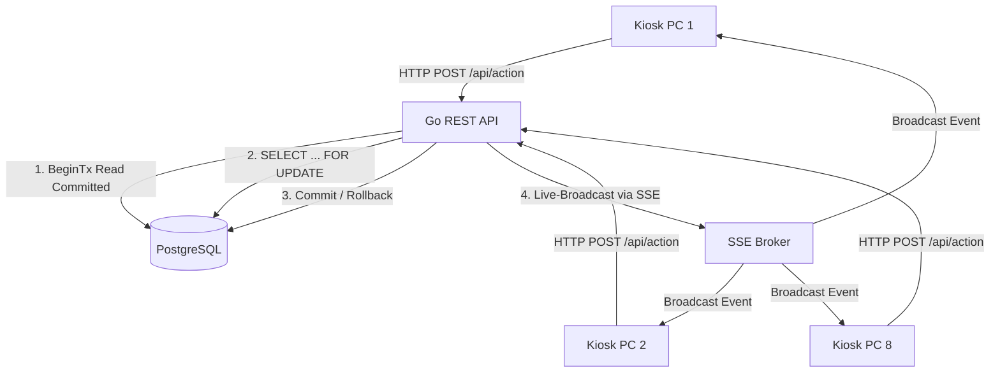

# 🏗️ System-Architektur & Concurrency-Modell

Dieses Dokument beschreibt das Concurrency-Modell zur Lastverteilung bei parallelen Kiosk-Stationen sowie das Design der JSONB-Erweiterbarkeit der Schulbibliothek.

---

## ⚡ Concurrency-Modell (8-PC-Lastverteilung am Tresen)

Im Schulalltag (z. B. in Pausen oder Klassen-Ausleihstunden) müssen bis zu **8 Kiosk-Scanstations (Laptops/PCs/Tablets) zeitgleich** am Ausleihtresen arbeiten können. Das System wurde so konzipiert, dass es Race Conditions, Doppel-Scans und Netzwerk-Lags ohne Datenverlust oder Inkonsistenzen verarbeitet.



### 1. Transaktions-Isolation & Zeilenbasierte Sperren
* **READ COMMITTED**: Alle Datenbankoperationen laufen auf der standardmäßigen PostgreSQL-Stufe *Read Committed*. Das garantiert hohe Durchsatzraten bei gleichzeitigen Zugriffen verschiedener PCs auf unterschiedliche Bücher.
* **Row-Level Locking (`SELECT ... FOR UPDATE`)**:
  Bei jedem Checkout- und Return-Vorgang wird die Buchkopie (`buecher_exemplare`) sowie eine eventuell bestehende aktive Ausleihe über `SELECT ... FOR UPDATE` innerhalb der Transaktion gesperrt.
  * *Szenario*: Zwei Helfer scannen dasselbe Buch im selben Moment. Der erste Request erhält die Sperre. Der zweite Request wartet, bis die erste Transaktion abgeschlossen (Committed/Rolled Back) ist, liest den aktualisierten Zustand (Buch bereits entliehen/zurückgegeben) und bricht sauber mit einer Fehlermeldung ab, anstatt korrupte Doppel-Einträge zu erzeugen.

### 2. Schutz vor WLAN-Lags & Mehrfach-Scans (Idempotenz)
* **Unique Constraints**: Die Tabelle `ausleihen` besitzt einen Unique Partial Index:
  ```sql
  CREATE UNIQUE INDEX unique_active_loan 
  ON ausleihen (exemplar_id) 
  WHERE rueckgabe_am IS NULL;
  ```
* **Idempotenz**: Bei `CreateLoan` wird `INSERT INTO ... ON CONFLICT DO NOTHING` verwendet. Wenn ein Scanner aufgrund eines Lags oder zittriger Hände ein Buch zweimal innerhalb von Millisekunden scannt, wird die zweite Anfrage ignoriert, anstatt eine weitere aktive Ausleihe anzulegen.

### 3. Echtzeit-Synchronisation (SSE Broker)
Damit alle 8 Kiosk-PCs stets denselben UI-Zustand sehen (z. B. wenn ein Schüler an PC 1 aufgerufen wird, darf er nicht zeitgleich an PC 2 verbucht werden), sendet der Server nach jedem erfolgreichen DB-Commit Events über Server-Sent Events (SSE) an alle verbundenen Web-Clients. Diese aktualisieren ihre Ansichten in Echtzeit.

---

## 🗄️ JSONB-Erweiterbarkeit (Flexibles Datenbankschema)

Um das Datenbankschema zukunftssicher und ohne ständige Migrationsskripte erweiterbar zu machen, besitzen die Haupttabellen flexible `erweiterte_eigenschaften`-Spalten vom Typ `JSONB`.

### Spaltendefinitionen
* `buecher_titel.erweiterte_eigenschaften` (Default `{}`)
* `buecher_exemplare.erweiterte_eigenschaften` (Default `{}`)
* `audit_logs.details` (Default `NULL`)

### Vorteile von JSONB in PostgreSQL
1. **Schema-Freiheit**: Zusätzliche Attribute wie Regal-Positionen (`shelf_location`), Zustand-Feindetails (`condition`), Antolin-Punkte oder externe IDs können beliebig als Key-Value-Paare gespeichert werden.
2. **Indizierung**: Bei Bedarf können PostgreSQL-GIN-Indizes (`Generalized Inverted Index`) auf diese Spalten gelegt werden, um Suchen innerhalb der JSON-Objekte extrem schnell zu machen.
3. **Typensicherheit in Go**: Im Go-Backend werden diese Spalten als `map[string]any` oder strukturierte Go-Structs deserialisiert, was eine saubere Typkonvertierung garantiert.
