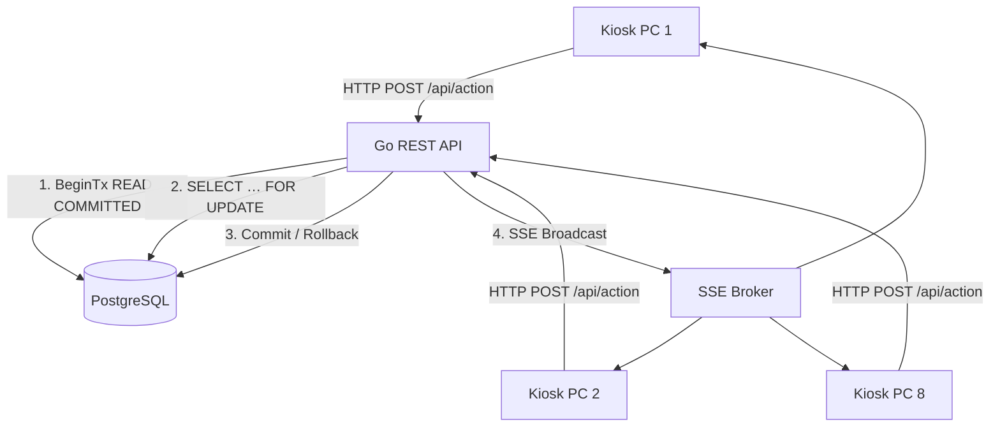

# System Architecture & Technical Concepts

> Last updated: 2026-06-24

---

## Layered Architecture (Go Backend)

```
HTTP Request
     │
     ▼
┌─────────────────────────────────────┐
│  Middleware Chain (api/)            │
│  Rate Limiter → Auth (JWT) →        │
│  CSRF → RBAC → Security Header      │
└─────────────────┬───────────────────┘
                  │
                  ▼
┌─────────────────────────────────────┐
│  Handler / Router (api/)            │
│  HTTP Parsing, Validation,          │
│  JSON Response                      │
└─────────────────┬───────────────────┘
                  │
                  ▼
┌─────────────────────────────────────┐
│  Service Layer (internal/service)   │
│  Business Logic, Orchestration,     │
│  PDF, E-Mail, Event Dispatch        │
└─────────────────┬───────────────────┘
                  │
                  ▼
┌─────────────────────────────────────┐
│  Repository Layer (repository/)     │
│  SQL, pgx/v5, Mapping → Go Structs  │
└─────────────────┬───────────────────┘
                  │
                  ▼
           PostgreSQL 15/16
```

---

## ⚡ Concurrency Model (8-PC Load Distribution)

Up to 8 kiosk stations operate simultaneously. The system prevents race conditions, double scans, and inconsistencies through three layers:

### 1. Transaction Isolation & Row-Level Locking
- **READ COMMITTED** (PostgreSQL standard): high throughput for parallel access
- **`SELECT … FOR UPDATE`** on `buecher_exemplare` and active loans: a second parallel scan waits, reads the current state, and aborts cleanly

### 2. Data Integrity via Unique Partial Index
```sql
-- Migration 033 — prevents two active loans on the same copy
CREATE UNIQUE INDEX unique_active_loan
    ON ausleihen (exemplar_id)
    WHERE rueckgabe_am IS NULL;

CREATE UNIQUE INDEX unique_active_device_loan
    ON geraete_ausleihen (geraet_id)
    WHERE rueckgabe_am IS NULL;
```
- Protects against TOCTOU races with idempotency keys (atomic DB level, not just application level)
- Unique violation maps to HTTP 409 Conflict (`mapLoanCreateErr`)

### 3. Real-Time Synchronization (SSE Broker)
After each DB commit, the server broadcasts an update to all connected clients via Server-Sent Events (SSE). All kiosk PCs see the same state in real-time.



---

## 🔄 Idempotency Keys

Each scan request carries an `item.id`-based idempotency key:
- Duplicate key → cached response is returned (no second DB write)
- 5xx errors are not cached (retry possible)
- TTL cleanup runs daily (24h cron)
- **Additional protection via DB unique index** (Migration 033): even if two requests with the same key pass the idempotency check simultaneously, the index prevents a second active loan

---

## 🗄️ Database Design

### Catalog vs. Inventory (Strict Separation)
- **`buecher_titel`** — metadata (ISBN, title, author, publisher, target grade, LMF flag)
- **`buecher_exemplare`** — physical instances (barcode, condition, `ist_ausleihbar`)
- **`ausleihen`** — active and historical loans (linked to copy + student)

### JSONB Extensibility
Main tables have `erweiterte_eigenschaften JSONB DEFAULT '{}'` for ad-hoc attributes (shelf position, call number, external IDs) without schema migration:
- `buecher_titel.erweiterte_eigenschaften`
- `buecher_exemplare.erweiterte_eigenschaften`
- `audit_logs.details`

GIN indexes can be applied to these columns if necessary.

### Enum Casing
`benutzer_rolle` is a PostgreSQL ENUM with lowercase values: `admin`, `lehrer`, `mitarbeiter`.
SQL comparisons must use `LOWER(rolle::text)` (no `= 'LEHRER'`).

### Migration Hygiene
- Migrations are numbered (`NNN_description.sql`) and deduplicated via the `schema_migrations` table
- The seed list in `schema.sql` must exactly match the files in `migrations/` (no phantom entries, no missing entries)
- Duplicate number prefixes (003, 008, 021, 022) sort deterministically and have no order dependency — style smell, but functionally correct
- **Idempotency**: All migrations must use `IF NOT EXISTS` / `IF EXISTS` / `DO $$ BEGIN … EXCEPTION WHEN …`

---

## 🏗️ Repository Layer — Error Handling

All `rows.Next()` loops end with a `rows.Err()` check:
```go
for rows.Next() {
    // scan …
}
if err := rows.Err(); err != nil {
    return nil, fmt.Errorf("…: %w", err)
}
```
**Why critical:** Without `rows.Err()`, a connection drop in the middle of iteration would be treated as success — the returned list would silently be incomplete. In `audit_books.go`, this could have caused a title to be treated as "borrowable" despite active loans.

---

## 📡 SSE Broker (Real-Time)

- Central event loop, no goroutine per client
- `RLock`/`Lock` prevent send-on-closed
- Non-blocking broadcast (buffered channel) — a slow client does not block others
- Heartbeat + context cancellation on graceful shutdown

---

## ⚙️ Background Jobs

| Job | Schedule | Function |
|---|---|---|
| GDPR Anonymization | Startup + daily | `RunGDPRAnonymizeLoans` — deletes `bearbeiter_id` after 14 days |
| GDPR Graduate Deletion | Startup + daily | `RunGDPRDeleteAbgaenger` — Hard delete after grace period |
| DB Backup | Daily 02:30 | `pg_dump` → gzip → AES-GCM |
| Idempotency TTL | Daily | Cleans up expired idempotency keys (24h) |
| Cover Sync | On-demand + daily | Worker pool (8), re-entrancy guard, FAILED-retry |

---

## 🔌 External Dependencies

| Package | Purpose |
|---|---|
| `jackc/pgx/v5` | PostgreSQL driver (Connection pool, type-safe queries) |
| `golang-jwt/jwt` | JWT signing and verification (HMAC-only) |
| `chai2010/webp` | WebP decoding for cover images (CGO) |
| `go-playground/validator/v10` | Struct validation of all API payloads |
| `getsentry/sentry-go` | Error tracking (optional via `SENTRY_DSN`) |
| `jung-kurt/gofpdf` | PDF generation (dunning, graduates, damages) |
| `emersion/go-imap` | IMAP for incoming email |

### Build Tags
- `//go:build odbc` — isolates the `cmd/littera_migration` ODBC dependency; default build (`go build ./...`) does not require `unixODBC`

---

## 🎨 Frontend Architecture (Svelte 5 Runes)

### Design System: Flat & Edge-to-Edge
- No card/tile anti-pattern at the layout level
- Separation by `border-b border-gray-200` instead of box-shadow
- Container: `max-w-5xl` to `max-w-6xl`, `w-full`
- Labels: `text-sm font-medium text-gray-600`
- Important fields/values: `text-lg font-medium`
- **Kept** as cards: Modals, toasts, dropdowns, cover gallery tiles

### Component Rules
- ≤ 200 lines per `.svelte` file
- Logic-free subcomponents using `{#snippet}` / `{@render}` for DRY
- Data arrays outsourced to `.js` metadata files (e.g., `permissionMetadata.js`)

### State Management
- Svelte 5 Runes (`$state`, `$derived`, `$props`, `$bindable`) — local, no global store
- SSE reconnect with guards (`isLoggedIn`, timeout)
- Offline queue: Items removed only on 2xx/permanent 4xx; retained on 5xx/network errors

### RBAC in Frontend
- Menu items are hidden client-side via permission map
- **The authority is exclusively the backend**: every data query is permission-gated (`RequirePermission`)
- Forced view without permission → 403, no data leak
