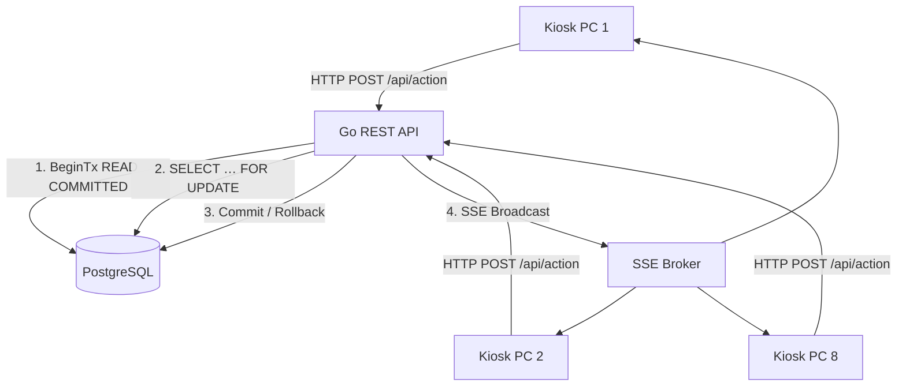

# Systemarchitektur & technische Konzepte

> Zuletzt aktualisiert: 2026-08-11

---

## Schichtenarchitektur (Go Backend)

```
HTTP Request
     │
     ▼
┌─────────────────────────────────────┐
│  Globale Middleware-Kette (api/)    │
│  PanicRecovery → Sentry →           │
│  Security-Header → CORS → Logging → │
│  HTTPS-Redirect → Lesefrist →       │
│  Body-Limit → Timeout →             │
│  Rate-Limiter → CSRF → UUID-Check   │
└─────────────────┬───────────────────┘
                  │
                  ▼
┌─────────────────────────────────────┐
│  Auth (JWT) + RBAC                  │
│  NICHT global, sondern als Wrapper  │
│  pro Route: RequirePermission(…) /  │
│  RequireRoles(…) — siehe            │
│  routes_authz_coverage_test.go      │
└─────────────────┬───────────────────┘
                  │
                  ▼
┌─────────────────────────────────────┐
│  Handler / Router (api/)            │
│  HTTP-Parsing, Validierung,         │
│  JSON-Response                      │
└─────────────────┬───────────────────┘
                  │
                  ▼
┌─────────────────────────────────────┐
│  Service-Schicht (internal/service) │
│  Geschäftslogik, Orchestrierung,    │
│  PDF, E-Mail, Event-Dispatch        │
└─────────────────┬───────────────────┘
                  │
                  ▼
┌─────────────────────────────────────┐
│  Repository-Schicht (repository/)   │
│  SQL, pgx/v5, Mapping → Go-Structs  │
└─────────────────┬───────────────────┘
                  │
                  ▼
           PostgreSQL 15/16
```

### Neben der Anfragekette: die Einmal-Werkzeuge

Die Altbestandsübernahme läuft nicht über diese Schichten, sondern als eigenes Kommando
gegen dieselbe Datenbank. Sie hat deshalb einen eigenen kleinen Unterbau:

| Paket | Aufgabe |
|---|---|
| `internal/littera` | Liest den Littera-Export (`mdb-export`-CSVs), bildet ihn auf die Begriffe dieser Anwendung ab und schreibt ihn — Bestand, Personen, Ausleihen |
| `internal/uebernahme` | Das Gemeinsame jeder Übernahme: Savepoint je Datensatz, Einordnung von Postgres-Fehlern nach SQLSTATE, ISBN-Prüfung, Spaltenbreiten, Protokoll mit getrennten Zählern für Abwertung und Ausfall |
| `cmd/littera-altbestand` | Das Kommando davor (siehe [SCRIPTS.md](SCRIPTS.md)) |

Warum das ein eigenes Paket ist und nicht in `cmd/` liegt: Die Härtung entstand in
`cmd/migrate` und wurde dort gegen echtes PostgreSQL erarbeitet. Eine zweite Kopie für
Littera hätte bedeutet, dass die zweite Fassung dieselben Fehler noch einmal macht — der
fehlende Savepoint war jahrelang unbemerkt und kostete im Fehlerfall ganze Batches.

---

## ⚡ Concurrency-Modell (8-PC-Lastverteilung)

Bis zu 8 Kiosk-Stationen arbeiten zeitgleich. Das System verhindert Race Conditions, Doppel-Scans und Inkonsistenzen durch drei Schichten:

### 1. Transaktions-Isolation & Row-Level-Locking
- **READ COMMITTED** (PostgreSQL-Standard): hoher Durchsatz bei parallelen Zugriffen
- **`SELECT … FOR UPDATE`** — welche Zeile gesperrt wird, hängt vom Pfad ab, und das ist keine Formsache (nachgezählt 11.08.2026, es sind genau fünf Stellen):

  | Pfad | gesperrte Zeile | Fundstelle |
  |---|---|---|
  | Scan eines Exemplars | die **aktive Ausleihe** (`ausleihen`) | `GetActiveLoanByCopyIDTx` |
  | Ausleihe an einen Schüler | die **Schüler**-Zeile | `loan_checkout.go` |
  | Rückgabe mit Vormerkung | die **Vormerkung** (`FOR UPDATE OF v SKIP LOCKED`) | `loan_return.go` |
  | Geräte-Ausleihe | die aktive Geräte-Ausleihe | `device_service.go` |
  | Schaden erfassen | die **Exemplar**-Zeile (`buecher_exemplare`) | `damage.go` |

  Hier stand bis zum 11.08.2026, der Scan sperre `buecher_exemplare`. Das tut nur der
  Schadens-Pfad. Der Unterschied ist wichtig: Scannen **zwei verschiedene** Stationen
  dasselbe Exemplar für **verschiedene** Schüler, greift keine gemeinsame Zeilensperre —
  dann trägt allein der Unique-Index aus Schicht 2. Er ist also nicht Gürtel zum
  Hosenträger, sondern an dieser Stelle der einzige Schutz.

### 2. Datenintegrität durch Unique-Partial-Index
```sql
-- migrations/033_unique_active_loan.sql — verhindert zwei aktive Ausleihen
-- auf demselben Exemplar bzw. Gerät. Beide Indizes liegen auf DERSELBEN
-- Tabelle: ausleihen trägt exemplar_id und geraet_id nebeneinander
-- (check_loan_item erzwingt, dass genau eine der beiden gesetzt ist).
CREATE UNIQUE INDEX IF NOT EXISTS uniq_ausleihen_aktiv_exemplar
    ON ausleihen (exemplar_id)
    WHERE rueckgabe_am IS NULL AND exemplar_id IS NOT NULL;

CREATE UNIQUE INDEX IF NOT EXISTS uniq_ausleihen_aktiv_geraet
    ON ausleihen (geraet_id)
    WHERE rueckgabe_am IS NULL AND geraet_id IS NOT NULL;
```
- Schützt auch gegen TOCTOU-Race bei Idempotenz-Keys (atomare DB-Ebene, nicht nur Applikationsebene)
- Unique-Verletzung wird zu HTTP 409 Conflict gemappt (`mapLoanCreateErr`)

### 3. Echtzeit-Synchronisation (SSE Broker)
Nach jedem DB-Commit sendet der Server über Server-Sent Events (SSE) ein Update an alle verbundenen Clients. Alle Kiosk-PCs sehen denselben Zustand in Echtzeit.


```mermaid
graph TD
    PC1[Kiosk PC 1] -->|HTTP POST /api/action| API[Go REST API]
    PC2[Kiosk PC 2] -->|HTTP POST /api/action| API
    PC8[Kiosk PC 8] -->|HTTP POST /api/action| API
    API -->|1. BeginTx READ COMMITTED| DB[(PostgreSQL)]
    API -->|2. SELECT … FOR UPDATE| DB
    API -->|3. Commit / Rollback| DB
    API -->|4. SSE Broadcast| SSE[SSE Broker]
    SSE --> PC1
    SSE --> PC2
    SSE --> PC8
```

---

## 🔄 Idempotenz-Keys

Jeder Scan-Request trägt einen `item.id`-basierten Idempotenz-Key:
- Doppelter Key → gespeicherte Antwort wird zurückgegeben (kein zweiter DB-Write)
- 5xx-Fehler werden nicht gecacht (Retry möglich)
- TTL-Cleanup läuft **stündlich** (`17 * * * *`); die **24 h** sind die Aufbewahrung, nicht der Takt. Hier stand bis zum 11.08.2026 „täglich (24h-Cron)" — die beiden Zahlen waren verwechselt
- **Zusätzliche Absicherung durch DB-Unique-Index** (Migration 033): selbst wenn zwei Requests mit gleichem Key gleichzeitig die Idempotenz-Prüfung passieren, verhindert der Index eine zweite aktive Ausleihe

---

## 🗄️ Datenbankdesign

### Katalog vs. Bestand (strikte Trennung)
- **`buecher_titel`** — Metadaten (ISBN, Titel, Autor, Verlag, Ziel-Jahrgang, LMF-Flag)
- **`buecher_exemplare`** — physische Instanzen (Barcode, Zustand, `ist_ausleihbar`)
- **`ausleihen`** — aktive und historische Ausleihen (verknüpft mit Exemplar + Schüler)

### JSONB-Erweiterbarkeit
Haupttabellen haben `erweiterte_eigenschaften JSONB DEFAULT '{}'` für ad-hoc-Attribute (Regalposition, Signatur, externe IDs) ohne Schema-Migration:
- `buecher_titel.erweiterte_eigenschaften`
- `buecher_exemplare.erweiterte_eigenschaften`
- `audit_logs.details`

GIN-Indizes können bei Bedarf auf diese Spalten gelegt werden.

### Enum-Casing
`benutzer_rolle` ist ein PostgreSQL-ENUM mit lowercase-Werten: `admin`, `kollegium`,
`mitarbeiter`, `helfer` (`schema.sql`). SQL-Vergleiche müssen `LOWER(rolle::text)`
verwenden (kein `= 'KOLLEGIUM'`).

`helfer` kam mit Migration 042 dazu; `kollegium` hieß bis Migration 069 `lehrer` — das
Wort war doppelt belegt und bezeichnet seither nur noch den **Entleihertyp**
(`schueler.klasse = 'lehrer'`, Handapparat). Wer nach dem alten Namen greppt, findet
deshalb weiterhin Treffer, die richtig sind.

### Migrations-Hygiene
- Migrationen sind nummeriert (`NNN_beschreibung.sql`) und werden via `schema_migrations`-Tabelle dedupliziert
- Die Seed-Liste in `schema.sql` muss exakt mit den Dateien in `migrations/` übereinstimmen (kein Phantom-Eintrag, kein fehlender Eintrag)
- Doppelte Zahlenpräfixe (003, 008, 021, 022) sortieren deterministisch und haben keine Reihenfolge-Abhängigkeit — Style-Smell, aber funktional korrekt
- **Idempotenz**: Alle Migrationen müssen `IF NOT EXISTS` / `IF EXISTS` / `DO $$ BEGIN … EXCEPTION WHEN …` verwenden

---

## 🏗️ Repository-Schicht — Fehlerbehandlung

Alle `rows.Next()`-Schleifen enden mit einer `rows.Err()`-Prüfung:
```go
for rows.Next() {
    // scan …
}
if err := rows.Err(); err != nil {
    return nil, fmt.Errorf("…: %w", err)
}
```
**Warum kritisch:** Ohne `rows.Err()` würde ein Verbindungsabbruch mitten in der Iteration als Erfolg behandelt — die zurückgegebene Liste wäre still unvollständig. In `audit_books.go` hätte dies dazu führen können, dass ein Titel trotz aktiver Ausleihen als "ausleihbar" behandelt wird.

---

## 📡 SSE Broker (Real-Time)

- **Kein Event-Loop.** Der Broker führt überhaupt keine eigene Goroutine — weder eine zentrale Schleife noch eine je Client. Der Zustand (`map[chan string]struct{}`) liegt hinter einem `sync.RWMutex`, das Verteilen läuft in der Goroutine des Aufrufers.
- `RLock`/`Lock` verhindern Send-on-Closed: `unsubscribe` und `shutdown` schließen Kanäle unter der **Schreib**sperre, `Broadcast` sendet unter der **Lese**sperre — beides kann sich damit nie überschneiden. Ein Senden auf einen geschlossenen Kanal würde den Prozess abbrechen.
- Non-blocking Broadcast (`select`/`default`, Puffer 10 je Client) — ein langsamer Client wird übersprungen und blockiert andere nicht
- Heartbeat alle 15 s als Dead-Man-Switch; Context-Abbruch beim Graceful Shutdown (Zeitfenster 10 s in `main.go`)

> **Hier stand bis zum 11.08.2026 „Zentraler Event-Loop".** Das beschrieb die
> **abgeschaffte** Bauweise. Die frühere Fassung hatte register-/unregister-Kanäle, und
> genau die verhinderten ein sauberes Herunterfahren: Kehrte `Start` durch den
> abgebrochenen Kontext zurück, las niemand mehr aus den Kanälen, jeder SSE-Handler blieb
> in seinem `defer b.unregister <- …` stehen, `httpServer.Shutdown` wartete auf eben diese
> Handler bis zum Timeout — und `main` endete mit `os.Exit(1)`. In einer Schule mit
> dauerhaft verbundenen Arbeitsplätzen war das **jeder** Deploy. Wer die Doku als Vorlage
> nimmt und den Event-Loop „wiederherstellt", baut diesen Fehler zurück ein.

---

## ⚙️ Background Jobs

| Job | Zeitplan | Funktion |
|---|---|---|
| GDPR Anonymisierung | Startup + täglich | `RunGDPRAnonymizeLoans` — löscht `bearbeiter_id` nach 14 Tagen; `RunGDPRAnonymizeOldData` tilgt fällige Schüler-PII inkl. Audit-Spuren |
| GDPR Abgänger-Löschung | Startup + täglich | `RunGDPRDeleteAbgaenger` — Hard-Delete nach Karenzzeit |
| DB-Backup | täglich 02:30 | `pg_dump` → gzip → AES-256-GCM (scrypt-Schlüssel, `internal/backupkrypto`) |
| Restore-Probe | **wöchentlich So 03:30** (`30 3 * * 0`) | `RunRestoreProbe` — jüngstes Backup in eine Wegwerf-DB einspielen, Ergebnis als Befund der Betriebsbereitschaft (`jobs/restore_probe.go`) |
| Audit-Aufbewahrung | täglich 03:00 | Löscht Audit-Einträge jenseits der Frist (Vorgabe 24 Monate) |
| Idempotenz-TTL | **stündlich** (`17 * * * *`) | Bereinigt Idempotenz-Keys älter als 24 h |
| Vormerkung-Verfall | **stündlich** (`23 * * * *`) | Räumt abgelaufene „abholbereit"-Reservierungen ab |
| Cover-Sync | on-demand + **alle 6 Stunden** (`0 */6 * * *`) | Worker-Pool (8), Re-Entrancy-Guard, FAILED-Retry |

---

## 🔌 Externe Abhängigkeiten

| Paket | Zweck |
|---|---|
| `jackc/pgx/v5` | PostgreSQL-Treiber (Connection Pool, typsichere Queries) |
| `golang-jwt/jwt` | JWT-Signierung und -Verifikation (HMAC-only) |
| `chai2010/webp` | WebP-Dekodierung für Cover-Bilder (CGO) |
| `go-playground/validator/v10` | Struct-Validierung aller API-Payloads |
| `getsentry/sentry-go` | Error Tracking (optional via `SENTRY_DSN`) |
| `jung-kurt/gofpdf` | PDF-Generierung (Mahnwesen, Abgänger, Schäden) |
| `emersion/go-imap` | IMAP für E-Mail-Eingang |

### Build-Tags
- keine. Der frühere `//go:build odbc` für `cmd/littera_migration` ist mit dem Werkzeug entfallen; der Littera-Altbestand kommt jetzt über `mdb-export`-CSVs (`cmd/littera-altbestand`) und braucht kein `unixODBC`.

---

## 🎨 Frontend-Architektur (Svelte 5 Runes)

### Designsystem: Flat & Edge-to-Edge
- Kein Karten-/Kachel-Anti-Pattern auf Layout-Ebene
- Trennung durch `border-b border-gray-200` statt Box-Shadow
- Container: `max-w-5xl` bis `max-w-6xl`, `w-full`
- Labels: `text-sm font-medium text-gray-600`
- Wichtige Felder/Werte: `text-lg font-medium`
- **Bewahrt** als Karten: Modals, Toasts, Dropdowns, Cover-Galerie-Kacheln

### Komponenten-Regeln
- ≤ 200 Zeilen pro `.svelte`-Datei
- Logik-freie Teilkomponenten mit `{#snippet}` / `{@render}` für DRY
- Daten-Arrays in `.js`-Metadatendateien auslagern (z. B. `permissionMetadata.js`)

### State Management
- Svelte 5 Runes (`$state`, `$derived`, `$props`, `$bindable`) — lokal, kein globaler Store
- SSE-Reconnect mit Guards (`isLoggedIn`, Timeout)
- Offline-Queue: Items nur bei 2xx/permanentem 4xx entfernt; bei 5xx/Netzwerkfehler erhalten

### RBAC im Frontend
- Menü-Items werden client-seitig per Permission-Map geblendet
- **Die Autorität ist ausschließlich das Backend**: jede Datenabfrage ist permission-gated (`RequirePermission`)
- Erzwungene View ohne Berechtigung → 403, kein Datenleck
