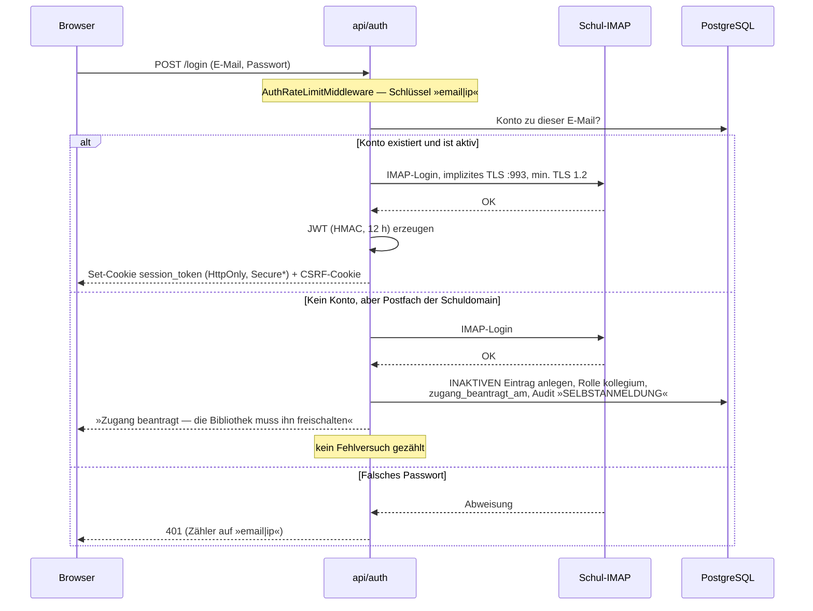
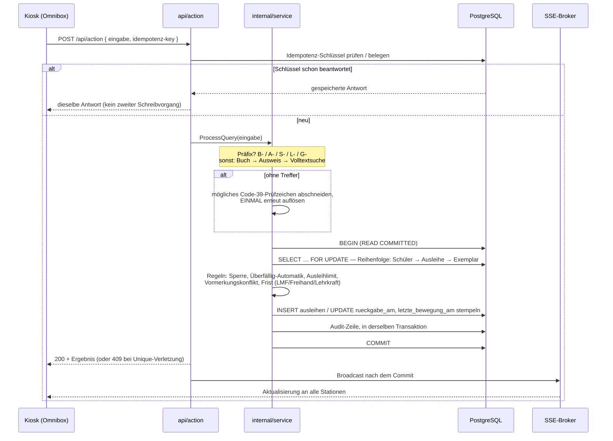
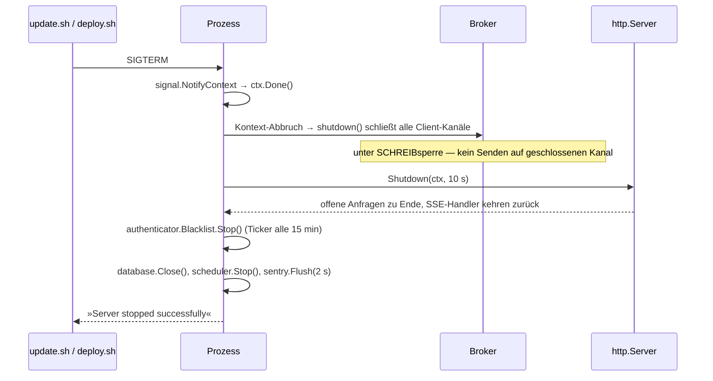

# arc42-Architekturdokumentation — Bibliothek (Schulbibliotheks-Software)

Stand: 08.10.2026 · Gliederung nach [arc42](https://arc42.org) (Template 8.2, deutsch) · am
07.10.2026 aus dreizehn Dateien zu dieser einen zusammengeführt; jedes Kapitel nennt seinen
eigenen Stand

---

## Was das hier ist

Die Architekturdokumentation dieses Systems, gegliedert nach arc42 — zwölf Kapitel in
dieser einen Datei. Sie beschreibt **den gebauten Stand**, nicht einen Plan: Jede Aussage ist
am Code, an `schema.sql`, an den Migrationen, am `Dockerfile`, an den CI-Workflows oder an
einem Gate nachgelesen, und wo eine Fundstelle die Aussage trägt, steht sie dabei.

Diese Dokumentation ist **die** Architekturbeschreibung des Systems; die frühere Kurzfassung
`ARCHITECTURE.md` ist am 18.09.2026 darin aufgegangen. Die Arbeitsteilung mit den übrigen
Dokumenten unter [`docs/`](../README.md#dokumentation):

| Frage                                                        | Dort steht die Antwort                                     |
| ------------------------------------------------------------ | ---------------------------------------------------------- |
| Wie ist das System gebaut, und **warum so**?                 | **hier** (arc42)                                           |
| Welche fachliche Regel gilt genau?                           | [FACHKONZEPT.md](FACHKONZEPT.md)                        |
| Wie bediene ich das System?                                  | [HANDBUCH.md](HANDBUCH.md)                              |
| Wie betreibe, deploye, sichere ich es?                       | [DEPLOYMENT.md](DEPLOYMENT.md), [resilience_and_recovery.md](resilience_and_recovery.md) |
| Welche Schutzmaßnahme greift wo?                             | [SECURITY.md](SECURITY.md), [PII_MATRIX.de.md](PII_MATRIX.de.md) |
| Was muss **immer** wahr sein, und auf welcher Ebene?         | [invarianten.md](invarianten.md)                        |
| Welche Bugklassen kennt das Projekt, und wer detektiert sie? | [sweeps.md](sweeps.md)                                  |
| Was ist **offen**?                                           | [OFFEN.md](OFFEN.md) — die einzige Offen-Liste          |

> **Diese Dokumentation führt keine eigene Offen-Liste.** Kapitel 11 benennt Risiken und
> technische Schulden, verweist für den Bearbeitungsstand aber auf `OFFEN.md`. Zwei Listen
> wären genau die Fehlerart, gegen die dieses Projekt antritt.

---

## Die zwölf Kapitel

| #   | Kapitel                                                                    | Beantwortet                                                                       |
| --- | -------------------------------------------------------------------------- | --------------------------------------------------------------------------------- |
| 1   | [Einführung und Ziele](#1-einführung-und-ziele)                        | Was soll das System leisten, für wen, mit welchen Qualitätszielen                 |
| 2   | [Randbedingungen](#2-randbedingungen)                                   | Was war nicht verhandelbar — technisch, organisatorisch, konventionell            |
| 3   | [Kontextabgrenzung](#3-kontextabgrenzung)                               | Wer und was steht außen dran, über welche Schnittstelle                           |
| 4   | [Lösungsstrategie](#4-lösungsstrategie)                                | Die tragenden Entscheidungen in Kurzform, mit Begründung                          |
| 5   | [Bausteinsicht](#5-bausteinsicht)                                       | Statische Struktur: Pakete, Schichten, Verantwortungen, Level 1–3                 |
| 6   | [Laufzeitsicht](#6-laufzeitsicht)                                       | Zehn Szenarien im Ablauf — Scan, Login, Offline, Nachtlauf, Shutdown …            |
| 7   | [Verteilungssicht](#7-verteilungssicht)                                 | Container, Volumes, Ports, Reverse Proxy, CI/CD-Wege                              |
| 8   | [Querschnittliche Konzepte](#8-querschnittliche-konzepte)               | Sicherheit, Datenschutz, Persistenz, Nebenläufigkeit, Zeit, Fehler, Test …        |
| 9   | [Architekturentscheidungen](#9-architekturentscheidungen)               | 24 Entscheidungen als ADR: Stand, Grund, Folge, Fundstelle                        |
| 10  | [Qualitätsanforderungen](#10-qualitätsanforderungen)                    | Qualitätsbaum und messbare Szenarien samt zugehörigem Gate                        |
| 11  | [Risiken und technische Schulden](#11-risiken-und-technische-schulden)   | Was heute weh tut oder morgen weh tun wird — mit Einschätzung                     |
| 12  | [Glossar](#12-glossar)                                                   | Die Fachsprache des Hauses, deutsch, mit Code-Bezug                               |

---

## Lesewege

- **Neu im Projekt, eine Stunde Zeit:** Kapitel 1 → 4 → 5 (Level 1+2) → 12. Danach
  [FACHKONZEPT.md §1](FACHKONZEPT.md) für die Omnibox, weil daran der ganze Betrieb hängt.
- **Ich muss etwas ändern:** Kapitel 5 (welcher Baustein), 8 (welches Querschnittskonzept
  fasse ich an), 9 (ist das schon einmal entschieden worden), dann
  [invarianten.md](invarianten.md) und [sweeps.md](sweeps.md).
- **Ich muss es betreiben:** Kapitel 7 → [DEPLOYMENT.md](DEPLOYMENT.md) →
  [resilience_and_recovery.md](resilience_and_recovery.md).
- **Ich muss es beurteilen (Schule, Träger, Datenschutz):** Kapitel 1, 3, 10, 11 und
  [SECURITY.md](SECURITY.md).

---

## Wie diese Dokumentation gepflegt wird

1. **Kein Kapitel behauptet einen Stand, den es nicht hat.** Jedes Kapitel trägt unter seiner
   Überschrift eine `Stand:`-Zeile, das Dokument eine im Kopf. Das Gate
   `docs/stand_angaben_test.go` prüft für jede Datei unter `docs/`, dass **kein im Text
   genanntes Datum jünger ist als der Kopf**. Wer hier einen datierten Absatz ergänzt, zieht
   den Stand des Kapitels und den Kopf mit — sonst wird der Test rot.
2. **Zahlen tragen ihr Messdatum.** Die Umfangszahlen in Kapitel 1.4 und Kapitel 5 sind am
   08.10.2026 mit den Befehlen aus dem
   [Anhang von Kapitel 5](#anhang-die-zahlen-selbst-nachmessen) erhoben. Sie altern; der
   Befehl daneben altert nicht.
3. **Fundstellen werden beim Namen genannt, nicht gezählt.** Keine Zeilennummern: Datei-,
   Paket-, Constraint- und Indexnamen halten, Zeilennummern wandern. Das ist dieselbe Regel,
   die [invarianten.md](invarianten.md) seit dem 06.08.2026 anwendet — dort waren nach
   dem Wachstum von `schema.sql` alle 21 Zeilenverweise falsch, ohne dass es beim Lesen
   auffiel.
4. **Das Warum steht im Commit.** Wo eine Entscheidung eine längere Geschichte hat, nennt
   Kapitel 9 sie knapp und verlässt sich im Übrigen auf `git log` — die Historie ist
   ausführlicher als jede gepflegte Liste und kann nicht veralten.

---

## 1. Einführung und Ziele

Stand: 08.10.2026

---

### 1.1 Aufgabenstellung

**Bibliothek** ist die Verwaltungssoftware der Schulbibliothek einer Gesamtschule. Sie
löst eine Windows-Altanwendung (**Littera**) ab und deckt den vollständigen Betrieb ab:
Ausleihe und Rückgabe am Scanner-Tresen, Medienkatalog, Lernmittelverwaltung (LMF),
Mahnwesen, Vormerkungen, Inventur, Bestellwesen, Geräteausleihe, Leserdatei und die
datenschutzrechtlich vorgeschriebenen Löschroutinen.

**Das ist kein Produkt.** Es ist für **einen** konkreten Betrieb gebaut; die Entscheidungen
darin sind entsprechend konkret (eine feste Lernmittel-Stichtagsregel, ein einziger
Mailserver als Anmeldequelle, Barcodes eines Altbestands, die nicht neu geklebt werden
können). Wo diese Dokumentation eine Entscheidung „falsch" erscheinen lässt, lohnt der
Blick in [Kapitel 9](#9-architekturentscheidungen): fast immer ist die Randbedingung der
Grund, nicht der Geschmack.

#### Die tragenden fachlichen Anforderungen

| #  | Anforderung                                                                                                                                  | Fundstelle                                       |
| -- | -------------------------------------------------------------------------------------------------------------------------------------------- | ------------------------------------------------ |
| F1 | **Ein Eingabefeld für alle Scans** (Omnibox). Ohne Präfix wird in der Reihenfolge Buch → Ausweis → Volltextsuche aufgelöst.                   | `internal/service/omnibox_service.go`, FACHKONZEPT §1 |
| F2 | **Fristen** je Medienart: Lernmittel auf den Stichtag 31. Juli bzw. den Klassentermin des LMF-Plans, Freihand rollierend, Kollegium als Dauerleihe (gespeichert wird ein Jahr, überfällig wird sie nie). | `internal/service/loan_rules.go`, `pkg/lmf`, `pkg/lmfplan` |
| F3 | **Bis zu 8 Kiosk-Stationen gleichzeitig** am selben Bestand, ohne Doppelbuchung und ohne Phantom-Erfolg.                                      | `migrations/033_unique_active_loan.sql`, `sse/`  |
| F4 | **Mahnwesen**: Mahnstufe steigt ausschließlich beim PDF-Druck (dem physischen Verwaltungsakt), nie beim Mailversand; Listen gehen an die Klassenleitung, nie an Schüler. | `api/mahnwesen_bulk.go`                          |
| F5 | **Schülerdaten unter DSGVO**: Löschfristen, Karenz, Anonymisierung, verschlüsselte Fotos, Auskunftsrecht, Audit-Trail.                        | `jobs/cron_dsgvo*.go`, `internal/crypto`, [SECURITY.md](SECURITY.md) |
| F6 | **Öffentliche Seiten ohne Anmeldung** (Katalog `/katalog`, Monitor `/monitor`) — Titeldaten ja, Personendaten nie.                            | `api/opac.go`, `api/monitor.go`, FACHKONZEPT §16 |
| F7 | **Kollegiums-Portal** mit Selbstanmeldung über das Schulpostfach, Klassensatz-Reservierung und Meldungen.                                     | `auth/selbstanmeldung.go`, `frontend/src/lib/KollegiumPortal.svelte` |
| F8 | **Altbestandsübernahme aus Littera**: Titel, Exemplare, Personen, offene Ausleihen — verlustfrei und nachweisbar.                             | `internal/littera`, `internal/uebernahme`, `cmd/littera-altbestand` |
| F9 | **Bestellwesen** bis zum Wareneingang, inklusive Bestätigungslink für Händler, die selbst etikettieren.                                       | `api/bestellbestaetigung_*.go`                   |
| F10| **Der Betrieb muss merken, wenn eine Funktion still nichts tut** (fehlende Einstellung, fehlendes Geheimnis, fehlgeschlagene Restore-Probe).  | `api/betriebsbereitschaft.go`, FACHKONZEPT §15   |

---

### 1.2 Qualitätsziele

Die fünf Ziele stehen in der Reihenfolge, in der bei einem Konflikt entschieden wird. Das
ist keine Rhetorik: Q1 vor Q5 heißt konkret, dass eine Buchung lieber mit **409 Conflict**
scheitert als „irgendwie" durchgeht, und Q2 vor Q4, dass eine Löschroutine auch dann läuft,
wenn dadurch eine Statistik ihre Zahlenbasis verliert.

| Prio | Qualitätsziel                          | Was damit konkret gemeint ist                                                                                                                                     | Wie es nachgewiesen wird                                                                                     |
| ---- | -------------------------------------- | ----------------------------------------------------------------------------------------------------------------------------------------------------------------- | ------------------------------------------------------------------------------------------------------------ |
| Q1   | **Korrektheit unter Nebenläufigkeit**  | Acht Stationen scannen gleichzeitig. Kein Exemplar hat zwei aktive Ausleihen, kein Doppelscan erzeugt eine zweite Buchung, kein Fehler wird als Erfolg quittiert. | Partielle Unique-Indizes (DB-Ebene), Idempotenz-Keys, `*_pg_test.go` gegen echtes Postgres, `phantom_erfolg_test.go` |
| Q2   | **Datenschutz-Konformität**            | Schülerdaten werden fristgerecht getilgt, Fotos verschlüsselt, öffentliche Seiten tragen keine Personendaten, jede Route ist nach PII-Stufe eingeordnet.          | `api/pii_matrix_test.go` hält [PII_MATRIX.de.md](PII_MATRIX.de.md) deckungsgleich mit dem Code; DSGVO-Cronjobs mit PG-Tests |
| Q3   | **Betriebstransparenz**                | Eine eingerichtete, aber nicht in Betrieb befindliche Funktion muss sich melden — nicht schweigen.                                                                 | Selbstprüfung der Betriebsbereitschaft + Bereitschafts-Wächter (täglich per Mail), `/health`                 |
| Q4   | **Bedienbarkeit am Tresen**            | Ein Scan, eine Reaktion, ohne Maus. Der Ausfall des Netzes darf den Betrieb nicht anhalten.                                                                        | Offline-Warteschlange (IndexedDB) + Nachbuch-Tür, Tastaturbedienung, WCAG 2.1 AA mit axe-Gate                |
| Q5   | **Änderbarkeit ohne Rückfall**         | Ein behobener Fehler bleibt behoben. Jede Bugklasse bekommt einen Detektor (eine „Ratsche"), nicht nur einen Fix.                                                  | [sweeps.md](sweeps.md), Drift-Gates (Swagger, Migrationen, Compose-Variablen), Deadcode-Gate              |

> **Die Gate-Regel des Projekts:** Der Anspruch ist nicht „es gibt Tests", sondern *jedes
> Gate muss man einmal rot gesehen haben*. Ein Gate, das seine Aussage nicht verlieren kann,
> prüft nichts. Deshalb führt `scripts/git-hooks/pre-push` auch eine **Skip-Bilanz**: Es
> sagt, was es *nicht* geprüft hat (die `*_pg_test.go` überspringen sich ohne
> `TEST_DATABASE_URL` still, mit grünem „ok" daneben).

#### Was ausdrücklich **kein** Ziel ist

- **Mandantenfähigkeit.** Eine Schule, eine Datenbank, ein Stack. Es gibt keine
  Schul-ID und keinen Mandanten-Schlüssel.
- **Konfigurierbarkeit als Produktmerkmal.** Was das Kollegium darf, steht fest in
  `db/seed.go` und ist kein Schalter je Schule (Entscheidung vom 16.09.2026).
- **Skalierung über einen Host hinaus.** Der Entwurf zielt auf ~1.900 Leser und acht
  gleichzeitige Arbeitsplätze, nicht auf horizontale Skalierung. Der Prozess hält
  In-Memory-Zustand (SSE-Broker, Rechte-Cache, Rate-Limit-Zähler); mehrere Instanzen
  hinter einem Load Balancer wären ein Umbau, nicht eine Konfiguration
  ([Kapitel 11](#11-risiken-und-technische-schulden)).
- **Mehrsprachigkeit.** Die Oberfläche, die Fachsprache und der Code sind deutsch.

---

### 1.3 Stakeholder

| Rolle                                | Erwartung an das System                                                                                                            | Was daraus architektonisch folgt                                                                                     |
| ------------------------------------ | ---------------------------------------------------------------------------------------------------------------------------------- | -------------------------------------------------------------------------------------------------------------------- |
| **Bibliotheksleitung**               | Überblick, Mahnwesen, Bestellung, Statistik ohne Klarnamen; Systempflege nicht übernehmen müssen                                   | Eigene Rolle `leitung` = Admin **minus** `manage_users`/`manage_settings`, abgeleitet statt abgeschrieben (Migration 122) |
| **Bibliotheks-Mitarbeiter**          | Tagesgeschäft an der Theke, schnell, ohne Systemwissen                                                                             | Omnibox als einziges Eingabefeld; Fehler sprechen deutsch und sagen die nächste Handlung                             |
| **Helfer** (Eltern, Hilfskräfte)     | Ausleihe/Rückgabe und die Frage „habt ihr Band 3 noch da?" beantworten — ohne Zugriff auf Personendaten                            | Genau zwei Rechte (`perform_actions`, `view_books`), Grenze zu Personendaten über `view_students`                     |
| **Kollegium** (~160 Lehrkräfte)      | Selbst anmelden können, Klassensätze reservieren, LMF-Termine sehen, Probleme melden                                                | Selbstanmeldung über die Schuldomain mit **Freischaltung durch die Bibliothek**; Portal hängt am Recht `create_reservations`, nicht an der Rolle |
| **Schüler und Eltern**               | Sehen, ob ein Buch da ist — ohne Konto                                                                                             | Öffentlicher Katalog und Monitor, die ausschließlich Titeldaten liefern (PII-Stufe 0)                                |
| **Sekretariat / Schulleitung**        | Schülerdaten müssen ohne Doppelerfassung hereinkommen; Versetzung und Abgang müssen funktionieren                                   | LUSD-Import mit drei Zuordnungsstufen, Umbenennungs-Paarung und Karenzzeit ([LUSD.md](LUSD.md))                   |
| **Datenschutzbeauftragte(r)**        | Nachweisbare Fristen, Rechtsgrundlagen, Verarbeitungsverzeichnis, Auskunft                                                          | PII-Matrix je Route als Gate, automatische Löschroutinen, VVT- und Art.-13-Entwürfe unter `docs/datenschutz/`         |
| **Schulträger**                      | Nachweispflichten (Zugangs-/Abgangsbuch, Bestandsnachweis zum Stichtag), getrennte Töpfe Land/Träger                                | Bestandsbücher als eigene Reiter mit Druckblatt; Mittelherkunft an der Bestellung ([mittel_konzept.md](mittel_konzept.md)) |
| **Betreiber/Entwickler** (eine Person) | Ein Deploy darf nichts still zerstören; ein Fehler muss sich selbst melden; die Doku muss die Entscheidung tragen, nicht nur das Ergebnis | Gates, Drift-Tests, Selbstprüfung, Bereitschafts-Wächter, `OFFEN.md` als einzige Liste, Commit-Historie als Doku      |
| **Land (Lernmittelfreiheit)**         | Leihbücher nach Erlass behandeln: Fristen, Ersatzwert-Staffel, Bescheid statt Barzahlung                                            | `pkg/ersatzwert` (Staffel als Vorschlag mit Herleitung), `api/bescheid_*.go`, Gate `docs/ersatzwert_staffel_test.go`  |

---

### 1.4 Umfang in Zahlen (gemessen 08.10.2026)

| Gegenstand                        | Umfang                                    |
| --------------------------------- | ----------------------------------------- |
| Go-Produktivcode                  | 76.340 Zeilen (ohne das generierte `docs/docs.go`) |
| Go-Tests                          | 118.234 Zeilen in 811 Testdateien          |
| Svelte/JavaScript (`frontend/src`) | 83.128 Zeilen in 745 Dateien, davon 309 `.svelte` |
| e2e (Playwright, `frontend/e2e`)  | 161 Dateien, davon 156 Specs               |
| Registrierte HTTP-Routen          | 230 (davon 88 Operationen Swagger-annotiert) |
| Datenbank-Migrationen             | 166 Dateien, die höchste Nummer ist 163    |
| Tabellen / Sichten in `schema.sql`| 44 Tabellen, 2 Sichten (`schueler`, `view_buecher_bestand`) |

Die Befehle, mit denen diese Zahlen in zehn Sekunden neu erhoben werden, stehen in
[Kapitel 5](#anhang-die-zahlen-selbst-nachmessen). Das ist Absicht: Eine
gepflegte Behauptung altert, ein Messbefehl nicht. Die vorige Fassung im README lag bei den
Testzeilen um 47 % daneben, weil sie gepflegt statt gemessen war.

---

## 2. Randbedingungen

Stand: 08.10.2026

Randbedingungen sind das, was **nicht zur Diskussion stand**. Sie erklären mehr von dieser
Architektur als jede Entwurfsvorliebe: Der Grund für die Omnibox, für IMAP als
Anmeldequelle und für die Nachsicht gegenüber alten Barcodes steht hier, nicht in
[Kapitel 4](#4-lösungsstrategie).

---

### 2.1 Technische Randbedingungen

| #  | Randbedingung                                                                 | Hintergrund und Konsequenz                                                                                                                                                                               |
| -- | ----------------------------------------------------------------------------- | -------------------------------------------------------------------------------------------------------------------------------------------------------------------------------------------------------- |
| T1 | **Go 1.27.1**, Version identisch in `go.mod` und `Dockerfile`                 | Zwei Versionen wären zwei Verhalten. Genutzt werden ausdrücklich neuere Fähigkeiten: Methoden-Routing im `net/http`-Mux (`GET /api/...`), `os.OpenRoot` gegen Path-Traversal, `slog` als Standard-Logger. |
| T2 | **Kein Web-Framework** — `net/http` mit `http.ServeMux`                       | Routing, Middleware-Kette und RBAC sind Eigenbau (`api/router.go`, `api/middleware.go`, `api/permission_middleware.go`). Preis: Die Kettenreihenfolge ist Handarbeit und braucht ein Gate (`routes_authz_coverage_test.go`). |
| T3 | **PostgreSQL 18** über `pgx/v5` (Pool), keine ORM-Schicht                     | SQL steht im Repository-Paket sichtbar da. Constraints sind ein Entwurfsmittel, nicht eine Absicherung „unten" — siehe [invarianten.md](invarianten.md).                                                |
| T4 | **CGO_ENABLED=1** für das Hauptbinary                                         | `chai2010/webp` (Cover-Dekodierung) braucht CGO. Folge: Der Build braucht `build-base` im Builder-Image; die CLI-Werkzeuge werden dagegen mit `CGO_ENABLED=0` gebaut.                                      |
| T5 | **Svelte 5 (Runes), Tailwind 4, Vite — kein TypeScript**                       | Typsicherheit kommt über JSDoc + `svelte-check --fail-on-warnings`, nicht über `.ts`. Eine Umstellung wäre ein Umbau von rund 300 Komponenten und ist bewusst nicht erfolgt.                                    |
| T6 | **Ein Host, ein Prozess**                                                      | Der Prozess hält Zustand im Speicher: SSE-Abonnenten, Rechte-Cache, Rate-Limit-Zähler, Idempotenz-Warteschleife. Eine zweite Instanz hinter einem Load Balancer wäre **nicht** nur Konfiguration.         |
| T7 | **Anmeldung gegen den Schul-Mailserver (IMAP)**                                | Die Anwendung speichert **kein** Benutzerpasswort; eine Passwortspalte gibt es seit Migration 012 nicht. Für die Dauer einer Anmeldung hält sie einen Prüfwert davon (Migration 155, A2). Folge: Die E-Mail **ist** die Identität, und `benutzer.email` schreiben zu dürfen heißt, ein Konto übernehmen zu können. |
| T8 | **Barcodes des Altbestands dürfen nicht neu geklebt werden**                   | Ausweise und Etiketten aus Littera tragen nackte Nummern ohne Präfix. Deshalb löst die Omnibox **ohne** Präfix der Reihe nach auf, und deshalb gibt es die Prüfzeichen-Nachsicht (`pkg/code39`).           |
| T9 | **Docker Compose hinter Caddy**, TLS per ACME                                  | Kein Kubernetes, kein Ingress-Controller. Die maßgebliche Caddy-Konfiguration liegt **auf dem Schulserver** (`/root/caddy/Caddyfile`, geschrieben von `update_caddy.sh`); die `Caddyfile` im Repo ist Vorlage zum Nachschlagen. |
| T10| **Der Betrieb läuft ggf. über HTTP im Schul-LAN**                              | Deshalb ist `COOKIE_SECURE` eine bewusst treffbare Betriebsentscheidung — Vorgabe `true` außerhalb lokaler Entwicklung, ein explizites `false` warnt laut, bricht aber nicht ab.                            |
| T11| **Zeitzone Europe/Berlin fachlich, UTC technisch**                              | Fristen pinnen `Europe/Berlin` im Code (`TagesEndeInSchulzeitzone` → `schulzeit.TagesEnde`), der Cron-Zeitplan ist auf UTC genagelt (`cron.WithLocation(time.UTC)`) — sonst verschluckt die Zeitumstellung den 02:30-Backup-Job.  |
| T12| **Lizenz EUPL-1.2**                                                             | Jede Go-Quelldatei trägt den Lizenzkopf; `frontend/package.json` nennt dieselbe Lizenz. Abhängigkeiten müssen dazu passen.                                                                                 |

---

### 2.2 Organisatorische und fachliche Randbedingungen

| #  | Randbedingung                                                        | Konsequenz für die Architektur                                                                                                                                                       |
| -- | -------------------------------------------------------------------- | ------------------------------------------------------------------------------------------------------------------------------------------------------------------------------------ |
| O1 | **Ein Entwickler, ein Betreiber — dieselbe Person**                   | Alles, was nur durch Disziplin funktioniert, funktioniert nicht. Daher: Gates statt Checklisten, Selbstprüfung statt Runbook-Gedächtnis, `OFFEN.md` als **einzige** Liste.            |
| O2 | **Der Betrieb läuft, während gebaut wird**                            | Migrationen müssen idempotent sein und beim Start von selbst laufen; ein Deploy darf offene SSE-Verbindungen nicht mit `os.Exit(1)` beenden (der Grund für den Broker-Umbau).         |
| O3 | **Lernmittelfreiheit ist Landesrecht**                                | Der Stichtag 31. Juli, die Ersatzwert-Staffel und der Bescheid-Weg (Konto statt Bargeld) sind Vorgaben, keine Produktentscheidungen. Die Staffel ist bewusst ein **Vorschlag mit Herleitung**, weil der Betrag im Ermessen der Schule liegt. |
| O4 | **~160 Lehrkräfte legt niemand von Hand an**                          | Selbstanmeldung über die Schuldomain ist Pflicht, die Freischaltung bleibt aber bei der Schule: IMAP beantwortet „wer bist du", nicht „darfst du rein".                               |
| O5 | **Zwei Anforderungen aus dem Anforderungsprotokoll vom 16.09.2026** | Alte Aufdrucke bleiben lesbar (A14), und ein Lernmittel kann über mehrere Jahre beim selben Kind bleiben (Mehrjahresband am Titel, Spalte `mehrjahresband`). Beides ist gebaut. Wie die übrigen der zwölf Punkte behandelt sind, steht in den Commits vom 17. und 22.09.2026, die begründeten Abweichungen im Mahnwesen in [mittel_konzept.md](mittel_konzept.md), Abschnitt 3. |
| O6 | **Kein Passwort-Selbstservice, kein Nutzerverzeichnis**                | Es gibt keinen „Passwort vergessen"-Pfad und keine Registrierung außer der Selbstanmeldung — beides liegt beim Schul-IT-Betrieb.                                                       |
| O7 | **Altbestand aus Littera muss verlustfrei übernommen werden**          | Übernahme als eigenes Kommando gegen dieselbe Datenbank, mit Savepoint **je Datensatz** und Abgleich gegen den tatsächlichen Zeilenzuwachs — ein abgebrochener Batch darf nicht alles mitnehmen. |
| O8 | **Datenschutz ist nachweispflichtig, nicht nur einzuhalten**            | Die PII-Einstufung je Route ist ein Dokument **mit Gate** (`api/pii_matrix_test.go`), nicht eine Zusage.                                                                              |

---

### 2.3 Konventionen

| Konvention                                        | Regel                                                                                                                                                                                                              | Durchsetzung                                                        |
| ------------------------------------------------- | ------------------------------------------------------------------------------------------------------------------------------------------------------------------------------------------------------------------ | ------------------------------------------------------------------- |
| **Fachsprache deutsch**                           | Domänenbegriffe im Code deutsch (`ausleihen`, `leser`, `vormerkungen`, `Abgaenger`, `Ersatzwert`). Englisch nur, wo es aus der Frühzeit stammt (`book`, `loan`, `student`). Gemischt, aber nie übersetzt-doppelt.   | Review; [Glossar](#12-glossar)                                     |
| **Migrationen**                                   | `NNN_beschreibung.sql`, idempotent (`IF NOT EXISTS` / `DO $$ … EXCEPTION`), dedupliziert über `schema_migrations`; die Seed-Liste in `schema.sql` muss exakt den Dateien entsprechen.                               | `db/migrations_drift_test.go`, `db/migrations_nummern_test.go`, `db/migrations_schema_paritaet_pg_test.go` |
| **Rows-Iteration**                                | Jede `rows.Next()`-Schleife endet mit `rows.Err()`. Ohne das gilt ein Verbindungsabbruch mitten in der Iteration als Erfolg — die Liste wäre still unvollständig.                                                   | `golangci-lint`, Review                                              |
| **Komponenten-Größe Frontend**                    | ≤ 200 Zeilen je **neuer** `.svelte`-Datei; der Altbestand darüber darf nicht wachsen.                                                                                                                              | Ratsche `frontend/src/lib/frontend-hygiene-dateigroesse.test.js`     |
| **Eine Wahrheitsquelle für Menü und Router**      | Welche Seite eine Rolle erreicht, entscheidet `canSeeItem()` in `frontend/src/lib/menu.js` — und nur diese Funktion.                                                                                                | `frontend/e2e/menue-fuehrt-irgendwohin.spec.js`                      |
| **Autorisierung pro Route**                       | Kein globaler Auth-Filter: jede nicht-öffentliche Route trägt `RequirePermission(...)` oder, wo jede Sitzung genügt, `RequireAuthenticated()`; öffentliche Routen stehen in einer Allowlist.                        | `api/routes_authz_coverage_test.go`                                  |
| **Fundstellen beim Namen**                        | In der Dokumentation werden Constraint-, Index-, Datei- und Paketnamen genannt — keine Zeilennummern und keine Migrationsnummern als Beleg (eine Datei existiert weiter, auch wenn eine spätere Migration sie aufhebt). | `docs/invarianten_fundstellen_test.go`                               |
| **Stand-Angaben**                                 | Kein Dokument behauptet im Kopf einen Stand, unter dem es jüngere Vorgänge beschreibt.                                                                                                                             | `docs/stand_angaben_test.go` (jede `.md` unter `docs/`)              |
| **Keine Changelog-Datei**                         | Die Commit-Historie ist Teil der Dokumentation; Erledigtes wird aus `OFFEN.md` gelöscht, nicht archiviert.                                                                                                          | Entscheidung vom 15.09.2026                                          |
| **Jedes Gate einmal rot gesehen**                 | Ein Detektor, dessen Aussage nicht verloren gehen kann, prüft nichts. Neue Gates werden gegen den echten Fehlerfall gehalten, bevor sie grün bleiben dürfen.                                                        | [sweeps.md](sweeps.md) Regel 2; „Rot-Beweis-Battery"              |

---

### 2.4 Werkzeuge, die zur Architektur gehören

Diese Werkzeuge sind keine Beigabe: Ohne sie wären mehrere Entscheidungen in
[Kapitel 9](#9-architekturentscheidungen) nicht tragbar.

| Werkzeug                                | Rolle in der Architektur                                                                                            |
| --------------------------------------- | ------------------------------------------------------------------------------------------------------------------- |
| `golangci-lint` (`.golangci.yml`)       | Steht in CI **vor** allem anderen. Ein ungenutzter Typ hat am 12.09.2026 Tests, Deadcode-Gate und Restore-Probe mit übersprungen — seither kennt auch der pre-push-Hook den Linter. |
| `scripts/deadcode_gate.sh` + Baseline   | Unerreichbarer Code ist eine Fehlerquelle: `Blacklist.Stop()` war geschrieben, getestet und von niemandem aufgerufen. |
| `govulncheck` + `scripts/govulncheck-gate.sh`, `security/vuln-ausnahmen.json` | Schwachstellen-Gate mit **benannten, begründeten** Ausnahmen statt globalem Abschalten.               |
| `gosec`, CodeQL, Trivy, `npm audit`      | Vier unabhängige Blickwinkel; Befunde, die begründet keine sind, werden dokumentiert (`.jules/sentinel.md`).          |
| Playwright gegen den **gebauten Container** | e2e misst, was ausgeliefert wird — nicht einen Dev-Server.                                                       |
| `internal/pgtest`, `*_pg_test.go`        | Constraints kann man nicht mocken. Ohne `TEST_DATABASE_URL` überspringen sie sich still — deshalb die Skip-Bilanz.    |
| `internal/smtptest`, `internal/pdftest`  | Mail- und PDF-Pfade werden gegen eine Attrappe bzw. am erzeugten Dokument geprüft, nicht am Aufruf.                  |
| `scripts/api_inventar.sh`                | Erzeugt [api_inventar.md](api_inventar.md): alle Go-Routen gegen alle Frontend-Aufrufer, in **beide** Richtungen.  |

---

## 3. Kontextabgrenzung

Stand: 08.10.2026

---

### 3.1 Fachlicher Kontext

```mermaid
graph TB
    subgraph Schule
        MA[Bibliotheks-<br/>Mitarbeiter]
        LTG[Bibliotheks-<br/>leitung]
        HELF[Helfer]
        KOLL[Kollegium<br/>~160 Lehrkräfte]
        SEK[Sekretariat]
    end
    subgraph Öffentlich
        SCH[Schüler & Eltern]
        MON[Flur-Monitor]
    end
    subgraph Extern
        HAENDL[Buchhändler]
        MZ[Schulträger]
        DSB[Datenschutz-<br/>beauftragte]
    end

    SYS[("Bibliothek<br/>(dieses System)")]

    MA -->|Scan, Ausleihe, Rückgabe, Mahnwesen, Inventur| SYS
    LTG -->|Bestellung, Statistik, Bescheide| SYS
    HELF -->|Ausleihe/Rückgabe, Katalog lesen| SYS
    KOLL -->|Klassensatz-Reservierung, LMF-Plan, Anliegen| SYS
    SEK -->|LUSD-Bericht (Schülerdaten)| SYS
    SCH -->|Katalog /katalog, ohne Anmeldung| SYS
    SYS -->|Slideshow /monitor| MON
    SYS -->|Bestellmail + Barcodebogen| HAENDL
    HAENDL -->|Bestätigungslink /bestellung/token| SYS
    SYS -->|Zugangs-/Abgangsbuch, Bestandsnachweis| MZ
    SYS -->|Auskunft, VVT, Löschnachweis| DSB
    SYS -->|Mahnliste an Klassenleitung, Abgängerbrief, Bescheid| KOLL
```

#### Fachliche Nachbarn im Einzelnen

| Nachbar                     | Eingang in das System                                                                                       | Ausgang aus dem System                                                                                                | Besonderheit                                                                                                    |
| --------------------------- | ----------------------------------------------------------------------------------------------------------- | --------------------------------------------------------------------------------------------------------------------- | --------------------------------------------------------------------------------------------------------------- |
| **Bibliothekspersonal**     | Barcode-Scans, Stammdatenpflege, Mahnlauf, Inventurzählung, Wareneingang                                     | Bildschirm-Rückmeldung je Scan, PDFs (Mahnungen, Etiketten, Ausweise, Bescheide, Listen)                              | Bedienung ist auf **Tastatur und Scanner** ausgelegt; die Maus ist optional                                     |
| **Kollegium**               | Selbstanmeldung mit dem Schulpostfach, Reservierungen, Meldungen                                              | Portal-Ansichten (Klassensätze, LMF-Plan, Schulbücher als PDF), Terminbestätigungen                                    | Zugang entsteht **inaktiv** und wird von der Bibliothek freigeschaltet                                          |
| **Sekretariat**             | LUSD-Bericht als `.xlsx` **oder** Semikolon-CSV (LANIS-Klassenliste, UTF-8 mit BOM)                           | Abgleichbericht: neu, geändert, Umbenennung, Abgänger                                                                  | Die Kopfzeile wird **gesucht, nicht vorausgesetzt** — LUSD-Berichte tragen Titelzeilen darüber                  |
| **Schüler und Eltern**      | Suchanfragen im öffentlichen Katalog                                                                         | Titel, Cover, Verfügbarkeit                                                                                            | **Nie** Ausleiherdaten — PII-Stufe 0, im Gate `api/pii_matrix_test.go` festgehalten                              |
| **Buchhändler**             | Bestätigung über einen Token-Link, ohne Konto                                                                 | Bestellmail mit Positionsliste und Barcodebogen                                                                        | Der Token steht **im Pfad** und wird im Log maskiert (`maskiereToken`); gespeichert wird nur sein Hash           |
| **Schulträger**             | Nachweispflichten                                                                                             | Zugangs-/Abgangsbuch je Halbjahr, getrennt nach Land und Träger; Bestandsnachweis zum Stichtag (15.3./15.9.)           | Bücher ohne hinterlegte Bestellung erscheinen ausdrücklich „ohne Zuordnung" — die ehrliche Lücke statt einer Erfindung |
| **Datenschutzbeauftragte**  | Prüffragen                                                                                                    | DSGVO-Auskunft als PDF, PII-Matrix, VVT-Entwurf, Nachweis der Löschläufe im Audit-Trail                                | Die Audit-Tilgung ist die **bewusste Ausnahme** von der Append-only-Konvention                                  |

---

### 3.2 Technischer Kontext

```
                   ┌──────────────────────────────────────────┐
  Browser          │  Caddy (Host, ACME/Let's Encrypt)        │
  (SPA, PWA)  ────► │  flasch3.herzog-dupont.de :443          │
                   │  response_header_timeout 300s            │
                   │  read/write_timeout 600s                 │
                   └───────────────┬──────────────────────────┘
                                   │ HTTP, Docker-Netz
                                   ▼
        ┌───────────────────────────────────────────────────────────┐
        │  backend (Go, alpine, non-root »appuser«)                 │
        │  :8083 (Produktion) / :8084 (lokaler Stack)               │
        │  /api  JSON · /events SSE · /uploads Cover · /login       │
        │  /health · /swagger (nur local|development)               │
        └───┬───────────┬────────────┬───────────┬──────────────────┘
            │ pgx/v5    │ IMAP 993   │ SMTP      │ HTTPS (Allowlist)
            ▼           ▼            ▼           ▼
     ┌────────────┐  ┌────────┐  ┌────────┐  ┌──────────────────────┐
     │ PostgreSQL │  │ Schul- │  │ Schul- │  │ DNB · OpenLibrary ·  │
     │ 18-alpine  │  │ Mail-  │  │ SMTP   │  │ Google Books         │
     │ :5432      │  │ server │  │ STARTTLS│ │ (Cover + Metadaten)  │
     └────────────┘  └────────┘  └────────┘  └──────────────────────┘
            │                                        ▲
            │ pg_dump → gzip → AES-256-GCM           │ nur öffentliche IPs
            ▼                                        │ (pkg/safehttp)
     ┌────────────────────┐   optional   ┌────────────────────────┐
     │ Volume /app/backups│ ───────────► │ S3-kompatibler Speicher│
     └────────────────────┘              └────────────────────────┘
                                          optional: Sentry (SENTRY_DSN)
```

#### Schnittstellen technisch

| Schnittstelle                    | Protokoll / Format                              | Richtung        | Absicherung                                                                                                                       |
| -------------------------------- | ----------------------------------------------- | --------------- | --------------------------------------------------------------------------------------------------------------------------------- |
| **Browser → Backend**            | HTTPS, JSON über `/api`, `POST /login`          | eingehend       | Security-Header/CSP, CORS auf die Schuldomain, Body-Limit 100 MB, Timeouts, Rate-Limit, CSRF (Double-Submit), JWT im HttpOnly-Cookie |
| **Backend → Browser (Echtzeit)** | Server-Sent Events, `GET /events`               | ausgehend       | Nur authentifiziert (`RequireAuthenticated`); Heartbeat alle 15 s; **kein** `WriteTimeout` am Server, weil der Strom nie endet     |
| **Statische Auslieferung**       | SPA aus `frontend/dist`, PWA-Service-Worker      | ausgehend       | Dateizugriffe OS-seitig an `dist/` gebunden (`os.OpenRoot`); ein unbekannter `/api/`-Pfad antwortet 404 statt App-Shell            |
| **Cover-Dateien**                | `GET /uploads/...`                              | ausgehend       | **Bewusst ohne Anmeldung** (Katalog/Monitor brauchen Cover); in der Allowlist von `routes_authz_coverage_test.go` vermerkt          |
| **Backend → PostgreSQL**         | Postgres-Wire über `pgx/v5`-Pool                | ausgehend       | Netz nur intern; Passwort aus `.env`; `pg_dump` erhält es über eine temporäre `.pgpass`, nicht über `PGPASSWORD`                    |
| **Backend → IMAP**               | IMAP über implizites TLS, Port 993, min. TLS 1.2 | ausgehend       | Feste Cipher-Auswahl; `IMAP_HOST=mock` akzeptiert in Entwicklung/Test jedes Passwort und wird beim Start laut protokolliert         |
| **Backend → SMTP**               | SMTP mit **erzwungenem** STARTTLS und Zertifikatsprüfung | ausgehend | Bietet der Server kein STARTTLS, bricht der Versand ab (`ErrSMTPKlartext`); nur ein ausdrückliches `SMTP_ALLOW_PLAINTEXT=true` erlaubt es. Kopfzeilen werden gegen CR/LF-Einschmuggelung geprüft |
| **Backend → Metadaten/Cover**    | HTTPS GET an eine **Host-Allowlist**             | ausgehend       | `pkg/coverquelle` baut die URL aus geprüften Teilen **neu** auf (Schema fest HTTPS, Host aus der Konstante); `pkg/safehttp` lehnt Verbindungen zu nicht-öffentlichen IPs ab (SSRF) |
| **Backend → S3 (optional)**      | S3-API über `minio-go`                           | ausgehend       | Nur aktiv, wenn `S3_ENDPOINT/ACCESS_KEY/SECRET_KEY/BUCKET` vollständig gesetzt sind; sonst überspringt der Job den Offsite-Upload und sagt das |
| **Backend → Sentry (optional)**  | HTTPS                                            | ausgehend       | Nur bei gesetztem `SENTRY_DSN`                                                                                                     |
| **Littera-Altbestand**           | CSV aus `mdb-export` (einmalig, CLI)             | eingehend       | Kein HTTP-Weg: eigenes Kommando `cmd/littera-altbestand` gegen dieselbe Datenbank, Savepoint je Datensatz                            |
| **Bestellbestätigung Händler**   | `GET/POST /bestellung/<token>` ohne Anmeldung     | eingehend       | Token einmalig, Hash gespeichert, im Log maskiert; die Bestätigung ist über `WHERE bestaetigt_am IS NULL` atomar                    |
| **Scanner / Kamera**             | USB-HID (Tastatureingabe) bzw. `html5-qrcode`     | eingehend       | Kein Gerätetreiber im System: Ein Handscanner ist eine Tastatur, die Kamera läuft im Browser                                        |
| **Drucker**                      | PDF-Download, Druck aus dem Browser              | ausgehend       | Etiketten/Ausweise als PDF mit festen Bogenmaßen; Gate `npm run test:druck` prüft die Drucksektionen                               |

#### Was ausdrücklich **nicht** angebunden ist

- **Kein Single-Sign-On** (kein LDAP, kein OAuth, kein Kerberos) — IMAP ist die einzige
  Identitätsquelle.
- **Keine Schnittstelle zur Schulverwaltung außer dem LUSD-Bericht als Datei.** Es gibt
  keinen Webservice, keine Datenbankkopplung und kein automatisches Nachladen.
- **Keine Zahlungsschnittstelle.** Forderungen werden über Bescheid und Rechnung
  abgewickelt; das System bucht keine Zahlungseingänge ein und nennt für Landes-Lernmittel
  ausdrücklich das Konto statt Bargeld.
- **Kein Push an Schüler oder Eltern.** Mahnlisten gehen an die Klassenleitung; Abgänger-
  und Schadensbriefe gehen über die Schule.
- **Kein externer Monitoring-Agent.** Das System stellt `/health` und die Selbstprüfung
  bereit und schickt den Bereitschafts-Wächter per Mail; ein externes Uptime-Signal ist als
  Handgriff offen ([OFFEN.md](OFFEN.md) 7.5).

---

## 4. Lösungsstrategie

Stand: 08.10.2026

Dieses Kapitel nennt die tragenden Entscheidungen in Kurzform und ordnet sie den
Qualitätszielen aus [Kapitel 1](#12-qualitätsziele) zu. Die
ausführliche Fassung mit Datum, Anlass und Folge steht in
[Kapitel 9](#9-architekturentscheidungen).

---

### 4.1 Die acht Leitentscheidungen

| #  | Entscheidung                                                                                     | Trägt                | Kurzbegründung                                                                                                                                                                                                 |
| -- | ------------------------------------------------------------------------------------------------ | -------------------- | -------------------------------------------------------------------------------------------------------------------------------------------------------------------------------------------------------------- |
| L1 | **Geschichteter Monolith**, ein Deployable: Handler → Service → Repository                        | Q5, Betrieb          | Ein Betreiber, ein Host, eine Datenbank. Ein Schnitt in Dienste würde Transaktionsgrenzen zerreißen, die heute die Korrektheit tragen (Ausleihe = eine Transaktion über Schüler, Ausleihe, Exemplar).            |
| L2 | **Die Datenbank ist die letzte Instanz**, nicht die Applikation                                   | Q1                   | Zwei Stationen können dieselbe Zeile ohne gemeinsame Sperre anfassen. Erst der partielle Unique-Index macht die zweite aktive Ausleihe *strukturell unmöglich*; Code-Prüfungen sind umgehbar, sobald ein zweiter Schreibpfad entsteht. |
| L3 | **Autorisierung pro Route, nicht global**                                                          | Q2                   | Eine globale Kette kennt die Route nicht, die sie schützt. `RequirePermission` sitzt **hinter** dem Routing (nur dort ist `r.PathValue` gefüllt) und prüft Recht, Kontostatus und UUID-Form in einem Zug. Ein Coverage-Gate zählt jede ungeschützte Route auf. |
| L4 | **Echtzeit über SSE, ohne Event-Loop**                                                             | Q1, Q4, Betrieb      | Alle Stationen sehen denselben Zustand nach dem Commit. Der Broker hält seinen Zustand hinter einem `RWMutex` statt hinter Kanälen — die frühere Kanal-Bauweise verhinderte das Herunterfahren und machte **jeden** Deploy zum `os.Exit(1)`. |
| L5 | **Idempotenz als Vertrag der Schreibtüren**                                                        | Q1, Q4               | Ein Scan darf doppelt ankommen (Netz, Nachbuchen, nervöse Hand). Der Idempotenz-Key liefert die gespeicherte Antwort zurück; 5xx wird nie gecacht, damit ein Wiederholen möglich bleibt.                          |
| L6 | **Der Tresen arbeitet auch ohne Netz weiter**                                                      | Q4                   | Scans landen in IndexedDB und gehen später durch die **Nachbuch-Tür**, die den Scan-Zeitpunkt buchen, einen Schlüssel genau einmal buchen und jede Abweichung als Meldung festhalten kann. Schweigen des Servers gilt nicht als Erfolg. |
| L7 | **Jede Bugklasse bekommt einen Detektor**                                                          | Q5                   | Ein Fix ohne Ratsche ist ein Rückfall auf Zeit. Das Register dieser Klassen und ihrer Detektoren ist [sweeps.md](sweeps.md); die Landkarte nennt zu jeder Ratsche auch, was sie systembedingt **nicht** sieht. |
| L8 | **Das System muss sich selbst melden**                                                             | Q3                   | Die wiederkehrende Fehlerart ist nicht der Absturz, sondern die fertige Funktion, die still nichts tut, weil eine Einstellung fehlt. Dagegen stehen die Selbstprüfung, der tägliche Bereitschafts-Wächter per Mail und die wöchentliche Restore-Probe. |

---

### 4.2 Wie die Qualitätsziele technisch erreicht werden

#### Q1 Korrektheit unter Nebenläufigkeit

Vier Ebenen, absteigend nach Verlässlichkeit:

1. **Struktur (DB):** `uniq_ausleihen_aktiv_exemplar` / `uniq_ausleihen_aktiv_geraet`
   (partielle Unique-Indizes), `check_loan_item` (Exemplar XOR Gerät), `check_return_date`,
   Fremdschlüssel auf `leser`, Enum-Vokabular für Rollen und Status.
2. **Transaktion + Zeilensperre:** `READ COMMITTED` mit `SELECT … FOR UPDATE`. Die
   **Sperrreihenfolge** ist festgelegt — Schüler → Ausleihe → Exemplar —, weil Online-Scan
   und Nachbuchen sich sonst gegeneinander verklemmen. Die Rückgabe mit Vormerkung nimmt
   `FOR UPDATE OF v SKIP LOCKED`, damit eine fremde Sperre den Rückgabevorgang nicht anhält.
   Eine bekannte Ausnahme: Der Rückgabe-Trigger aus Migration 137 sperrt die Leserzeile nach
   der Ausleihe ([Kapitel 11](#11-risiken-und-technische-schulden), R2).
3. **Idempotenz:** `idempotency_keys` mit gespeicherter Antwort, stündlicher TTL-Lauf,
   Wartezeit auf eine laufende Anfrage desselben Schlüssels. Der Unique-Index deckt den
   TOCTOU-Fall ab, in dem zwei Anfragen die Idempotenz-Prüfung gleichzeitig passieren.
4. **Fehler ehrlich abbilden:** Eine Unique-Verletzung wird zu **409 Conflict**
   (`mapLoanCreateErr`), nicht zu 500 und nicht zu einem stillen Erfolg. Die Testklasse
   dazu heißt `phantom_erfolg_test.go` — „hat es geklappt?" muss beantwortbar sein.

#### Q2 Datenschutz-Konformität

- **Ein Ort für Schülerdaten, eine gefilterte Sicht für „wirklich Schüler":** Seit
  Migration 123 stehen Schüler und Kollegium in `leser` mit der Spalte `art`; `schueler`
  ist eine **Sicht** mit `WHERE art = 'schueler'` und `WITH CHECK OPTION`. Klassenlisten,
  LUSD-Abgleich, Mahnlauf und die Löschfristen lesen die Sicht und sehen das Kollegium nicht.
- **Verschlüsselung am Ruhepunkt:** Schülerfotos und das gespeicherte SMTP-Passwort liegen
  AES-256-GCM verschlüsselt in der Datenbank (`internal/crypto`); Backups zusätzlich mit
  scrypt-abgeleitetem Schlüssel (`internal/backupkrypto`). Für den Schlüsselwechsel gibt es
  ein Werkzeug mit Probelauf (`cmd/rotate-encryption-key`).
- **Fristen als Code, nicht als Vorsatz:** Anonymisierung, Karenz und Hard-Delete der
  Abgänger laufen als Cronjob in festgelegter Reihenfolge (Anonymisierung **vor** Löschung,
  damit die Karenz für beides gilt).
- **Einstufung jeder Route:** [PII_MATRIX.de.md](PII_MATRIX.de.md) ordnet jede Route
  einer Stufe 0–3 zu; `api/pii_matrix_test.go` hält Dokument und Code deckungsgleich.
- **Kein Personenbezug in Logs:** Die Logzeile je Anfrage trägt keine IP; der
  Bestätigungstoken im Pfad wird maskiert.

#### Q3 Betriebstransparenz

| Mittel                                        | Beantwortet die Frage                                                         |
| --------------------------------------------- | ----------------------------------------------------------------------------- |
| `GET /health` (mit DB-Ping)                   | Läuft der Prozess und erreicht er die Datenbank?                              |
| Selbstprüfung der Betriebsbereitschaft        | Was ist **eingerichtet, aber nicht in Betrieb** (Mail, Selbstanmeldung, Geheimnisse, Backup)? |
| Bereitschafts-Wächter (3 min nach Start, dann täglich) | Muss jemand hinsehen? Der Wächter meldet sich per Mail, statt gelesen werden zu müssen; auf Spielwiesen schweigt er von selbst. |
| Restore-Probe (wöchentlich So 03:30)          | Ist das Backup **wiederherstellbar** — nicht nur vorhanden?                    |
| Start-Verweigerung bei Default-Geheimnissen   | Läuft der Schulserver mit dem Schlüssel aus dem Repository?                    |
| Skip-Bilanz im pre-push-Hook                  | Was hat dieser Lauf **nicht** geprüft?                                         |

#### Q4 Bedienbarkeit am Tresen

- **Ein Feld für alles.** Die Omnibox löst ohne Präfix in der Reihenfolge Buch → Ausweis →
  Volltextsuche auf; Präfixe (`B-`, `A-`, `G-`, historisch `S-`/`L-`) sind eine Abkürzung.
  Die Vorsilbe bleibt trotzdem nötig, weil sie **offline** die einzige Information ist, an
  der ein Buchscan von einem Ausweisscan zu unterscheiden ist.
- **Nachsicht für alte Aufdrucke.** Bleibt ein Scan ohne Treffer, wird ein mögliches
  Code-39-Prüfzeichen abgeschnitten und **ein zweiter Versuch** gestartet — nur als zweiter
  Versuch, weil im Schnitt jeder 43. gültige Code zufällig so aussieht, als hinge eines dran.
- **Sperre statt Logout.** Nach 5 Minuten leert sich die Theke, nach 15 kommt der
  Sperrbildschirm, und der Server sperrt die Anmeldung, bis das Passwort eingegeben ist; die
  Sitzung läuft weiter (Mehrplatzrechner).
- **Barrierefreiheit gemessen, nicht behauptet:** axe über den Anfangszustand aller
  Hauptansichten, dazu Gates für Fokusfalle, Tabellen und Bewegung.

#### Q5 Änderbarkeit

- **Testebenen mit klarer Zuständigkeit:** Unit (Regeln), `*_pg_test.go` (Constraints gegen
  echtes Postgres), e2e gegen den **gebauten Container** (was ausgeliefert wird).
- **Drift-Gates gegen auseinanderlaufende Wahrheiten:** Swagger gegen Annotationen,
  Migrationsliste gegen `schema.sql`, Compose-Variablen gegen den Code, Dokumentzahlen
  gegen die Rechenfunktion, Fundstellen gegen `schema.sql`.
- **Deadcode-Gate mit Baseline:** Unerreichbarer Code wird sichtbar, statt als
  Scheinsicherheit dazustehen.
- **Eine Wahrheitsquelle je Frage.** Menü und Router fragen dieselbe Funktion; die
  Host-Allowlist steht in einem Paket; die Rechte der Leitung werden aus den Admin-Rechten
  **abgeleitet** statt abgeschrieben.

---

### 4.3 Bewusst nicht gewählte Alternativen

| Alternative                                  | Warum nicht                                                                                                                                                                        |
| -------------------------------------------- | ---------------------------------------------------------------------------------------------------------------------------------------------------------------------------------- |
| **Microservices**                            | Die Korrektheit der Ausleihe hängt an einer Transaktion über drei Tabellen. Verteilte Transaktionen wären ein Vielfaches an Komplexität für null fachlichen Gewinn bei acht Arbeitsplätzen. |
| **ORM (GORM/ent)**                            | Die kritischen Stellen sind Sperren, partielle Indizes und Sichten mit `CHECK OPTION`. Genau das ist der Teil, den ein ORM verdeckt.                                               |
| **Web-Framework (Gin/Chi/Echo)**              | Der Bedarf ist Methoden-Routing plus sechs Middlewares — das kann `net/http` seit Go 1.22 selbst. Der Preis (eigene Kette, eigene Gates) ist bezahlt und dokumentiert.             |
| **WebSockets statt SSE**                       | Der Datenfluss ist einseitig (Server → Stationen). SSE kommt ohne Protokoll-Upgrade durch den Reverse Proxy und reconnectet von selbst.                                            |
| **Eigene Benutzerverwaltung mit Passwörtern**   | Ein zweiter Passwortspeicher in einer Schule ist ein Risiko ohne Nutzen. Es gibt keine Passwortspalte. Nur für die Dauer einer Anmeldung liegt ein Prüfwert in `sitzungen`, der ohne den Schlüssel des Servers nichts preisgibt (A2).                                        |
| **Redis/Memcached für Cache und Rate-Limit**    | Ein Prozess, ein Host: In-Memory reicht und spart eine Betriebskomponente. Der Preis ist die fehlende horizontale Skalierbarkeit (dokumentiert in [Kapitel 11](#11-risiken-und-technische-schulden)). |
| **TypeScript im Frontend**                     | JSDoc mit `checkJs` und `svelte-check --fail-on-warnings` liefert die Prüfung ohne den Umbau von rund 300 Komponenten.                                                                |
| **Kubernetes**                                  | Ein Schulserver. `docker compose` plus `update.sh` ist die Betriebsform, die eine Person im Ernstfall noch versteht.                                                               |
| **Soft-Delete überall**                        | Wo die DSGVO Löschung verlangt, ist ein Soft-Delete keine Löschung. Es gibt Soft-Deletes im Bestand (Aussonderung mit Grund), aber die Abgänger-Tilgung ist ein Hard-Delete.        |

---

## 5. Bausteinsicht

Stand: 08.10.2026 · alle Umfangszahlen gemessen am 08.10.2026
(Befehle im [Anhang](#anhang-die-zahlen-selbst-nachmessen))

---

### 5.1 Level 1 — Whitebox Gesamtsystem

```
┌──────────────────────────────────────────────────────────────────────────────┐
│  Bibliothek (ein Deployable)                                                 │
│                                                                              │
│  ┌────────────────────────────┐        ┌───────────────────────────────────┐ │
│  │  Frontend (SPA + PWA)      │        │  Backend (Go)                     │ │
│  │  Svelte 5 Runes, Tailwind  │◄──────►│  net/http, pgx/v5                 │ │
│  │  309 .svelte, 83.128 Zeilen│  JSON  │  76.340 Zeilen Produktivcode      │ │
│  │  IndexedDB-Warteschlange   │  SSE   │  230 Routen, 166 Migrationen      │ │
│  └────────────────────────────┘        └──────────────┬────────────────────┘ │
│           ausgeliefert AUS dem Backend                │                       │
│           (frontend/dist, os.OpenRoot)                │ pgx-Pool              │
│                                                        ▼                      │
│                                          ┌───────────────────────────────┐   │
│                                          │  PostgreSQL 18                │   │
│                                          │  44 Tabellen, 2 Sichten       │   │
│                                          └───────────────────────────────┘   │
│                                                                              │
│  ┌──────────────────────────────────────────────────────────────────────────┐│
│  │  Einmal-/Betriebswerkzeuge (cmd/, 9 Kommandos) — NICHT über HTTP        ││
│  └──────────────────────────────────────────────────────────────────────────┘│
└──────────────────────────────────────────────────────────────────────────────┘
```

| Baustein                   | Verantwortung                                                                                         | Nicht verantwortlich für                                             |
| -------------------------- | ----------------------------------------------------------------------------------------------------- | -------------------------------------------------------------------- |
| **Frontend (SPA/PWA)**     | Bedienung, Ansichten, Offline-Warteschlange, Menü-Sichtbarkeit, Druckvorbereitung                     | Autorisierung (nur Blende — Autorität ist immer das Backend)          |
| **Backend (Go)**           | Routing, Auth/RBAC, Fachlogik, Persistenz, PDF, Mail, Hintergrundjobs, Echtzeit, Auslieferung der SPA  | Rendering der Oberfläche; Zustandshaltung über Prozessgrenzen hinweg  |
| **PostgreSQL**             | Datenhaltung **und Durchsetzung der Invarianten** (Constraints, partielle Unique-Indizes, Sichten)    | Geschäftsregeln, die Ermessen enthalten (Ersatzwert-Vorschlag, Übergehen eines Hinweises) |
| **cmd-Werkzeuge**          | Altbestandsübernahme, Migrationen von Hand, Foto-Migration, Backup/Restore, Schlüsselwechsel, Seeding, Lasttest | Alles, was im laufenden Betrieb über die Oberfläche erreichbar sein muss |

---

### 5.2 Level 2 — Backend, Whitebox

#### 5.2.1 Die Anfragekette

```
HTTP-Anfrage
   │
   ├─ 1 PanicRecovery ────────── fängt Panics, 500 statt Prozess-Ende
   ├─ 2 Sentry (Repanic: true) ─ Fehlerweitergabe, optional
   ├─ 3 SecurityHeaders ──────── CSP, HSTS, X-Content-Type-Options … (internal/middleware)
   ├─ 4 CORS ─────────────────── nur die konfigurierte Schuldomain (ALLOWED_ORIGIN)
   ├─ 5 Logging ──────────────── nur 5xx: Status, Methode, Pfad — ohne IP, Token maskiert
   ├─ 6 HTTPSRedirect ────────── nur wenn der Proxy es anzeigt
   ├─ 7 Lesefrist-Erweiterung ── hebt ReadTimeout für Import-Routen an (VOR dem Body-Lesen)
   ├─ 8 BodyLimit (100 MB) ───── MaxBytesReader, puffert nichts
   ├─ 9 Timeout ──────────────── Kontext-Deadline je Route (StandardBearbeitungsfrist)
   ├─10 RateLimit ────────────── je Client-IP (pkg/clientip: genau ein Proxy-Hop)
   ├─11 CSRF ─────────────────── Double-Submit-Cookie, Refresh-Route ausgenommen
   ├─12 Kompression ──────────── gzip für JSON, den CSV-Export und die Textdateien der Oberfläche; der SSE-Strom läuft daran vorbei
   │
   ▼  http.ServeMux (Methoden-Routing, Go 1.22+)
   │
   ├─ RequirePermission("…") / RequireAuthenticated()
   │     └─ Cookie → JWT prüfen → Kontostatus in der DB → Recht (Cache 60 s, Epoche)
   │        → UUID-Pfadparameter prüfen  ← hier, weil r.PathValue erst nach dem Routing gefüllt ist
   ▼
  Handler (api/, inventur/, auth/)
   ▼
  Service (internal/service/) — Regeln, Orchestrierung, Transaktionsklammer
   ▼
  Repository (repository/) — SQL, pgx, Mapping
   ▼
  PostgreSQL
   │
   └─ nach dem Commit: SSE-Broadcast an alle Stationen
```

> **Warum Auth nicht in der globalen Kette sitzt:** Eine Middleware außen um den Mux
> gelegt kennt die aufgelöste Route nicht. Die UUID-Prüfung hing dort einmal und lief
> deshalb **nie** (`r.PathValue("id")` ist vor dem Routing leer, Audit-Befund vom
> 01.08.2026). Seither sitzt sie in `RequirePermission`. Zugleich ist die frühere
> `RBACBlockMiddleware` mit ihrer hartkodierten Pfad-Allowlist entfallen: Sie überstimmte
> die konfigurierbare Rechtetabelle und entzog Rechte, die der Admin gerade vergeben hatte.

#### 5.2.2 Pakete des Backends

| Paket                   | Umfang (Produktivcode) | Verantwortung                                                                                                                                                                     |
| ----------------------- | ---------------------- | --------------------------------------------------------------------------------------------------------------------------------------------------------------------------------- |
| `main.go`               | 1 Datei                | Konfiguration lesen **und hart prüfen** (DSN, JWT ≥ 32 Zeichen, AES-Schlüssel exakt 32 Byte, IMAP, Secret-Guard), Pool, Migrationen, Rechte-Seed, Admin-Bootstrap, SMTP-Übernahme, Broker, Scheduler, Server, Graceful Shutdown |
| `api/`                  | 30.785 Zeilen, 168 Dateien | HTTP-Schicht: Router, Middleware, CSRF, Rate-Limit, Handler je Fachbereich, PDF-Endpunkte, Selbstprüfung, Mail-Routen, LUSD-Parser und -Anwendung, öffentliche Seiten     |
| `repository/`           | 17.036 Zeilen, 100 Dateien | SQL gegen `pgx`: Abfragen, Schreibpfade, Mapping auf Go-Strukturen, Sperren, Bewegungsstempel, Audit-Schreiber, Systemeinstellungen                                        |
| `internal/service/`     | Teil von 9.908 Zeilen  | Fachlogik mit Transaktionsklammer: Ausleihe/Rückgabe (`loan_*.go`), Omnibox, Nachbuchen, Geräte, Cover, Fotos, Bestellungen, Importe, Littera-Etiketten                          |
| `inventur/`             | 6.514 Zeilen, 42 Dateien   | **Eigenständiges Untermodul** mit eigenem Handler-Baum und eigener Datenbankschicht: Medienkatalog-CRUD, Excel-Import, ISBN-Suche, Metadaten- und Cover-Beschaffung, Dublettenkontrolle, Lernmittel-Sichten, Uploads |
| `auth/`                 | 1.854 Zeilen, 11 Dateien   | Anmeldung gegen IMAP, JWT-Erzeugung/-Prüfung, Sperrliste widerrufener Token (Ticker alle 15 min), Sperre nach Inaktivität mit Prüfwert des Passworts (`sitzungen`), Selbstanmeldung des Kollegiums, `/api/auth/me`, Refresh |
| `jobs/`                 | 1.751 Zeilen, 13 Dateien   | Cron-Scheduler (UTC) und die Läufe: DSGVO-Kette, Audit-Aufbewahrung, Backup (+ optional S3), Idempotenz-TTL, Vormerkungs-Verfall, Cover-Sync, Restore-Probe               |
| `db/`                   | 724 Zeilen, 4 Dateien      | Verbindungspool, Migrations-Runner, Rechte-Seed (`seed.go` = Vorgabe je Rolle), Admin-Bootstrap, SMTP-Konfig-Übernahme                                                    |
| `pkg/` (21 Pakete)      | 2.459 Zeilen, 29 Dateien   | Wiederverwendbares ohne Fachbezug bzw. mit **isoliertem** Fachbezug — siehe Tabelle unten                                                                                 |
| `pdf/`                  | 1.297 Zeilen, 10 Dateien   | Erzeugte Dokumente: Kontoauszug, Rechnung, Schadensfall, LMF-Plan, Zahlungsweg, Schulkopf                                                                                 |
| `mailservice/`          | 476 Zeilen, 4 Dateien      | SMTP-Versand mit erzwungenem STARTTLS, Kopfzeilen-Härtung (CR/LF), SMTP-Konfiguration aus der Datenbank                                                                   |
| `sse/`                  | 193 Zeilen, 1 Datei        | Broker und Handler für Server-Sent Events                                                                                                                                 |
| `apierrors/`            | 242 Zeilen, 1 Datei        | Einheitliche Fehlerantworten (`SendHTTPError`) und ihre Abbildung auf HTTP-Status                                                                                          |
| `internal/*` (übrige)   | Teil von 9.908 Zeilen  | `crypto` (AES-256-GCM), `backupkrypto` (scrypt + Dateiformat), `littera` (Altbestand lesen/abbilden/schreiben), `uebernahme` (Savepoint, Fehlerklassen, ISBN, Protokoll), `ausweis` (Gültigkeit), `middleware` (Security-Header), `pgtest`/`smtptest`/`pdftest` (Prüfhilfen) |
| `migrations/`           | 166 Dateien            | Nummerierte, idempotente Schema-Schritte; laufen beim Start                                                                                                                |
| `docs/` (Go-Anteil)     | `docs.go` generiert    | Swagger-Spezifikation, ausgeliefert **nur** bei `APP_ENV=local`/`development`                                                                                              |
| `cmd/` (9 Kommandos)    | 2.517 Zeilen, 13 Dateien   | `littera-altbestand`, `littera-import`, `migrate`, `migrate-fotos`, `encrypt-backup`, `restore-backup`, `rotate-encryption-key`, `seed`, `stresstest`                      |

##### Die `pkg/`-Pakete im Einzelnen

| Paket              | Zweck                                                                                                                             |
| ------------------ | --------------------------------------------------------------------------------------------------------------------------------- |
| `clientip`         | Echte Client-IP hinter dem Proxy — `X-Forwarded-For` wird **nur** von konfigurierten Proxies geglaubt (sonst wäre Rate-Limiting ein globaler DoS) |
| `safehttp`         | HTTP-Clients für **fremde** Ziele; Verbindungen zu nicht-öffentlichen IP-Adressen werden abgelehnt (SSRF)                          |
| `coverquelle`      | Host-Allowlists für Cover und Metadaten; baut die URL aus geprüften Teilen **neu** auf (Parsing-Differential)                     |
| `coverdatei`       | Lokal gespeicherte WebP-Cover in einer Form, die `gofpdf`/`maroto` einbetten können                                               |
| `coverablage`      | Der Ort der lokal gespeicherten Cover: Pfad einer Cover-URL prüfen, Verzeichnis öffnen, Datei entfernen — ohne Bildbibliothek, damit auch die ohne CGO gebauten Werkzeuge es einbinden können |
| `betrag`           | Geldbeträge in der deutschen Form (zwei Nachkommastellen, Komma) — eine Stelle für Briefe, Berichte und die Meldungen der Theke   |
| `imageutil`        | Bildkonvertierung (JPEG/PNG/GIF/WebP → JPEG), Qualitätsvorgabe                                                                    |
| `csvutil`          | Schutz vor CSV-/Formel-Injection (CWE-1236) beim Export                                                                           |
| `pdfzeichen`       | Die eine Zeichenersetzung für alle PDFs: gofpdf druckt in cp1252, ş, ł, ğ … würden sonst zum Punkt (seit 21.09.2026, Ratsche `pdfzeichen_ratsche_test.go`) |
| `xlsxgrenze`       | Die eine Tür zu einer hochgeladenen XLSX: Entpackgrenze, Abweisung verschlüsselter Container, Schranke gegen Abstürze der Bibliothek |
| `isbnutil`         | ISBN normalisieren                                                                                                                |
| `code39`           | Rechnet das Prüfzeichen wieder heraus, das bis zum 17.09.2026 auf jedem Aufdruck stand                                            |
| `kennung`          | UUID-Form genau so prüfen, wie Postgres sie annimmt (nicht `urn:uuid:…`)                                                          |
| `schulzeit`        | „Jetzt" aus Sicht der Schule, Stichtage der Bestandskartei (15.3./15.9.), Kalendertag-Rechnung                                    |
| `lmf`              | Das Wissen über Lernmittel: Schuljahresfrist, Ausleihlimit, Katalogsichtbarkeit, Löschfrist                                       |
| `lmfplan`          | Feiertage (Osterformel), freie Tage, Terminlagen des LMF-Plans                                                                    |
| `ersatzwert`       | Schadensersatz-**Vorschlag** nach Staffel, **mit Herleitung** (der Betrag liegt im Ermessen der Schule)                           |
| `httpresp`         | Antwortkörper schreiben, wenn Status und Header schon draußen sind (dann bleibt nur Logging)                                       |
| `closeutil`        | Schließen mit protokolliertem, aber nicht behebbarem Fehler                                                                       |
| `logger`           | Log-Injection-Schutz für Werte, die nicht durch `slog` gehen (CWE-117)                                                            |
| `safego`           | Unbeaufsichtigte Goroutinen überleben ein Panic — ohne den Prozess mitzunehmen                                                    |

#### 5.2.3 Warum `inventur/` ein eigenes Untermodul ist

`inventur/` ist der Medienkatalog samt Beschaffung von Titeldaten und Covern. Es hat seine
**eigene** Datenbankschicht (`inventur/datenbank*.go`) und seinen eigenen Handler
(`inventur.NewAPIHandler`), der vom Hauptrouter unter wenigen Pfadpräfixen eingehängt wird:
`/api/books`, `/api/class-books`, `/api/portal/`, `/api/lookup/`, `/api/admin`, `/uploads/`.

Die Rechteprüfung kommt dabei **von außen hinein**: Der Hauptrouter übergibt die fertigen
Middleware-Wrapper (`RequireViewBooks`, `RequireEditBooks`, `RequireDeleteBooks`,
`RequireAuthenticated`) in der Konfiguration. Das Untermodul entscheidet also nicht selbst
über Rechte — es bekommt sie.

Das ist historisch gewachsen (der Katalog war ein eigenes Projekt) und bleibt so, weil die
Grenze sauber ist: Der Katalog kennt keine Ausleihen, keine Leser und kein Mahnwesen.

#### 5.2.4 Neben der Anfragekette: die Einmal-Werkzeuge

Die Altbestandsübernahme läuft **nicht** über Handler/Service/Repository, sondern als
eigenes Kommando gegen dieselbe Datenbank:

| Paket                    | Aufgabe                                                                                                                                         |
| ------------------------ | ----------------------------------------------------------------------------------------------------------------------------------------------- |
| `internal/littera`       | Liest den Littera-Export (`mdb-export`-CSVs), bildet ihn auf die Begriffe dieser Anwendung ab und schreibt ihn: Bestand, Personen, Barcodes, Verleih, Abgang |
| `internal/uebernahme`    | Das Gemeinsame **jeder** Übernahme: Savepoint je Datensatz, Einordnung von Postgres-Fehlern nach SQLSTATE, ISBN-Prüfung, Spaltenbreiten, Protokoll mit getrennten Zählern für Abwertung und Ausfall |
| `cmd/littera-altbestand` | Das Kommando davor ([SCRIPTS.md](SCRIPTS.md))                                                                                                |

Warum `internal/uebernahme` ein eigenes Paket ist und nicht in `cmd/` liegt: Die Härtung
entstand in `cmd/migrate` gegen echtes PostgreSQL. Eine zweite Kopie für Littera hätte
bedeutet, dass die zweite Fassung dieselben Fehler noch einmal macht — der fehlende
Savepoint war jahrelang unbemerkt und kostete im Fehlerfall ganze Batches.

#### 5.2.5 Fremdbibliotheken des Backends

Maßgeblich ist `go.mod` (25 direkte Abhängigkeiten am 08.10.2026). Die Tabelle nennt, **wo**
jede eingesetzt wird — gemessen über die Importe des Produktivcodes, nicht abgeschrieben:

| Modul                                                          | eingesetzt in                                                    | Rolle                                                                                   |
| -------------------------------------------------------------- | ---------------------------------------------------------------- | --------------------------------------------------------------------------------------- |
| `jackc/pgx/v5`                                                 | überall, wo SQL läuft (`repository`, `db`, `api`, `auth`, `jobs`, `inventur`, `internal/*`, `cmd/*`) | Postgres-Treiber und Pool, keine ORM-Schicht (T3)                            |
| `golang-jwt/jwt/v5`                                            | `auth`, `cmd/stresstest`                                         | Sitzungs-Token HS256; die Prüfung akzeptiert nur HMAC (`auth/jwt.go`)                   |
| `emersion/go-imap`                                             | `auth`                                                           | Anmeldung gegen den Schul-Mailserver (A2)                                               |
| `go-playground/validator/v10`                                  | `api`                                                            | Strukturprüfung von Request-Körpern                                                     |
| `getsentry/sentry-go`                                          | `main.go`, `api`                                                 | Fehlerweitergabe, nur mit `SENTRY_DSN`                                                  |
| `chai2010/webp`                                                | `api`, `pkg/imageutil`                                           | WebP-Dekodierung der Cover — der Grund für CGO (T4)                                     |
| `jung-kurt/gofpdf`, `phpdave11/gofpdf`, `johnfercher/maroto/v2` | `pdf`, `api`, `inventur`                                        | Erzeugte Dokumente (8.9)                                                                |
| `boombuler/barcode`                                            | `api`                                                            | Code 128, Code 39 und QR auf Aufdrucken (A14)                                           |
| `xuri/excelize/v2`                                             | `api`, `inventur`, `pkg/xlsxgrenze`                              | Excel lesen (`OpenReader`), nur über `pkg/xlsxgrenze`; geschrieben wird nur in Tests    |
| `robfig/cron/v3`                                               | `jobs`                                                           | Zeitplan der Hintergrundläufe, auf UTC (A16)                                            |
| `minio/minio-go/v7`                                            | `jobs`                                                           | optionaler S3-Upload des Backups (A17)                                                  |
| `google/uuid`                                                  | `api`, `cmd/seed`                                                | Kennungen erzeugen                                                                      |
| `klauspost/compress`                                           | `api`                                                            | gzip der Antworten (`api/middleware_kompression.go`)                                    |
| `swaggo/swag`, `swaggo/http-swagger`                           | `docs`, `api`                                                    | Swagger, nur lokal (A23)                                                                |
| `golang.org/x/crypto`                                          | `internal/backupkrypto`                                          | scrypt-Schlüsselableitung des Backups                                                   |
| `golang.org/x/image`, `golang.org/x/net`, `golang.org/x/text`  | `pkg/imageutil`, `inventur`, `internal/service`, `repository`    | Bildformate; Zeichensatz-Erkennung (`html/charset`); Unicode-Normalisierung (`unicode/norm`) |
| `go-sql-driver/mysql`                                          | nur `cmd/migrate`                                                | Einmal-Werkzeug, nicht im Server                                                        |
| `pashagolub/pgxmock/v5`, `stretchr/testify`, `uudashr/gocognit` | nur `*_test.go`                                                  | Prüfhilfen; gocognit misst für `komplexitaet_ratsche_test.go`                           |

Nachmessen: `awk '/^require \(/{f=1;next} /^\)/{f=0} f&&!/indirect/{print $1}' go.mod` und je
Modul `grep -rl '"<modul>' --include='*.go' . | grep -v _test.go`.

---

### 5.3 Level 2 — Frontend, Whitebox

```
frontend/src
├─ main.js               Einstiegspunkt, Service-Worker-Registrierung
├─ App.svelte            App-Shell: Layout, Menü, SSE-Abonnement, Sperrbildschirm
├─ lib/                  237 Einträge — Ansichten, Komponenten, Stores, Metadaten
│   ├─ Router.svelte     Client-Routing; fragt canSeeItem() aus menu.js
│   ├─ menu.js           EINZIGE Wahrheitsquelle: welche Rolle erreicht welche Seite
│   ├─ Omnibox.svelte    Das Eingabefeld des Tresens
│   ├─ stores/*.svelte.js Geteilter Zustand (Runes-Singletons): authStore, uiStore,
│   │                     omnibox, offlineSync, printQueue, toastStore, mahnwesen*, …
│   └─ …                 Fachansichten (StudentProfile, BookAkte, Mahnwesen, LmfPlan,
│                         DruckCenter, KollegiumPortal, Betriebsbereitschaft, Monitor, …)
├─ inventur/             Die Katalog-Oberfläche des Untermoduls (eigene lib/ + routes/)
└─ styles/, assets/
```

| Baustein             | Verantwortung                                                                                                     |
| -------------------- | ----------------------------------------------------------------------------------------------------------------- |
| `App.svelte`         | Rahmen, Navigation, SSE-Verbindung samt Reconnect-Guards, Leerlauf-Sperre                                         |
| `Router.svelte`      | Pfad → Ansicht, **mit derselben Sichtbarkeitsfunktion wie das Menü**                                              |
| `menu.js`            | `canSeeItem()` — die einzige Stelle, an der Rolle/Recht über Sichtbarkeit entscheidet                              |
| `stores/omnibox`     | Eingabe, Auflösung, Warteschlange, Sperrdialog, Leserauswahl, Zusammenführen                                        |
| `stores/offlineSync` | IndexedDB-Warteschlange; entfernt einen Eintrag **nur** bei einem endgültigen Serverurteil                         |
| `stores/authStore`   | Sitzungszustand, Rechte-Map für die Blende, Abmeldung                                                              |
| `stores/printQueue`  | Sammelt Etiketten/Ausweise für den Stapeldruck                                                                     |
| `inventur/`          | Katalogpflege, Import, Cover — spiegelt die Grenze des Backend-Untermoduls                                          |

**Regeln, die im Frontend architektonisch tragen:**

- **Die Autorität ist immer das Backend.** Menü-Blenden verhindern Verwirrung, nicht
  Zugriff: Jede Datenabfrage ist rechtegeschützt, eine erzwungene Ansicht endet in 403.
- **≤ 200 Zeilen je neuer Komponente**, Altbestand darüber darf nicht wachsen (Ratsche).
- **Geteilter Zustand nur in `stores/*.svelte.js`**, Komponentenzustand lokal mit Runes.
- **Datenarrays in `.js`-Metadatendateien** (z. B. `permissionMetadata.js`) statt in
  Komponenten.
- **Logikfreie Teilkomponenten mit `{#snippet}` / `{@render}`** statt kopierter
  Markup-Blöcke (gemessen 18.09.2026: 67 Dateien).
- **Flat & Edge-to-Edge:** Trennung über `border-b`, nicht über Karten; Karten bleiben
  Modals, Toasts, Dropdowns und Cover-Kacheln. Gemeint sind die Flächen der Seite, nicht die
  Eingabefelder (klargestellt am 03.10.2026): Ein Textfeld läuft nicht über die volle Breite
  eines großen Bildschirms (Material 3, Text fields: „Text fields shouldn't span the full
  width of a large screen").
- **Rahmen oder Erhebung, nie beides.** In den Token von Material 3 trägt kein Bauteil einen
  Rahmen und eine Erhebung zugleich; welcher Teil weicht, entscheidet die Rolle des Bauteils
  (Dialog: Erhebung, Tabelle und umrandeter Knopf: Rahmen). Gemessen wird im Browser:
  `frontend/e2e/m3-bauform.spec.js`.
- **Ein Knopf ohne Fläche steht in der Hauptfarbe; trägt er nur ein Symbol, nicht.**
  Material 3, Buttons: „since there's no container, the label text color must always be
  recognizable from non-button text and elements" (Specs: „Text icon & label: Primary");
  Icon buttons, Specs: „Standard icon: On surface variant". In `ui/Button.svelte` sind das die
  Varianten `ghost` und `symbol`, auseinandergehalten von `frontend-hygiene-knoepfe.test.js`.
  Die Beschriftung nennt die Handlung („It describes the action that will occur").
- **Ein Knopf steht bei dem Inhalt, den er betrifft** (Material 3, Spacing: „buttons should be
  close to the content they're affecting"), nicht am fernen Rand der Zeile.
- **Was jemand sieht, entscheidet das Recht der Route,** nicht die Rolle: `hatRecht` aus
  `menu.js` (Ratsche `frontend-hygiene-rechte.test.js`, [FACHKONZEPT.md §12.2](FACHKONZEPT.md)).
- **Suchen, Sortieren und Filtern einer gekappten Liste geschehen am Server.** Im Browser
  sortiert, ordnete die Liste nur die Zeilen um, die die Kappung durchgelassen hat
  ([sweeps.md](sweeps.md), „Sortierung hinter der Kappung"; sortierbare Spaltenköpfe:
  `ui/TabelleSortKopf.svelte`).
- **Gekürzter Text braucht einen Weg zum Rest.** Material 3 („Text truncation"): „Don't cut
  off text without providing a way for users to view it." Wo es keinen gibt, läuft der Text
  um — auf Papier immer. Die Sprechblase des Hauses (`data-tip`, `actions/tooltip.js`)
  erscheint an einer Tabellenzelle nur mit der Maus und ist dort kein Weg für die Tastatur.

---

### 5.4 Level 3 — Ausgewählte Bausteine im Detail

#### 5.4.1 `internal/service` — Ausleihe (`loan_*.go`)

| Datei                          | Aufgabe                                                                                                  |
| ------------------------------ | -------------------------------------------------------------------------------------------------------- |
| `loan.go`                      | Dienstdefinition, Abhängigkeiten (Pools und Repositories)                                                |
| `loan_checkout.go`             | Die Transaktionsklammer: Sperren in der Reihenfolge Schüler → Ausleihe → Exemplar, Limits, Vormerkungskonflikt |
| `loan_checkout_validation.go`  | Ausleiher und Leihfrist auflösen                                                                         |
| `ausleih_sperren.go`           | Die Sperren einer Ausleihe — ein Prüfweg für Buch, Gerät und Nachbuchen; Übergehen mit Protokoll         |
| `loan_checkout_cases.go`       | Abbildung der DB-Fehler auf HTTP-Fälle (`mapLoanCreateErr` → 409)                                        |
| `loan_return.go`               | Rückgabe, inklusive Vormerkungs-Nachrücken (`FOR UPDATE OF v SKIP LOCKED`)                                |
| `loan_rules.go`                | Fristenberechnung je Medienart und Entleiherart                                                          |

`HandleUnifiedCheckout` ist bewusst **eine** Tür für Ausleihe und Rückgabe: Wird ein
bereits ausgeliehenes Exemplar gescannt, entscheidet die Methode selbst, ob das eine
reguläre Rückgabe, eine Fremdrückgabe oder ein Konflikt ist. Zwei Türen wären zwei
Sperrreihenfolgen.

#### 5.4.2 `internal/service/omnibox_service.go` — der Scan-Dispatcher

```
ProcessQuery(eingabe)
   │
   ├─ verarbeite(eingabe)              ← der Schalter: Präfix B- / A- / S- / L- / G-,
   │                                     sonst Buch → Ausweis → Volltextsuche
   │
   ├─ scanBliebOhneTreffer(resp, err)? ← erkennt BEIDE Formen: lauter ErrNotFound
   │                                     und stille leere Trefferliste
   │
   └─ ja → Prüfzeichen abschneiden, EINMAL erneut verarbeiten
           (nur als zweiter Versuch — bei 43 möglichen Zeichen sieht jeder 43. gültige
            Code zufällig so aus, als hinge ein Prüfzeichen dran)
```

Ein Fehler, der **kein** `ErrNotFound` ist (Datenbank weg, Sperre, Gerät ohne Checkliste),
gilt ausdrücklich nicht als „ohne Treffer": Ihn ein zweites Mal auszulösen hieße, eine
Sperrmeldung doppelt zu schreiben oder eine echte Störung zu verschleiern.

#### 5.4.3 `api/permission_middleware.go` — Rechteprüfung mit Epoche

Der Rechte-Cache (60 s) hat einen Zähler, nicht nur einen Inhalt:

```
leseCacheEpoche()  ──►  DB lesen  ──►  nur cachen, wenn die Epoche unverändert ist
                                        └─ sonst: Entscheidung ist überholt, nicht speichern
InvalidatePermissionCache()  ──►  Cache leeren UND Epoche erhöhen
```

Ohne die Epoche konnte ein Leser, der **vor** einer Rechteänderung startete, den alten
Stand **nach** der Invalidierung zurückschreiben — und er wirkte bis zu 60 s weiter
(Nebenläufigkeits-Audit vom 19.08.2026).

#### 5.4.4 `sse/sse.go` — Broker ohne Event-Loop

| Eigenschaft            | Ausführung                                                                                           |
| ---------------------- | ---------------------------------------------------------------------------------------------------- |
| Zustand                | `map[chan string]struct{}` hinter `sync.RWMutex` — **keine** eigene Goroutine, keine Registerkanäle   |
| Verteilen              | In der Goroutine des Aufrufers, unter **Lese**sperre                                                  |
| Abmelden/Herunterfahren| Schließen der Kanäle unter **Schreib**sperre → kann sich mit dem Senden nie überschneiden             |
| Rückstau               | Puffer 10 je Client, `select`/`default`: ein langsamer Client wird übersprungen, nicht abgewartet     |
| Lebenszeichen          | Heartbeat alle 15 s als Dead-Man-Switch                                                               |
| Abbruch                | Kontext-Abbruch beim Shutdown; Zeitfenster 10 s in `main.go`                                          |

> **Wer hier einen „zentralen Event-Loop" wiederherstellt, baut einen Betriebsfehler
> zurück ein.** Die frühere Bauweise mit register-/unregister-Kanälen verhinderte das
> saubere Herunterfahren: Kehrte `Start` durch den abgebrochenen Kontext zurück, las
> niemand mehr aus den Kanälen, jeder SSE-Handler blieb in seinem `defer` stehen,
> `Shutdown` wartete auf eben diese Handler bis zum Timeout — und `main` endete mit
> `os.Exit(1)`. In einer Schule mit dauerhaft verbundenen Arbeitsplätzen war das **jeder**
> Deploy.

#### 5.4.5 `jobs/` — der Zeitplan

| Job                       | Zeitplan (UTC)                  | Inhalt                                                                                                     |
| ------------------------- | ------------------------------- | ---------------------------------------------------------------------------------------------------------- |
| `RunNaechtlicheDSGVO`     | `0 0 * * *`                     | Anonymisierung Ausleihen → Anonymisierung fälliger Schüler-PII → Hard-Delete Abgänger → Papierkorb der Kollegen → Lesehistorie → Anliegen → Klassensatz-Reservierungen → Nachbuch-Meldungen, **in dieser Reihenfolge** |
| `RunAuditAufbewahrung`    | `0 3 * * *`                     | Audit-Einträge jenseits der Frist löschen (Vorgabe 24 Monate)                                              |
| `RunDatabaseBackup`       | `30 2 * * *`                    | `pg_dump` → gzip → AES-256-GCM (scrypt), Ablage im Volume, optional S3-Upload                              |
| Idempotenz-TTL            | `17 * * * *`                    | Schlüssel älter als 24 h entfernen (**stündlicher Takt**, 24 h ist die Aufbewahrung)                        |
| Vormerkungs-Verfall       | `23 * * * *`                    | Abgelaufene „abholbereit"-Reservierungen abräumen                                                           |
| Cover-Sync                | `0 */6 * * *` + on demand       | Worker-Pool (8), Re-Entrancy-Guard, Retry für FAILED                                                        |
| `RunRestoreProbe`         | `30 3 * * 0`                    | Jüngstes Backup in eine Wegwerf-Datenbank einspielen; Ergebnis wird Befund der Selbstprüfung                |

Daneben laufen **zwei** Starter im Prozess selbst: `startGDPRWorker` (beim Start und alle
24 h, nur `RunGDPRAnonymizeLoans` + `RunGDPRDeleteAbgaenger` — **nicht**
`RunGDPRAnonymizeOldData`) und `startBereitschaftsWaechter` (3 Minuten nach dem Start,
danach alle 24 h). Der erste Lauf nach 3 Minuten ist Absicht: Ein Deploy mit kaputter
Umgebung meldet sich noch am selben Vormittag, nicht erst am nächsten Tag.

---

### 5.5 Wichtige Datenstrukturen (Auszug)

Vollständig: `schema.sql` (44 Tabellen) und [invarianten.md](invarianten.md).

| Tabelle / Sicht                | Bedeutung                                                                                                        |
| ------------------------------ | ---------------------------------------------------------------------------------------------------------------- |
| `buecher_titel`                | Katalog: Metadaten (ISBN, Titel, Autor, Verlag, Jahrgang, `ist_lernmittel`), `erweiterte_eigenschaften JSONB`      |
| `buecher_exemplare`            | Bestand: das physische Stück (Barcode, Zustand, `standort`, `ist_ausleihbar`, `letzte_bewegung_am`)              |
| `ausleihen`                    | Aktive und historische Ausleihen; `exemplar_id` XOR `geraet_id`; aktiv = `rueckgabe_am IS NULL`                    |
| `leser`                        | **Alle** Entleiher mit ihrer `art` (`schueler`, `lehrkraft`, `liv`, `praktikum`, `sekretariat`, `uplus`, `fachbereich`), ein gemeinsamer Ausweis-Nummernkreis |
| `ausweisnummern_ausgeschieden` | Jede `A-`-Nummer, die eine Leserzeile verlassen hat — nur die Zahl, ohne Person; der Generator zählt über sie hinweg (Migration 146) |
| `schueler` (**Sicht**)         | `WHERE art = 'schueler'` + `WITH CHECK OPTION` — trägt die alte Bedeutung „wirklich Schüler" weiter               |
| `benutzer`                     | Anmeldekonten; `UNIQUE lower(email)`; **keine** Passwortspalte                                                    |
| `role_permissions`             | Die konfigurierbare Rechtematrix; Vorgabe kommt aus `db/seed.go`                                                  |
| `vormerkungen`                 | Einzel-Vormerkungen inkl. Abholfach und Abholfrist                                                                |
| `klassensatz_reservierungen`   | Reservierungen des Kollegiums                                                                                     |
| `lmf_plaene`, `lmf_termine`, `lmf_termin_klassen`, `lmf_plan_freie_tage`, `lmf_plan_ausgelassen` | Büchertausch und -ausgabe je Klasse                            |
| `inventur_sessions`, `inventur_erfassungen`, `inventur_verluste` | Sitzungsgebundene Zählung, damit parallele Zählungen sich nicht überschreiben   |
| `schadensfaelle`, `schadensersatz_bescheide`, `schadensersatz_nummern` | Schaden, Forderung, Bescheid mit eigener Nummernfolge                     |
| `bestellungen_verlauf`, `bestellungen_positionen`, `lieferanten` | Bestellwesen inkl. Mittelherkunft (Land/Träger)                                 |
| `idempotency_keys`             | Schlüssel → gespeicherte Antwort (TTL 24 h)                                                                       |
| `audit_logs`                   | Ereignisprotokoll, `details JSONB`; append-only als **Konvention**, DSGVO-Tilgung als bewusste Ausnahme            |
| `revoked_tokens`               | Sperrliste abgemeldeter JWTs                                                                                      |
| `sitzungen`                    | eine Zeile je Anmeldung: Sperre nach Inaktivität und Prüfwert des Passworts, bis zum Abmelden oder Ablauf         |
| `schueler_fotos`               | AES-256-GCM verschlüsselte Passbilder (kein öffentliches Dateiverzeichnis)                                        |
| `system_einstellungen`         | Die Schalter der Einstellungskategorien (FACHKONZEPT §17); Lieferanten, Schlagworte und Mail in eigenen Tabellen   |
| `mail_settings_config`, `mail_vorlagen` | SMTP-Zugang (Passwort verschlüsselt) und Textvorlagen                                                    |
| `view_buecher_bestand` (Sicht) | Bestandszahlen je Titel für Katalog und Theke                                                                     |

---

### Anhang: Die Zahlen selbst nachmessen

```bash
# Migrationen
ls migrations/*.sql | wc -l

# Go-Produktivcode (ohne das generierte Swagger-Dokument; unter frontend/node_modules
# liegt eine fremde Go-Datei, deshalb jedes node_modules ausschließen)
find . -name '*.go' -not -name '*_test.go' -not -path '*/node_modules/*' \
     -not -path './docs/docs.go' | xargs cat | wc -l

# Go-Tests
find . -name '*_test.go' -not -path '*/node_modules/*' | wc -l
find . -name '*_test.go' -not -path '*/node_modules/*' | xargs cat | wc -l

# Frontend — node_modules ausschließen: Vitest legt einen Cache unter
# frontend/src/lib/node_modules an (gitignored); mit ihm zählt der Befehl das Doppelte.
find frontend/src -name '*.svelte' -not -path '*/node_modules/*' | wc -l
find frontend/src \( -name '*.svelte' -o -name '*.js' \) -not -path '*/node_modules/*' | xargs cat | wc -l
ls frontend/e2e | wc -l

# Routen und Schema — „^", weil zwei Kommentarzeilen in schema.sql CREATE TABLE nennen
grep -rhoE 'mux\.(Handle|HandleFunc)\(' api/*.go | wc -l
grep -c '^CREATE TABLE' schema.sql
```

Für das vollständige Routenverzeichnis samt Abgleich gegen die Frontend-Aufrufer in
**beide** Richtungen: `./scripts/api_inventar.sh` → [api_inventar.md](api_inventar.md).

---

## 6. Laufzeitsicht

Stand: 08.10.2026

Zehn Szenarien, ausgewählt nach einem Kriterium: **Wo ist die Architektur an der
Arbeit?** Der Normalfall („Liste laden, JSON zurückgeben") kommt nicht vor — er erklärt
nichts.

| #  | Szenario                                                     | Zeigt                                                       |
| -- | ------------------------------------------------------------ | ----------------------------------------------------------- |
| 1  | [Anmeldung](#61-anmeldung-imap--jwt--csrf)                   | Identität, Sitzung, Rechteprüfung                            |
| 2  | [Scan am Tresen](#62-scan-am-tresen-der-kernablauf)          | Auflösung, Transaktion, Sperren, Konflikt, Echtzeit          |
| 3  | [Rückgabe mit Vormerkung](#63-rückgabe-mit-vormerkung)       | `SKIP LOCKED`, Nachrücken, Abholfach                         |
| 4  | [Doppelscan von zwei Stationen](#64-doppelscan-von-zwei-stationen) | Q1 im Ernstfall: warum der Index trägt                 |
| 5  | [Theke ohne Netz](#65-theke-ohne-netz--und-das-nachbuchen)    | Offline-Warteschlange, Uhrenversatz, neun Urteile            |
| 6  | [LUSD-Import](#66-lusd-import-zum-schuljahreswechsel)        | Zuordnung ohne Schlüssel, Karenz statt Sofort-Tilgung        |
| 7  | [Mahnlauf](#67-mahnlauf-und-die-mahnstufe)                   | Eine Schreibstelle, physischer Verwaltungsakt                |
| 8  | [Nachtlauf](#68-der-nachtlauf-dsgvo-backup-restore-probe)    | Reihenfolge, Verschlüsselung, Beweis statt Hoffnung          |
| 9  | [Bestellbestätigung durch den Händler](#69-bestellbestätigung-durch-den-händler) | Öffentlicher Token-Pfad, Atomarität      |
| 10 | [Deploy und Shutdown](#610-deploy-und-graceful-shutdown)     | Warum der Broker so gebaut ist                               |

---

### 6.1 Anmeldung (IMAP → JWT → CSRF)



\* `Secure` nach `ermittleCookieSecure()`: Vorgabe `true` außerhalb von
`local/development/test`; ein fehlender Wert warnt und wählt die **sichere** Richtung, ein
unlesbarer Wert bricht den Start ab.

**Bei jeder folgenden Anfrage** prüft `RequirePermission`:

1. Cookie lesen → JWT verifizieren (HMAC-only, `alg=none` ausgeschlossen),
2. Sperrliste (`revoked_tokens`),
3. **Kontostatus live in der DB** (aktiv, nicht gelöscht) — deshalb braucht es keine
   zusätzliche „Zombie-Session"-Prüfung,
4. **Sperre nach Inaktivität** (`sitzungen`): Eine gesperrte Anmeldung bekommt **423**, bis
   das Passwort eingegeben ist,
5. Recht aus `role_permissions`, gecacht 60 s, abgesichert über den Epochenzähler,
6. UUID-Form der Pfadparameter.

Ein Datenbank-Aussetzer bei Schritt 2 bis 4 ergibt **503**, nicht 401: Eine 401 würde den
Arbeitsplatz abmelden, obwohl die Sitzung gültig ist. Aus demselben Grund ist „gesperrt" eine
423 und keine 401: Der Client zeigt den Sperrbildschirm und meldet nicht ab.

---

### 6.2 Scan am Tresen (der Kernablauf)



**Die vier Entscheidungen, die man an diesem Ablauf sieht:**

1. **Idempotenz vor Fachlogik.** Ein doppelt angekommener Scan darf keine zweite Buchung
   erzeugen — und keine zweite Sperrmeldung.
2. **Auflösung, dann Nachsicht.** Die Prüfzeichen-Korrektur greift nur, wenn der Scan *so
   wie er kam* nichts ergab, und nur einmal.
3. **Eine Tür für Ausleihe und Rückgabe.** Ist das Exemplar bereits ausgeliehen,
   entscheidet der Dienst selbst zwischen Rückgabe, Fremdrückgabe und Konflikt.
4. **Broadcast erst nach dem Commit.** Ein Broadcast davor würde einen Zustand verkünden,
   den ein Rollback gleich wieder einzieht.

---

### 6.3 Rückgabe mit Vormerkung

```
Rückgabe wird gebucht
   │
   ├─ SELECT … FROM vormerkungen v … FOR UPDATE OF v SKIP LOCKED
   │     └─ SKIP LOCKED, weil eine fremde Sperre auf einer ANDEREN Vormerkung
   │        den Rückgabevorgang sonst anhält — die Rückgabe darf nie warten
   │
   ├─ nächste wartende Vormerkung rückt nach → Status »abholbereit«, Abholfrist gesetzt
   ├─ Exemplar geht NICHT in den freien Bestand (reserviert liegt im Abholfach)
   └─ Theke bekommt den Abholfach-Hinweis: Titel + Frist, bewusst ohne IDs
```

Läuft die Abholfrist ab, räumt der stündliche Lauf (`23 * * * *`) die Reservierung ab. Ein
abholbereit reserviertes Exemplar geht in der Zwischenzeit nicht an Dritte — geprüft in
`pruefeVormerkungKonflikt`, mit einem eigenen PG-Test.

---

### 6.4 Doppelscan von zwei Stationen

Das ist der Fall, für den Q1 gebaut ist — und der Fall, über den die Dokumentation bis zum
11.08.2026 falsch informierte.

```
Station 1: Exemplar X → Schüler A        Station 2: Exemplar X → Schüler B
      │                                        │
      ├─ FOR UPDATE auf Schüler A              ├─ FOR UPDATE auf Schüler B
      │  (verschiedene Zeilen!)                │  (verschiedene Zeilen!)
      │                                        │
      ├─ keine gemeinsame Sperre ──────────────┤   ← hier trägt KEINE Zeilensperre
      │                                        │
      ├─ INSERT ausleihen (X, A) ✓             ├─ INSERT ausleihen (X, B)
      │                                        │      └─ uniq_ausleihen_aktiv_exemplar
      │                                        │         verweigert → SQLSTATE 23505
      └─ 200                                   └─ mapLoanCreateErr → 409 Conflict
```

**Der Scan eines Exemplars sperrt nicht das Exemplar, sondern die aktive Ausleihe.** Zwei
Stationen, die dasselbe Exemplar für **verschiedene** Leser scannen, greifen daher auf
keine gemeinsame Zeile — der partielle Unique-Index ist an dieser Stelle **der einzige**
Schutz, nicht der Hosenträger zum Gürtel. Wer ihn entfernt, verliert die Zusage.

Welcher Pfad welche Zeile sperrt:

| Pfad                       | gesperrte Zeile                                                            | Fundstelle                                                     |
| -------------------------- | -------------------------------------------------------------------------- | -------------------------------------------------------------- |
| Scan eines Exemplars       | die **aktive Ausleihe** (`ausleihen`)                                      | `GetActiveLoanByCopyIDTx` (`repository/loan.go`)               |
| Ausleihe an einen Leser    | die **Leser**-Zeile, über die Sicht `schueler`                             | `internal/service/loan_checkout.go`                            |
| Rückgabe mit Vormerkung    | die **Vormerkung** — `FOR UPDATE OF v SKIP LOCKED`, damit der JOIN nicht auch die nur gelesene Leser-Zeile sperrt (das könnte sich mit der Ausleih-Logik verklemmen) | `internal/service/loan_return.go`, `repository/vormerkung_nachruecken.go` |
| Geräte-Ausleihe            | die aktive Geräte-Ausleihe                                                 | `internal/service/device_service.go`                           |
| Nachbuchen                 | **zwei** Sperren in der festgelegten Folge: `leser`, dann `buecher_exemplare` | `internal/service/nachbuchen.go`                            |
| Schaden erfassen           | die **Ausleihe**-Zeile — der Schuldner wird aus ihr gelesen, nicht aus dem Request | `repository/schaden_melden.go`                          |
| Rückgabe (Trigger, seit Migration 137) | die **Leser**-Zeile des Ausleihers, **nach** der Ausleihe — gegen die festgelegte Folge ([Kapitel 11](#11-risiken-und-technische-schulden), R2) | `trg_leser_stempel_rueckgabe` (`schema.sql`)          |
| Verlängerung (seit 24.09.2026) | die **Ausleihe**-Zeile; die neue Frist rechnet Go, nicht mehr SQL      | `handleExtendLoan` (`api/ausleihe.go`)                         |
| Sperren und Aufheben am Leser | die **Leser**-Zeile                                                     | `LockStudentHandler` (`api/student_lock.go`)                   |
| Auflagen zusammenfassen und lösen | erst die Advisory-Sperre der Auflagen, dann die **Titel**-Zeilen, nach `id` geordnet | `sperreAuflagen` (`repository/auflagen.go`)   |
| Schlagworte eines Titels, Schlagwort-Pflege | die **Titel**-Zeile bzw. die **Schlagwort**-Zeilen, mehrere nach `id` geordnet | `SetzeSchlagworte` (`repository/schlagworte.go`), `sperreSchlagwort` und `LoescheSchlagworte` (`repository/schlagworte_pflege.go`) |
| Bescheid, Inventur-Abschluss, Zusammenführen, Bestellmittel, Audit-System | jeweils die betroffene Zeile                  | `repository/bescheid_*.go`, `inventur_session_finish.go`, `schueler_zusammenfuehren.go`, `bestellung_mittel.go`, `audit_system.go` |

> **Warum hier die Ausleihe-Zeile steht:** Die frühere Kurzfassung `ARCHITECTURE.md` (bis
> 18.09.2026) nannte für „Schaden erfassen" die Exemplar-Zeile (`buecher_exemplare`,
> Fundstelle `damage.go`); `damage.go` enthält kein `FOR UPDATE`. Am 17.09.2026 am Code
> nachgemessen sperrt dieser Pfad die **Ausleihe**-Zeile
> (`SELECT schueler_id FROM ausleihen WHERE id = $1 FOR UPDATE` in
> `repository/schaden_melden.go`) — und zwar mit Absicht: Zwei parallele
> „Schaden melden"-Klicks würden sonst beide den Prüfschritt passieren und je einen
> Schadensfall anlegen; der Schüler würde für dasselbe Buch doppelt belastet. Im
> Produktivcode stehen am 26.09.2026 **20** `FOR UPDATE`-Anweisungen in 18 Dateien
> (Kommentare nicht mitgezählt; am 17.09.2026 waren es 14 in 13).

---

### 6.5 Theke ohne Netz — und das Nachbuchen

```mermaid
sequenceDiagram
    participant K as Kiosk (offline)
    participant IDB as IndexedDB
    participant N as POST /api/action/nachbuchen
    participant DB as PostgreSQL

    Note over K: Netz weg. Die Vorsilbe entscheidet jetzt allein,<br/>ob ein Scan Buch oder Ausweis ist — es gibt niemanden zu fragen.
    K->>IDB: Scan + gescannt_am + performance.now()-Marke
    Note over K: Netz zurück
    K->>N: Portion von 1–50 Einträgen (gescannt_am, gesendet_am, Schlüssel)
    N->>N: Uhrenversatz messen; ab Schwelle Logzeile »Uhr stellen«
    N->>DB: je Eintrag: Wirklichkeit buchen, Schlüssel genau einmal
    DB-->>N: je Eintrag ein Urteil
    N-->>K: 8 endgültige Urteile + »wiederholen«
    K->>IDB: nur endgültig beurteilte Einträge entfernen
    Note over K: Abweichungen bleiben als Nachbuch-Meldung am Server,<br/>bis jemand sie quittiert — nichts verschwindet still.
```

**Die Uhr ist hier kein Randfall.** Die Uhr eines Theken-Rechners wird oft genau in dem
Moment korrigiert, in dem das Netz zurückkommt — also *zwischen* Scan und Versand.
`gescannt_am` und `gesendet_am` müssen aber von derselben Uhr kommen, sonst rechnet der
Server den Versatz falsch. Deshalb wird der Scan-Zeitpunkt aus `performance.now()`
(springt nicht) und der Wanduhr von *jetzt* neu bestimmt, solange der Eintrag aus demselben
Seitenaufruf stammt.

**Die neun Urteile.** Endgültig sind `ausgeliehen`, `umgebucht`, `bereits_ausgeliehen`,
`zurueckgegeben`, `nur_reaktiviert`, `nicht_gebucht`, `veraltet`, `bereits_gebucht` — in
allen acht Fällen hat der Server den Fall abschließend behandelt. Das neunte,
`wiederholen`, heißt das Gegenteil: Der Server war nicht erreichbar, oder derselbe
Schlüssel wird gerade gebucht. Dann bleibt der Eintrag liegen und die Runde endet, statt
gegen dieselbe Wand zu laufen.

**Ein Schlüssel, den der Server gar nicht beantwortet hat, bleibt ebenfalls liegen.**
Schweigen ist kein Erfolg — bis zum 15.09.2026 galt es als erledigt.

---

### 6.6 LUSD-Import zum Schuljahreswechsel

```
Datei (xlsx ODER Semikolon-CSV mit BOM)
   │
   ├─ Kopfzeile SUCHEN (bis 10 Zeilen Titel/Schuljahr darüber), nicht voraussetzen
   │
   ├─ Zuordnungsstufe aus der Datei ableiten und im Banner NENNEN:
   │     LUSD-ID  >  Name + Geburtsdatum  >  nur Name (Notweg)
   │     Namensschlüssel ist die Normalform »suchnorm« (Müller ≡ Mueller ≡ MÜLLER)
   │
   ├─ Vorschau: neu · geändert · »vermutlich dieselbe Person« (Umbenennungspaare)
   │     └─ mehrdeutig in der Normalform (Bauer/Baur) → gemeldet, NICHT angefasst
   │
   ├─ Anwenden: jede wiedergefundene/angelegte Zeile stempelt lusd_bestaetigt_am
   │
   └─ Abgänger = war bestätigt, fehlt jetzt
         ├─ offene Ausleihe oder unbezahlter Schaden → gesperrt, Name/Anschrift bleiben
         ├─ nichts offen, Karenz > 0  → NUR gesperrt; abgaenger_seit startet die Uhr
         └─ nichts offen, Karenz = 0  → sofort anonymisiert
```

Import, nächtlicher Job und Selbstprüfung lesen **denselben** Einstellungsschlüssel
(`abgaenger_karenz_tage`, Vorgabe 90 Tage) und rechnen mit **demselben** Prädikat
(`repository.PredikatAnonymisierung`). Drei Rechner mit derselben Frage müssen dieselbe
Antwort geben — sonst anonymisiert der eine, was der andere noch für reparierbar hält.

Handanlagen, die nie in einem Export standen, bleiben unangetastet („nicht im Export").
Details: [LUSD.md](LUSD.md).

---

### 6.7 Mahnlauf und die Mahnstufe

```
Überfällige ermitteln  →  Mahnliste je Klasse
        │
        ├─ Mail an die Klassenleitung        → Mahnstufe bleibt unverändert
        └─ PDF-Druck (api/mahnwesen_bulk.go) → Mahnstufe steigt, genau hier
```

Die Mahnstufe steigt **nur** beim PDF-Druck, weil der Druck der physische Verwaltungsakt
ist: Was nicht gedruckt wurde, ist nicht gemahnt. `mahnstufe` wird deshalb an genau
**einer** Stelle geschrieben — am 11.08.2026 zeilenweise nachgeprüft. Mahnlisten gehen an
die Klassenleitung, **nie** an Schüler.

---

### 6.8 Der Nachtlauf: DSGVO, Backup, Restore-Probe

```
00:00 UTC  RunNaechtlicheDSGVO
             1. RunGDPRAnonymizeLoans      bearbeiter_id nach 14 Tagen entfernen
             2. RunGDPRAnonymizeOldData    fällige Schüler-PII inkl. Audit-Spuren tilgen
             3. RunGDPRDeleteAbgaenger     Hard-Delete ab 30. Januar des Folgejahres,
                                           NUR anonymisierte Zeilen
             4. Papierkorb: gelöschte Kollegen nach 180 Tagen endgültig löschen
             5. Lesehistorie   6. Anliegen   7. Klassensatz-Reservierungen
             8. quittierte Nachbuch-Meldungen
           └─ Die Reihenfolge ist die Zusage: Löschung NACH Anonymisierung, damit die
              Karenz für beides gilt.

02:30      Backup   pg_dump → gzip → AES-256-GCM (scrypt-Schlüssel)
                    → Volume /app/backups  → optional S3
                    Ohne BACKUP_ENCRYPTION_KEY überspringt sich der Job —
                    und die Selbstprüfung meldet genau das.

03:00      Audit-Aufbewahrung: Einträge jenseits der Frist löschen (Vorgabe 24 Monate)

So 03:30   Restore-Probe: jüngstes Backup in eine WEGWERF-Datenbank einspielen.
           Ergebnis wird Befund der Betriebsbereitschaft — ein Backup, das nie
           eingespielt wurde, ist eine Hoffnung, keine Sicherung.
```

Der Zeitplan ist auf **UTC** genagelt (`cron.WithLocation(time.UTC)`). Mit
`TZ=Europe/Berlin` und lokaler Zeitrechnung hätte die Nacht der Sommerzeit-Umstellung den
02:30-Job verschluckt — die Uhrzeit existiert dann nicht.

---

### 6.9 Bestellbestätigung durch den Händler

```
Bestellung abschicken
   │
   ├─ Bestellmail an den Händler: Positionsliste + Barcodebogen als PDF
   └─ Bestätigungslink /bestellung/<token>   ← Token im PFAD, für Händler ohne Konto
         │
         ├─ gespeichert wird nur der HASH des Tokens
         ├─ die Logzeile maskiert den Token (maskiereToken) — sonst stünde jeder
         │  verschickte Link im Klartext in einem Logfile, das in Tickets wandert
         │  (und die Hash-Speicherung wäre entwertet)
         └─ Bestätigen ist atomar: UPDATE … WHERE bestaetigt_am IS NULL
```

Der Händler druckt über denselben Link seine Etiketten und bestätigt die Bestellung selbst.
Das ist der einzige schreibende Pfad ohne Anmeldung — und er steht als solcher in der
Allowlist von `routes_authz_coverage_test.go`.

---

### 6.10 Deploy und Graceful Shutdown



**Warum das ein Architekturthema ist:** In der alten Broker-Bauweise blieb jeder
SSE-Handler in seinem `defer b.unregister <- …` stehen, sobald `Start` zurückgekehrt war.
`Shutdown` wartete auf eben diese Handler bis zum Timeout, und `main` endete mit
`os.Exit(1)`. Bei dauerhaft verbundenen Arbeitsplätzen war das **jeder** Deploy. Die
Migrationen laufen beim Start des neuen Containers von selbst; das Zeitfenster von 10 s ist
kürzer als der Heartbeat-Abstand und länger als jede normale Anfrage.

---

## 7. Verteilungssicht

Stand: 08.10.2026 · Betriebsanleitung: [DEPLOYMENT.md](DEPLOYMENT.md)

---

### 7.1 Produktion: ein Host, drei Prozesse

```
┌─────────────────────────────────────────────────────────────────────────────────┐
│ Schulserver (Linux, Docker)                                                     │
│                                                                                 │
│  ┌──────────────────────────────┐                                               │
│  │ Caddy (Host bzw. eigener     │  :80/:443 öffentlich                          │
│  │ Container)                   │  ACME/Let's Encrypt, Zertifikat selbst geholt │
│  │ /root/caddy/Caddyfile        │  response_header_timeout 300s                 │
│  │ ← update_caddy.sh            │  read_timeout 600s, write_timeout 600s        │
│  └──────────────┬───────────────┘                                               │
│                 │ Docker-Netz »caddy_global_net« (extern)                       │
│                 ▼                                                               │
│  ┌──────────────────────────────────────────────┐                               │
│  │ bibliothek-backend                           │  127.0.0.1:8083 → :8083      │
│  │ alpine:3.24, USER appuser (non-root)          │  restart: unless-stopped     │
│  │ HEALTHCHECK wget /health (10s/3s/30s, 3×)     │  logging json-file 3×10 MB   │
│  │ Volumes: /app/uploads, /app/backups           │  ENV GIT_COMMIT (Build-Arg)  │
│  └──────────────┬───────────────────────────────┘                               │
│                 │ postgres-db:5432 (nur Docker-Netz)                            │
│                 ▼                                                               │
│  ┌──────────────────────────────────────────────┐                               │
│  │ bibliothek-db — postgres:18-alpine            │  127.0.0.1:5434 → :5432      │
│  │ Volume postgres_data:/var/lib/postgresql      │  healthcheck pg_isready      │
│  └──────────────────────────────────────────────┘                               │
│                                                                                 │
│  Volumes: postgres_data · bibliothek_uploads · bibliothek_backups (benannt)      │
└─────────────────────────────────────────────────────────────────────────────────┘
```

#### Die Betriebsentscheidungen, die in dieser Zeichnung stecken

| Entscheidung                                                   | Grund                                                                                                                                                                              |
| -------------------------------------------------------------- | ---------------------------------------------------------------------------------------------------------------------------------------------------------------------------------- |
| **Alle Host-Ports auf `127.0.0.1` gebunden**                    | `"5434:5432"` veröffentlichte die Datenbank auf **allen** Interfaces: Wer den Host im Netz erreichte, sprach mit dem DSN aus der `.env` direkt die Datenbank an — vorbei an Rolle, Audit und Anonymisierung. Für einen Zugriff von außen: SSH-Tunnel. |
| **`restart: unless-stopped` für beide Container**               | `unattended-upgrades` startete den Docker-Daemon neu, und der Dienst lag **zwölf Stunden** still. Die Policy stand danach als uncommitteter Hotfix auf dem Server und blockierte jedes `git pull` — sie gehört ins Repo. |
| **Log-Rotation 3 × 10 MB je Container**                          | Der Docker-Default `json-file` kennt **keine** Größengrenze. Das fällt nicht in Wochen auf, sondern in dem Moment, in dem die Platte voll ist — und mit ihr die Datenbank desselben Hosts. |
| **`GIT_COMMIT` als Build-Argument ins Image**                    | Beantwortet die Frage, die kein Healthcheck beantwortet: Läuft der Container, der aus **diesem** Commit gebaut wurde? „Gesund" heißt nicht „aktuell".                              |
| **Volume-Mount auf `/var/lib/postgresql`, nicht `…/data`**        | Seit dem 18er-Image liegt `PGDATA` unter `/var/lib/postgresql/18/docker`. Der alte Mount ginge ins Leere — die Daten landeten in einem **anonymen** Volume und wären beim nächsten Neuerstellen weg. |
| **`bibliothek_backups` als benanntes Volume**                     | Damit die verschlüsselten Dumps einen Container-Neubau überleben.                                                                                                                 |
| **Netz `caddy_global_net` extern**                                | Auf dem Host laufen mehrere Dienste (schul-orga, inventur, bibliothek) hinter **einem** Caddy.                                                                                     |
| **Die `Caddyfile` im Repo ist nicht maßgeblich**                   | Maßgeblich ist `/root/caddy/Caddyfile` auf dem Server, geschrieben von `update_caddy.sh`. Die Repo-Datei sagt das in ihrer ersten Zeile — eine Vorlage, die niemand ausprobiert, fällt erst im Ernstfall auf. |

#### Fristen müssen zueinander passen

| Ort                                | Frist                                        | Warum genau dort                                                                          |
| ---------------------------------- | -------------------------------------------- | ----------------------------------------------------------------------------------------- |
| `http.Server.ReadHeaderTimeout`    | 5 s                                          | Slowloris auf der Header-Phase                                                            |
| `http.Server.ReadTimeout`          | `api.StandardLesefrist`                      | Begrenzt das **Senden des Rumpfes** — eine Kontext-Deadline bricht kein blockierendes Read auf |
| `ErweitereLesefristFuerLangeUploads` | angehoben für Import-Routen                | Steht **vor** dem Body-Limit, also vor jedem Lesen — danach gesetzt käme sie zu spät       |
| `http.Server.IdleTimeout`          | 120 s                                        | Getrennt gesetzt, damit nicht `ReadTimeout` beide Fristen aneinanderkettet                 |
| `http.Server.WriteTimeout`         | **bewusst nicht gesetzt**                    | `/events` ist definitionsgemäß eine Antwort, die nie endet; ein globaler Wert würde jede Live-Verbindung kappen |
| `TimeoutMiddleware`                | `StandardBearbeitungsfrist` (je Route)       | Begrenzt die Bearbeitungsdauer im Handler                                                  |
| Caddy                              | 300 s Header, 600 s Read/Write               | Muss ≥ der längsten Anwendungsfrist sein — läuft die kürzeste Frist vorne weg, bricht der Vorgang dort ab, wo niemand die Meldung sieht |

---

### 7.2 Das Image (mehrstufiger Build)

| Stufe                    | Basis                  | Erzeugnis                                                                                                          |
| ------------------------ | ---------------------- | ------------------------------------------------------------------------------------------------------------------ |
| 1 `frontend-builder`     | `node:24-alpine`       | `npm ci` (Lockfile verbindlich) → `npm run build` → `frontend/dist`                                                |
| 2 `backend-builder`      | `golang:1.27.1-alpine` | `main` mit **CGO_ENABLED=1** (WebP), dazu `rotate-encryption-key`, `restore-backup`, `encrypt-backup`, `migrate-fotos` mit **CGO_ENABLED=0** |
| 3 Laufzeit               | `alpine:3.24`          | `apk upgrade` + `ca-certificates`, `tzdata`, **`postgresql18-client`**; Binaries, `schema.sql`, `migrations/`, `frontend/dist`; `USER appuser`; `EXPOSE 8081`; `HEALTHCHECK` auf `/health`; `CMD ["./main"]` |

**Warum die Werkzeuge mit ins Image gehören:** Der Schulserver hat kein Go. Ein
Wiederherstellungswerkzeug, das man genau dort nicht starten kann, wo man es braucht, ist
keines — aufgefallen beim ersten echten Einsatz am 06.08.2026. Deshalb liegen
`restore-backup`, `encrypt-backup`, `rotate-encryption-key` und `migrate-fotos` im Image,
und ein Gate (`docs/werkzeuge_im_image_test.go`) hält die Anleitungen damit deckungsgleich.

**Warum die Go-Version patch-genau gepinnt ist:** CVE-Fixes stecken in
Stdlib-Patches; ein Build mit `golang:1.27` könnte die verwundbaren Pakete einkompilieren.
`docs/umgebung_paritaet_test.go` erzwingt die Paarung von `go.mod` und `Dockerfile` —
Dependabot hebt nur eine der beiden Zeilen.

**Warum `postgresql18-client` im Image ist:** `pg_dump` für das nächtliche Backup und
`psql` für die Restore-Probe. Der Client **muss** bei jedem Server-Upgrade mitziehen, sonst
schlägt die Restore-Probe sonntags Alarm (ein älterer Client verweigert den neueren Server).

---

### 7.3 Lokale Entwicklung

| Variante                  | Kommando                                              | Erreichbar                                                    |
| ------------------------- | ----------------------------------------------------- | ------------------------------------------------------------- |
| Vollständiger Stack       | `docker compose -f docker-compose.local.yml up -d`    | Anwendung `http://localhost:8084`, DB `127.0.0.1:5434`         |
| Frontend mit Hot Reload   | `cd frontend && npm ci && npm run dev`                | `http://localhost:5173`, reicht `/api`, `/login`, `/uploads`, `/events` an `127.0.0.1:8084` durch |
| Backend von Hand          | `go run main.go`                                      | Port aus der `.env` (Beispiel: 8081) — dann `VITE_API_TARGET=http://127.0.0.1:8081 npm run dev` |

Der lokale Stack fährt **dieselbe** Postgres-Major-Version wie Produktion und CI. Die
Migrationen laufen beim Start automatisch. `IMAP_HOST=mock` akzeptiert in
Entwicklung/Test jedes Passwort für jede in `benutzer` vorhandene E-Mail — und der Server
protokolliert das beim Start ausdrücklich.

> **Auf den Port achten.** Der Dev-Server zeigt auf den **lokalen Docker-Stack** (8084).
> Bis zum 12.08.2026 war er fest auf 8083 verdrahtet — den Port des **Produktions**-Stacks.
> Wer der Anleitung folgte, bekam eine Oberfläche, deren API-Aufrufe alle ins Leere liefen,
> ohne dass irgendetwas auf den Port hinwies.

---

### 7.4 Konfiguration (Umgebungsvariablen)

| Variable                                        | Pflicht     | Wirkung bei Fehlen / Besonderheit                                                                            |
| ----------------------------------------------- | ----------- | ------------------------------------------------------------------------------------------------------------ |
| `DATABASE_URL`                                  | ja          | Start bricht ab                                                                                              |
| `JWT_SECRET` (≥ 32 Zeichen)                     | ja          | Start bricht ab; bekannter Default-Wert → Start verweigert (Secret-Guard)                                     |
| `APP_ENCRYPTION_KEY` (32 Byte / 64 Hex)         | ja          | Start bricht ab; ein abweichend gesetzter **früherer Zweitname** bricht ebenfalls ab, statt still zu gelten    |
| `PORT`                                          | ja          | Start bricht ab                                                                                              |
| `POSTGRES_PASSWORD`                             | ja (Compose)| Compose startet nicht — es gibt bewusst kein committetes Default-Passwort                                      |
| `APP_ENV`                                       | Vorgabe `production` | Steuert Cookie-Secure-Vorgabe, Swagger-Sichtbarkeit und den Secret-Guard                              |
| `ENFORCE_PROD_SECRETS`                          | nein        | Seit 05.09.2026 **von selbst scharf**; nur ein ausdrückliches `false` schaltet es für eine Testphase ab — mit Warnung und Vermerk in der Selbstprüfung |
| `COOKIE_SECURE`                                 | nein        | Fehlt → sichere Vorgabe `true` (mit Warnung); unlesbarer Wert → **Abbruch**; `false` außerhalb lokal → laute Warnung |
| `TRUSTED_PROXIES`                               | praktisch ja| Ohne den Wert sieht das Backend hinter Caddy nur eine Proxy-IP: fünf Fehl-Logins eines Nutzers sperren **alle** (globaler DoS). Compose setzt das private Docker-Netz als Vorgabe |
| `IMAP_HOST`, `IMAP_PORT`                        | ja          | `PruefeIMAPKonfiguration()` bricht früh ab — fehlt der Host, kann sich niemand anmelden; steht er auf `mock`, jeder |
| `SELBSTANMELDUNG_DOMAIN`                        | nein        | Leer ⇒ der Weg ist zu; richtige Zugangsdaten enden in „Anmeldung fehlgeschlagen". Die Selbstprüfung meldet das als Warnung |
| `INITIAL_ADMIN_EMAIL`                           | nein        | Leer ⇒ System startet ohne Admin-Zugang und sagt das in einer Logzeile; keine Adresse ⇒ der erste Start bricht ab. **Kein** Passwort — es gibt keins |
| `BACKUP_ENCRYPTION_KEY`, `BACKUP_DIR`           | nein        | Ohne Schlüssel **überspringt** sich der Backup-Job — die Selbstprüfung macht genau das sichtbar                 |
| `S3_ENDPOINT/ACCESS_KEY/SECRET_KEY/BUCKET/USE_SSL` | nein     | Nur bei vollständiger Angabe läuft der Offsite-Upload; sonst überspringt der Job ihn und protokolliert es       |
| `ALLOWED_ORIGIN`                                | nein        | CORS-Herkunft der Schuldomain                                                                                 |
| `SENTRY_DSN`                                    | nein        | Ohne DSN kein Sentry                                                                                          |
| `SMTP_ALLOW_PLAINTEXT`                          | nein        | Nur `true` erlaubt Versand ohne STARTTLS — mit deutlicher Warnung über die Folgen                              |
| `TZ`                                            | nein        | Hält Logs konsistent; gefahrlos setzbar, weil der Cron-Plan auf UTC genagelt ist                               |

`docs/compose_variablen_test.go` prüft die Richtung, die ohne Liste auskommt: Was der Code
liest, muss in Compose ankommen.

---

### 7.5 Deployment-Wege

| Weg                        | Was er tut                                                                                                                                                              | Wann                             |
| -------------------------- | ----------------------------------------------------------------------------------------------------------------------------------------------------------------------- | -------------------------------- |
| **`./update.sh`**          | 1. `pg_dump`-Vorabsicherung → 2. `git pull` → 3. `docker compose up -d --build` → 4. Gesundheitsprüfung **und** Commit-Abgleich (`GIT_COMMIT` im Image vs. `git rev-parse HEAD`) → 5. Vorabsicherung verschlüsseln, Klartext löschen → 6. Backups > 30 Tage aufräumen → 7. Build-Cache > 7 Tage aufräumen. Bei Fehler: Abbruch **mit ausgedrucktem Rückweg** auf den Stand, der vorher lief (Commit des laufenden Images, seit 25.09.2026; ohne lesbares Image der Commit des Arbeitsverzeichnisses, mit Warnung) | **Der gepflegte Weg** für Updates |
| `scripts/deploy.sh`        | Stammt aus der Einrichtung (trägt den Caddy-Block nach). Baut und geht — **kein** Backup, **keine** Gesundheitsprüfung, **kein** Commit-Beweis                            | Ersteinrichtung                   |
| `scripts/stack-neu.sh`     | Stack neu aufsetzen                                                                                                                                                      | Notfall/Neuaufbau                 |
| `update_caddy.sh`          | Schreibt die maßgebliche Caddy-Konfiguration auf dem Server                                                                                                              | Proxy-Änderungen                  |

> Beide Skripte kapseln ihren gesamten Rumpf in `{ … }` mit einem `exit` **innerhalb** der
> Klammer. Grund: Sie ziehen per `git pull` neuen Code und überschreiben sich dabei
> **selbst, während sie laufen**. Bash merkt sich eine Position in der Datei; wird sie
> unterwegs länger, führt bash Bruchstücke aus (am 11.08.2026 nachgestellt). `{ … }` ist
> **ein** zusammengesetzter Befehl, den bash vollständig parst, bevor er beginnt.
>
> Daraus folgt eine Eigenschaft, die man kennen muss: **Ein Deploy-Skript ändert sich
> immer erst für den nächsten Lauf.**

---

### 7.6 CI/CD

| Workflow              | Auslöser                          | Stufen                                                                                                                                                                                       |
| --------------------- | --------------------------------- | -------------------------------------------------------------------------------------------------------------------------------------------------------------------------------------------- |
| `ci.yml`              | Push, Pull Request                | `actionlint` · `build-and-test` (gofmt, **golangci-lint**, Deadcode-Gate, Postgres-Client für die Restore-Probe, `go test -race ./...`, **Skip-Bilanz**) · `frontend-test` (ESLint, Prettier, `svelte-check`, Vitest) · e2e (lokaler Stack **bauen**, Playwright-Browser aus Cache, Druck-Sektionen-Gate, Playwright; bei Fehlschlag Traces und Backend-Logs als Artefakt) |
| `security-scan.yml`   | Push, Pull Request, **Zeitplan**  | `govulncheck` über `scripts/govulncheck-gate.sh` (benannte Ausnahmen in `security/vuln-ausnahmen.json`) · `gosec` · `npm audit` · Trivy-Scan des **gebauten Images** samt Container-Smoke (läuft unprivilegiert? sind die Laufzeitwerkzeuge da? ist jedes Volume beschreibbar?) |
| `docker-publish.yml`  | Push auf `main`, `v*.*.*`, manuell | Build und Push nach `ghcr.io/uuuxy/bibliothek`, `linux/amd64`                                                                                                                                 |
| `release.yml`         | Tag `v*.*.*`                      | Prüft Muster, Zugehörigkeit zu `main` und **grüne CI**, dann GitHub-Release mit generierten Notes                                                                                             |

Dazu lokal: `scripts/install-hooks.sh` installiert pre-commit (Formatierung, ESLint,
`golangci-lint`) und pre-push (Go-Tests, `golangci-lint`, `svelte-check`, Vitest,
`npm audit`, `govulncheck`, Trivy, `deadcode` — plus die Skip-Bilanz).

**Die Lehre vom 12.09.2026 steckt in dieser Reihenfolge:** Weil der Lint-Schritt in CI
**vor** den Tests kommt, hat ein einziger ungenutzter Typ in einer Testdatei auch
Unit-Tests, Deadcode-Gate und Restore-Probe mit übersprungen; `main` stand knapp drei
Stunden rot, ohne dass lokal etwas zu sehen war. Seither kennt der pre-push-Hook denselben
Linter — `go vet` meldet ungenutzte **Typen** nicht.

---

### 7.7 Datensicherung im Betrieb

```
täglich 02:30  pg_dump → gzip → AES-256-GCM (scrypt)  →  Volume bibliothek_backups
                                                       └─ optional S3 (minio-go)
vor jedem Deploy  Vorabsicherung (update.sh), nach Erfolg verschlüsselt, Klartext gelöscht
wöchentlich So 03:30  Restore-Probe in eine Wegwerf-Datenbank  →  Befund der Selbstprüfung
Aufbewahrung  Backups > 30 Tage werden von update.sh aufgeräumt
```

**Gesichert wird nur die Datenbank** — eine bewusste Entscheidung vom 11.07.2026. Cover
unter `/app/uploads` sind aus ISBN und Quelle reproduzierbar; Schülerfotos liegen
verschlüsselt **in** der Datenbank und sind damit im Dump enthalten.

Das Passwort erreicht `pg_dump` über eine temporär angelegte `.pgpass` mit engen Rechten,
**nicht** über `PGPASSWORD` — Umgebungsvariablen sind für andere Prozesse desselben Systems
sichtbar (`.jules/sentinel.md`).

Der Rückweg steht Schritt für Schritt in
[resilience_and_recovery.md](resilience_and_recovery.md), inklusive der Gegenprobe
**vor** dem Löschen und der Sicherung des aktuellen Stands **vor** dem Einspielen.

---

## 8. Querschnittliche Konzepte

Stand: 08.10.2026

Diese Konzepte gelten quer über alle Bausteine. Wer einen davon anfasst, ändert das System
an vielen Stellen zugleich — darum stehen sie hier zusammen und nicht in
[Kapitel 5](#5-bausteinsicht).

| Abschnitt                                                        | Kernfrage                                                     |
| ---------------------------------------------------------------- | ------------------------------------------------------------- |
| [8.1 Domänenmodell und Sprache](#81-domänenmodell-und-sprache)   | Wie heißen die Dinge, und warum genau so?                      |
| [8.2 Sicherheit](#82-sicherheit)                                 | Welche Hürde steht wo, und was hält sie wirklich?              |
| [8.3 Datenschutz](#83-datenschutz-dsgvo)                         | Welche Daten, welche Frist, welcher Nachweis?                  |
| [8.4 Persistenz und Invarianten](#84-persistenz-und-invarianten) | Was ist strukturell unmöglich — und was nur beabsichtigt?      |
| [8.5 Nebenläufigkeit](#85-nebenläufigkeit)                       | Was passiert, wenn acht Stationen gleichzeitig zugreifen?      |
| [8.6 Fehlerbehandlung](#86-fehlerbehandlung)                     | Wie wird ein Fehler zum Fehler — und nicht zum stillen Erfolg? |
| [8.7 Zeit und Kalender](#87-zeit-und-kalender)                   | Welche Uhr gilt wo?                                            |
| [8.8 Echtzeit und Offline](#88-echtzeit-und-offline)             | Wie bleiben acht Stationen einig, auch ohne Netz?              |
| [8.9 Dokumente und Druck](#89-dokumente-und-druck)               | Warum der Druck ein Fachvorgang ist                            |
| [8.10 Mail](#810-mail)                                           | Wie Post das Haus verlässt                                     |
| [8.11 Protokollierung und Beobachtbarkeit](#811-protokollierung-und-beobachtbarkeit) | Woran merkt jemand etwas?                  |
| [8.12 Konfiguration](#812-konfiguration)                         | Was steht in der Umgebung, was in der Datenbank?               |
| [8.13 Barrierefreiheit und Bedienung](#813-barrierefreiheit-und-bedienung) | Bedienbar ohne Maus, messbar                          |
| [8.14 Teststrategie](#814-teststrategie)                         | Welche Ebene beweist was?                                      |
| [8.15 Abhängigkeits-Hygiene](#815-abhängigkeits-hygiene)         | Wie bleibt der Baum sauber?                                    |

---

### 8.1 Domänenmodell und Sprache

**Katalog und Bestand sind strikt getrennt.** `buecher_titel` ist der Titel, einer je Auflage
(ISBN, Titel, Autor, Jahrgang, `ist_lernmittel`), `buecher_exemplare` ist das physische Stück
(Barcode, Zustand, Ausleihbarkeit). Eine Ausleihe hängt immer am **Exemplar**, nie am Titel.
Genau diese Trennung ist der Grund, warum die Trefferliste an der Theke „3 Stück, 1 frei"
sagen kann — und warum ein Titel ohne Exemplar es ausdrücklich sagen muss.

**Auflagen desselben Buchs fasst ein Werk zusammen** (`buecher_titel.werk_id`, Migration 148).
Die Spalte ist nullbar und wird über `COALESCE(werk_id, id)` gelesen: Ein Titel ohne Werk ist
sein eigenes, und jeder Lesepfad, der nicht nach Auflagen fragt, bleibt, wie er ist. An der
Auflage bleiben Exemplar, Etikett, Ausleihe und Ausgabe, weil sich Auflagen in den Seitenzahlen
unterscheiden. Geschrieben wird `werk_id` nur in `repository/auflagen.go`. Am Werk zählen
Bedarf und Nachbestellung: Die Nachbestell-Liste summiert über `COALESCE(werk_id, id)` und
zeigt die neueste Auflage (`api/reorders.go`); „Neue Auflage bestellen" fasst aus der Zeile heraus
zusammen. An der Theke warnt eine Zeile, wenn eine Klasse gemischte Auflagen bekommt; die
Klassensatz-Übersicht zählt am Buch und schlüsselt die Auflagen einer Klasse auf
(`inventur/datenbank_klassen.go`). Der Medienkatalog zeigt ein Buch als eine Kachel mit der
Summe; zusammengefasst wird erst in der Anzeige, weil dieselbe Katalogliste jede Auflage
einzeln an die Titel-Verwaltung liefert. Der Reiter „Schulbücher" im Portal fasst am Server
zusammen, weil er dort filtert; Liste, Fach-Zahlen und PDF lesen dieselben Zeilen. Die zehn-
und die dreizehnstellige Form einer ISBN sind dieselbe Nummer: Die Datenbank führt eine
zehnstellige mit richtigem Prüfzeichen dreizehnstellig (`isbn_normalform`, Migration 157), und
jede Tür findet den Titel über beide Längen, statt einen zweiten anzulegen.

**Rolle und Art sind zwei verschiedene Fragen.** Die **Rolle** sagt, was jemand im
Programm darf (Admin, Leitung, Mitarbeiter, Helfer — dazu `kollegium` als Grundzustand).
Die **Art** sagt, wer an der Theke Bücher bekommt (`schueler`, `lehrkraft`, `liv`). Ein
Mensch kann beides haben, eines oder keines: Eine Lehrkraft ohne Konto steht in der
Leserdatei und darf nichts im Programm; ein Admin muss nicht in der Leserdatei stehen.

**`schueler` ist eine Sicht, keine Tabelle** (seit Migration 124): `WHERE art = 'schueler'`
mit `WITH CHECK OPTION`. Das trägt die alte Bedeutung weiter — Klassenlisten,
LUSD-Abgleich, Mahnlauf und die Löschfristen lesen die Sicht und bekommen das Kollegium
nicht zu sehen.

> **Die Kehrseite ist eine eigene Bugklasse** („Schreibpfad gegen gefilterte Sicht",
> [sweeps.md](sweeps.md)): Ein Pfad, der *alle* Leser meint und weiter gegen `schueler`
> schreibt, trifft beim Kollegen null Zeilen und meldet „nicht gefunden" — eine **stille
> 404** statt eines Fehlers. Genau so sind der Änderungspfad der Stammdaten und das
> Zusammenführen aufgefallen. Ein `JOIN schueler` sieht nach Zugehörigkeit aus und ist ein
> `WHERE`, das niemand geschrieben hat. Detektor:
> `docs/schreibpfade_gegen_sicht_test.go`.

**Enum-Schreibweise:** `benutzer_rolle` ist ein Postgres-ENUM mit
Kleinbuchstaben (`admin`, `kollegium`, `mitarbeiter`, `helfer`, `leitung`). SQL-Vergleiche
müssen `LOWER(rolle::text)` verwenden — kein `= 'KOLLEGIUM'`.

**Sprache:** Domänenbegriffe sind deutsch (`ausleihen`, `leser`, `vormerkungen`,
`Ersatzwert`, `Abgaenger`, `Nachbuchen`); aus der Frühzeit steht Englisch daneben
(`book`, `loan`, `student`). Gemischt, aber nie doppelt: Es gibt nicht zwei Namen für
dieselbe Sache. Das [Glossar](#12-glossar) listet beide Seiten.

---

### 8.2 Sicherheit

#### Die Hürden in der Reihenfolge, in der eine Anfrage sie trifft

| Hürde                     | Ausführung                                                                                                                                         |
| ------------------------- | -------------------------------------------------------------------------------------------------------------------------------------------------- |
| **Security-Header**       | CSP `default-src 'self'` mit `script-src 'self'`, `img-src 'self' data: blob:`, `frame-ancestors 'none'`, `object-src 'none'`; HSTS 1 Jahr inkl. Subdomains; `X-Frame-Options: DENY`; `Referrer-Policy: strict-origin-when-cross-origin`; `Permissions-Policy: geolocation=(), microphone=(), camera=(self)` (Kamera: Barcode-Scan und Passbild); seit dem 30.09.2026 `Cache-Control: no-store` für jede Antwort unter `/api/` — der Browser legt keine Personendaten ab (OWASP ASVS 5.0, 14.3.2); eigene Köpfe nur an Buchcover und Buchnummern der Theke ([SECURITY.md](SECURITY.md)) |
| **CORS**                  | Nur die konfigurierte Schuldomain (`ALLOWED_ORIGIN`)                                                                                               |
| **Body-Limit**            | 100 MB global über `http.MaxBytesReader` — begrenzt nur, **wie viel ein Handler lesen darf**, puffert nichts. Bewusst großzügig, weil Littera-, Bestands- und Excel-Import durch denselben Wert laufen. Für `/login` gilt zusätzlich eine eigene, enge Grenze (16 KB): Es ist der einzige unangemeldete Endpunkt, der JSON liest |
| **Fristen (Slowloris)**   | `ReadHeaderTimeout` 5 s, `ReadTimeout` als Lesefrist, `IdleTimeout` 120 s, kein `WriteTimeout` (SSE) — siehe [7.1](#fristen-müssen-zueinander-passen) |
| **Rate-Limit**            | 50 Anfragen/s/IP (Map + Mutex, kein externer Cache). Ausgenommen sind Auslieferungspfade (`/api/images/cover`, `/uploads/`, `/api/barcode`, `/events`) — ein Seitenaufruf lädt dutzende Bilder, SSE ist eine Dauerverbindung. Der **teure** Zweig des Cover-Proxys hat eine eigene Bremse |
| **CSRF**                  | Double-Submit-Cookie; `GET /api/csrf-token` holt Token und Cookie vor der ersten Änderung; die Refresh-Route ist ausgenommen                        |
| **Anmeldung**             | IMAP über implizites TLS (:993, min. TLS 1.2, feste Cipher-Auswahl). **Kein** Passwort im System                                                     |
| **Brute-Force**           | Schlüssel `lower(email)|ip`, 5 Fehlversuche / 15 min. Nur-IP wäre an einer Schul-NAT eine Aussperrung der ganzen Schule                              |
| **Sitzung**               | JWT **HMAC-only** (HS256; `alg=none` ausgeschlossen), 12 h, Cookie `HttpOnly` + `SameSite=Strict` (+ `Secure` nach Betriebslage); Sperrliste für abgemeldete Token, Aufräum-Ticker alle 15 min |
| **Fail-closed**           | Ist die Sperrlisten- oder Kontostatus-Abfrage nicht erreichbar, wird die Anfrage mit **503** abgelehnt — nicht durchgelassen und **nicht** mit 401 beantwortet (eine 401 meldet den Arbeitsplatz ab, obwohl die Sitzung gültig ist) |
| **Autorisierung**         | `RequirePermission` je Route: Recht aus `role_permissions` (Cache 60 s mit Epochenzähler) **plus** Live-Kontostatus **plus** UUID-Form der Pfadparameter |
| **Eskalationsschutz**     | Ein Admin-Konto bleibt der Leitung auch mit `manage_users` verschlossen (`api/user_admin_eskalation.go`) — weil wer `benutzer.email` schreiben darf, ein Konto übernimmt |
| **Secret-Guard**          | Außerhalb von `local/development/test` verweigert der Server den Start bei bekannten Beispiel-Geheimnissen. Die Liste steht **einmal** (`api.IstBekanntesDefaultGeheimnis`) und wird von der Selbstprüfung mitbenutzt — zwei Listen würden „alles gut" melden, während der Server aus demselben Grund nicht startet |

#### Injection und Datenausgänge

| Klasse                        | Maßnahme                                                                                                                                                                        |
| ----------------------------- | ------------------------------------------------------------------------------------------------------------------------------------------------------------------------------- |
| **SQL-Injection**             | Ausschließlich parametrisierte Abfragen über `pgx`; kein String-Zusammenbau von Werten                                                                                          |
| **XSS**                       | Svelte escapet von selbst. Die **eine Naht**, an der das nicht mehr gilt, ist der Druckpfad (erzeugtes HTML für den Etiketten-/Ausweisdruck) — dort wird ausdrücklich kodiert   |
| **CSV-/Formel-Injection**     | `pkg/csvutil.SanitizeCell` (CWE-1236): Eine Zelle, die mit `=`, `+`, `-` oder `@` beginnt, ist für Tabellenkalkulationen eine Formel                                             |
| **SSRF**                      | `pkg/safehttp` lehnt Verbindungen zu **nicht-öffentlichen** IP-Adressen ab; `pkg/coverquelle` hält die Host-Allowlist                                                           |
| **Parsing-Differential**      | Die Cover-/Metadaten-URL wird aus geprüften Teilen **neu gebaut** (Schema fest HTTPS, Host aus der Konstante, nur Pfad und Query vom Aufrufer). Geprüft wurde bisher mit `url.Parse`, angefragt der rohe String — verschiedene Parser sind sich über `\`, `@`, `#`, `?` nicht einig |
| **Path-Traversal**            | `os.OpenRoot` bindet Dateizugriffe **OS-seitig** an ein Verzeichnis (SPA-Auslieferung, Cover-Einbettung ins PDF). Manuelle `filepath.Clean`+`HasPrefix`-Logik ist fehleranfällig und war als Existenz-Orakel außerhalb des Verzeichnisses nutzbar |
| **Log-Injection**             | `slog.SetDefault` mit JSON-Handler: Ein Zeilenumbruch aus einer Anfrage wird zu `\n` **innerhalb** des JSON-Strings und kann keinen zweiten Eintrag erzeugen. Am laufenden Server nachgemessen. Wer diese Zeile entfernt oder `log.SetOutput` dahinter setzt, hebt beides auf |
| **SMTP-Header-Injection**     | `mailservice.HeaderWert` weist CR/LF in Kopfzeilenwerten ab — direkt an der Schreibstelle, nicht nur bei der Empfängerprüfung                                                    |
| **Dekompressionsbombe**       | Bild-Uploads werden gegen aufgeblähte Pixelmaße geprüft, bevor dekodiert wird                                                                                                   |
| **Token im Pfad**             | Der Bestätigungslink des Händlers trägt sein Geheimnis im Pfad; `maskiereToken` hält es aus der Logzeile (sonst wäre die Hash-Speicherung in der Datenbank entwertet)             |
| **Panics**                    | `PanicRecoveryMiddleware` für HTTP-Handler, `pkg/safego` für unbeaufsichtigte Goroutinen — ein ungefangenes Panic in einer Goroutine reißt in Go den **ganzen** Prozess mit      |

#### Endpunkte ohne Anmeldung (bewusst)

`/katalog` und `/monitor` (Titeldaten), `GET /api/images/cover` und `/uploads/` (Cover),
`POST /login`, `GET /api/csrf-token`, `GET /health`, der Bestätigungspfad
`/bestellung/<token>`. Jeder davon steht in der Allowlist von
`api/routes_authz_coverage_test.go`: Eine neue ungeschützte Route ohne Eintrag macht das
Gate rot.

---

### 8.3 Datenschutz (DSGVO)

#### Einstufung als Gate, nicht als Zusage

[PII_MATRIX.de.md](PII_MATRIX.de.md) stuft **jede** Route nach Schülerdaten ein
(Stufe 0–3). Drei Gates halten die Matrix ehrlich:

- `api/pii_matrix_test.go` — eine Route ohne Zeile wird rot, eine Zeile ohne Route ebenso,
  und das dokumentierte Recht wird gegen die Registrierung geprüft.
- `api/pii_antwort_gate_pg_test.go` — ruft jede GET-Route (und die lesenden POST-Routen:
  Theken-Scan und LUSD-Vorschau) über den **echten** Router mit genau dem Recht ihrer Zeile
  auf und prüft die Antwort — inklusive entpackter PDF-Ströme — gegen Kanarienwerte je
  Stufe. Schlüsselrouten tragen Positiv-Kontrollen gegen leere Antworten.
- `api/rechte_schreibwege_pg_test.go` — fährt jede Schreibroute mit Fachrecht (am 08.10.2026
  sind es 101) mit einer Rolle, die das Recht **nicht** hat, und verlangt 403 mit der
  Begründung des Rechte-Wächters. Damit ist auch der Fall abgedeckt, den ein Textvergleich
  nie sieht: ein Recht, das im Seed ohnehin jede Rolle hält.

#### Verschlüsselung

| Gegenstand              | Verfahren                                                                 | Ort                          |
| ----------------------- | ------------------------------------------------------------------------- | ---------------------------- |
| Schülerfotos            | AES-256-GCM (`internal/crypto`, `APP_ENCRYPTION_KEY`)                     | **in** der Datenbank         |
| SMTP-Passwort           | AES-256-GCM                                                               | `mail_settings_config`       |
| Datenbank-Backups       | gzip + AES-256-GCM mit **scrypt**-abgeleitetem Schlüssel                  | Volume + optional S3         |
| Transport               | HTTPS (Caddy/ACME), IMAP implizites TLS, SMTP erzwungenes STARTTLS        | —                            |

Der Schlüsselwechsel hat ein eigenes Werkzeug **mit Probelauf**
(`cmd/rotate-encryption-key`), und es liegt im Image — der Schulserver hat kein Go. Der
frühere Zweitname der Schlüsselvariable wird **nicht mehr gelesen**; ist er abweichend
gesetzt, bricht der Start laut ab, statt mit dem falschen Schlüssel zu verschlüsseln.

#### Fristen und Löschung

```
Ausleihbearbeiter (bearbeiter_id)  →  nach 14 Tagen entfernt
Schüler-PII fällig                 →  anonymisiert (inkl. Audit-Spuren)
Abgänger ohne offene Vorgänge      →  Karenz (Vorgabe 90 Tage) → Anonymisierung
Anonymisierte Abgänger             →  Hard-Delete ab 30. Januar des Folgejahres
Audit-Einträge                     →  gelöscht jenseits der Frist (Vorgabe 24 Monate)
Lesehistorie, Anliegen             →  eigene Läufe in derselben Nachtkette
```

Die **Reihenfolge ist die Zusage**: Löschung läuft nach der Anonymisierung, damit die
Karenz für beides gilt. Import, Nachtlauf und Selbstprüfung lesen **denselben**
Einstellungsschlüssel und rechnen mit **demselben** Prädikat
(`repository.PredikatAnonymisierung`). Keine Frist darf eine andere verkürzen: Die Uhr der
Karenz liest den letzten abgeschlossenen Vorgang am Leser (`letzter_vorgang_am`, Migration
137), nicht aus den Ausleihen, deren Zuordnung die Lesehistorie-Befristung löst.

**Offene Vorgänge schlagen die Frist:** Wer eine offene Ausleihe oder einen unbezahlten
Schaden hat, wird gesperrt, behält aber Name und Anschrift — sonst ließe sich die Forderung
nicht mehr zustellen.

#### Audit-Trail

- `audit_logs` ist **append-only als Konvention** (kein `UPDATE`/`DELETE` außer der
  DSGVO-Tilgung; kein Trigger-Zwang). Die Tilgung ist die bewusste Ausnahme — anders wäre
  das Löschrecht nicht erfüllbar.
- **Ausleihe und Rückgabe schreiben ihre Audit-Zeile in derselben Transaktion**, vor dem
  Commit: Kann die Spur nicht geschrieben werden, gibt es die Buchung nicht. Vorher lief
  die Zeile nach dem Commit in eigener Transaktion — brach die Verbindung dazwischen ab,
  galt die Ausleihe **ohne** Revisionsspur.
- Admin-Aktionen (Übergehen eines Hinweises, Wareneingang-Sammelbuchung) stehen weiter neben dem
  Vorgang.
- **Einträge der Verwaltung nennen den Gegenstand, keine Adresse.** Die Zuordnung der
  Klassenleitungen, die Mail-Vorlagen, die Lieferanten und die Verlängerung der Lernmittel
  einer Klasse schreiben Bearbeiter, Zeit, Gegenstand und die Namen der geänderten Felder
  (`api/verwaltung_protokoll.go`). Die Mailadresse steht nicht im Eintrag: Sie bliebe bis zur
  Aufbewahrungsfrist des Protokolls, und die Tilgung findet nur Einträge mit der Kennung eines
  Lesers. Ein Speichern, das nichts ändert, schreibt keinen Eintrag.
- **Keine IP-Adressen in der Anfrage-Logzeile.**

#### Datenminimierung als Entwurfsprinzip

- Öffentliche Seiten liefern **nur** Titeldaten. Der Abholfach-Hinweis der Theke trägt
  Titel und Frist — bewusst **ohne** IDs, weil die Theke nur den Griff ins Fach braucht.
- Statistiken kommen ohne Klarnamen (Zirkulation, Wiederbeschaffungswert, Renner und
  Ladenhüter).
- Mahnlisten gehen an die Klassenleitung, **nie** an Schüler.
- Es gibt **kein** öffentliches Fotoverzeichnis. Unter `/uploads/`, das ohne Anmeldung
  lesbar ist, liefert der Server nur Dateien direkt im Verzeichnis aus (Cover), keinen
  Unterordner; weder Programm noch Image legen `uploads/fotos` an. Die Dateinamen dort
  waren die **Barcode-IDs von den Schülerausweisen**, also vollständig aufzählbar.

---

### 8.4 Persistenz und Invarianten

#### Die Ebenenfrage

[invarianten.md](invarianten.md) stellt zu jeder Invariante **nicht** die Frage „testen
wir sie?", sondern „auf welcher Ebene ist sie durchgesetzt?":

| Ebene       | Bedeutung                             | Umgehbar?                                               |
| ----------- | ------------------------------------- | ------------------------------------------------------- |
| 🟢 **DB**   | CHECK / UNIQUE / FK / Enum / NOT NULL | Nein — strukturell unmöglich                            |
| 🟡 **Code** | Go-Handler/Service-Logik              | Ja, sobald ein zweiter Schreibpfad die Prüfung auslässt |
| 🔴 **Doku** | nur im Kommentar/Konzept              | Ja — reine Hoffnung                                     |

Ziel ist, kritische Invarianten von 🔴/🟡 nach 🟢 zu schieben. Beispiele für 🟢:
`uniq_ausleihen_aktiv_exemplar`, `check_loan_item`, `check_return_date`,
`ausleihen_schueler_id_fkey`, `chk_leser_nur_schueler_werden_abgaenger`,
`UNIQUE lower(email)`.

Ein Beispiel für ein bewusst gebliebenes 🟡: die **Sperrreihenfolge** Schüler → Ausleihe →
Exemplar. Sie ist Konvention; die Schreibpfade des Codes halten sie, der Rückgabe-Trigger aus
Migration 137 nicht, und ein Gate gibt es nicht ([Kapitel 11](#11-risiken-und-technische-schulden), R2).

#### Migrations-Hygiene

- Nummeriert (`NNN_beschreibung.sql`), dedupliziert über `schema_migrations`, laufen beim
  Start.
- **Idempotent**: `IF NOT EXISTS` / `IF EXISTS` / `DO $$ BEGIN … EXCEPTION WHEN … END $$`.
- Die Seed-Liste in `schema.sql` muss **exakt** den Dateien entsprechen — kein
  Phantom-Eintrag, kein fehlender.
- Doppelte Zahlenpräfixe (003, 008, 021, 022) sortieren deterministisch und haben keine
  Reihenfolgeabhängigkeit: Style-Smell, funktional korrekt.
- **Eine Migrationsnummer ist kein haltbarer Beleg.** Die Datei existiert weiter, auch wenn
  eine spätere Migration ihr Werk zurücknimmt — eine Existenzprüfung bliebe grün. Deshalb
  wird in der Dokumentation das **lebende Objekt** beim Namen genannt.

#### Erweiterbarkeit ohne Migration

`buecher_titel.erweiterte_eigenschaften`, `buecher_exemplare.erweiterte_eigenschaften` und
`audit_logs.details` sind `JSONB DEFAULT '{}'` — für Ad-hoc-Attribute (Regalposition,
Signatur, externe IDs) ohne Schemaschritt. GIN-Indizes können bei Bedarf darauf gelegt
werden.

---

### 8.5 Nebenläufigkeit

Vier Schichten, in dieser Reihenfolge wirksam:

1. **Transaktion und Zeilensperre.** `READ COMMITTED` (Postgres-Standard, hoher Durchsatz)
   mit `SELECT … FOR UPDATE`. Die Sperrreihenfolge ist **Schüler → Ausleihe → Exemplar**;
   Online-Scan und Nachbuchen halten sie gleich, sonst verklemmen sie sich gegeneinander.
   Die Rückgabe mit Vormerkung nimmt `FOR UPDATE OF v SKIP LOCKED`, damit eine fremde
   Sperre den Rückgabevorgang nicht anhält. Der Rückgabe-Trigger aus Migration 137 sperrt
   die Leserzeile nach der Ausleihe; die Folge steht in Kapitel 11, R2.
2. **Struktur.** Die partiellen Unique-Indizes sind an der entscheidenden Stelle **der
   einzige** Schutz: Zwei Stationen, die dasselbe Exemplar für verschiedene Leser scannen,
   greifen auf keine gemeinsame Zeile (siehe
   [6.4](#64-doppelscan-von-zwei-stationen)).
3. **Idempotenz.** Schlüssel je Vorgang mit gespeicherter Antwort; eine parallele Anfrage
   desselben Schlüssels wartet begrenzt (3 s) auf das Ergebnis der laufenden. 5xx wird
   **nie** gecacht, damit ein Wiederholen möglich bleibt. TTL-Lauf stündlich, Aufbewahrung
   24 h (zwei Zahlen, die man nicht verwechseln darf).
4. **Rechte-Cache mit Epoche.** Eine DB-Entscheidung darf nur in den Cache, wenn seit ihrem
   **Start** keine Invalidierung dazwischenkam — sonst schreibt ein überholter Leser den
   alten Stand zurück, wo er bis zu 60 s weiterwirkt.

**Bewegungsstempel:** Jede Bewegung eines Exemplars (Ausleihe, Rückgabe, Rückholen,
Aussonderung) setzt `letzte_bewegung_am`, und der Stempel **läuft nie rückwärts** — auch
nicht mit einem früheren Scan-Zeitpunkt aus dem Nachbuchen und nicht aus einer früher
begonnenen Transaktion. Jede Ausleihe trägt zusätzlich `erfasst_am` (Scan-Zeitpunkt,
höchstens Serverzeit).

---

### 8.6 Fehlerbehandlung

| Regel                                                          | Warum                                                                                                                                           |
| -------------------------------------------------------------- | ----------------------------------------------------------------------------------------------------------------------------------------------- |
| **Eine Unique-Verletzung wird 409, nicht 500**                  | Ein Doppelscan ist ein Fachfall, keine Störung. `mapLoanCreateErr` bildet SQLSTATE 23505 ab                                                     |
| **DB-Aussetzer bei der Sitzungsprüfung wird 503, nicht 401**    | Eine 401 meldet den Arbeitsplatz ab, obwohl die Sitzung gültig ist                                                                               |
| **Ein unbekannter `/api/`-Pfad wird 404, nicht die App-Shell**  | Vorher antwortete er „200 text/html", und der Aufrufer scheiterte erst beim JSON-Parsen — mit einer Meldung, die nichts mit der Ursache zu tun hat |
| **Jede `rows.Next()`-Schleife endet mit `rows.Err()`**          | Ohne das gilt ein Verbindungsabbruch mitten in der Iteration als **Erfolg** — die Liste wäre still unvollständig. In `audit_books.go` hätte das einen Titel trotz aktiver Ausleihen als „ausleihbar" behandeln können |
| **Schweigen ist kein Erfolg**                                   | Ein Nachbuch-Schlüssel ohne Antwort bleibt in der Warteschlange liegen                                                                          |
| **Eine gekappte Liste sagt es**                                 | Wo eine Ausgabe begrenzt wird, steht die Begrenzung dabei — auch wenn zusätzlich gefiltert wurde                                                 |
| **Fehlt einer Liste eine Quelle, sagt sie es**                  | Die Bestellsuche zeigt den eigenen Katalog und die DNB. Antwortet die DNB nicht, bleibt es bei 200 mit den Treffern aus dem Katalog, und der Kopf `X-DNB-Ausfall` nennt den Ausfall; die Trefferliste zeigt ihn. Ohne ihn sähe ein Buch, das die DNB kennt, aus wie eines, das sie nicht kennt. Ist ein fremder Dienst die einzige Quelle, antwortet die Tür mit 502 |
| **Ein Fehler wird an seinem Namen erkannt**                     | `errors.Is`, ein eigener Fehlertyp mit `errors.As` oder bei Datenbankfehlern der SQLSTATE mit dem Namen der Bedingung (`pgconn.PgError`). Ein Vergleich am Text bricht still, sobald jemand die Meldung umformuliert (`fehler_am_wortlaut_test.go`) |
| **Fehlerantworten einheitlich**                                 | `apierrors.SendHTTPError`; Fehlermeldungen sind deutsch und nennen die nächste Handlung                                                          |
| **Ein 500 trägt nie den Text des Fehlers**                     | Bei jedem 500 ersetzt `apierrors` die Meldung durch einen neutralen Satz (`sanitizeInternalError`); nur unterhalb von 500 geht der Fehlertext hinaus. Eine Diagnose, die jemand lesen soll, braucht deshalb 400 (Eingabe), 409 (Fachfall) oder 502 (ein fremder Dienst versagt, etwa der Mailserver: `mailFehlerStatus`). Soll die Ursache nur ins Log, trennt `SendHTTPErrorMitMeldung` Meldung und Ursache |
| **Ein Panic beendet nicht den Prozess**                         | `PanicRecoveryMiddleware` für Handler, `pkg/safego` für Goroutinen                                                                              |

Die Testklasse dazu heißt `phantom_erfolg_test.go` und `fehler_kollaps_test.go`: „Hat es
geklappt?" muss beantwortbar sein, und mehrere verschiedene Fehler dürfen nicht zu einer
einzigen unbrauchbaren Meldung kollabieren.

---

### 8.7 Zeit und Kalender

| Frage                        | Antwort                                                                                                          |
| ---------------------------- | ---------------------------------------------------------------------------------------------------------------- |
| Welche Zeitzone rechnet Fristen? | `Europe/Berlin`, im Code gepinnt (`TagesEndeInSchulzeitzone` → `schulzeit.TagesEnde`). Eine zweite, rohe Berechnung gibt es bewusst nicht |
| Welche Zeitzone fährt den Cron?  | **UTC**, genagelt über `cron.WithLocation(time.UTC)` — sonst verschluckt die Umstellnacht den 02:30-Job          |
| Was ist „jetzt" für die Fachlogik? | `pkg/schulzeit`; in Tests über `Server.Uhr` gestellt, sonst bewiese derselbe Test im Oktober das Gegenteil von dem im Juni |
| Wie wird der Lernmittel-Stichtag berechnet? | 31. Juli des laufenden bzw. kommenden Schuljahres — es sei denn, der LMF-Plan nennt für die Klasse einen Rückgabetermin; dann gilt der nächste Termin **nach** dem Ausleihtag |
| Feiertage?                    | `pkg/lmfplan` rechnet Ostersonntag nach der Gauß'schen Osterformel (Fassung Lichtenberg) und leitet die beweglichen Feiertage ab |
| Bestandsstichtage?            | 15.3. und 15.9. (`pkg/schulzeit`) — geprüft wird an den **Rändern**, weil dort entschieden wird, ob ein Abgang noch in den Nachweis gehört |
| Und die Uhr des Kiosk-Rechners? | Wird beim Nachbuchen gemessen; der Versatz wird herausgerechnet und ab einer Schwelle protokolliert (siehe [6.5](#65-theke-ohne-netz--und-das-nachbuchen)) |

**Ferien:** Eine Frist nach Tagen — Buch, Medium, Gerät, Verlängerung, Abholfrist einer
Vormerkung — endet an einem Schultag; fällt sie auf ein Wochenende, einen Feiertag Hessens oder
in die Ferien, gilt der nächste (`lmfplan.Ferientabelle.Tagesfrist`, seit 24.09.2026, A19; die
Abholfrist seit 29.09.2026). Die Ferien stehen als Tabelle im
Programm (`pkg/lmfplan/ferien.go`, `pkg/lmfplan/schulferien.go`). Stichtage rücken nicht. Das
Werkzeug für „Bücher über die Sommerferien mitnehmen" bleibt der Ferien-Leseclub (aktiv +
Zieldatum ⇒ feste Rückgabefrist für Ausleihen von Schülern außer Lernmitteln, bis das Datum
vorbei ist); das Mahnwesen wird nur von Hand bedient.

---

### 8.8 Echtzeit und Offline

#### SSE

Nach jedem Commit geht ein Ereignis an alle verbundenen Stationen. Der Broker hat
**keinen** Event-Loop (Details und die Begründung:
[5.4.4](#544-ssessego--broker-ohne-event-loop)). Im Client:
Reconnect mit Guards (`isLoggedIn`, Timeout), damit ein abgemeldeter Tab nicht endlos
gegen die Tür klopft.

#### Offline

- **PWA** (`vite-plugin-pwa`, `registerType: 'autoUpdate'`): Der Service Worker beantwortet
  Navigationen aus dem Cache mit der App-Shell — aber nur für Pfade, die auch wirklich
  Anwendungspfade sind.
- **IndexedDB-Warteschlange** (`idb`): Scans werden lokal gehalten und gehen später durch
  die **Nachbuch-Tür**. Ein Eintrag verlässt die Warteschlange nur bei einem **endgültigen**
  Serverurteil (acht von neun Wörtern).
- **Die Vorsilbe ist offline unentbehrlich:** Ohne Netz ist sie die einzige Information, an
  der die Theke einen Buchscan von einem Ausweisscan unterscheiden kann. Es gibt niemanden
  zu fragen. (Littera kommt ohne aus, weil dort Nummer und Scanwert zwei verschiedene
  Felder sind — dieses zweite Feld gibt es hier nicht.)
- Portionen von 1–50 Einträgen je Aufruf: Mehr wäre eine Transaktion, die zu lange offen
  steht.

---

### 8.9 Dokumente und Druck

| Dokument                                  | Erzeuger                               | Besonderheit                                                                                         |
| ----------------------------------------- | -------------------------------------- | ---------------------------------------------------------------------------------------------------- |
| Mahnliste, Kontoauszug, Rechnung, Schadensfall, LMF-Plan | `pdf/` (gofpdf/maroto)  | Der **Druck** der Mahnung ist der Verwaltungsakt: nur hier steigt die Mahnstufe                       |
| Bescheid (Landes-Lernmittel)              | `api/bescheid_pdf.go`                  | Nennt das Konto; Barzahlung ist laut Erlass nicht der Weg. Eigene Nummernfolge                        |
| Etiketten und Ausweise                    | `api/label_pdf.go`, `api/barcode_*.go` | Aufschrift nach **Art** des Lesers („Schülerausweis"/„Lehrerausweis"/„Leserausweis"); Gültigkeit nur beim Schülerausweis |
| Zugangs-/Abgangsbuch                      | `api/bestandsbuch.go`, `api/abgangsbuch_*.go` | Getrennt nach Land und Träger; sagt ausdrücklich, was es **nicht** weiß (Aussonderungen ohne Abgangsdatum, Bücher „ohne Zuordnung") |
| DSGVO-Auskunft                            | `api/dsgvo_pdf.go`                     | Auskunftsrecht als Dokument                                                                           |
| Barcodebogen für den Händler              | `api/bestellbestaetigung_etiketten.go` | Für Händler, die selbst etikettieren                                                                  |

**Barcode-Symbologie:** Gedruckt wird **Code 128 ohne Prüfzeichen**. Vorher war es Code 39
**mit** Prüfzeichen — das Zeichen steht in den Strichcode-Daten, und ein Lesegerät gibt es
als Teil der Nummer zurück: Unter der Karte stand `A-10003`, gescannt wurde `A-100037`. Der
Server suchte eine Nummer, die es nicht gibt, und weil ein unbekannter Scan nur eine leere
Trefferliste erzeugt, sah es an der Theke aus, als täte der Scanner **gar nichts**.
`pkg/code39` rechnet das Zeichen für alte Aufdrucke wieder heraus.

Cover werden für die PDF-Einbettung aus WebP konvertiert (`pkg/coverdatei`) — weder
`gofpdf` noch `maroto` kennen WebP. Ein Gate (`npm run test:druck`) prüft die
Drucksektionen am gebauten Frontend.

**Ausweise: zwei Renderer, einer fürs Papier.** Der Ausweis-Designer zeichnet die Karte
zweimal: `designer/CanvasElement.svelte` auf dem Bildschirm, mit den Griffen zum Bearbeiten,
und `designer/CardFace.svelte` für das Papier. `CardFace` ist die eine Quelle für den
Testdruck des Designers, den Stapeldruck aus der Leserdatei und den Einzeldruck aus der Akte.
Wo die beiden auseinanderlaufen, sieht man es nur auf dem Papier (24.08.2026: Der Testdruck
ließ leere Bildfelder weg, die der Bildschirm als gestrichelten Rahmen zeigte). Daraus folgen
drei Regeln. Eine neue Elementart wird an drei Stellen gebaut — `CardFace`, `CanvasElement`,
`PropertiesPanel`; der Server speichert das Layout als Ganzes und prüft die Arten nicht.
Platzhalter für leere Felder zeichnet `CardFace` nur, wenn der Designer es verlangt
(`platzhalter`): Ein echter Ausweis trägt nie „PASSBILD", weil ein Foto fehlt. Die Größe
des Strichcodes rechnet eine Funktion für beide (`strichcodeBildOptionenFuerElement` in
`strichcodeBild.js`). Farbflächen der Vorlagen sind Elemente der Art `box`, keine Bilder: Ein
Bild ließ weiße Streifen am Kartenrand, und seine Farbe war nicht zu ändern.

**Das Design liegt am Server** (`GET`/`PUT /api/ausweis-layout`), samt der Betriebsart
(`printMode`: Karte oder Etikett) und dem Bogenformat. Mehrere Arbeitsplätze drucken
deshalb dasselbe; im Browser gespeichert, hätte jeder Rechner sein eigenes Design. Die
Antwort `{}` heißt „noch keines gespeichert": Der Designer zeigt danach seine Vorgabewerte
und speichert sie. Ein gescheitertes Lesen beantwortet der Server deshalb mit einem Fehler,
nie mit `{}` (`api/ausweis_layout_tuer_pg_test.go`).

**Gedruckt wird nur mit geladenem Design.** Die Druckwege — Stapeldruck und Druckfläche der
Leserdatei, Einzeldruck der Akte — laden es über einen Lader (`designer/ausweisDesignLaden.js`):
einmal je Sitzung, Bauteile derselben Seite teilen sich den Abruf. Er meldet nichts, weil die
Akte auch an der Theke lädt und die Meldung dort bei jedem Leser aufginge. Vor dem Druckdialog
fragt jeder Weg `designFuerDruck`: Fehlt das Design, wird es jetzt geladen; scheitert das, steht
die Meldung da und nichts wird gedruckt. Mit den Standardwerten käme sonst eine Karte aus dem
Drucker, die richtig aussieht und es nicht ist, oder eine Karte statt des eingestellten
Etiketts. Der Designer lädt eigens (`idDesignPersistenz.svelte.js`): Er zeigt den Fehler an
der Leinwand und sperrt das Speichern. Einen weiteren Abrufer hält
`designer/ausweisDesignLaden.test.js` auf.

**Etiketten: drei Wege zum selben Blatt.** Ein Buch-Etikett entsteht über „Barcodes
drucken" am Titel (`GET /api/buecher/titel/{id}/etiketten`), über das Druck-Center
(`POST /api/print/labels`) und für den Händler (Seite und Mailanhang,
`ladeBestellEtiketten`). Das Druck-Center schickt nur Nummer, Titel und Autor; was der Server
weiß — Anschaffungsjahr, Signatur, Eigentum —, trägt `ergaenzeServerfelder` nach. Ein neues
Feld auf dem Etikett gehört an alle drei Wege. Das Gate liest den gedruckten Text:
`api/etiketten_pdf_paritaet_pg_test.go` fährt die Handler, entpackt die Inhaltsströme des PDF
und vergleicht die Textstücke; Statuscode und Dateigröße sind bei einem fehlenden Feld
dieselben. Einen eigenen Endpunkt für ein einzelnes Etikett gibt es seit dem 24.09.2026 nicht
mehr; der Knopf an der Exemplarkarte übergibt an das Druck-Center.

**Was auf ein Blatt gehört, wird am fertigen PDF gemessen.** Der LMF-Plan hängt als ein Blatt
aus; `pdf/lmfplan_satz.go` wählt vor dem Setzen den größten Schriftgrad, mit dem alles auf
eine Seite geht, erst in einer Spalte, dann in zweien. Eine feste Zeilenhöhe brach ab rund
vierzig Terminen von selbst um.

---

### 8.10 Mail

- **Konfiguration aus der Datenbank, nicht aus der Umgebung.** `BindeSMTPKonfigAnDatenbank`
  wird beim Serverbau gesetzt; vorher benutzte der Test-Knopf die eine und jeder echte
  Versand die andere Quelle. `InitMailKonfig` übernimmt beim Start die Werte aus der
  Umgebung **nur**, solange in der Datenbank noch die Schema-Vorgabe steht — ohne diese
  Übernahme gingen die Mahnungen nach dem Umstieg an `localhost:1025`. Gemeldet wird nur,
  wenn wirklich übernommen wurde.
- **STARTTLS erzwungen**, mit Zertifikatsprüfung. Bietet der Server es nicht an, bricht der
  Versand ab (`ErrSMTPKlartext`) — vorher galt „dann eben ohne", und ein Angreifer, der die
  EHLO-Antwort streicht („STARTTLS stripping"), bekam Mahntexte mit Schülernamen.
  `SMTP_ALLOW_PLAINTEXT=true` erlaubt es ausdrücklich und protokolliert die Folgen.
- **Kopfzeilen-Härtung** direkt an der Schreibstelle (Betreff, Absender, Empfänger).
- **Jede Verbindung hat eine Frist:** 10 Sekunden für den Aufbau, 60 Sekunden für die ganze
  Sitzung (`mailservice/versand.go`). Ohne sie hing ein Versand an einem Server, der die
  Verbindung annimmt und dann schweigt, für immer — auch die Alarm-Mail des Wächters.
- **Eine Mail nach dem Speichern meldet ihr Ergebnis.** „Klassensatz liegt bereit" und
  „Meldung erledigt" gehen nach dem Commit hinaus; die Antwort der Tür nennt im Feld `mail`,
  ob sie versendet wurde, fehlschlug oder keine Adresse hatte, und die Oberfläche warnt dann
  („bitte die Lehrkraft selbst benachrichtigen"). Vorher stand ein Ausfall nur im Log des Servers.
- **Die Bestellmail hält ihr Scheitern an der Bestellung fest** (Migration 161,
  `bestellungen_verlauf.mail_gescheitert_am`). Die Bestellung ist gespeichert, bevor die Mail
  geht. Scheitert der Versand oder ist kein Mailserver eingerichtet, steht der Zeitpunkt an
  der Bestellung, die Bestellhistorie nennt „Mail nicht versendet", und die Bestellung lässt
  sich erneut senden (`POST /api/bestellungen/{id}/mail`). Erster und erneuter Versand bauen
  die Mail über dieselbe Funktion (`sendeBestellmail`); der erneute liest Positionen und
  Etiketten aus der gespeicherten Bestellung, sendet an die heutige Adresse des Lieferanten
  und erzeugt einen neuen Bestätigungs-Link, weil vom alten nur der Hash gespeichert ist.
  Zwei Dinge schützen den Vermerk: Er hängt nicht an der Anfrage (`context.WithoutCancel`),
  steht also auch, wenn der Browser das Warten aufgibt, während der Mailserver nicht antwortet.
  Und der erneute Versand nimmt der Bestellung den Vermerk, bevor er sendet
  (`repository.BeanspruchBestellmail`): Ein zweiter Klick bekommt 409 und schickt nichts
  doppelt; scheitert der Versuch, kommt der Vermerk zurück. Liste, Detail und der erneute
  Versand lesen den Vermerk über einen Ausdruck (`repository.SQLBestellmailOffen`): Er gilt,
  solange die Bestellung nicht bestätigt ist. Hat der Händler die Bestellung auf anderem Weg
  erhalten, nimmt `DELETE /api/bestellungen/{id}/mail` den Vermerk, ohne zu senden
  (`repository.NimmBestellmailVermerk`), und schreibt einen Eintrag ins Protokoll. Die Tür
  gilt nur für Bestellungen ohne Bestätigungs-Link (`repository.SQLBestellungMitBestaetigung`,
  dieselbe Bedingung wie `mit_bestaetigung` in Liste und Detail): Mit Link zeigt die
  Oberfläche den Bestätigungsblock, und der nennte den Link nach dem Entfernen als mit der
  Mail verschickt; dort nimmt die nachgetragene Zusage den Vermerk.
- **Wer Post bekommt:** Klassenleitung (Mahnlisten), Händler (Bestellung), Admins
  (Bereitschafts-Wächter), Lehrkräfte (Portal-Vorgänge). **Nicht** Schüler.
- Vorlagen mit Platzhaltern liegen in `mail_vorlagen` und sind in der Oberfläche pflegbar.

---

### 8.11 Protokollierung und Beobachtbarkeit

| Mittel                       | Inhalt                                                                                                              |
| ---------------------------- | ------------------------------------------------------------------------------------------------------------------- |
| `slog` als JSON auf stdout   | Ein Handler für alles — auch für die noch vorhandenen `log.Printf`-Aufrufe (seit Go 1.21 hängt `log` mit daran). Das ist zugleich der Log-Injection-Schutz |
| Anfrage-Logzeile             | Methode und Pfad (Token maskiert), geschrieben VOR der Verarbeitung — **keine** IP, kein Status, keine Dauer, keine Anfragekennung. Endet die Anfrage mit 5xx, folgt eine zweite Zeile mit dem Status |
| 500er                        | Stack schreibt `PanicRecoveryMiddleware`; die Logging-Middleware hängt **keinen** eigenen Stack an (der zeigte nur auf sie selbst) |
| Docker-Logs                  | json-file, 3 × 10 MB je Container                                                                                    |
| Sentry (optional)            | `SENTRY_DSN`; `Repanic: true`, damit die eigene Recovery weiterhin greift                                            |
| `GET /health`                | Prozess **und** DB-Ping                                                                                              |
| Selbstprüfung                | „Was ist eingerichtet, aber nicht in Betrieb?" — Mail, Selbstanmeldung, Geheimnisse, Backup, Restore-Probe            |
| Bereitschafts-Wächter        | Meldet kritische Befunde per Mail an die Admins: 3 Minuten nach dem Start, danach täglich. Auf Spielwiesen schweigt er von selbst |
| `GIT_COMMIT` im Image        | „Gesund" heißt nicht „aktuell" — `update.sh` vergleicht nach dem Deploy                                              |

---

### 8.12 Konfiguration

Zwei Orte mit klarer Trennung:

| Ort                              | Inhalt                                                                                                         | Änderbar durch            |
| -------------------------------- | -------------------------------------------------------------------------------------------------------------- | ------------------------- |
| **Umgebung** (`.env`, Compose)   | Was zum Starten gebraucht wird und Sicherheitsentscheidungen: DSN, Geheimnisse, Ports, IMAP, Proxy-Vertrauen, Cookie-Secure, Backup- und S3-Zugang | Betrieb (Neustart nötig)  |
| **Datenbank** (`system_einstellungen`, `mail_settings_config`, `role_permissions`) | Fachliche Schalter der Einstellungskategorien (FACHKONZEPT §17): Fristen, Limits, Karenzzeit, Sitzungsfristen, SMTP-Zugang, Rechtematrix | Oberfläche (sofort wirksam) |

**Die Vorgabe ist immer die sichere Richtung.** `COOKIE_SECURE` ohne Wert ⇒ `true` mit
Warnung; unlesbarer Wert ⇒ Abbruch. Der Secret-Guard ist von selbst scharf. Fehlt
`BACKUP_ENCRYPTION_KEY`, überspringt sich der Backup-Job — und die Selbstprüfung macht
genau das sichtbar, statt dass es unbemerkt bleibt.

Was das Kollegium darf, steht **fest** in `db/seed.go` und ist bewusst **kein** Schalter je
Schule. Die Rechte der Leitung werden aus den Admin-Rechten **abgeleitet** (Admin minus
`manage_users` und `manage_settings`) — eine abgeschriebene Liste wäre eine zweite Wahrheit
und liefe beim nächsten neuen Recht auseinander, ohne dass es jemand merkt.

---

### 8.13 Barrierefreiheit und Bedienung

- Gebaut auf **WCAG 2.1 AA**, gemessen per Browser-Gate: axe über den Anfangszustand aller
  Hauptansichten, dazu Gates für Fokusfalle, Tabellensemantik und Bewegung
  (`frontend/e2e/barrierefreiheit-*.spec.js`).
- **Tastaturbedienung ist der Normalfall**, nicht die Ausnahme: Ein Handscanner ist eine
  Tastatur. Die Kurzbefehle stehen im [Handbuch](HANDBUCH.md); Umfang, Grenzen und
  bekannte Lücken in [FACHKONZEPT.md §19](FACHKONZEPT.md).
- **Sperre statt Abmeldung:** 5 Minuten ⇒ Theke leeren, 15 Minuten ⇒ Sperrbildschirm, und
  der Server sperrt die Anmeldung, bis das Passwort eingegeben ist (423 für jede Anfrage, auch
  nach dem Neuladen; bei einem Ausfall des Mailservers entscheidet der Prüfwert der Anmeldung).
  Als Bedienung zählen Zeiger, Tastatur, Berührung und Rad — **nicht** SSE-Pings oder
  Poller. Beide Fristen sind Einstellungen (0 = aus) und kommen aus einer Route, die nur
  zwei Zahlen liefert.
- **Fehlermeldungen sind deutsch und handlungsleitend.** Ein Ergebnis darf nicht so
  aussehen, als täte das Gerät nichts.

---

### 8.14 Teststrategie

| Ebene                     | Beweist                                                                     | Preis                                                                 |
| ------------------------- | --------------------------------------------------------------------------- | --------------------------------------------------------------------- |
| Unit (Go)                 | Regeln, Grenzfälle, Fehlerabbildung                                          | Sieht keine Constraints                                               |
| `*_pg_test.go`            | Constraints, Sichten, Sperren, Trigger — gegen **echtes** Postgres           | Überspringt sich ohne `TEST_DATABASE_URL` **still**, mit grünem „ok"  |
| Vitest (Frontend)         | Stores, Regeln, Komponentenverhalten                                         | Kein echter Browser                                                   |
| `svelte-check`            | Typfehler ohne TypeScript (JSDoc + `checkJs`)                                | Nur so gut wie die JSDoc-Abdeckung                                    |
| Playwright e2e            | Den **gebauten Container**: was ausgeliefert wird                            | Langsam; braucht den ganzen Stack                                     |
| Ratschen/Gates            | Dass ein behobener Fehler behoben **bleibt**                                 | Müssen einmal rot gesehen worden sein, sonst prüfen sie nichts        |
| Drift-Gates               | Dass zwei Wahrheiten nicht auseinanderlaufen (Swagger, Migrationen, Compose-Variablen, Dokumentzahlen, Fundstellen, Stand-Angaben) | Erkennen nur die Drift, die sie kennen |

**Die Skip-Bilanz ist Teil der Strategie.** Am 10.08.2026 stand acht Stunden ein Test auf
`main`, der das Gegenteil der geltenden Entscheidung behauptete: Lokal übersprang er sich,
und in CI fiel er in einen Lauf, in den niemand mehr schaute. Der pre-push-Hook zieht
deshalb keine Datenbank hoch (das gehört nicht in einen Push), **sagt aber, was er nicht
geprüft hat** — gezählt werden die Dateien, nicht die Skips, weil `go test` ohne `-v` keine
Skip-Gründe druckt und ein Zähler auf der Ausgabe immer auf 0 stünde.

Die Landkarte der Ratschen in [sweeps.md](sweeps.md) nennt zu **jeder** Ratsche auch,
was sie systembedingt **nicht** sieht. Das ist der Teil, den man nur einmal aufschreibt,
wenn man ihn einmal gebraucht hat.

**Handgriffe beim Prüfen.** Was die Tabelle oben behauptet, wird so nachgewiesen:

- **Tests an der Datenbank am Arbeitsplatz.** Läuft der lokale Stack, nimmt der Hook vor dem
  Push dessen Postgres (Port 5434, Datenbank `bibliothek_test`, Passwort aus `.env`) und fährt
  die `*_pg_test.go` mit (`scripts/git-hooks/pre-push`). Von Hand: `TEST_DATABASE_URL` auf
  dieselbe Datenbank setzen oder den Wegwerf-Container aus [SCRIPTS.md](SCRIPTS.md) §7 nehmen.
  Die Harness (`internal/pgtest`) lädt `schema.sql`, nicht die Migrationen, hält eine Sperre
  über alle Pakete und weigert sich bei einem Datenbanknamen ohne „test".
- **Eine Tür wird über den Router geprüft,** mit Sitzung und CSRF, nicht am Handler allein: Was
  die Registrierung davorhängt (Recht, `ValidateUUIDParamsMiddleware`), gehört zum Verhalten.
  Muster: `baueKanarienWelt`, `mitCSRF` und `setzeGenauEinRecht` in
  `api/pii_antwort_gate_pg_test.go`, `registrierteRouten` in `api/pii_matrix_test.go`.
- **Gegenprobe am Rückbau.** Ein neuer Test zählt, wenn er am alten Code rot war. Als Beweis
  gilt die erwartete Meldung des Tests, nicht der Exit-Code: Ein Rückbau, der nicht übersetzt,
  endet auch mit 1. Ohne den Arbeitsstand anzufassen geht es in Go mit
  `go test -overlay probe.json -run <Test> ./api/`; die Datei ordnet dem Pfad der echten Datei
  eine geänderte Kopie zu (`{"Replace": {"/…/api/x.go": "/tmp/x_alt.go"}}`), danach ist
  `git status` leer. Ratschen, die Go-Quelltext oder SQL-Dateien zur Laufzeit lesen, sehen das
  Overlay nicht; dort die Datei kopieren, ändern und zurückkopieren. Bleibt eine Probe grün,
  misst der Test den Fall nicht.
- **Eine Regel über Titeltexte wird an Sätzen der DNB gemessen.** Die Datenbank am
  Arbeitsplatz trägt keine Untertitel, und eine Schulstufe nennen dort nur Titel aus
  Testläufen. Die DNB liefert Sätze über SRU ohne Anmeldung, 100 je Abruf, `startRecord`
  blättert:
  `https://services.dnb.de/sru/dnb?version=1.1&operation=searchRetrieve&query=tit%3DSchuljahr&recordSchema=MARC21-xml&maximumRecords=100&startRecord=1`.
  Ein Wegwerf-Test im Paket `inventur`, über `go test -overlay` als zusätzliche Datei
  eingehängt, liest die Antworten mit `dekodiereMARC`, bildet den Titel wie die ISBN-Abfrage
  (`marcBibDaten`: die Unterfelder a, b, n und p von Feld 245, mit Leerzeichen verbunden) und
  lässt alte und neue Regel nebeneinander laufen. Gezählt wird je Titel: neu, geändert,
  verloren, unverändert; jede Gruppe wird gelesen. So gemessen am 08.10.2026 für den Vorschlag
  des Jahrgangs an 1.327 Sätzen: Ein Strich mit Leerzeichen trennt dort Band und Jahrgang
  („Band 1 - 11. Schuljahr"), und vor der Stufe steht oft eine Jahreszahl („Ausgabe 2027 - 5.
  Schuljahr"). Die Regel dazu steht in [FACHKONZEPT.md](FACHKONZEPT.md) §13, „Jahrgang am
  Titel".
- **Welchen Code kein Go-Test ausführt,** zeigt die ganze Suite mit `-coverpkg` über alle
  Pakete des Moduls (ohne das Go-Paket, das npm unter `frontend/node_modules` ablegt). Am
  08.10.2026 führt sie 86,5 % der Anweisungen aus (28.016 von 32.405); ohne `cmd/`, `main.go`
  und Dateien mit weniger als 20 Anweisungen liegt keine Datei unter 50 %. Eine Datei darunter
  bekommt einen Test über ihre Tür, mit Datenbank und einer Gegenprobe je Zusicherung (Muster:
  `api/inventur_verlust_aktionen_pg_test.go`). Das Nachziehen solcher Tests fand am 03.10. und
  am 08.10.2026 je mehrere Fehler, die bis dahin kein Test zeigte. Ob Browser-Tests den übrigen
  Code erreichen, ist nicht gemessen.
- **Messende Browser-Tests warten auf die Daten der Seite.** `networkidle` tritt nie ein, weil
  die Live-Leitung offen bleibt. `frontend/e2e/messhilfe.js` führt deshalb Buch über die
  Datenanfragen einer Seite (fetch und XHR unter `/api/`): Gemessen wird, wenn keine mehr offen
  ist und die Zählung dreimal hintereinander gleich ausfällt. Nach der Messung zählt eine
  Gegenprobe noch einmal und macht den Test rot, wenn inzwischen etwas dazugekommen ist; eine
  feste Untergrenze je Seite gibt es nicht, weil die CI mit einer frischen Datenbank läuft.
  `gehZu` in `frontend/e2e/helpers.js` ruft eine Seite auf und belegt, dass die Anwendung dort
  geblieben ist: Einen unbekannten Pfad schiebt sie auf die Theke, und ein Gate mäße die Theke
  zweimal.
- **Scanfelder werden getippt, nicht gefüllt.** Ein Handscanner tippt in das Element, das den
  Fokus hat; `locator.fill()` und `locator.click()` setzen den Fokus selbst und verdecken, dass
  er fehlt. Vorlage: `frontend/e2e/kiosk-scannerfokus.spec.js` (`page.keyboard.type`, Enter,
  Nachweis an der Datenbank).
- **Nach dem Speichern wartet ein Browser-Test auf den gespeicherten Stand, nicht auf die
  Meldung.** Eine Meldung der Oberfläche steht fünf Sekunden
  (`frontend/src/lib/stores/toastStore.svelte.js`). Speichert ein Test zweimal kurz
  hintereinander, ist die Erwartung an den Text „Buch erfolgreich gespeichert!" gleich nach dem
  Klick an der Meldung vom ersten Mal erfüllt und belegt das zweite Speichern nicht; erscheint
  die zweite dazu, trifft der Ausdruck zwei Elemente, und der Test bricht ab. Am Arbeitsplatz
  blieb das grün, im Prüflauf wurde es rot. Vorlage: `expect.poll` auf eine Abfrage der
  Datenbank in `frontend/e2e/feld-roundtrip.spec.js`.
- **Eine Druckseite wird in der Druckansicht gemessen.** `window.print` durch eine Attrappe
  ersetzen, den echten Auslöser klicken, `page.emulateMedia({ media: 'print' })`, dann in der
  Seite messen (`frontend/e2e/ausweis-druckseite.spec.js`). Am DOM allein fällt nicht auf, wenn
  ein Bauteil des Seitengerüsts mitdruckt ([sweeps.md](sweeps.md), „Bedienung druckt mit").
- **Ein Umbau, der die Oberfläche nicht ändern soll,** wird am Bau belegt: `npx vite build
  --outDir <Ordner>` vor und nach dem Umbau, dann die Prüfsummen der Dateien vergleichen. Zwei
  Bauten desselben Stands sind gleich (15 Dateien, nachgestellt am 07.10.2026).
- **Eine Änderung der Oberfläche ansehen, ohne den Stack neu zu bauen:** `npm run dev` im
  Ordner `frontend` (Port 5173, reicht die Abrufe an den laufenden Stack durch) und eine
  Wegwerf-Spec in `frontend/e2e/`, gestartet mit
  `E2E_BASE_URL=http://localhost:5173 npx playwright test e2e/<Datei>`. Die Spec legt ihre
  Daten selbst an, misst in der Seite, legt ein Bild ab und räumt über die Kennung auf; eine
  gescheiterte Antwort stellt `page.route` her. Der Server ist dabei der des laufenden Stacks:
  Was eine Änderung am Server braucht, zeigt die Ansicht erst nach `scripts/stack-neu.sh`. Die
  Spec wird nicht eingecheckt.
- **Verhalten hinter dem Proxy** lässt sich am Arbeitsplatz nachstellen: ein Caddy-Container
  mit dem `reverse_proxy`-Block aus `update_caddy.sh` vor dem lokalen Stack
  (`host.docker.internal:8084`, `auto_https off`). Nachgestellt am 07.10.2026; TLS und HTTP/2
  des Servers bildet das nicht nach.
- **Browser-Tests verschicken keine Mail.** Der Stack, gegen den die Suite läuft, hat einen
  Mailserver eingetragen, und mehrere Abläufe verschicken Mail (Meldung erledigt, Klassensatz
  bereit, Alarme). Für die Dauer des Laufs zeigt die Einstellung deshalb auf eine Adresse, an
  der nichts zuhört (`frontend/e2e/mailserver.js`); `frontend/e2e/mailserver-stumm.spec.js`
  hält es fest. Eine Spec, die einen Versand bis zum Ende klickt, fängt die Anfrage ab.
- **Eine neue Tabelle oder Route macht Register rot, die ein gezielter Testlauf nicht sieht**
  (23.09.2026, Migration 138: sechs auf einmal). Nach der ersten grünen Einzelprobe deshalb
  die ganze Suite fahren, `go test ./...` mit `TEST_DATABASE_URL`. Erwartet wird je ein
  Eintrag: in `phantom_erfolg_test.go` für jeden `Exec`, dessen Ergebnis verworfen wird; in
  `docs/PII_MATRIX.de.md` eine Zeile je Route (`api/pii_matrix_test.go`); in `bauePIIAufrufe`
  ein Aufruf je GET-Route (`api/pii_antwort_gate_pg_test.go`); am Ende von `schema.sql` die
  neue Migration in der Liste der angewendeten (`db/migrations_drift_test.go`); in
  `repository/schema_gegenrichtung_pg_test.go` jede neue Lösch-Folge und jede neue Bedingung
  mit der Antwort, wer die Folge behandelt; in
  `repository/schema_gegenrichtung_sperren_pg_test.go` jeder neue Fremdschlüssel, an dem ein
  Löschen scheitert oder der ein Umbenennen weiterträgt, und jede neue Eindeutigkeit; in
  `listenGrenze` je Liste in der Antwort einer GET-Route, was sie begrenzt
  (`api/listen_grenze_gate_pg_test.go`). Dazu Tests, die JSON wörtlich vergleichen (ein
  neues Feld erscheint dort als `null`), Swagger (`docs/swagger_drift_test.go`),
  [api_inventar.md](api_inventar.md) und die Liste der Bauteile in `CLAUDE.md`. Ein Eintrag
  ist eine Antwort, keine hochgesetzte Zahl.

---

### 8.15 Abhängigkeits-Hygiene

- **Go:** `go mod verify` in CI, patch-genaue Toolchain, Paarung `go.mod` ↔ `Dockerfile`
  über ein Gate. Keine Build-Tags mehr (der frühere `//go:build odbc` ist mit dem Werkzeug
  entfallen — der Littera-Altbestand kommt über `mdb-export`-CSVs und braucht kein
  `unixODBC`).
- **npm:** `npm ci` (Lockfile verbindlich, **nicht** `npm install`), `overrides` für
  transitive Fixes, `npm audit` in CI und im Hook.
- **Schwachstellen:** `govulncheck` mit einem Gate, das **benannte, begründete** Ausnahmen
  kennt (`security/vuln-ausnahmen.json`) — nicht ein globales Abschalten. Ein Befund, der
  begründet keiner ist, wird am Code nachgemessen und dokumentiert (Beispiel: die
  Schwachstelle im Excel-Leser, die diesen Code nicht erreicht;
  `pkg/xlsxgrenze` hält Grenze und Schranke fest).
- **Dependabot** (`.github/dependabot.yml`) gruppiert Updates; die Gates entscheiden, ob
  sie durchgehen. Achtung: Dependabot hebt bei einem Go-Bump nur `go.mod` — die
  `Dockerfile`-Zeile muss mitziehen, und genau das erzwingt
  `docs/umgebung_paritaet_test.go`.
- **Erkenntnisse aus Sicherheitsbefunden** werden als Lehrsatz festgehalten
  (`.jules/sentinel.md`): `os.OpenRoot` statt Pfad-Strings, `.pgpass` statt `PGPASSWORD`,
  Kopfzeilen-Sanitisierung an der Schreibstelle. Das ist die Form, in der eine Lehre den
  nächsten Fall erreicht.

---

## 9. Architekturentscheidungen

Stand: 07.10.2026

Vierundzwanzig Entscheidungen, die diese Architektur tragen. Format je Eintrag:
**Entscheidung — Anlass — Folge — Fundstelle.** Wo eine Entscheidung eine längere
Geschichte hat, steht sie knapp; ausführlicher ist die Commit-Historie, und die kann nicht
veralten.

> **Warum das hier steht:** Mehrere dieser Entscheidungen sehen von außen wie ein Fehler
> aus und sind das Ergebnis eines echten Vorfalls. Wer sie „aufräumt", baut den Vorfall
> zurück ein. Die betroffenen Einträge sind mit ⚠️ markiert.

---

### Überblick

| #   | Entscheidung                                                                   | Wann          | Status   |
| --- | ------------------------------------------------------------------------------ | ------------- | -------- |
| A1  | Geschichteter Monolith, `net/http` statt Framework                             | von Anfang an | gültig   |
| A2  | Anmeldung gegen IMAP, keine Passwortspalte                                     | Migration 012 | gültig   |
| A3  | Autorisierung pro Route; `RBACBlockMiddleware` entfernt                        | —             | gültig   |
| A4  | UUID-Prüfung hinter das Routing verlegt                                        | 01.08.2026    | gültig   |
| A5  | Die Datenbank ist die letzte Instanz (partielle Unique-Indizes)                | Migration 033 | gültig   |
| A6  | ⚠️ SSE-Broker ohne Event-Loop                                                  | 11.08.2026    | gültig   |
| A7  | Feste Sperrreihenfolge Schüler → Ausleihe → Exemplar                           | 15.09.2026    | gültig (🟡) |
| A8  | Idempotenz-Keys als Vertrag der Schreibtüren                                   | —             | gültig   |
| A9  | Rechte-Cache mit Epochenzähler                                                 | 19.08.2026    | gültig   |
| A10 | Eine Tabelle `leser`, `schueler` als Sicht                                     | Migr. 123–125 | gültig   |
| A11 | `kollegium` ist Grundzustand, keine Rolle; Rechte fest im Seed                 | 16.09.2026    | gültig   |
| A12 | Rolle `leitung` wird **abgeleitet**, nicht abgeschrieben                       | Migration 122 | gültig   |
| A13 | Eine Vorsilbe `A-` für alle Ausweise — die Vorsilbe selbst bleibt              | 16.09.2026    | gültig   |
| A14 | Code 128 ohne Prüfzeichen, mit Nachsicht für alte Aufdrucke                    | 17.09.2026    | gültig   |
| A15 | Secret-Guard von selbst scharf                                                 | 05.09.2026    | gültig   |
| A16 | Cron auf UTC genagelt                                                          | 19.08.2026    | gültig   |
| A17 | Backup: nur die Datenbank, verschlüsselt, mit wöchentlicher Restore-Probe      | 11.07.2026    | gültig   |
| A18 | Mahnstufe steigt nur beim PDF-Druck                                            | —             | gültig   |
| A19 | Frist nach Tagen endet an einem Schultag; Ferien als Tabelle im Programm      | 24.09.2026    | gültig   |
| A20 | Schülerfotos verschlüsselt in der Datenbank, kein öffentliches Verzeichnis     | 08.08.2026    | gültig   |
| A21 | Offline-Sync über die Nachbuch-Tür statt über die Stapel-Tür                    | 16.09.2026    | gültig   |
| A22 | Kein TypeScript; JSDoc + `svelte-check`                                        | von Anfang an | gültig   |
| A23 | Swagger nur lokal; `api_inventar.md` ist das vollständige Verzeichnis           | —             | gültig   |
| A24 | Keine Changelog-Datei; `OFFEN.md` ist die einzige Liste                        | 15.09.2026    | gültig   |

---

### A1 — Geschichteter Monolith, `net/http` statt Framework

**Entscheidung.** Ein Deployable mit den Schichten Handler → Service → Repository,
geroutet über `http.ServeMux` mit Methoden-Mustern; Middleware-Kette von Hand.

**Anlass.** Eine Schule, ein Server, ein Betreiber. Die Korrektheit der Ausleihe hängt an
einer Transaktion über `leser`, `ausleihen` und `buecher_exemplare`.

**Folge.** Kein Framework-Update kann das Routing verändern; die Kettenreihenfolge ist
aber Handarbeit und braucht Gates (`routes_authz_coverage_test.go`). Ein Schnitt in
Dienste würde die Transaktionsklammer zerreißen, die heute Q1 trägt.

**Fundstelle.** `api/router.go`, `api/middleware.go`.

---

### A2 — Anmeldung gegen IMAP, keine Passwortspalte

**Entscheidung.** Zugangsdaten werden gegen den Schul-Mailserver geprüft. Die Anwendung
speichert **kein** Benutzerpasswort und hält keinen dauerhaften Passwort-Hash.

**Ergänzung (entschieden am 01.10.2026, Migration 155).** Für die Dauer einer Anmeldung hält
der Server einen Prüfwert des Passworts (`sitzungen.passwort_pruefwert`: Argon2id, davor ein
HMAC mit einem Schlüssel außerhalb der Datenbank). Anlass: Die Sperre nach Inaktivität gilt am
Server und wird mit dem Passwort aufgeschlossen; ohne den Prüfwert sperrte ein Ausfall des
Mailservers die Theke zu. Gefragt wird er nur, wenn der Mailserver nicht erreichbar ist, und er
fällt mit dem Abmelden, dem Ablauf oder dem Konto. Eine neue Anmeldung prüft weiterhin allein
der Mailserver. Dabei bleibt es (entschieden am 05.10.2026): Ist er nicht erreichbar, kann sich
niemand neu anmelden.

**Anlass.** Ein zweiter Passwortspeicher in einer Schule ist ein Risiko ohne Nutzen; die
Schule pflegt die Postfächer ohnehin.

**Folge.** Die **E-Mail ist die Identität**. Wer `benutzer.email` schreiben darf, übernimmt
damit ein Konto — ein Rechte-Audit, das nur auf `rolle` schaut, sieht diesen Weg nicht.
Daraus folgen A12 und der Eskalationsschutz. Es gibt keinen „Passwort vergessen"-Pfad.
Nebenwirkung: Der Brute-Force-Schutz schützt auch den **Mailserver** vor
Credential-Stuffing über diesen Weg. Ein Helfer braucht ein Schulpostfach.

**Fundstelle.** `auth/handlers.go` (`verifyIMAPCredentials`), Migration 012;
`auth/pruefwert.go`, `auth/handlers_sperre.go`, Migration 155.

**Frühere Doku-Lage.** Bis zum 11.08.2026 stand in [FACHKONZEPT.md](FACHKONZEPT.md)
„E-Mail und Passwort (Bcrypt-gehasht)" — das war nie so, und zwei Absätze weiter stand
bereits das Gegenteil.

---

### A3 — Autorisierung pro Route; `RBACBlockMiddleware` entfernt

**Entscheidung.** Jede nicht-öffentliche Route trägt `RequirePermission(...)` oder, wo jede
Sitzung genügt, `RequireAuthenticated()`. Es gibt **keine** globale Autorisierungs-Middleware
und keinen Wächter, der nach der Rolle fragt (`RequireRoles` ist seit dem 04.08.2026 entfernt).

**Anlass.** Die frühere `RBACBlockMiddleware` führte eine hartkodierte Pfad-Allowlist für
einzelne Rollen. Sie **überstimmte** die konfigurierbare Rechtetabelle: Eine Lehrkraft
konnte im PermissionManager gewährte Rechte nicht nutzen.

**Folge.** Zwei Wahrheitsquellen wurden zu einer (`role_permissions`). Der Preis ist die
Vollständigkeitspflicht — deshalb das Coverage-Gate mit Allowlist für die bewusst
öffentlichen Routen.

**Fundstelle.** `api/permission_middleware.go`, `api/routes_authz_coverage_test.go`.

---

### A4 — UUID-Prüfung hinter das Routing verlegt

**Entscheidung.** `ValidateUUIDParamsMiddleware` sitzt **in** `RequirePermission`, nicht als globale
Middleware um den Mux.

**Anlass.** Audit-Befund vom 01.08.2026: Von außen um den Mux gelegt las die Middleware
`r.PathValue("id")`, bevor die Route aufgelöst war. Der Wert ist dort **immer leer** — die
Prüfung lief also nie.

**Folge.** Ungültige UUIDs werden abgewiesen, bevor sie Postgres erreichen (`pkg/kennung`
prüft genau die Schreibweise, die Postgres annimmt — **nicht** `uuid.Parse`, das auch
`urn:uuid:…` akzeptiert, was Postgres abweist).

**Fundstelle.** `api/middleware.go` (Kommentar an `ValidateUUIDParamsMiddleware`),
`pkg/kennung`.

---

### A5 — Die Datenbank ist die letzte Instanz

**Entscheidung.** Zwei aktive Ausleihen auf demselben Exemplar bzw. Gerät sind durch
**partielle Unique-Indizes** strukturell unmöglich; die Verletzung wird zu 409 gemappt.

**Anlass.** Acht Stationen. Der Scan eines Exemplars sperrt die **aktive Ausleihe**, nicht
das Exemplar — zwei Stationen mit verschiedenen Lesern greifen also auf keine gemeinsame
Zeile.

**Folge.** Der Index ist an dieser Stelle **der einzige** Schutz, nicht der Hosenträger zum
Gürtel. Er deckt zugleich den TOCTOU-Fall bei Idempotenz-Keys ab.

⚠️ **Wer ihn entfernt, verliert die Zusage von Q1** — und zwar ohne dass ein Test
außerhalb der PG-Integrationstests es merkt.

**Fundstelle.** `uniq_ausleihen_aktiv_exemplar`, `uniq_ausleihen_aktiv_geraet`,
`check_loan_item`, `mapLoanCreateErr`.

**Doku-Korrektur.** Bis zum 11.08.2026 stand in der Architekturübersicht, der Scan sperre
`buecher_exemplare`. Das tut nur der Schadens-Pfad.

---

### A6 ⚠️ — SSE-Broker ohne Event-Loop

**Entscheidung.** Der Broker hat **keine** eigene Goroutine: Der Zustand
(`map[chan string]struct{}`) liegt hinter einem `sync.RWMutex`, das Verteilen läuft in der
Goroutine des Aufrufers.

**Anlass.** Die frühere Bauweise hatte register-/unregister-Kanäle. Kehrte `Start` durch
den abgebrochenen Kontext zurück, las niemand mehr aus den Kanälen, jeder SSE-Handler blieb
in seinem `defer` stehen, `httpServer.Shutdown` wartete auf eben diese Handler bis zum
Timeout — und `main` endete mit `os.Exit(1)`. Bei dauerhaft verbundenen Arbeitsplätzen war
das **jeder** Deploy.

**Folge.** `Broadcast` sendet unter Lesesperre, `unsubscribe`/`shutdown` schließen Kanäle
unter Schreibsperre — beides kann sich nie überschneiden (ein Senden auf einen geschlossenen
Kanal würde den Prozess abbrechen). Rückstau wird übersprungen (Puffer 10, `select`/
`default`), Heartbeat alle 15 s.

⚠️ **Wer den „zentralen Event-Loop" wiederherstellt, baut den Deploy-Abbruch zurück ein.**

**Fundstelle.** `sse/sse.go`.

---

### A7 — Feste Sperrreihenfolge Schüler → Ausleihe → Exemplar

**Entscheidung.** Jeder Schreibpfad, der Zeilen sperrt, sperrt in dieser Reihenfolge.

**Anlass.** Online-Scan und Nachbuchen fassen dieselben Zeilen an. Zwei verschiedene
Reihenfolgen verklemmen sich gegeneinander.

**Folge.** Die Schreibpfade des Codes halten die Regel, aber **nur als Konvention (🟡)**: Ein
Gate gibt es nicht. Sie steht als Invariante im Katalog und in den Kommentaren der beteiligten
Funktionen. Der Rückgabe-Trigger aus Migration 137 (`trg_leser_stempel_rueckgabe`) hält sie
nicht: Er sperrt die Leserzeile nach der Ausleihe. Geben zwei Kinder an zwei Theken zugleich je
das Buch des anderen ab, bricht Postgres eine der beiden Buchungen ab; erneutes Scannen bucht.
Am 24.09.2026 entschieden, das so zu lassen, bis die Karenz-Uhr umgebaut wird.

**Fundstelle.** `internal/service/loan_checkout.go`, `repository/loan.go`
(`StempleBewegungZum`), [invarianten.md](invarianten.md) Abschnitt 1.

---

### A8 — Idempotenz-Keys als Vertrag der Schreibtüren

**Entscheidung.** Schreibende Scan-Vorgänge tragen einen Idempotenz-Schlüssel; die Antwort
wird gespeichert und bei Wiederholung zurückgegeben.

**Anlass.** Ein Scan kommt doppelt an (Netz, nervöse Hand, Nachbuchen). Eine zweite Buchung
oder eine zweite Sperrmeldung wäre falsch.

**Folge.** 5xx wird **nicht** gecacht (Retry bleibt möglich). Eine parallele Anfrage
desselben Schlüssels wartet begrenzt. Aufbewahrung 24 h, TTL-Lauf **stündlich** — bis zum
11.08.2026 stand in der Doku „täglich (24h-Cron)", die beiden Zahlen waren verwechselt.

**Fundstelle.** `repository/idempotenz.go`, `jobs/cron.go` (`17 * * * *`). Offline ist der
Schlüssel die `item.id` des Warteschlangen-Eintrags (`frontend/src/lib/stores/offlineSync.svelte.js`);
sie wandert beim Nachbuchen als `schluessel` mit (`api/nachbuchen_schluessel.go`) — eine
zweimal eingespielte Sicherung führt deshalb nichts doppelt aus.

---

### A9 — Rechte-Cache mit Epochenzähler

**Entscheidung.** Eine DB-Rechteentscheidung darf nur in den Cache, wenn seit ihrem
**Start** keine Invalidierung dazwischenkam.

**Anlass.** Nebenläufigkeits-Audit vom 19.08.2026: Ein Leser, der vor einer Rechteänderung
startete, schrieb den alten Stand **nach** der Invalidierung zurück — und er wirkte bis zu
60 s weiter.

**Folge.** `InvalidatePermissionCache()` leert den Cache **und** erhöht die Epoche; der
Schreiber vergleicht. 60 s Cache bleiben als Obergrenze für die Wirksamkeit einer
Rechteänderung.

**Fundstelle.** `api/permission_middleware.go`.

---

### A10 — Eine Tabelle `leser`, `schueler` als Sicht

**Entscheidung.** Schüler und Kollegium stehen in **einer** Tabelle `leser` mit der Spalte
`art`: `schueler`, `lehrkraft`, `liv` und seit Migration 153 die vier Sonderkonten `praktikum`,
`sekretariat`, `uplus`, `fachbereich` (`chk_leser_art`). `schueler` ist eine Sicht mit
`WHERE art = 'schueler'` und `WITH CHECK OPTION`. Ein gemeinsamer Ausweis-Nummernkreis.

**Anlass.** Lehrkräfte waren Entleiher über einen Umweg (`schueler.klasse = 'lehrer'`) und
standen teils doppelt in der Datei — Ausweis und Ausleihen am einen Eintrag, die Anmeldung
am anderen.

**Folge.** Jede Abfrage, die **wirklich** Schüler meint (Klassenlisten, LUSD-Abgleich,
Mahnlauf, Löschfristen), liest die Sicht. Preis ist die Bugklasse „Schreibpfad gegen
gefilterte Sicht": eine **stille 404** statt eines Fehlers. `chk_leser_nur_schueler_werden_abgaenger`
verhindert, dass ein Schüler seine Art wechselt; innerhalb des Kollegiums lässt sie sich
ändern. Das Programm unterscheidet überall nur `art = 'schueler'` gegen den Rest
([FACHKONZEPT.md §12.3](FACHKONZEPT.md)).

**Fundstelle.** Migrationen 123–125, `docs/schreibpfade_gegen_sicht_test.go`,
`db/sicht_schueler_vollstaendig_pg_test.go`. Der frühere Umweg ist seit Migration 072
geschlossen; `api/student_klasse_regel.go` weist `lehrer` als Klassennamen an beiden Türen
ab (`student_create.go`, `student_update.go`).

---

### A11 — `kollegium` ist Grundzustand, keine Rolle

**Entscheidung.** Der Admin vergibt **vier** Rollen (Admin, Leitung, Mitarbeiter, Helfer).
`kollegium` ist technisch derselbe Enum-Wert, fachlich aber der Grundzustand jeder
Lehrkraft. Was das Kollegium darf, steht **fest** in `db/seed.go`.

**Anlass.** Bis zum 16.09.2026 stand Kollegium als fünfte Spalte in der Rechte-Matrix und
sah dort wie eine Stufe in einer Rangfolge aus. Es ist keine: Jede Lehrkraft meldet sich
selbst an, wird freigeschaltet und ist damit erst einmal niemand Besonderes.

**Folge.** Der Rechte-Editor führt nur noch vier Spalten. Erteilt ist genau ein Recht
(`create_reservations`); „Mein Portal" hängt seit dem 26.08.2026 an **diesem Recht**, nicht
an der Rolle — eine Lehrkraft, die als Mitarbeiter in der Bibliothek mitarbeitet, sieht das
Portal ebenfalls.

**Historie, die man kennen muss:** Am 10.08.2026 sah ein Kollegiums-Konto auf dem
Schulserver **zehn von fünfzehn** Menüpunkten, darunter Schülerdatei, Mahnwesen,
System-Logs und Einstellungen — und es war keine reine Anzeigefrage: Dieselbe Tabelle
entscheidet in `RequirePermission`. Migration 070 hat alles außer `create_reservations`
entzogen.

**Fundstelle.** `db/seed.go`, `auth/selbstanmeldung.go`; Migrationen 042 (`helfer` kommt in
das Enum), 069 (`lehrer` → `kollegium`, weil das Wort doppelt belegt war), 070 (Rechte des
Kollegiums auf das Portal zurückgenommen), 121 (`leitung`).

---

### A12 — Rolle `leitung` wird abgeleitet, nicht abgeschrieben

**Entscheidung.** `leitung` = Rechte des Admins **minus** `manage_users` und
`manage_settings`. Migration 122 **erzeugt** die Zeilen aus den Admin-Zeilen und setzt genau
die zwei Ausnahmen auf `false`.

**Anlass.** Eine abgeschriebene Rechteliste wäre eine zweite Wahrheit neben `db/seed.go`
und liefe beim nächsten neuen Recht auseinander — die Leitung bekäme es nicht, und niemand
merkte es.

**Folge.** Das Gate `db/rolle_leitung_test.go` leitet dasselbe aus der Vorgabe ab.
`manage_users` fehlt **deshalb**, weil man mit dem Recht die E-Mail eines Kontos ändert und
die Anmeldung eine Person allein an ihrer E-Mail erkennt (A2): Die Rechtevergabe wäre der
Weg in jedes Konto. Ein Admin-**Konto** bleibt der Leitung auch mit dem Recht verschlossen.

**Fundstelle.** Migrationen 121/122, `db/rolle_leitung_test.go`,
`api/user_admin_eskalation.go`.

---

### A13 — Eine Vorsilbe `A-` für alle Ausweise; die Vorsilbe bleibt

**Entscheidung.** Neue Ausweisnummern tragen `A-`. `S-` und `L-` werden weiter **gelesen**.
Bücher `B-` und `LMF-`, Geräte `G-`.

**Anlass.** Die beiden alten Vorsilben behaupteten etwas über die Person (`S-` aus
Handanlage/LUSD, `L-` aus dem Littera-Personenlauf). Seit A10 ist das die falsche Aussage:
Wer jemand ist, steht in den Stammdaten, nicht auf der Karte.

**Folge.** Nummern werden nicht recycelt, alte Karten funktionieren weiter — seit Migration 146
(24.09.2026) auch dann nicht, wenn die Nummer aus `leser` verschwindet: Die Tabelle
`ausweisnummern_ausgeschieden` hält sie als Zahl fest, und der Generator zählt über sie hinweg.
Eine Sequenz reichte dafür nicht, weil der LUSD-Lauf selbst weiterzählt, die Littera-Übernahme
Ersatznummern bildet und Nummern von Hand nur in der Tabelle stehen. **Die Vorsilbe
selbst bleibt** — und der Grund ist nicht offensichtlich: Ohne Netz ist sie die einzige
Information, an der die Theke einen Buchscan von einem Ausweisscan unterscheiden kann
(A21). Littera kommt ohne aus, weil dort Nummer und Scanwert zwei verschiedene Felder sind.

**Fundstelle.** `internal/service/omnibox_service.go`, `internal/service/vorsilben_zwilling_test.go`.

---

### A14 — Code 128 ohne Prüfzeichen, mit Nachsicht für alte Aufdrucke

**Entscheidung.** Gedruckt wird Code 128 **ohne** Prüfzeichen. Bleibt ein Scan ohne
Treffer, wird ein mögliches Code-39-Prüfzeichen abgeschnitten und **einmal** erneut
aufgelöst.

**Anlass.** Die Anwendung druckte Code 39 **mit** Prüfzeichen. Das Zeichen steht in den
Strichcode-Daten, und ein Lesegerät gibt es als Teil der Nummer zurück: Unter der Karte
stand `A-10003`, gescannt wurde `A-100037`. Der Server suchte eine Nummer, die es nicht
gibt — und weil ein unbekannter Scan nur eine leere Trefferliste erzeugt, sah es an der
Theke aus, als täte der Scanner **gar nichts**.

**Folge.** Die Nachsicht greift **nur** als zweiter Versuch: Bei 43 möglichen Zeichen sieht
im Schnitt jeder 43. gültige Code zufällig so aus, als hinge ein Prüfzeichen dran. Sie
sitzt **an einer** Stelle (in `ProcessQuery`, nicht in den einzelnen Zweigen), weil ein
alter Aufdruck jede Form haben kann — drei Stellen wären drei Gelegenheiten, eine zu
vergessen. Ein Fehler, der **kein** `ErrNotFound` ist, gilt ausdrücklich nicht als „ohne
Treffer".

**Dauerhaft so:** Alle vor dem 17.09.2026 gedruckten Ausweise und Etiketten bleiben über
diesen Weg nutzbar; neu drucken muss die Schule nichts (entschieden am 17.09.2026).

**Fundstelle.** `pkg/code39`, `internal/service/omnibox_service.go`,
`frontend/e2e/barcode-lesbar.spec.js`.

---

### A15 — Secret-Guard von selbst scharf

**Entscheidung.** Außerhalb von `APP_ENV=local/development/test` verweigert der Server den
Start bei bekannten Beispiel-Geheimnissen. Nur ein ausdrückliches
`ENFORCE_PROD_SECRETS=false` schaltet das für eine Testphase ab — mit Warnung.

**Anlass.** Vorher musste die Prüfung **eingeschaltet** werden. Eine vergessene Zeile
reichte, damit der Schulserver mit dem Schlüssel aus dem Repository lief: Jeder mit
Repo-Zugriff hätte Admin-JWTs fälschen (JWT_SECRET) bzw. die verschlüsselten Schülerfotos
entschlüsseln können (APP_ENCRYPTION_KEY).

**Folge.** Die Liste der Beispiel-Geheimnisse steht **einmal**
(`api.IstBekanntesDefaultGeheimnis`) und wird von der Selbstprüfung mitbenutzt. Zwei Listen
wären genau die Fehlerart, gegen die die Selbstprüfung antritt: Sie meldete „alles gut",
während der Server aus demselben Grund den Start verweigert.

**Fundstelle.** `main.go/loadConfig`, `api/prod_geheimnisse.go`, `scripts/pruefe_secrets.sh`.

---

### A16 — Cron auf UTC genagelt

**Entscheidung.** `cron.New(cron.WithLocation(time.UTC))` — **nicht** `time.Local`.

**Anlass.** Mit `TZ=Europe/Berlin` hätte die Nacht der Sommerzeit-Umstellung den Backup-Job
`30 2 * * *` verschluckt: 02:30 existiert dann nicht.

**Folge.** `TZ` ist seither gefahrlos setzbar und hält Logs und Zeitstempel konsistent. Die
**fachliche** Zeitrechnung bleibt getrennt davon bei `Europe/Berlin` im Code
(`pkg/schulzeit`, `ZonenName`). Für SQL heißt das: Der Kalendertag der Schule ist
`schulzeit.SQLHeute`, nie `CURRENT_DATE` — die Datenbank-Sitzung läuft in UTC, und zwischen
Mitternacht in Berlin und Mitternacht UTC wäre es der Vortag. Den Bestand hält die Ratsche
`docs/kalendertag_bestand_test.go` ([sweeps.md](sweeps.md), „Tag in der falschen Zeitzone").

**Fundstelle.** `jobs/cron.go`, `.env.example` (Abschnitt `TZ`), `pkg/schulzeit/schulzeit.go`.

---

### A17 — Backup: nur die Datenbank, verschlüsselt, mit Restore-Probe

**Entscheidung.** Gesichert wird ausschließlich die Datenbank: `pg_dump` → gzip →
AES-256-GCM (scrypt), Ablage im benannten Volume, optional Offsite zu S3. Wöchentlich wird
das jüngste Backup in eine **Wegwerf-Datenbank** eingespielt.

**Anlass.** Cover sind aus ISBN und Quelle reproduzierbar; Schülerfotos liegen
verschlüsselt **in** der Datenbank und sind damit im Dump enthalten. Ein Backup, das nie
eingespielt wurde, ist eine Hoffnung.

**Folge.** Das Ergebnis der Probe wird **Befund der Selbstprüfung** — es muss niemand
daran denken, nachzusehen. Die beiden Shell-Wege verschlüsseln seit dem 23.08.2026 über
dieselbe Ableitung wie der Job, ohne den Schlüssel je an den Host zu reichen. Das Passwort
erreicht `pg_dump` über eine temporäre `.pgpass`, **nicht** über `PGPASSWORD`. Ohne
`BACKUP_ENCRYPTION_KEY` überspringt sich der Job — und sagt das.

**Fundstelle.** `jobs/backup.go`, `internal/backupkrypto`, `jobs/restore_probe.go`,
[resilience_and_recovery.md](resilience_and_recovery.md).

---

### A18 — Mahnstufe steigt nur beim PDF-Druck

**Entscheidung.** `mahnstufe` wird an **genau einer** Stelle erhöht: beim Erzeugen des
Mahn-PDFs. Der Mailversand erhöht sie nicht.

**Anlass.** Der Druck ist der physische Verwaltungsakt. Was nicht gedruckt wurde, ist nicht
gemahnt.

**Folge.** Ein Mailversand ist wiederholbar, ohne die Stufe zu verschieben. Am 11.08.2026
zeilenweise nachgeprüft: Es gibt wirklich nur diese eine Schreibstelle. Mahnlisten gehen an
die Klassenleitung, nie an Schüler.

**Fundstelle.** `api/mahnwesen_bulk.go`, [invarianten.md](invarianten.md).

---

### A19 — Frist nach Tagen endet an einem Schultag; Ferien als Tabelle im Programm

**Entscheidung (24.09.2026).** Fällt eine Frist, die in Tagen zählt — Buch, Medium, Gerät,
Verlängerung —, auf ein Wochenende, einen Feiertag Hessens oder in die Ferien, gilt der
nächste Schultag. Die Ferien stehen als Tabelle im Programm, nicht als Datei, die die Schule
hochlädt. Stichtage (Lernmittel, LMF-Plan, Ferien-Leseclub), Fristen von Hand und die
Jahresfrist der Dauerleihe rücken nicht. Eine Ferien-Pause des Mahnwesens gibt es nicht; für
„Bücher über die Sommerferien mitnehmen" bleibt der **Ferien-Leseclub** (aktiv + Zieldatum ⇒
festes Rückgabedatum).

**Anlass.** Ausleihe am 24.09.2026 plus 21 Tage ist der 15.10., mitten in den Herbstferien.
Vom 06.09. bis zum 24.09.2026 galt „keine Ferienautomatik": Die Tabelle
`ferien_schliesszeiten` (Migration 017) hatte nie einen Schreiber, Banner und Sperre liefen
ins Leere, und sie ist mit Migration 102 ausgebaut. Littera führte Schließtage als Liste von
Hand; in der Sicherung von 2010 ist sie leer.

**Folge.** Das Kultusministerium legt die Termine vier Schuljahre im Voraus fest. Zwei Jahre
vor dem Ende der Tabelle melden es die Betriebsbereitschaft und zwei Horizont-Tests. Die
beweglichen Ferientage der Schule kennt die Tabelle nicht.

**Nachtrag (29.09.2026).** Entschieden am 28.09.2026: Dieselbe Regel gilt für die Abholfrist
einer Vormerkung — drei Tage, das Ende auf dem nächsten Schultag, keine Einstellung. Gesetzt wird sie auch in `repository`
(Nachrücken in der Warteschlange); deshalb liegt die Rechnung seit dem 29.09.2026 in
`pkg/lmfplan` und nicht mehr in `internal/service`.

**Fundstelle.** `lmfplan.Ferientabelle.Tagesfrist` (`pkg/lmfplan/tagesfrist.go`),
`repository.Abholfrist` (`repository/vormerkung_abholfrist.go`), `pkg/lmfplan/schulferien.go`,
`pkg/lmfplan/ferien.go`, [FACHKONZEPT.md §2.1](FACHKONZEPT.md).

---

### A20 — Schülerfotos verschlüsselt in der Datenbank, kein öffentliches Verzeichnis

**Entscheidung.** Passbilder liegen AES-256-GCM verschlüsselt in `schueler_fotos`. Das
Verzeichnis `uploads/fotos` wird **nicht** mehr angelegt, und `/uploads/` liefert nur
Dateien direkt im Verzeichnis aus, keinen Unterordner.

**Anlass.** Das Verzeichnis wurde bis zum 08.08.2026 bei jedem Start neu erzeugt, obwohl
seit der Foto-Migration nichts mehr hineinschrieb — unter `/uploads/`, das **bewusst ohne
Anmeldung** lesbar ist (Cover für Katalog und Monitor). Die Dateinamen waren die
Barcode-IDs von den Schülerausweisen, also vollständig aufzählbar. Das Image legte es
bis zum 01.10.2026 weiter an, und jedes neue Volume übernahm es von dort.

**Folge.** `/uploads/` bleibt öffentlich lesbar (mit Vermerk in der Allowlist), enthält aber
keine Personendaten. Ein Unterordner kommt nicht ins Netz, auch kein von Hand angelegter;
auf einem Server mit älterem Volume kann `uploads/fotos` noch liegen (OFFEN.md 7.8).

**Fundstelle.** `inventur/api_routen.go` (`neuteredFileSystem`), `Dockerfile`,
`api/router.go` (`registerInventurSubmoduleRoutes`), `cmd/migrate-fotos`, `internal/crypto`.
Gates: `inventur/api_routen_test.go`, `api/uploads_auslieferung_pg_test.go`.

---

### A21 — Offline-Sync über die Nachbuch-Tür

**Entscheidung.** Die Warteschlange der Theke geht an `POST /api/action/nachbuchen`, nicht
an die Stapel-Tür `/api/action/batch`.

**Anlass.** Die Nachbuch-Tür war gebaut, geroutet und getestet — und niemand rief sie auf.
Sie kann, was der Stapel nicht kann: den **Scan-Zeitpunkt** buchen, einen Schlüssel genau
einmal buchen, einen offline gescannten Ausweis auflösen und jede Abweichung als Meldung
festhalten.

**Folge.** Neun Urteile je Eintrag, acht davon endgültig; `wiederholen` bedeutet
ausdrücklich das Gegenteil. Ein Schlüssel, den der Server **gar nicht** beantwortet hat,
bleibt liegen — bis zum 15.09.2026 galt Schweigen als erledigt. Die Uhr des Kiosk-Rechners
wird über `performance.now()` gegen die Wanduhr gehalten, weil sie oft genau dann gestellt
wird, wenn das Netz zurückkommt. Die Stapel-Tür blieb „eine Version länger" für Theken-Tabs mit
altem Stand (v3.0.0) und ist seit dem 22.09.2026 entfernt.

**Fundstelle.** `api/nachbuchen_handler.go`, `internal/service/nachbuchen.go`,
`frontend/src/lib/stores/offlineSync.svelte.js`.

---

### A22 — Kein TypeScript

**Entscheidung.** Das Frontend ist JavaScript mit JSDoc-Typen; geprüft wird über
`jsconfig.json` (`checkJs`) und `svelte-check --fail-on-warnings`.

**Anlass.** Der Nutzen wäre Typprüfung — und die gibt es so auch. Der Preis wäre der Umbau
von rund 300 Komponenten.

**Folge.** Die Typabdeckung hängt an der JSDoc-Disziplin; das Gate ist `npm run check` in
CI und im pre-push-Hook.

**Fundstelle.** `frontend/jsconfig.json`, `frontend/package.json`.

---

### A23 — Swagger nur lokal; `api_inventar.md` ist das vollständige Verzeichnis

**Entscheidung.** Die interaktive API-Doku wird **nur** bei `APP_ENV=local`/`development`
gemountet. Das vollständige Routenverzeichnis ist ein generiertes Dokument.

**Anlass.** Swagger deckt die **annotierten** Endpunkte ab (am 17.09.2026 63 Operationen auf 54
Pfaden von 206 registrierten Routen). Eine unvollständige Liste, die vollständig aussieht,
ist schlechter als keine.

**Folge.** `./scripts/api_inventar.sh` erzeugt [api_inventar.md](api_inventar.md) und
gleicht Go-Routen gegen Frontend-Aufrufer in **beide** Richtungen ab.
`docs/swagger_drift_test.go` wird rot, sobald `docs.go` von den `@Router`-Annotationen
abweicht.

**Fundstelle.** `api/router.go` (`registerSwaggerRoutes`), `docs/swagger_drift_test.go`.

---

### A24 — Keine Changelog-Datei; `OFFEN.md` ist die einzige Liste

**Entscheidung.** Es gibt keine gepflegte Änderungshistorie als Datei. Offenes steht an
**einem** Ort; Erledigtes wird gelöscht, nicht archiviert.

**Anlass.** Das Befund-Register und sechs GitHub-Issues führten parallele Listen; am
13.09.2026 sind sie zusammengeführt worden. Zwei Listen driften, und die Drift fällt genau
dann auf, wenn man sich auf eine verlässt.

**Folge.** `git log` (und `git log -p docs/OFFEN.md`) ist die Historie — ausführlicher als
jede gepflegte Liste und nicht veraltbar. **Auch diese arc42-Dokumentation führt keine
eigene Offen-Liste**; Kapitel 11 benennt Risiken und verweist für den Stand auf `OFFEN.md`.

**Fundstelle.** [OFFEN.md](OFFEN.md), [README.md](../README.md#dokumentation).

---

## 10. Qualitätsanforderungen

Stand: 08.10.2026

---

### 10.1 Qualitätsbaum

```
Qualität
├── Q1 Korrektheit (Funktionale Eignung + Zuverlässigkeit)   ← höchste Priorität
│   ├── Keine Doppelbuchung bei parallelen Stationen                    → S1, S2
│   ├── Kein Phantom-Erfolg: ein Fehler ist ein Fehler                  → S3
│   ├── Fristen sind fachlich richtig (LMF, Freihand, Lehrkraft)        → S4
│   ├── Wiederherstellbarkeit nachgewiesen, nicht behauptet             → S5
│   └── Eine abgebrochene Abfrage liefert keine halbe Liste              → S24
├── Q2 Datenschutz (Sicherheit + Compliance)
│   ├── Öffentliche Pfade tragen keine Personendaten                    → S6
│   ├── Rechte greifen serverseitig, nicht nur in der Oberfläche        → S7
│   ├── Löschfristen laufen unbeaufsichtigt und in richtiger Folge      → S8
│   └── Kein Passwort, kein Klartext-Geheimnis im Betrieb               → S9
├── Q3 Betriebstransparenz (Analysierbarkeit)
│   ├── Eine untätige Funktion meldet sich selbst                       → S10
│   └── „Läuft der Container aus diesem Commit?" ist beantwortbar        → S11
├── Q4 Bedienbarkeit (Benutzbarkeit + Barrierefreiheit)
│   ├── Ein Scan, eine Reaktion — auch bei alten Aufdrucken             → S12
│   ├── Netzausfall hält den Betrieb nicht an                           → S13
│   ├── Bedienbar ohne Maus, WCAG 2.1 AA                                → S14
│   └── Sperre am Mehrplatzrechner                                      → S15
└── Q5 Änderbarkeit (Wartbarkeit)
    ├── Ein behobener Fehler bleibt behoben                             → S16
    ├── Zwei Wahrheiten laufen nicht auseinander                        → S17
    └── Ein Deploy unterbricht den Betrieb nicht dauerhaft              → S18
```

---

### 10.2 Qualitätsszenarien

Spalte **Nachweis** nennt das Gate, das die Zusage verliert, wenn sie nicht mehr gilt. Wo
kein Gate steht, ist die Zusage nur so gut wie die Sorgfalt — das ist dann ausdrücklich
vermerkt.

#### Q1 Korrektheit

| ID  | Auslöser / Situation                                                                                 | Erwartete Reaktion                                                                                                 | Nachweis                                                                                            |
| --- | ---------------------------------------------------------------------------------------------------- | ------------------------------------------------------------------------------------------------------------------ | --------------------------------------------------------------------------------------------------- |
| S1  | Zwei Stationen scannen **dasselbe Exemplar** für **zwei verschiedene** Leser, im selben Moment        | Eine Buchung gelingt, die andere endet mit **409 Conflict** — nie zwei aktive Ausleihen                             | `uniq_ausleihen_aktiv_exemplar` (DB) + `repository/loan_konflikt_pg_test.go`, `damage_race_test.go` |
| S2  | Derselbe Scan kommt zweimal an (Netz, Doppeldruck, Nachbuchen)                                        | Die gespeicherte Antwort wird zurückgegeben; **kein** zweiter Schreibvorgang, **keine** zweite Sperrmeldung          | `repository/idempotenz_uebernahme_pg_test.go`, `api/idempotenz_fristen_test.go`                     |
| S3  | Ein `UPDATE` trifft null Zeilen (Sicht, falsche ID, Wettlauf)                                          | Fehler oder 404 — **niemals** „erfolgreich"                                                                         | `phantom_erfolg_test.go`, `docs/schreibpfade_gegen_sicht_test.go`                                   |
| S4  | Ein Lernmittel wird nach dem Rückgabetermin der Klasse ausgeliehen                                     | Frist ist der Stichtag des **folgenden** Schuljahres, nicht ein vergangener Termin                                  | `internal/service/loan_rules_test.go`, `repository/lmf_termine_frist_pg_test.go`                    |
| S5  | Das jüngste verschlüsselte Backup soll wiederhergestellt werden                                         | Wöchentliche Probe spielt es in eine Wegwerf-Datenbank ein; Fehlschlag wird **Befund der Selbstprüfung**             | `jobs/restore_probe_pg_test.go`, `jobs/backup_drill_pg_test.go`, `docs/rueckweg_anleitungen_test.go` |
| S24 | Eine Verbindung bricht mitten in einer Ergebnisliste ab                                                 | Fehler — die Liste darf **nicht** still gekürzt zurückkommen                                                        | `rows.Err()`-Konvention + `golangci-lint`; **kein** eigenes Gate                                     |

#### Q2 Datenschutz

| ID  | Auslöser / Situation                                                                                   | Erwartete Reaktion                                                                                     | Nachweis                                                                       |
| --- | ------------------------------------------------------------------------------------------------------ | ------------------------------------------------------------------------------------------------------ | ------------------------------------------------------------------------------ |
| S6  | Jemand ruft ohne Anmeldung `/katalog`, `/monitor`, `/uploads/…` auf                                     | Titeldaten, Cover, Verfügbarkeit — **nie** Ausleiher, Namen, Klassen                                    | `api/pii_matrix_test.go` + `api/pii_antwort_gate_pg_test.go` (Kanarienwerte je Stufe) |
| S7  | Eine Rolle ohne Fachrecht ruft eine Schreibroute direkt per HTTP auf (Menü umgangen)                     | **403** mit der Begründung des Rechte-Wächters                                                          | `api/rechte_schreibwege_pg_test.go` (jede Schreibroute mit Fachrecht), `api/routes_authz_coverage_test.go` |
| S8  | Ein Abgänger hat keine offenen Vorgänge mehr                                                             | Sperre + Karenz (Vorgabe 90 Tage) → Anonymisierung → Hard-Delete ab 30. Januar des Folgejahres, **in dieser Folge** | `jobs/cron_dsgvo_karenz_pg_test.go`, `jobs/cron_dsgvo_abgaenger_pg_test.go`, `jobs/loeschpraedikat_ratsche_test.go` |
| S9  | Der Server startet mit einem Beispiel-Geheimnis aus dem Repository                                       | **Start verweigert** (außerhalb local/development/test); nur ein ausdrückliches `ENFORCE_PROD_SECRETS=false` lässt ihn los, mit Warnung | `api/prod_geheimnisse.go` + Selbstprüfung (**eine** gemeinsame Liste), `scripts/pruefe_secrets.sh` |
| S19 | Ein Mailserver bietet kein STARTTLS an (oder ein Angreifer streicht es aus der EHLO-Antwort)              | **Versand abgebrochen** — Mahntexte mit Schülernamen gehen nicht im Klartext über das Netz               | `mailservice/versand_test.go`, `internal/smtptest`                             |
| S20 | Ein Wert aus einer Anfrage enthält einen Zeilenumbruch und landet im Log                                  | Ein einziger JSON-Eintrag mit `\n` **innerhalb** des Strings — kein zweiter, gefälschter Eintrag         | am laufenden Server nachgemessen (11.08.2026); `slog`-JSON-Handler als Standard |

#### Q3 Betriebstransparenz

| ID  | Auslöser / Situation                                                                            | Erwartete Reaktion                                                                                               | Nachweis                                                     |
| --- | ----------------------------------------------------------------------------------------------- | ---------------------------------------------------------------------------------------------------------------- | ------------------------------------------------------------ |
| S10 | Eine fertige Funktion tut still nichts, weil eine Einstellung fehlt (SMTP, Selbstanmeldung, Backup-Schlüssel) | Selbstprüfung führt sie als Befund; kritische Befunde gehen **per Mail** an die Admins — 3 Minuten nach dem Start und danach täglich | `api/betriebsbereitschaft*.go`, `frontend/e2e/betriebsbereitschaft.spec.js` |
| S11 | Nach einem Deploy: läuft der Container aus dem aktuellen Commit?                                 | `update.sh` vergleicht `GIT_COMMIT` im Image mit `git rev-parse HEAD`; „gesund" genügt **nicht** als Antwort       | `update.sh` Schritt 4b                                       |
| S21 | Ein Testlauf überspringt die DB-Integrationstests (kein `TEST_DATABASE_URL`)                      | Der Lauf **sagt es** (Skip-Bilanz), statt grün auszusehen                                                         | `scripts/git-hooks/pre-push`, CI-Schritt „Skip-Bilanz"        |

#### Q4 Bedienbarkeit

| ID  | Auslöser / Situation                                                                       | Erwartete Reaktion                                                                                                         | Nachweis                                                                 |
| --- | ------------------------------------------------------------------------------------------ | -------------------------------------------------------------------------------------------------------------------------- | ------------------------------------------------------------------------ |
| S12 | Gescannt wird ein Ausweis mit dem **alten** Aufdruck (Prüfzeichen im Strichcode)            | Der Scan trifft — über den zweiten Versuch ohne Prüfzeichen. Ein unbekannter Scan darf nicht wie „Scanner tot" aussehen     | `internal/service/omnibox_altes_etikett_pg_test.go`, `frontend/e2e/barcode-lesbar.spec.js` |
| S13 | Das Netz fällt während des Ausleihbetriebs aus                                              | Scans laufen weiter in die lokale Warteschlange; nach Rückkehr bucht die Nachbuch-Tür die Wirklichkeit, Abweichungen bleiben als Meldung stehen | `frontend/src/lib/stores/offlineSync.test.js`, `api/nachbuchen_*_pg_test.go` |
| S14 | Eine Hauptansicht wird mit Tastatur und Screenreader bedient                                 | Keine axe-Verstöße im Anfangszustand; keine Fokusfalle; Tabellen semantisch korrekt                                        | `frontend/e2e/barrierefreiheit-axe.spec.js`, `…-dialog.spec.js`           |
| S15 | Der Thekenrechner bleibt unbedient stehen                                                    | Nach 5 min ist der geladene Leser weg, nach 15 min der Sperrbildschirm; der Server beantwortet die Anmeldung bis zum Passwort mit 423, auch nach dem Neuladen; bei totem Mailserver schließt das Passwort gegen den Prüfwert auf | `auth/sperre_pg_test.go`, `frontend/src/lib/stores/idleLock*.test.js` (gestellte Uhr, am Rückbau rot gesehen), `frontend/e2e/sperrbildschirm.spec.js` |
| S22 | Ein Menüpunkt ist für eine Rolle sichtbar                                                    | Der Klick führt **irgendwohin** — nicht wortlos zurück an die Theke                                                        | `frontend/e2e/menue-fuehrt-irgendwohin.spec.js` (Helfer, Mitarbeiter, Lehrkraft) |

#### Q5 Änderbarkeit

| ID  | Auslöser / Situation                                                                              | Erwartete Reaktion                                                                                     | Nachweis                                                                    |
| --- | ------------------------------------------------------------------------------------------------- | ------------------------------------------------------------------------------------------------------ | --------------------------------------------------------------------------- |
| S16 | Eine bereits behobene Bugklasse kehrt in neuem Code zurück                                         | Die zuständige Ratsche wird rot — **und** ihre bekannte Blindheit steht in der Landkarte                | [sweeps.md](sweeps.md) samt „Landkarte der Ratschen"                     |
| S17 | Zwei Orte behaupten dasselbe (Swagger vs. Annotation, Migrationsliste vs. `schema.sql`, Compose vs. Code, Dokumentzahl vs. Rechenfunktion) | Drift wird rot                                                          | `docs/swagger_drift_test.go`, `db/migrations_drift_test.go`, `docs/compose_variablen_test.go`, `docs/ersatzwert_staffel_test.go`, `docs/stand_angaben_test.go` |
| S18 | Ein Deploy während laufender Kiosk-Verbindungen                                                    | Geordnetes Herunterfahren innerhalb von 10 s, **kein** `os.Exit(1)`; Migrationen laufen beim Start des neuen Containers | `sse/sse_test.go`, `main_test.go`                                           |
| S23 | Toter Code bleibt liegen (eine geschriebene, getestete und nie gerufene Funktion)                   | Deadcode-Gate wird rot                                                                                 | `scripts/deadcode_gate.sh` + Baseline                                       |

---

### 10.3 Leistungsanforderungen (Größenordnung)

Der Entwurf zielt auf **eine** Schule. Die Zahlen sind die Auslegungsgrundlage, nicht ein
gemessenes Limit:

| Kennzahl                            | Auslegung                                                                                |
| ----------------------------------- | ---------------------------------------------------------------------------------------- |
| Leser                               | ~1.900 (LUSD-Simulation mit 1.890 Schülern über drei Schuljahre, 40 Prüfungen)           |
| Gleichzeitige Arbeitsplätze         | bis 8 Kiosk-Stationen mit dauerhafter SSE-Verbindung                                     |
| Antwortzeit eines Scans             | „ein Scan, eine Reaktion" — die Theke soll nicht warten; Fristen der Middleware begrenzen die Bearbeitungsdauer |
| Globales Rate-Limit                 | 50 Anfragen/s/IP, Auslieferungspfade ausgenommen                                          |
| Nachbuch-Portion                    | 1–50 Einträge je Aufruf (mehr wäre eine zu lange offene Transaktion)                      |
| Cover-Sync                          | Worker-Pool 8, alle 6 Stunden und auf Anforderung                                         |
| Lastprüfung                         | `loadtest.js` / `loadtest_advanced.js` (k6), `cmd/stresstest`                              |

**Nicht Teil der Zusage:** horizontale Skalierung, Mehrmandantenfähigkeit, Hochverfügbarkeit
ohne Wartungsfenster. Ein Deploy ist ein kurzer, geordneter Abriss der Verbindungen
(10-Sekunden-Fenster), kein Zero-Downtime-Rollout.

---

### 10.4 Was diese Zusagen **nicht** abdecken

Ehrlichkeit über die Grenzen gehört zur Qualitätszusage, sonst ist sie nur Werbung:

- **Ratschen sind lexikalisch, nicht semantisch.** Das Coverage-Gate prüft, dass ein Recht
  an einer Route **dransteht** — nicht, ob es das **richtige** ist. Die PII-Matrix vergleicht
  bei Nicht-GET-Routen Text gegen Text. Zu jeder Ratsche steht ihre Blindheit in der
  Landkarte in [sweeps.md](sweeps.md).
- **PG-Tests laufen lokal nur, wenn eine Datenbank steht.** In CI immer, im pre-push-Hook
  nur bei laufendem Stack-Postgres — sonst **still** übersprungen. Dagegen steht die
  Skip-Bilanz (S21), nicht ein Zwang.
- **Die Sperrreihenfolge (A7) ist Konvention.** Kein Gate erzwingt sie, und der Rückgabe-Trigger
  aus Migration 137 hält sie nicht (Kapitel 11, R2).
- **Barrierefreiheit ist im Anfangszustand gemessen.** Zustände nach mehreren
  Interaktionsschritten sind nur teilweise abgedeckt; Umfang und bekannte Lücken stehen in
  [FACHKONZEPT.md §19](FACHKONZEPT.md).
- **Swagger deckt 88 von 230 Routen ab** (Messung in Kapitel 1.4). Das vollständige Verzeichnis ist
  [api_inventar.md](api_inventar.md) — generiert, nicht gepflegt.

---

## 11. Risiken und technische Schulden

Stand: 08.10.2026

**Dieses Kapitel führt keine Arbeitsliste.** Was zu tun, zu prüfen und zu entscheiden ist —
und in welcher Reihenfolge —, steht an genau einem Ort: [OFFEN.md](OFFEN.md). Hier
stehen die **architektonischen** Risiken: das, was aus der Bauweise folgt und auch nach
Abarbeiten der Liste bleibt. Dazu in 11.5 die bekannten Grenzen: beschrieben, aber ohne
Schritt, solange kein Anlass eintritt.

Bewertung: **Auswirkung** (was passiert im Ernstfall) × **Sichtbarkeit** (merkt es jemand?).
Ein Risiko mit geringer Sichtbarkeit ist gefährlicher als eines mit hoher Auswirkung —
weil es unbemerkt eintreten kann.

---

### 11.1 Risiken aus der Bauweise

#### R1 — Ein Prozess hält Zustand im Speicher (keine zweite Instanz möglich)

| | |
| --- | --- |
| **Auswirkung** | hoch, wenn je skaliert werden soll |
| **Sichtbarkeit** | gering — es funktioniert, bis jemand eine zweite Instanz startet |

SSE-Abonnenten, Rechte-Cache (60 s), Rate-Limit-Zähler und die Idempotenz-Warteschleife
liegen im Prozessspeicher. Zwei Instanzen hinter einem Load Balancer würden: Ereignisse nur
an die Hälfte der Stationen verteilen, Rechteänderungen ungleich wirksam machen und das
Rate-Limit halbieren-verdoppeln. **Das ist kein Konfigurationsschalter, sondern ein Umbau**
(gemeinsamer Bus/Cache). Für eine Schule mit acht Arbeitsplätzen ist die Entscheidung
richtig — sie muss nur bewusst bleiben.

#### R2 — Die Sperrreihenfolge ist Konvention ohne Gate

| | |
| --- | --- |
| **Auswirkung** | hoch (Deadlock im Ausleihbetrieb) |
| **Sichtbarkeit** | mittel — ein Deadlock fällt auf, aber erst unter Last |

Die Schreibpfade des Codes halten Schüler → Ausleihe → Exemplar (A7). Ein neuer Pfad, der die
Reihenfolge tauscht, verklemmt sich gegen die bestehenden — und das ist eingetreten: Der
Rückgabe-Trigger aus Migration 137 sperrt die Leserzeile nach der Ausleihe. Geben zwei Kinder an
zwei Theken zugleich je das Buch des anderen ab, bricht Postgres eine Buchung ab (40P01,
nachgestellt am 23.09.2026); erneutes Scannen bucht, Daten gehen nicht verloren. Am 24.09.2026
entschieden, das bis zum nächsten Umbau der Karenz-Uhr so zu lassen. Es gibt **keinen Detektor**;
die Invariante steht als 🟡 im Katalog. Ein Gate wäre schwer, weil die Sperren über mehrere
Funktionen verteilt sind — der ehrliche Zwischenstand ist der Kommentar an jeder Stelle.

#### R3 — Die gefilterte Sicht `schueler` erzeugt stille 404

| | |
| --- | --- |
| **Auswirkung** | mittel (ein Vorgang scheitert wortlos) |
| **Sichtbarkeit** | **gering** — genau das ist das Problem |

Ein Schreibpfad, der alle Leser meint und gegen `schueler` schreibt, trifft beim Kollegen
null Zeilen und meldet „nicht gefunden". So sind der Änderungspfad der Stammdaten und das
Zusammenführen aufgefallen — beide erst im Betrieb. Es gibt inzwischen einen Detektor
(`docs/schreibpfade_gegen_sicht_test.go`), und er ist textbasiert: SQL aus Variablen oder
generischen Helfern sieht er nicht.

#### R4 — `api/` ist mit 30.785 Zeilen in 168 Dateien das schwerste Paket

| | |
| --- | --- |
| **Auswirkung** | mittel (Änderungsaufwand, Kollisionen) |
| **Sichtbarkeit** | hoch |

Das Paket trägt Router, Middleware, Handler **und** Teile der Fachlogik (LUSD-Parser,
Selbstprüfung, Bestellwesen). `api/schichtung_test.go` hält die Schichtung — aber
**datei-granular**: Eine Bestandsdatei darf beliebig SQL **dazu**bekommen. Der Schnitt
nach `internal/service` ist begonnen, nicht abgeschlossen.

#### R5 — Die Rechtematrix ist konfigurierbar und damit verstellbar

| | |
| --- | --- |
| **Auswirkung** | hoch (Datenschutz) |
| **Sichtbarkeit** | mittel |

`role_permissions` entscheidet in `RequirePermission`. Eine Fehlkonfiguration ist damit
keine Anzeigefrage, sondern eine echte Rechteerweiterung — genau das war am 10.08.2026 der
Fall, als ein Kollegiums-Konto zehn von fünfzehn Menüpunkten sah. Gegenmittel: Die Vorgabe
steht in `db/seed.go`, `leitung` wird abgeleitet (A12), Migrationen laufen nur einmal (eine
spätere Handvergabe wird **nicht** zurückgedreht). Die Betriebsbereitschaft vergleicht die
Matrix mit der Vorgabe und nennt jede Abweichung (`pruefeRechteVorgabe`, Bereich
„Rechte-Vorgabe") — als Warnung, weil eine Abweichung eine Entscheidung des Admins sein kann.
Eine Warnung löst keine Alarm-Mail aus; sie steht auf der Seite, bis jemand hinsieht. Seit dem
07.10.2026 steht jede Änderung an der Matrix mit Person, Rolle und Recht im Protokoll
(`RECHT_GEAENDERT`).

#### R6 — Die E-Mail ist die Identität

| | |
| --- | --- |
| **Auswirkung** | hoch (Kontoübernahme) |
| **Sichtbarkeit** | gering, wenn nur auf `rolle` geschaut wird |

Wer `benutzer.email` schreiben darf, übernimmt ein Konto (A2). Abgesichert ist der
gefährlichste Fall (`manage_users` fehlt der Leitung; ein Admin-Konto bleibt ihr
verschlossen). Ein Rechte-Audit, das nur Rollen vergleicht, sieht diesen Weg trotzdem nicht
— er muss in jeder künftigen Rechteänderung mitgedacht werden.

#### R7 — Ein Betreiber, ein Wissensstand (Bus-Faktor 1)

| | |
| --- | --- |
| **Auswirkung** | sehr hoch |
| **Sichtbarkeit** | hoch, aber nicht abstellbar |

Entwicklung und Betrieb liegen bei einer Person. Die Gegenmittel sind bewusst gewählt und
Teil der Architektur: Gates statt Checklisten, Selbstprüfung statt Runbook-Gedächtnis,
Begründungen im Code und in der Commit-Historie, ausgedruckter **Rückweg** bei
fehlgeschlagenem Deploy, Wiederherstellungswerkzeuge **im Image**. Das ersetzt keine zweite
Person. Seit dem 24.09.2026 ist eine benannte Vertretung für zwei Handgriffe vorgesehen — ein
Update einspielen, eine Sicherung zurückholen — und dafür das
[Pflegekonzept und Wartungshandbuch](PFLEGEKONZEPT.md) (Entwurf). Änderungen am Code
bleiben bei einer Person. Zwei Schritte dazu stehen aus: das Blatt mit den zwei Schlüsseln
bei der Schule und die Probe der Wiederherstellung durch die Vertretung
([OFFEN.md](OFFEN.md) 9.9 und 7.4).

#### R8 — Offsite-Backup ist optional und standardmäßig aus

| | |
| --- | --- |
| **Auswirkung** | hoch (Totalverlust des Hosts) |
| **Sichtbarkeit** | hoch — die Betriebsbereitschaft führt es als kritischen Befund |

Ohne vollständige S3-Zugangsdaten liegen alle Sicherungen im Volume **desselben Hosts**.
Der Job sagt es („S3 credentials not fully configured – skipping offsite upload"), und die
Betriebsbereitschaft führt es unter „Auslagerung der Backups" als kritisch
(`pruefeAuslagerung`); im echten Betrieb geht ein kritischer Befund täglich per Mail an die
Admins. Ein Host-Verlust ohne Offsite ist trotzdem ein Datenverlust. Ist ein Speicher
eingerichtet, löscht das Programm dort nichts: Die Aufbewahrung (`jobs.BehalteNaechte`,
`jobs.BehalteWochen`) gilt nur dem lokalen Verzeichnis. Das Einrichten und die Frage des
Löschens stehen in [OFFEN.md](OFFEN.md) 7.3.

#### R9 — Kein externes Uptime-Signal

| | |
| --- | --- |
| **Auswirkung** | mittel |
| **Sichtbarkeit** | gering bei Totalausfall |

`/health`, Selbstprüfung und Bereitschafts-Wächter laufen **im** System. Fällt der Host
aus, meldet sich niemand — der Wächter braucht denselben Prozess, den er überwachen soll.
Ein externes Signal ist als Handgriff notiert ([OFFEN.md](OFFEN.md) 7.5). Der Vorfall
dazu ist dokumentiert: `unattended-upgrades` startete den Docker-Daemon neu, und der Dienst
lag **zwölf Stunden** still, bis es jemandem auffiel (Gegenmittel seither:
`restart: unless-stopped`).

#### R10 — Alte Aufdrucke bleiben ein Sonderfall

| | |
| --- | --- |
| **Auswirkung** | mittel (Theke bleibt stehen) |
| **Sichtbarkeit** | hoch (fällt sofort auf) |

Die Nachsicht für das Code-39-Prüfzeichen (A14) ist eine **Heuristik mit bekannter
Trefferrate**: Bei 43 möglichen Zeichen sieht im Schnitt jeder 43. gültige Code so aus, als
hinge eines dran. Deshalb greift sie nur als zweiter Versuch. Ein falscher Treffer bleibt
dort möglich, wo der gekürzte Wert existiert und der volle nicht — genau der Fall, den sie
auflösen soll. Solange Karten und Etiketten von früher im Umlauf sind, bleibt diese Naht.

---

### 11.2 Technische Schulden

| #  | Schuld                                                                                                                  | Kosten heute                                                     | Warum sie (noch) steht                                                                      |
| -- | ----------------------------------------------------------------------------------------------------------------------- | ---------------------------------------------------------------- | ------------------------------------------------------------------------------------------- |
| D1 | **Invarianten auf Ebene 🟡** (Sperren des Lesers, Überfällig-Automatik, Ausleihlimit, Sperrreihenfolge)                   | Ein zweiter Schreibpfad kann sie auslassen                        | Teils Ermessen enthalten (Override mit Audit), teils über Funktionsgrenzen verteilt          |
| D2 | **Swagger deckt 88 von 230 Routen** (Kapitel 1.4)                                                                        | Interaktive Doku ist unvollständig                                | Das **vollständige** Verzeichnis ist generiert (`api_inventar.md`); Annotationen sind Handarbeit |
| D3 | **Doppelte Migrationsnummern** (003, 008, 021, 022)                                                                      | Style-Smell; sortiert deterministisch                            | Umnummerieren würde bereits gelaufene Migrationen betreffen — Risiko ohne Nutzen              |
| D4 | **Frontend-Altbestand über 200 Zeilen**                                                                                  | Große Komponenten sind schwer zu ändern                          | Ratsche friert den Bestand ein (darf nicht wachsen); Umbau läuft nebenher                    |
| D5 | **Gemischte Sprache im Code** (`book`/`loan`/`student` neben `leser`/`ausleihen`)                                         | Kognitive Last beim Lesen                                        | Eine Umbenennung quer durch 100 Repository-Dateien wäre ein Risiko ohne fachlichen Gewinn     |
| D6 | **`docs/` ist Go-Paket und Dokumentverzeichnis in einem**                                                                | Verwirrend; Gates liegen bei den Dokumenten                      | Die Gates **wollen** neben ihren Dokumenten liegen (`stand_angaben`, `invarianten_fundstellen`) |
| D7 | **PG-Tests lokal still übersprungen**                                                                                    | Ein Lauf kann grün aussehen, ohne Constraints geprüft zu haben    | Ein Postgres gehört nicht in einen Push; Gegenmittel ist die Skip-Bilanz                     |
| D8 | **Die `Caddyfile` im Repo ist nicht maßgeblich**                                                                         | Zwei Orte, ein Zustand                                           | Der Host betreibt mehrere Dienste in einer Datei; die Repo-Datei sagt das in Zeile 1          |
| D9 | **`scripts/deploy.sh` ist die zweite Tür zum selben Zustand**                                                            | Die falsche Tür geht irgendwann auf (kein Backup, keine Prüfung)  | Sie stammt aus der Einrichtung und trägt den Caddy-Block nach; sie warnt in ihrem Kopf        |
| D11| **Cover/Uploads sind nicht im Backup**                                                                                   | Nach einem Restore müssen Cover neu geholt werden                | Bewusste Entscheidung: reproduzierbar aus ISBN und Quelle (A17)                              |
| D12| **Ratschen sind lexikalisch**                                                                                            | Eine Umformulierung kann sie blind machen                        | Die Blindheit ist **aufgeschrieben** (Landkarte in [sweeps.md](sweeps.md)) statt behauptet weg |

---

### 11.3 Externe Abhängigkeiten als Risiko

| Abhängigkeit                       | Risiko                                                                                                  | Abfederung                                                                                      |
| ---------------------------------- | ------------------------------------------------------------------------------------------------------- | ----------------------------------------------------------------------------------------------- |
| **Schul-Mailserver (IMAP)**        | Ist er weg, kann sich **niemand** anmelden — es gibt keinen zweiten Anmeldeweg                           | Bewusst in Kauf genommen (A2). Laufende Sitzungen (12 h) bleiben gültig                          |
| **Schul-SMTP**                     | Kein Versand von Mahnungen/Bescheiden                                                                    | Der **Druckweg** funktioniert unabhängig; die Mahnstufe hängt ohnehin am Druck (A18)              |
| **LUSD-Bericht (Datei)**           | Format und Spalten liegen nicht in eigener Hand; eine Schüler-ID kommt in der Praxis nicht              | Kopfzeile wird gesucht statt vorausgesetzt; drei Zuordnungsstufen; Umbenennungspaare; Karenz      |
| **DNB / OpenLibrary / Google Books** | Cover und Metadaten können fehlen oder sich ändern                                                     | Allowlist, URL-Neuaufbau, Retry, manuelles Nachpflegen möglich; Cover sind nie betriebskritisch    |
| **PostgreSQL-Major-Upgrade**       | Ein Volume aus einer älteren Major-Version ist **nicht** startbar; ein zu alter Client verweigert den Server | Umzug nur per Dump/Restore (dokumentiert); der `pg_dump`-Client im Image **muss** mitziehen, sonst schlägt die Restore-Probe sonntags Alarm |
| **CGO/WebP**                       | Der Hauptbuild braucht CGO und `build-base`                                                              | Auf die eine Stufe begrenzt; alle CLI-Werkzeuge bauen mit `CGO_ENABLED=0`                         |
| **`ghcr.io`**                      | Registry-Ausfall beim Deploy                                                                             | `update.sh` baut lokal auf dem Server, die Registry ist nicht der kritische Pfad                   |

---

### 11.4 Was vor dem Echtstart steht

Das Programm läuft heute an einem Testserver; der Echtbetrieb beginnt am Schulserver mit einer
leeren Datenbank und der Littera-Übernahme (entschieden am 28.09.2026). Über den Risiken aus
11.1 steht bis dahin ein fachliches: Die Übernahme ist mit der Sicherung von 2010 erprobt, die
Sicherung von 2026 lässt sich noch nicht öffnen. Ob die vorhandenen Ausweise weiter gelten,
welche Ausleihen offen sind und was an Standorten, Verweisen, Sperren und Salden mitkommt,
zeigt erst die Generalprobe mit ihr.

Die zwölf Punkte des Anforderungsprotokolls vom 16.09.2026 sind bearbeitet (Randbedingung O5
in Kapitel 2). Daneben stehen der Datenschutz-Nachweis und das Pflegekonzept als Entwürfe
([OFFEN.md](OFFEN.md) 9.9).

Schritte und Reihenfolge: [OFFEN.md](OFFEN.md), Etappe 1 „vor dem Echtstart". Hier steht das
nur, damit niemand die Architekturdokumentation liest und das größte Risiko darin nicht findet.

---

### 11.5 Bekannte Grenzen — beschrieben, gebaut wird nur mit Anlass

Bis zum 07.10.2026 standen diese Punkte in [OFFEN.md](OFFEN.md), dort als Abschnitt 6 und als
Punkte 5.25, 5.49 und 5.54; am 08.10.2026 kamen 5.19 und 5.45 dazu, aus 5.5 und 5.10 die Teile
ohne geplanten Schritt. Sie sind keine geplante Arbeit. Jeder beschreibt eine Stelle, an
der das Programm eine Grenze hat, mit Beleg am Code oder Messwert, und nennt, wo es einen gibt,
den Anlass, bei dem gebaut würde. Tritt ein Anlass ein, kommt der Schritt in den Fahrplan von
[OFFEN.md](OFFEN.md), und der Punkt fällt hier weg. Die Reihenfolge sagt nichts über das
Gewicht.

#### Leserakte und Titel verwerfen unbekannte Felder still

Die Türen für Benutzer, Gerät, Lieferant und Einstellungen lehnen ein Feld ab, das sie nicht kennen
(`DecodeStrictAndValidate`). `PATCH /api/schueler/{id}` und `PUT /api/books/{id}` verwerfen es
still: Steht ein vertippter Name neben einem richtigen, wird der richtige gespeichert, und der
andere fällt ohne Meldung. Die Leserakte lehnt nur einen Rumpf ab, der gar kein bekanntes Feld
nennt (am Stack geprüft am 08.10.2026); der Titel nimmt das ganze Objekt entgegen, samt der
Felder, die nur der Server füllt. Einziger Aufrufer sind die Masken, und die prüfen Browser-Tests
am gespeicherten Wert. Anlass zum Bauen: ein zweiter Aufrufer oder ein Feld, das eine Maske
schickt und das nicht ankommt.

#### Der Vermerk „Mail nicht versendet" fällt mit der Lieferung nicht weg

Den Vermerk an einer Bestellung (8.9) nehmen „Erneut senden", die Bestätigung des Händlers
und „Auf anderem Weg bestellt". Wird die Lieferung im Wareneingang gebucht, bleibt er stehen:
`repository.SQLBestellmailOffen` fragt nur die Bestätigung (am Code gelesen am 07.10.2026).
Anlass zum Bauen: In der Bestellhistorie stehen gelieferte Bestellungen mit dem Hinweis.

#### Eine Forderung für ein Gerät lässt sich nicht anlegen

Die Datenbank sieht sie vor (`check_damage_item`: genau eines von `exemplar_id` und
`geraet_id`), die Rechnung an die Eltern kann sie drucken (`queryRechnungItems`), aber der
einzige Schreiber `meldeSchaden` (`repository/schaden_melden.go`) nimmt nur ein Buch-Exemplar:
Er sondert das Exemplar aus und legt die Forderung mit `exemplar_id` an. Fehlt bei der Rückgabe
Zubehör oder ist ein Gerät kaputt, gibt es keinen Weg zur Forderung; das FACHKONZEPT (Abschnitt
5) behauptete bis zum 24.09.2026 einen. Gesperrt würde wie heute (Schülerbücherei und
Geräte).

Beim Bau mitnehmen (bis zum 01.10.2026 als 5.37 geführt, am Code gelesen): Der Bescheid-Dialog
listet auch eine Forderung ohne Exemplar (`topf` leer). Sie steht richtig gesperrt da, darunter
aber der Satz „Buch der Schülerbücherei — gehört nicht auf den Bescheid des Landes."
(`frontend/src/lib/components/mahnwesen/BescheidPositionen.svelte`). Die Zeile darüber zeigt
„ohne ISBN" und, weil ein Gerät keinen Buchpreis hat, „kein Preis hinterlegt — Betrag bitte
eintragen" neben dem gesperrten Feld. Heute nicht zu sehen: Ohne Schreiber gibt es keine
Forderung für ein Gerät.

#### Versetzung und eine Klasse, deren Zahl kein Jahrgang ist

Die Versetzung liest die Zahl am Anfang der Klasse (`promoteStudentsQuery` und
`leseKlassenlehrerVersetzung` in `api/student_promotion.go`). Nachgestellt am 04.10.2026 am
Router, in der Vorschau (`dry_run`):

- Trägt ein aktiver Schüler eine Klasse, deren Zahl am Anfang größer ist als 2.147.483.647 (eine
  Buchnummer im Feld Klasse, „9783123456789"), antwortet die Versetzung mit 500 und versetzt
  niemanden. Die Meldung nennt weder die Klasse noch den Schüler.
- Jede Zahl ab 13 gilt als Abschlussklasse (`repository.AbschlussklasseSQL`): Der Schüler der
  Klasse „2147483647A" wird in der Vorschau als Abgänger gezählt (`archived_count` 1).

Die lesenden Türen (Jahrgangs-Auswahl und Jahrgangsfilter der Leserdatei, LMF-Planer,
Abgängerliste) antworten auch mit einer solchen Klasse (`klassenZahlSQL` in
`repository/abschlussklasse.go`, `api/klasse_lange_ziffernfolge_pg_test.go`); offen ist nur die
Versetzung. Die Klassen der Schule lösen keinen der beiden Fälle aus. Nächster Schritt mit
Anlass: Die Versetzung nimmt Klassen aus, deren Zahl nicht zwischen 1 und 13 liegt, und nennt
sie in der Vorschau.

#### Klassensätze aus den Ausleihen und Hinweise an der Theke

Am 03.10.2026 auf eine Frage hin am Code gelesen. Ein Auftrag dazu liegt nicht vor; gebaut
wird nur mit Anlass.

- Für ET1 bis ET3 entsteht kein Klassensatz „aus Ausleihen": Die Übersicht zählt nur Klassen,
  deren Name mit einer Ziffer beginnt (`GetClassGroups` in `inventur/datenbank_klassen.go`).
  Gezählt werden Ausleihen auf die Ausweise der Kinder; ein Stapel auf dem Ausweis der Lehrkraft
  erscheint nicht bei der Klasse.
- Die Theke warnt, wenn ein Kind eine andere Auflage bekommt als seine Klasse, und wenn ein Buch
  auf ein anderes Kind verbucht ist. Sie warnt nicht, wenn ein Kind ein Buch bekommt, das nicht
  zu seinem Jahrgang gehört, oder ein zweites Exemplar eines Titels, den es schon hat (am Code
  gelesen am 03.10.2026, nicht nachgestellt). Die Kachel eines Klassensatzes nennt die Zahl der
  Leser, nicht, wem das Buch fehlt.

#### Die kurze Nummer der alten Littera-Etiketten an der Theke

Gefunden am 30.09.2026, am Code gelesen, nicht nachgestellt. Nach der Übernahme ist die Nummer
eines Littera-Exemplars der EAN-13 seines Etiketts (`5896800039556`); lesbar steht auf dem
Etikett nur „Exemplar-Nr.: 58968". Liest der Scanner das Etikett nicht mehr, findet die Theke
das Buch über die getippte kurze Nummer nicht: `resolveOhnePraefix`
(`internal/service/omnibox_service.go`) sucht die Nummer genau und rechnet nur 13-stellige
Scans zurück; die kurze Nummer steht in `erweiterte_eigenschaften` als `littera_exemplarnr`
und wird nirgends gelesen. Ist `FremdLeserNummer` in der Sicherung von 2026 leer
([OFFEN.md](OFFEN.md) 7.2), tragen die Ausweise die Littera-Lesernummer, und beide
Nummernkreise beginnen bei 1: Eine getippte kurze Buchnummer kann dann einen Leser laden. Bis
dahin: den Titel suchen (die 13 Ziffern beginnen mit der kurzen Nummer) oder im Druck-Center
unter „Fehlende Etiketten", Stufe „Alle", nach der kurzen Nummer suchen und das Etikett
nachdrucken; der Nachdruck trägt die volle Nummer als Strichcode und als Text. Entschieden
wird, sobald die Generalprobe zeigt, ob `FremdLeserNummer` gefüllt ist.

#### Vormerkungen und Schadensfälle an einem Kollegen

Die Lesepfade gegen die Sicht `schueler` sehen sie nicht: Die Warteschlange geht über eine
solche Vormerkung hinweg. Neue Vormerkungen für Kollegen lehnt die Tür seit dem 21.09.2026 ab
(`ErrVormerkungNurFuerSchueler`); am Testserver waren beide Zählungen 0 (zuletzt am
08.10.2026). Auf einer anderen Anlage vorher zählen:

```
SELECT count(*) FROM vormerkungen v JOIN leser l ON l.id = v.schueler_id WHERE l.art <> 'schueler';
SELECT count(*) FROM schadensfaelle sf JOIN leser l ON l.id = sf.schueler_id WHERE l.art <> 'schueler';
```

#### Lange Listen, schmale Fenster und Tablet

Eine Liste zeigt alle Zeilen, gescrollt wird der Bereich der Seite
(`e2e/scrollbereiche.spec.js`); so stehen die Ausleihliste der Leserakte, die Positionen im
Wareneingang und die Exemplare in der Maske „Buch bearbeiten". Was daran und an schmalen
Fenstern bekannt ist:

- **Die Exemplare in „Buch bearbeiten" bei Mengen wie an der Schule** (am Testserver lesend
  gezählt am 02.10.2026): 2.253 Titel haben Exemplare, mindestens die Hälfte davon eines, 90 %
  höchstens 58; über 100 Exemplare haben 68 Titel, der größte 383. Lokal mit 403 Exemplaren
  öffnet die Maske in 0,3 s, „Speichern", Cover und Knöpfe bleiben im Bild, die Seite ist
  28.377 px hoch. In der Liste lässt sich nicht suchen (`BuchExemplareListe.svelte`); ein
  einzelnes Exemplar findet dort nur die Suche des Browsers. Anlass zum Bauen: Jemand sucht in
  der Maske ein bestimmtes Exemplar.
- **Der Abstand des Rahmens liegt um den Scrollbereich, nicht in ihm** (alle Seiten, gemessen
  am 02.10.2026 bei 1710 × 952 px): `Anwendungsrahmen.svelte` gibt der Arbeitsfläche 24 px
  oben und unten und 32 px an den Seiten, gescrollt wird erst das Element darin
  (`Router.svelte`, `overflow-y-auto`). Die Scrollleiste sitzt deshalb 32 px vom Fensterrand,
  und über und unter dem Inhalt bleiben beim Scrollen je 24 px stehen. Betrifft jedes
  Bauteil, das beim Scrollen stehen bleibt (`sticky top-0`).
- **Leserakte bei 1024 bis 1065 px Fensterbreite:** Seit dem 02.10.2026 beginnt die
  Navigation unter 1280 px eingeklappt (`Sidebar.svelte`); der Titel in der Ausleihliste hat
  damit ab 1066 px mindestens 140 px (`e2e/ausleihliste-zeilen.spec.js`). Darunter, bis zur
  Grenze von 1024 px, an der die Akte Leserkarte (320 px) und Inhalt nebeneinanderstellt,
  bleiben ihm 98 bis 139 px (gemessen am 02.10.2026 mit zwölf Ausleihen). Wer die
  Navigation unter 1258 px von Hand ausklappt, lässt dem Titel weniger als 140 px, unter
  1118 px nichts. Bei 1024 bis rund 1035 px ist auch die
  Reiterzeile der Akte 12 px zu schmal, sobald „Gebühren & Schäden" eine Zahl trägt (gemessen am
  05.10.2026: 540 von 528 px); sie lässt sich dann seitlich schieben.
- **Eingeklappte Navigation:** Sie zeigt nur Symbole, bis zu 18; der Name steht im `title`
  des Knopfs und erscheint beim Zeigen mit der Maus. M3, Navigation rail, Guidelines: „All
  navigation items require a one word label text" und „The collapsed nav rail … should
  contain 3–7 navigation items". Ausgeklappt schiebt sie in schmalen Fenstern den Inhalt
  zusammen; M3: „A navigation rail can be expanded by default on larger screen sizes, or can
  be expanded over content on smaller screen sizes". Anlass zum Bauen: Die Anwendung wird
  an einem Tablet oder in Fenstern unter 1280 px bedient.
- **Leserakte, Autor und Nummer des Exemplars:** Der Autor steht nur in der Sprechblase am
  Titel, die Nummer in Fenstern bis rund 1580 px ebenfalls (darüber hat sie ihre Spalte;
  gemessen bei ausgeklappter Seitenleiste). Die Sprechblase erscheint beim Zeigen mit der
  Maus; an einem Tablet ohne Maus sind beide Angaben in der Akte nicht zu sehen.
  Vorleseprogramme bekommen sie als unsichtbaren Text.
- **Leserakte, doppelte Beschriftung:** Unter dem Reiter „Stammdaten & Adresse" steht dieselbe
  Überschrift noch einmal; im Reiter „Gebühren & Schäden" heißt die Liste seit dem 01.10.2026
  „Forderungen".

#### Beobachtungen

- Listenimport gegen den Nummern-Wächter (Migration 131): Trägt eine Zeile der Datei die
  Ausweisnummer eines Lesers als Buch-Barcode, lehnt der Wächter ab und der ganze Import
  bricht mit der rohen Datenbankmeldung ab (`ON CONFLICT DO NOTHING` fängt nur den Index,
  nicht die Ausnahme). Laut, also richtig — nur die Meldung nennt weder Zeile noch Weg.
  Anlass zum Bauen: Es kommt einmal vor.
- Im Feld „Auflage" führt die Bücherei in Littera nicht nur Auflagen: bei Zeitschriften steht
  dort die Heftnummer („34 / 2010"), an einem Teil der Bücher eine eigene Nummer der Form
  „D-Ga-066". Nach der Form gezählt am 07.10.2026: in der Sicherung von 2010 2.512 Auflagen,
  199 Heftnummern, 432 solche Nummern (an Titeln mit zusammen 11.278 Exemplaren) und 39 andere
  Angaben; im Katalog-Export vom Juni 2026 5.033, 955, 69 und 96. Die Übernahme bringt alles ins
  Feld „Auflage"; es steht in der Buchakte, in der Maske „Buch bearbeiten" und in „Suche &
  Filter" unter dem Titel. Keine Suche vergleicht das Feld (`repository/book_search.go`,
  `inventur/datenbank_buecher_leser.go`): Ein Heft lässt sich nicht über seine Nummer finden,
  ein Buch nicht über „D-Ga-066". Anlass zum Bauen: Die Bücherei sucht nach einer dieser
  Angaben.
- Der Medienkatalog lädt in beiden Reitern die ganze Titelliste (`GET /api/books`, gekappt
  erst bei 50.000 Titeln), „Suche & Filter" bei jedem Öffnen, die Titel-Verwaltung beim Öffnen und bei leerem
  Suchfeld; gezeigt werden je 50 Titel. Gemessen am 04.10.2026 am lokalen Stack: 9.738 Titel,
  4,87 MB, gepackt über die Leitung 0,43 MB (`api/middleware_kompression.go`); auch über den
  Proxy des Testservers kommen die Antworten gepackt an. Größe und Dauer am Server über das
  Schulnetz sind nicht gemessen (im Browser: F12, Netzwerk, Zeile `books`). Anlass zum Bauen:
  Der Katalog öffnet am Server spürbar verzögert. Dann beantwortet der Server einen
  unveränderten Bestand mit 304 statt mit der Liste, wie bei den Buchnummern der Theke
  (`api/buchbarcodes_handler.go`).
- Breite der Textfelder: Textfelder folgen Material 3 (Text fields, Guidelines: „Text fields
  shouldn’t span the full width of a large screen"; entschieden am 03.10.2026). Umgesetzt ist das
  in der Maske „Buch bearbeiten" (Felder bis 704 px); die übrigen Masken sind nicht
  durchgesehen. Der Wert steht bisher nur in `BuchFormular.svelte`; mit der zweiten Maske gehört
  er an eine Stelle.
- Die Meldungen der Anwendung (`ToastContainer.svelte`) erscheinen oben rechts, bis 384 px
  breit, 5 s lang, und halten ihre Standzeit an, solange der Mauszeiger auf ihnen ruht. Was
  dort steht, ist in dieser Zeit verdeckt (gemessen am 02.10.2026 bei 1280 × 720: Meldung bei
  x 975 bis 1256, y 24 bis 68). In der Maske „Buch bearbeiten" steht „Speichern" deshalb
  hinter der Überschrift statt am rechten Rand (`e2e/scrollbereiche.spec.js`); unter rund
  1070 px Fensterbreite reicht eine Meldung in voller Breite trotzdem bis an den Knopf. M3,
  Snackbar, Guidelines: „Snackbars should be placed at the bottom of a UI, in front of the
  main content" und „avoid positioning the snackbar in a way that completely obscures
  actionable elements". Am unteren Rand stehen die Auswahlleisten der Listen
  (`ui/AuswahlLeiste`, `AuswahlAktionsleiste`); dort müssten die Meldungen ausweichen.
- Das Zugangsbuch baut alle Zugänge des Zeitraums auf einmal auf
  (`components/bestand/Bestandsbuch.svelte`; die Abfrage in `repository/zugangsbuch.go` hat
  keine Grenze). Gemessen am 02.10.2026 an der lokalen Datenbank: 34.621 Zeilen im laufenden
  Halbjahr, 5,4 MB, Abruf 0,1 s, Aufbau im Browser 4,2 s. Die lokalen Zugangsdaten stammen aus
  Importen und Testläufen und sagen nichts über die Schule; ein neues Exemplar übernimmt sein
  Erwerbsdatum als Zugangsdatum (`stempel_zugang_am`). Anlass zum Bauen: ein Halbjahr mit
  mehreren tausend Zugängen am Server. Die Felder je Topf über der Liste bauen dabei nichts
  neu auf: Eine Liste mit Zeilen bleibt im Dokument und wird aus- und eingeblendet (gemessen am
  02.10.2026 mit 38.810 Zeilen: ausblenden 0,1 s, einblenden 0,8 bis 0,9 s).
- Bei 390 px Breite ist die Bestellspalte (Bestellwesen, das Fenster vor dem Warenkorb) 68 px
  breit, auch das Eingabefeld der Schlagworte; die Chips ragen darüber hinaus (gemessen am
  30.09.2026 im echten Chrome, schon vor der zweiten Vorschlagszeile so). Unterhalb von `lg` legt
  `BestellWorkspace.svelte` die Spalten untereinander (`grid-cols-1`); woher die Breite kommt, ist
  nicht nachgesehen. Anlass zum Bauen: Bestellen soll am Telefon gehen.
- Die Leiste der markierten Exemplare in der Buchakte trägt mit „Standort ändern" vier Knöpfe
  und ist 692 px breit. Sie passt bis zu einem Fenster von 768 px. Bei 640 px ragt das × um
  10 px über die Leiste, bei 390 px sind „Eigentum ändern", „Löschen" und das × abgeschnitten
  (gemessen am 06.10.2026 im Browser). Mit drei Knöpfen war sie 553 px breit (gerechnet aus den
  Knopfbreiten) und bei 390 px schon abgeschnitten. Material 3, Toolbars: „If there's not
  enough space for all items, put them in an overflow menu in the trailing slot";
  `ui/AuswahlLeiste` hat kein solches Menü. Anlass zum Bauen: Die Buchakte soll am Telefon oder
  an einem kleinen Tablet bedient werden.
- Der Stand-Merker der Barcode-Liste (Anzahl + `max(aktualisiert_am)`) rechnet mit dem Beginn
  der Transaktion: Ändert eine lange Transaktion ein Etikett und committet nach einem kürzeren
  Schreiber, bleibt es bei 304. Nachgestellt hinter dem Build-Tag `raster`
  (`TEST_DATABASE_URL=… go test -tags raster -run TestRaster_ ./repository/`). Heute ändert nur
  `UpdateCopyBarcode` einen Barcode, als kurzer Einzelbefehl — scharf wird es erst mit einem
  Schreiber, der in einer langen Transaktion umetikettiert (Durchgang 15.09.2026).
- Ein Ausweis aus dem Altbestand ohne Vorsilbe (gemessen `B97601826457`) ist ohne Netz „unklar"
  und wird abgewiesen. Hängt am Ausweis-Neudruck und entscheidet sich mit dem frischen
  Littera-Backup ([OFFEN.md](OFFEN.md) 7.2).
- Band „Keine Verbindung": Der Herzschlag-Wächter (`App.svelte`, 25 s ohne `ping`) unterscheidet
  nicht zwischen „kein Ping gekommen" und „der Tab selbst stand" (Standby, eingefrorener
  Hintergrund-Tab). Beim Aufwachen wäre der Herzschlag alt und das Band stünde bis zum nächsten
  Ping, höchstens 15 s. Nicht nachgestellt.
- Schreibweise der Nummern (entschieden am 23.09.2026: am Server nichts bauen). Der Server
  schlägt Nummern exakt nach (`GetLeserByBarcode`, `GetCopyByBarcode`); die Theke
  vereinheitlicht vorher (`normalisiereScan`, nur mit Ziffer hinter der Vorsilbe) — beim
  Buchen und in der Offline-Warteschlange. Roh fragt nur die Vorschau beim Tippen
  (`/api/search`). Gemessen am Testserver am 23.09.2026: alle gespeicherten Vorsilben groß
  (40 Leser, 4.130 Exemplare, keine klein). **Anlass zum Bauen:** ein zweiter Aufrufer, der
  rohe Nummern schickt — dann die Eingabe am Server vereinheitlichen (nicht `upper(barcode_id)`,
  das nimmt den Index), mit einer gemeinsamen Fall-Tabelle für Go und JS.
- Von Hand lässt sich eine ausgeschiedene `A-`-Nummer wieder eintragen, in der Akte wie in
  „Benutzer & Rechte" — gewollt für die alte Karte eines Schülers, der zurückkommt (Migration
  146). Die Maske sagt dabei nicht, dass die Nummer schon einmal vergeben war; nur der Generator
  und die Littera-Übernahme lesen `ausweisnummern_ausgeschieden`. Anlass zum Bauen: eine alte
  Karte, die auf diesem Weg an eine andere Person gerät.
- Cover-Dateien ohne Titel (`uploads/cover_auto_…`): Eine ISBN-Abfrage, nach der nicht
  gespeichert wird, lässt eine Datei je ISBN liegen (der Name kommt seit dem 02.10.2026 aus
  ISBN und Inhalt, eine Wiederholung legt keine weitere ab), und ein ersetztes Cover die alte
  Datei. Was vorher entstand, liegt weiter dort; gemessen ist die Menge an keinem Server.
  Im Zwischenspeicher des Cover-Abrufs (`uploads/covers`) liegen dazu die Ersatzbilder von
  Google Books, die bis zum 02.10.2026 als Cover abgelegt wurden (je 1.118 Byte); abgerufen
  werden sie nicht mehr. Anlass zum Bauen: Der Ordner wird merklich groß.
- Ein Titel ohne gespeichertes Cover zeigt, was Google Books oder OpenLibrary liefern. Für
  Schulbücher ist das wenig (gemessen am 02.10.2026 an sieben ISBN der Reihen Deutschbuch,
  Lambacher Schweizer, Green Line und Mensch und Politik): Google Books hat eines, OpenLibrary
  keines, der Cover-Dienst der DNB fünf. Die DNB fragt nur der Cover-Abgleich des Servers
  (beim Start und alle sechs Stunden); bis er einen Titel erreicht hat, steht dort die
  Initiale. Anlass zum Bauen: Nach der Littera-Übernahme fehlen in den Katalogen merklich
  Cover, die es bei der DNB gibt.
- Der Cover-Abgleich fragt eine ISBN, die kein Katalogdienst kennt, alle sechs Stunden und bei
  jedem Start neu (am Code gelesen am 02.10.2026): `processCover`
  (`internal/service/cover_service.go`) setzt `FAILED`, sobald die Abfrage einen Fehler
  liefert, und „nicht gefunden" ist dort ein Fehler; `NOT_FOUND` gibt es nur für einen Treffer
  ohne Cover. Je Titel sind das bis zu fünf Anfragen an DNB, Google Books und OpenLibrary,
  gedrosselt auf zwei Titel je Sekunde. Wie viele Titel es trifft, zeigt
  `SELECT cover_status, count(*) FROM buecher_titel GROUP BY 1` am Server. Anlass zum Bauen:
  Ein Dienst sperrt die Adresse der Schule, oder der Lauf dauert merklich.
- Die Sperrprüfung liest aus dem Pool, während die Checkout-Transaktion mit `FOR UPDATE` offen ist
  (drei Abfragen über eine zweite Verbindung). Bei `MaxConns = 50` ohne Wirkung; beim Nachbuchen
  vieler Ausleihen ([OFFEN.md](OFFEN.md), Abschnitt 2) beobachten.
- Die Rate-Limiter-Maps räumen erst ab 5.000 Einträgen; nur mit vielen frischen Adressen ein
  CPU-Thema.
- Das Druck-Center hängt im Menü an `view_students`, seine Buch-Etiketten brauchen nur
  `view_books` und `edit_books`. Ab Werk hat jede Rolle mit `edit_books` auch `view_students`;
  wer die Rechte anders verteilt, erreicht die Buch-Etiketten nicht (Sammelpunkt wie
  „Einstellungen"). Der Etikett-Knopf der Buchakte fragt deshalb beides ab.
- Dieselbe Form bei der Klassenauswahl (Rasterdurchgang 30.09.2026): `GET /api/klassen` verlangt
  `view_students`, gewählt wird die Klasse aber auch in den Klassensätzen und der
  LMF-Verlängerung (`edit_books`) und im Mahnwesen-Routing (`manage_settings`). Ab Werk hat jede
  Rolle mit einem dieser Rechte auch `view_students`. Wer die Rechte anders verteilt, sieht dort
  „Klassen nicht geladen", und der Rat „Bitte neu öffnen" hilft ihm nicht.
- Auch die Katalogdienste werden in einer Anfrage gefragt, die die Oberfläche nach 10 s
  aufgibt: `POST /api/buecher/aus-isbn` fragt DNB, Google Books und OpenLibrary
  (`SucheNachISBN`), „Cover erneut lokalisieren" läuft in der Anfrage über alle gewählten
  Titel (`handleRetryExternalCovers`). Am Code gelesen am 07.10.2026, die Dauer nicht
  gemessen. Anlass zum Bauen: ein Abbruch, nach dem unklar ist, was gespeichert wurde.
- Die Inventur meldet einen Scan nur auf dem Bildschirm; einen Ton wie an der Theke gibt es
  nicht. Ein unbekannter Barcode in einer schnellen Folge steht nur so lange da, bis der
  nächste Scan gebucht ist.
- Die Meldung „Änderungen gespeichert." der Maske „Stammdaten bearbeiten" erscheint nie: Die
  Maske schließt mit dem Speichern, und die Meldung gehört zu ihr (`StudentEditSheet.svelte`).
  Die Akte zeigt danach den gespeicherten Stand.
- Theke: Antwortet der Server nicht, wartet jeder eingereihte Scan seine eigene Frist ab
  (10 s, `apiFetch.js`), bevor er ohne Netz abgelegt wird; die Reihe läuft dann langsam ab.
  Ein Neuladen oder Schließen der Seite nimmt die wartenden Scans mit, ohne Meldung (am Code
  gelesen am 07.10.2026). Anlass zum Bauen: Die Theke reagiert bei hängendem Server spürbar
  verzögert auf einen Stapel.
- Die Datenbank ordnet Text nach Codepunkt (gemessen am 07.10.2026 am lokalen Stack:
  „Banane < Mathe 10 < Mathe 5 < Ofen < Zebra < apfel < Ägypten < Ökologie"). Die Titelliste
  ordnet deshalb in Go. 30 Abfragen ordnen in der Datenbank nach Titel oder Nachname, darunter
  die Schüler-Etiketten, die Abgängerliste, die Suche des öffentlichen Katalogs und die
  Bestandsliste; ob die Oberfläche ihre Antwort neu ordnet, ist je Liste nicht durchgesehen
  (die Mahnliste tut es). Anlass zum Bauen: ein Name oder Titel, der in einer Liste nicht an
  seinem Platz steht.
- Theke: Kommt die Antwort auf einen Ausweis-Scan erst nach „Theke leeren" (Abmelden, während
  die Anfrage läuft), lädt sie den Leser doch (`verarbeiteLeser`; am Store nachgestellt am
  07.10.2026). Nach der nächsten Anmeldung stünde sein Konto offen.
- Ausfallmatrix A3 und B4; A3 erst nach S3 ([OFFEN.md](OFFEN.md) 7.3).
- Anmeldungen stehen nicht im Protokoll (am Code nachgesehen am 28.09.2026): `LoginHandler` in
  `auth/handlers.go` schreibt keinen Eintrag, nur die Selbstanmeldung
  (`auth/selbstanmeldung.go`). Nach einem Missbrauch lässt sich nicht nachsehen, wann und von wo
  ein Konto angemeldet war; der Datenschutz-Nachweis (Abschnitte 8 und 9) sagt das so. Ein
  Protokoll der Anmeldungen wären neue Personendaten des Personals (Zeitpunkt, Netzadresse) mit
  eigener Frist. Anlass zum Bauen: ein Vorfall oder eine Frage des Datenschutzbeauftragten.
- Skripte, die Titel löschen, lassen Werke zurück (Rasterdurchgang 25.09.2026):
  `e2e_altlasten.sql`, `entferne_demo_daten.sql` und `seed_demo.sql` löschen Titel per DELETE;
  das erreicht `werke` nicht, der Verweis zeigt vom Titel zum Werk. Zurück bleiben Werke ohne
  Titel, die keine Ansicht zeigt, oder mit einem einzigen Titel, der überall wie ein Titel ohne
  weitere Auflage erscheint (Titelmaske: unter „Andere Auflagen" steht keine Liste). Kein Schaden; die
  Ratsche `auflagen_schreibpfad_ratsche_test.go` liest keine Skripte.
- Der Katalogisat-Import legt Einträge über den Titeltext zusammen, und ein zweiter Lauf schreibt
  die Angaben des zuletzt passenden Eintrags darüber (`queueTitelUpsert` in
  `BulkUpsertBookTitles` sucht über die ISBN, sonst über den Titeltext). Gemessen am 30.09.2026
  am Export vom Juni 2026: Aus 13.708 Einträgen werden 11.302 Titel (226 echte Dubletten, 432
  mit gleicher ISBN und anderem Text, 1.748 mit gleichem Text bei anderer oder fehlender ISBN) —
  „Harry Potter und der Feuerkelch" steht als Buch, Taschenbuch und DVD in der Datei und wird
  ein Titel. Ein zweiter Lauf ändert 789 Titel; der letzte passende Eintrag gewinnt. Der Import
  aus CSV und Excel (`internal/service/import_dynamic.go`) gleicht ebenso ab, dort nicht
  gemessen; die Übernahme aus der Sicherung (`internal/littera`), mit der der Echtbetrieb
  beginnt, tut es nicht. Der Katalog am Testserver stammt aus diesem Import. Anlass zum Bauen:
  Das Katalogisat wird wieder ein Weg in den Echtbetrieb, oder ein gepflegter Katalog soll es
  erneut einlesen.
- Nach einem Rückbau auf einen älteren Stand behält ein Browser die neuere Startseite: Sie geht
  mit `Last-Modified` und ohne `Cache-Control` hinaus (`http.ServeFileFS` in `api/router.go`),
  und auf die Rückfrage mit dem jüngeren Datum antwortet der ältere Stand mit 304 (gemessen am
  01.10.2026: 304 mit späterem, 200 mit früherem Datum). Die Seite verlangt dann ein Bundle,
  das der Server nicht hat, bis jemand ohne Zwischenspeicher neu lädt. Bei einem Update nach
  vorn tritt es nicht auf. Abhilfe mit Anlass: `Cache-Control: no-cache` und ein ETag aus dem
  Namen des Bundles für die Startseite. Ein Fenster, das über den Rückbau hinweg offen bleibt,
  arbeitet mit dem neueren Programm weiter: Sperrt es nach Inaktivität, lässt es sich nicht
  aufschließen, weil dem älteren Stand die Wege zum Sperren und Aufschließen fehlen (am
  01.10.2026 am Code gelesen, nicht nachgestellt); es hilft nur das Neuladen ohne
  Zwischenspeicher.
- Der LMF-Planer erfährt nur über die Live-Leitung, dass ein anderer Platz den Plan geändert
  hat (`fremdesSignal`). War die Leitung unterbrochen — kein Netz, oder die Sperre nach
  Inaktivität, hinter der sie ruht —, fehlt der Hinweis, und wer danach speichert,
  überschreibt die fremde Änderung. Am Code gelesen am 01.10.2026, nicht nachgestellt. Seit
  dem 01.10.2026 bleibt der Planer hinter der Sperre mit seinen ungespeicherten Änderungen
  stehen; vorher gingen sie mit der Sperre verloren. Abhilfe mit Anlass: nach dem
  Wiederaufbau der Leitung und nach dem Aufschließen den Stand am Server vergleichen.
- Ungespeichertes übersteht seit dem 01.10.2026 die Sperre nach Inaktivität, aber nicht, was
  ihr vorausgeht oder folgen kann (Rasterdurchgang vom 02.10.2026, Frage 15). Nach fünf Minuten
  ohne Bedienung leert sich die Theke und baut die Akte des Lesers ab (am Stack nachgestellt),
  samt einem offenen Dialog — Schaden melden, Stammdaten bearbeiten, Rückgabedatum ändern — und
  dem, was darin getippt war. „Abmelden und als andere Person anmelden" am Sperrbildschirm
  verwirft, was dahinter ungespeichert steht, ohne es zu sagen (am Code gelesen). Ob etwas
  ungespeichert ist, weiß die Anwendung nur beim LMF-Planer (`uiStore.verlassenSperre`), und
  gefragt wird nur beim Wechsel des Menüpunkts und beim Schließen des Fensters. Das Leeren der
  Theke ist gewollt (Datenschutz-Nachweis, Abschnitt 5). Anlass zum Bauen: eine verlorene Eingabe an
  der Theke.
- Das Schließen-Symbol der Maske „Buch bearbeiten" und „Neues Buch" verwirft, was getippt und
  nicht gespeichert ist, ohne Rückfrage: `onClose` schaltet nur zurück zur Titelliste
  (`inventur/routes/admin/+page.svelte`). Seit dem 02.10.2026 steht „Speichern" im Kopf neben
  dem Symbol. M3, Dialogs, Guidelines: „When someone dismisses a full-screen dialog, a basic
  dialog should appear to confirm that they want to discard the unsaved changes." Dafür müsste
  die Maske wissen, ob etwas geändert ist (wie `uiStore.verlassenSperre` beim LMF-Planer).
- Die Live-Leitung (`GET /events`) verlangt nur eine Anmeldung, und ihre Meldung „action"
  trägt zu jeder Buchung die Kennung des Lesers, die Buchnummer und den Titel
  (`broadcastActionEvent`). Jedes angemeldete Konto bekommt sie, auch das Kollegium ohne
  Leserecht; einen Namen trägt sie nicht (PII-Matrix, Stufe 0). Gelesen am 01.10.2026, nicht
  nachgestellt. Zuhörer sind nur die Theke und die Abgänger-Seite. Frage mit Anlass: Braucht
  die Meldung die Kennung des Lesers für jeden Empfänger?
- Das Anfrage-Log nennt weder Dauer noch Anfragekennung (aus der Durchsicht von PR 631 am
  21.09.2026): nicht gebaut, die Doku steht auf dem Ist-Stand. Mehr Logzeilen am Schulserver
  sind eine Betriebsfrage.
- Barrierefreiheit: Ob das System eine Erklärung zur Barrierefreiheit und barrierefreie PDFs
  braucht (HTML-Druckweg oder begründete Ausnahme), ist nicht geklärt; bis dahin geparkt. Was
  die Gates heute prüfen, steht in [FACHKONZEPT.md](FACHKONZEPT.md), Abschnitt 19.

#### Kleinigkeiten

- gosec nimmt acht Regeln global aus (gemessen mit v2.29.0 am 28.09.2026, ohne `-exclude`):
  G706 (38 Stellen in 20 Dateien, nachgezählt am 08.10.2026), G704 (6), G703 (5), G120 (5),
  G124 (4), G404 (4), G115 (3), G101 (1); der Grund je Regel steht in
  `.github/workflows/security-scan.yml`. Eine neue Stelle dieser Regeln meldet gosec nicht.
  Abhilfe mit Anlass: je Stelle ein `#nosec` mit Grund, dann die Regel aus `-exclude` nehmen —
  außerhalb von G706 sind es 28 Stellen in 14 Dateien.
- Reste des Worts „Schülerdatei" nach der Umbenennung in „Leserdatei" (16.09.2026), gefunden am
  01.10.2026: das Recht „Schülerdatei anzeigen" samt Beschreibung und der Hinweis darauf in der
  Vormerk-Liste (`permissionMetadata.js`, `BookVormerkungenTab.svelte`), das Etikett der
  Reiterleiste (`StudentDirectory.svelte`), „Öffnet die Schülerdatei …" im Druck-Einstieg
  (`KlassenDruckEinstieg.svelte`), „Schülerakte" in drei Erklärtexten (`permissionMetadata.js`,
  `DatenschutzKategorie.svelte`, `BescheideTabelle.svelte`) und die Überschrift „Gelöschte Schüler (Papierkorb)", unter der
  auch das Kollegium steht (`DeletedStudentList.svelte`). Beim Umbenennen die E2E-Specs
  mitziehen.
- Drei Knöpfe tun bei leerem Feld nichts und sagen es nicht (gefunden am 01.10.2026 beim
  Durchgang über die Speichern-Wege der Oberfläche, am Code gelesen): die Nummer eines
  Exemplars speichern (`saveBarcode` in `BookExemplarCard.svelte`), eine Sachgruppe „Sichern"
  (`speichereBearbeitung` in `SystematikVerwaltung.svelte`) und „Anmelden" mit leerer Adresse
  oder leerem Passwort (`authStore.handleLogin`). Verloren geht nichts. Den Knopf in dem
  Zustand sperren oder das Feld nennen.
- Die Maske „Buch bearbeiten" speichert nur per Klick auf „Speichern": Sie ist kein Formular,
  die Eingabetaste und ein Tastenkürzel lösen nichts aus (`BuchFormular.svelte`, am Code
  gelesen am 02.10.2026). In der Reihenfolge der Tabulatortaste steht „Speichern" seit dem
  02.10.2026 vor den Feldern; wer mit der Tastatur ausfüllt, erreicht den Knopf nach dem
  letzten Feld nur rückwärts.
- Elf Dialoge sperren „Abbrechen", solange ihre Anfrage läuft (etwa
  `StudentProfileDeleteModal.svelte`, `BescheidDialog.svelte`, `PapierkorbLoeschenDialog.svelte`),
  dazu sieben Stellen in Formularen und Listen (`PromoteStudentsView.svelte` zweimal,
  `GeraeteVerwaltung.svelte`, `AnliegenListe.svelte`, `KlassensatzReservierungen.svelte`,
  `AusleiheRueckgabe.svelte`, `portal/ProblemFormular.svelte`; gezählt am 06.10.2026). M3 Dialogs, Guidelines: „Disable confirming
  actions until a choice is made. Dismissive actions are never disabled." Abbrechen bricht die
  laufende Anfrage am Server nicht ab. In der Lösch-Rückfrage der Benutzerliste schließt der
  Knopf den Dialog wie Escape, und das Ergebnis der Anfrage steht auf der Seite; zu entscheiden
  wäre, ob das für die übrigen ebenso gilt. Voraussetzung je Stelle: Erfolg und Ablehnung werden
  außerhalb des Dialogs gemeldet.
- Mahnwesen: „Neu laden" ist ein Symbolknopf ohne Wort (`MahnwesenAktionen.svelte`); auf den
  anderen Seiten heißt der Knopf „Aktualisieren" oder „Neu prüfen".
- `ui/Menue` kann einen Kopf über den Einträgen und Gruppen-Überschriften (`kopf`,
  `ueberschriftDavor`); seit dem 05.10.2026 nutzt beides kein Aufrufer mehr.
- Die Akte eines Kollegen ohne Ausweisnummer sagt am gesperrten Ausweisdruck „die Nummer steht
  in „Benutzer & Rechte""; ohne Konto hat er dort keinen Eintrag. Die Nummer kommt mit dem
  freigeschalteten Zugang (`StudentProfileActions.svelte`, `data-tip`).
- Browser-Gates: Die M3- und axe-Gates öffnen die Planer-Dialoge nicht, axe misst nur den
  Anfangszustand; kein Screenreader-Durchgang; der Ausweis-Designer geht nur per Maus.
- Symbol-Knöpfe haben 32 × 32 px ohne größere Trefferfläche (`.icon-btn` in
  `styles/komponenten.css`, Gate `e2e/icon-trefferflaechen.spec.js` mit 32 px als Untergrenze).
  M3, Icon buttons: „Extra small and small icon buttons must have a target size of 48x48dp or
  larger to be accessible." `CLAUDE.md` nennt 48 px Trefferfläche als Hausmaß; gemessen wird
  sie nirgends. In Tabellenzeilen stehen bis zu drei Symbole ohne Abstand nebeneinander
  (Ausleihliste der Leserakte: verlängern, Schaden melden, zurückgeben). Anlass zum Bauen:
  Fehlklicks an der Theke oder Bedienung am Tablet.
- 9 Bestandsstellen bauen ihr Cover selbst (Liste in `frontend-hygiene-cover.test.js`).
  Umstellen beim fachlichen Anfassen, nicht in einem Rutsch.
- 3.000 Titel ohne ISBN: Die Textsuche der DNB (`SucheTextDNB`, heute nur in der Bestellsuche)
  nur mit Bestätigung durch einen Menschen für sie verdrahten.
- Titel aus der DNB tragen deren Platzhalter für eine fehlende Zählung („Deutschbuch [...]
  Gymnasium 5."), und der Zusatz zum Sachtitel (MARC 245 $b) steht im Titel statt im Feld
  Untertitel („Lambacher Schweizer Mathematik 6. Ausgabe Hessen Schulbuch mit Medien Klasse
  6"; an Sätzen der DNB gelesen am 02.10.2026). Die Maske zeigt den Titel vor dem Speichern.
- Die Altersangabe der DNB (653 „(Zielgruppe)ab 10 Jahre", `MetadatenErgebnis.Zielgruppe`) wird
  gelesen und nicht gespeichert: Es gibt keine Spalte und keinen Leser. Anlass zum Bauen: ein
  Leser, etwa ein Filter im Portal.
- `TestEtikettenkette_ZaehlerFolgtDenFilternDerListe` schickt `?bis=time.Now()` in der Zone des
  Testprozesses; unter `TZ=Pacific/Midway` ist das der Vortag und der Zähler nennt 0. Kein
  Produktfehler — im Betrieb kommt dieses Datum aus dem Browser in Berlin. Beim nächsten Anfassen
  auf `schulzeit.Zone()` umstellen (gefunden am 18.09.2026, als die volle Suite einmal unter einer
  fremden Prozesszone lief).
- `github.com/jung-kurt/gofpdf` ist seit 2021 archiviert und steckt in 17 Dateien (ohne Tests,
  gezählt am 30.09.2026); gepflegt wird der Ableger `github.com/phpdave11/gofpdf`, den maroto
  mitbringt. Neue PDFs nicht mehr auf dem archivierten; die 17 beim fachlichen Anfassen
  umstellen, mit den PDF-Gates.
- Reste des Nie-verdrahtet-Sweeps: `abgaenger_jahr` in der Aktivlisten-Antwort ohne
  Konsument; bei den Geräten `ActionEvent.GeraetID` ohne Broadcast und mit Null-Zeitstempel.
- Die Prüfung der UUID-Pfadparameter (`ValidateUUIDParamsMiddleware`) sitzt in
  `RequirePermission`. Eine Route mit `{id}`, `{schueler_id}` oder `{ausleihe_id}` unter
  `RequireAuthenticated` liefe an ihr vorbei, und die Kennung ginge ungeprüft an die Datenbank.
  Heute gibt es keine: Am 04.10.2026 antworteten alle 65 Routen mit UUID-Platzhalter am echten
  Router auf eine Kennung, die keine UUID ist, mit 400. Kein Gate hält das;
  `api/uuid_pfadparameter_test.go` prüft die Namen der Platzhalter, nicht die Hülle der Route.
  Anlass zum Bauen: die erste Route mit UUID-Platzhalter ohne `RequirePermission`.
- `auth.Claims.BarcodeID` liest niemand mehr; die Ausweisnummer kommt seit Migration 125
  als LEFT JOIN aus der Leserzeile in die Sitzung, nur damit das Feld gefüllt bleibt.
- Tabellen-Inline-Felder mit 36 px: eine `size="sm"`-Variante von `Feld` erst bei Bedienbefund.
- `LabelHeight >= 30` steht zweimal (`api/label_pdf.go`, `api/schueler_etikett_pdf.go`).
- Zwei Normalformen für Namen (`repository.Suchnorm`, `normName` in `api/lusd_paarung.go`); beim
  Anfassen der Paarung zusammenführen.
- Der Paritätstest vergleicht keine COMMENTs und Seeds.
- Erbe der PR-Zulieferungen: Go-Testdateien über 200 Zeilen, ein schwacher Export-CSV-Test.
- Klone: Go 9 Gruppen (05.09.2026), Frontend 0,41 %.
- 48 Handler-Dateien in `api/` formulieren rohes SQL neben `repository/` (gezählt am 06.10.2026);
  der Bestand ist seit dem 07.08.2026 eingefroren (`handlerMitSQL` in `api/schichtung_test.go`).
  Umstellen beim fachlichen Anfassen einer Datei, nicht in einem Rutsch.
- Exemplarkarte der Buchakte (`BookExemplarCard.svelte`): Die vier Symbolknöpfe sind 14 px groß
  statt 32 px (`.icon-btn`), drei erklären sich per `title` statt `data-tip`; die Buchakte fehlt
  in `icon-trefferflaechen.spec.js` und `icon-tooltips.spec.js`. Ein 32-px-Knopf bricht die
  Kopfzeile bei 1280 px um (gemessen am 24.09.2026: Karte 70 → 100 px) — die Knöpfe brauchen
  eine eigene Zeile; eine Layoutfrage, nicht einzeln. „Barcode scannen" ist 24 px hoch, und
  „Interne ID generieren" bricht bei 1280 px im Knopf in zwei Zeilen um (gemessen am
  06.10.2026).
- Vorschläge an einem Textfeld zeichnet der Browser (`datalist`): am Feld „Signatur", im
  Dialog „Standort ändern", in der Schlagwort-Pflege und in `ui/ChipFeld` (sechs Stellen,
  gezählt am 06.10.2026). Die Liste sieht je Browser anders aus und folgt nicht Material 3;
  im Haus ist sie einheitlich. Anlass zum Bauen: Die Vorschläge sollen aussehen wie die Menüs
  der Anwendung.
- Die Ausleih-Quittung der Leserakte (`StudentPrintReceipt.svelte`) hat keinen Knopf. Sie
  erscheint, wenn jemand die offene Akte über den Browser druckt (Strg+P; so gesehen am
  05.10.2026, 1c4fbdd4), und sonst nirgends (`styles/druck-ausweise.css`). Den Knopf
  „Ausleihen-Liste" nahm 9e225604 am 23.07.2026 aus der Akte; für Schüler ist seitdem der
  Kontoauszug das Ausleih-Dokument. Für einen Kollegen gibt es den Kontoauszug nicht
  (`StudentProfileActions.svelte`), die Quittung ist dort der einzige Ausdruck seiner
  Ausleihen. Anlass zum Bauen: Jemand braucht den Ausdruck an der Theke, etwa die Dauerleihen
  einer Lehrkraft; dann bekommt er einen Knopf.

#### Bewusst nicht entschieden

Integer-Cent statt float64 · Bundle-Splitting · TypeScript-Migration · `inventur/` ins Haupt-API
verschmelzen · `cmd/migrate` (MySQL) löschen — seine PG-Tests sichern mit `internal/uebernahme`
geteilten Code · API-Versionierung · Mandantenfähigkeit (RLS) · Trennlinien-Durchgang (23 Dateien
mit `divide-y`, nur als eigener Durchgang mit Messung im Browser) · Zugangsbuch-Ausdruck je
Schulhalbjahr und Topf · Bestandskartei-Ausdruck zum 15.3. und 15.9. (beides nennt
[mittel_konzept.md](mittel_konzept.md), Abschnitt 7.1, als Verfahrensvorgabe; nicht gebaut) ·
ein Schüler wird Lehrkraft (die Datenbank verbietet es, `chk_leser_nur_schueler_werden_abgaenger`;
heute ein zweiter Leser, bei Häufung ein Umzugspfad wie Migration 072) ·
Schlagwortliste drucken, Schlagwortkatalog als Datei aus- und einlesen (wie Littera, nur wenn die
Bücherei es braucht; 23.09.2026) · Verweise für Autoren (der Autor ist ein Textfeld, kein
Personensatz) · Statistik nach Zweigen (braucht den Zweig an der Ausleihe ohne Namen, weil eine
Ausleihe der Bücherei seit dem 29.09.2026 den Namen nach einem Tag verliert; nur mit eigener
Frage).

---

## 12. Glossar

Stand: 08.10.2026

Die Fachsprache des Hauses, mit dem Code-Bezug daneben. Wo ein Begriff im Code **anders**
heißt als in der Oberfläche, steht beides — das ist die häufigste Stolperstelle beim
Einstieg.

---

### 12.1 Fachbegriffe der Bibliothek

| Begriff                     | Bedeutung                                                                                                                                                              | Im Code / in der DB                                        |
| --------------------------- | ---------------------------------------------------------------------------------------------------------------------------------------------------------------------- | ---------------------------------------------------------- |
| **Abgänger**                | Schüler, der bestätigt in der LUSD war und im neuen Export fehlt. Löst Sperre, Karenz und später Löschung aus                                                          | `abgaenger_seit`, `jobs/cron_dsgvo_abgaenger.go`           |
| **Abgangsbuch**             | Nachweis der aus dem Bestand ausgegangenen Bücher je Halbjahr, mit Grund, getrennt nach Land und Träger                                                                 | `api/abgangsbuch_handler.go`, `api/abgangsbuch_pdf.go`     |
| **Abholfach**               | Ort, an dem ein für eine Vormerkung reserviertes Exemplar auf Abholung wartet; Hinweis an der Theke trägt Titel und Frist, bewusst ohne IDs                             | `repository/vormerkung_abholfach_pg_test.go`               |
| **Abwertung**               | Minderung des Ersatzwerts nach Alter und Zustand des Exemplars                                                                                                          | `pkg/ersatzwert`, `repository/ersatzwert_groessen.go`       |
| **Auflage**                 | Eine Ausgabe eines Buchs mit eigener ISBN und eigenen Seitenzahlen — im Katalog ein eigener Titel. Auflagen desselben Buchs lassen sich zu einem **Werk** zusammenfassen | `buecher_titel.auflage` (Migration 126), `repository/auflagen.go` |
| **Art** (des Lesers)        | `schueler`, `lehrkraft`, `liv`, `praktikum`, `sekretariat`, `uplus` oder `fachbereich` (Migration 153). Sagt, **wer an der Theke Bücher bekommt** — entscheidet **keine** Rechte | `leser.art`                                                |
| **Aussonderung**            | Ausbuchen eines Exemplars aus dem Bestand mit Grund (Verlust, Beschädigung, Aussortiert, Bestandskorrektur)                                                                                     | `repository/aussonderung_paritaet_test.go`                  |
| **Ausweis**                 | Karte des Lesers. Alle neuen Nummern tragen die Vorsilbe `A-`; die Aufschrift richtet sich nach der **Art**                                                             | `internal/ausweis`, `api/ausweis_layout.go`                 |
| **Bescheid**                | Schadensersatz-Bescheid für Landes-Lernmittel; nennt das Konto (Barzahlung ist laut Erlass nicht der Weg), hat eine eigene Nummernfolge                                  | `schadensersatz_bescheide`, `api/bescheid_pdf.go`           |
| **Bestand**                 | Die physischen Stücke — im Unterschied zum **Katalog** (den Titeln)                                                                                                     | `buecher_exemplare`                                        |
| **Dauerleihe**              | Ausleihe an das Kollegium: Sie wird nie überfällig und nie gemahnt, die Akte zeigt „ohne Frist"; gespeichert wird eine Frist von einem Jahr | `resolveBorrowerAndDueTime` (`internal/service/loan_checkout_validation.go`) |
| **Bestandsbuch / Zugangsbuch** | Nachweis der in den Bestand gekommenen Bücher je Halbjahr, mit Lieferant                                                                                             | `api/bestandsbuch.go`                                      |
| **Betriebsbereitschaft**    | Die Selbstprüfung: „Was ist eingerichtet, aber nicht in Betrieb?"                                                                                                       | `api/betriebsbereitschaft*.go`                              |
| **Exemplar**                | Ein einzelnes physisches Buch mit eigenem Barcode                                                                                                                       | `buecher_exemplare`                                        |
| **Ersatzwert**              | Was ein Buch **heute noch wert** ist — als Vorschlag **mit Herleitung**, weil der Betrag im Ermessen der Schule liegt                                                    | `pkg/ersatzwert`                                            |
| **Freihand**                | Sonderbestände (CDs, DVDs, Hörbücher) mit rollierender Frist statt Jahresfrist                                                                                          | `internal/service/loan_rules.go`                            |
| **Gerät**                   | Ausleihbare Hardware (Laptop, Tablet) mit Zubehör-Checkliste; Vorsilbe `G-`                                                                                             | `geraete`, `internal/service/device_service.go`             |
| **Inventur-Session**        | Sitzungsgebundene Zählung, damit parallele Zählungen sich nicht überschreiben                                                                                            | `inventur_sessions`, `repository/inventur_session_repo.go`   |
| **Jahrgang** (am Titel)     | „Im Unterricht von Jahrgang … bis": ganz eingetragen oder gar nicht. Ohne Eintrag ist der Jahrgang unbekannt; eine Vorgabe gibt es nicht | `buecher_titel.jahrgang_von`, `jahrgang_bis` |
| **Karenzzeit**              | Frist ab dem späteren von Abgang und letztem abgeschlossenem Vorgang bis zur Anonymisierung (Vorgabe 90 Tage) — das Fenster, in dem eine falsche Zuordnung noch reparierbar ist | `abgaenger_karenz_tage`, `repository.KarenzUhr`, `PredikatAnonymisierung` |
| **Katalog**                 | Die Titel (Metadaten), einer je **Auflage** — im Unterschied zum **Bestand**                                                                                            | `buecher_titel`                                            |
| **Klassensatz**             | Mehrere Exemplare eines Titels für eine Klasse. Zwei Quellen: Handliste und live aus den Ausleihen abgeleitet                                                            | `class_books`, `klassensatz_reservierungen`                  |
| **Kollegium**               | **Grundzustand** jeder Lehrkraft, keine vergebene Rolle. Ein Recht: `create_reservations`                                                                                | Enum `benutzer_rolle = 'kollegium'`, `db/seed.go`            |
| **Leser**                   | Jeder Entleiher — Schüler und Kollegium, jeweils mit seiner Art. Eine Tabelle, ein Ausweis-Nummernkreis                                                                 | `leser`                                                    |
| **Leserdatei**              | Die Liste aller Leser in der Oberfläche                                                                                                                                 | `frontend/src/lib/StudentDirectory.svelte`                  |
| **Leitung**                 | Rolle: Admin **minus** `manage_users` und `manage_settings` — abgeleitet, nicht abgeschrieben                                                                            | Migration 122, `db/rolle_leitung_test.go`                    |
| **Littera**                 | Die Windows-Vorgängersoftware. Ihr Altbestand kommt über `mdb-export`-CSVs herein; ihre Barcodes dürfen nicht neu geklebt werden                                        | `internal/littera`, `cmd/littera-altbestand`                 |
| **LiV**                     | Lehrkraft im Vorbereitungsdienst. Eigene Art, gleiche Rechte wie eine Lehrkraft als Entleiher                                                                            | `leser.art = 'liv'`                                         |
| **LMF / Lernmittelfreiheit**| Schulbücher, die die Schule dem Schüler für ein Schuljahr leiht. Feste Jahresfrist (Stichtag 31. Juli) statt rollierender Frist                                          | `pkg/lmf`, `buecher_titel.ist_lernmittel`                    |
| **LMF-Plan**                | Termine je Klasse für Büchertausch (vor den Sommerferien) und Bücherausgabe (danach). Ein Termin **verschiebt die Frist**                                                | `lmf_plaene`, `lmf_termine`, `pkg/lmfplan`                  |
| **LUSD**                    | Das Schulverwaltungssystem des Landes. Liefert Schülerdaten als Bericht (`.xlsx`) — in der Praxis **ohne** Schüler-ID                                                     | `api/lusd*.go`, [LUSD.md](LUSD.md)                       |
| **Mahnstufe**              | Zählt die gedruckten Mahnungen. Steigt **nur** beim PDF-Druck, nie beim Mailversand                                                                                      | `api/mahnwesen_bulk.go`                                     |
| **Mehrjahresband**          | Lernmittel, das über seine Jahrgangsspanne beim selben Kind bleibt, statt am Rückgabetermin der Klasse zurückzukommen | `buecher_titel.mehrjahresband` (Migration 134) |
| **Mittel**                  | Herkunft des Geldes: Landesmittel (Lernmittel) oder Kreis-/Trägermittel (Schülerbücherei). Trennt Töpfe in Beschaffung und Nachweis                                      | `repository/bestellung_mittel.go`, [mittel_konzept.md](mittel_konzept.md) |
| **Nachbuchen**              | Das Einbuchen offline erfasster Scans nach Rückkehr des Netzes, mit Scan-Zeitpunkt und Abweichungsmeldung                                                                | `api/nachbuchen_handler.go`, `internal/service/nachbuchen.go` |
| **Omnibox**                 | Das **eine** Eingabefeld des Tresens für alle Scans und Suchen                                                                                                          | `internal/service/omnibox_service.go`, `frontend/src/lib/Omnibox.svelte` |
| **OPAC**                    | Der öffentliche Katalog unter `/katalog` — ohne Anmeldung, ohne Personendaten                                                                                            | `api/opac.go`                                               |
| **Regaladresse**            | Der Teil einer Signatur vor „ / ". Vorschläge, die Seite „Signaturen" und die Auswahl der Inventur fassen nach ihr zusammen; am Titel bleibt die ganze Aufschrift | `SQLSignaturRegaladresse` (`repository/signatur_praefix.go`) |
| **Schlagwort**              | Freies Wort am Titel (Thema, Gattung), mehrere je Titel, wie in Littera; ein Wort ist seine Kleinschreibung. Gepflegt unter Einstellungen → Schlagworte                 | `schlagworte`, `titel_schlagworte`, `repository.SetzeSchlagworte` |
| **Schnellrückgabe**         | Modus der Theke für einen Stapel vom Rückgabetisch: Jeder Scan nimmt nur zurück und leiht nie aus; ein gescannter Ausweis beendet ihn | `stores/omnibox.svelte.js`, `OmniboxSchnellrueckgabe.svelte` |
| **Signatur / Systematik**   | Ordnungsbegriff im Regal. Der Teil vor „ / " ist die **Regaladresse**; wo ein einzelnes Stück abweichend steht, sagt der **Standort** | `systematik_kategorien`, `repository/signatur_praefix.go` |
| **Standort**                | Wo ein Exemplar steht, wenn nicht an seinem Platz nach der Signatur (etwa „Bibliothek, Regal 3B"). Kommt aus Littera mit; ein neues Exemplar erbt ihn, wenn alle übrigen des Titels denselben tragen | `buecher_exemplare.standort`, `repository/exemplar_standort.go` |
| **Theke / Tresen**          | Der Arbeitsplatz mit Scanner; „Kiosk" meint dasselbe aus Sicht der Bauform                                                                                               | `frontend/src/lib/Omnibox.svelte`, `stores/thekeLeeren.js`    |
| **Verweis**                 | Schreibweise, die auf ein Schlagwort umleitet („Tierfantasy“ → „Fantasy“): am Titel und in der Suche gilt das Ziel. Trägt selbst keine Titel                           | `schlagworte.verweis_auf` (Migration 143)                  |
| **Vormerkung**              | Reservierung eines Exemplars durch einen Leser; rückt bei Rückgabe nach und wird „abholbereit"                                                                           | `vormerkungen`, `repository/vormerkung_nachruecken.go`        |
| **Werk**                    | Das Buch über seinen **Auflagen**: Titel mit derselben `werk_id` sind Auflagen desselben Buchs; Exemplar, Etikett und Ausleihe bleiben an der Auflage. Ein Titel ohne Werk ist sein eigenes | `werke`, `buecher_titel.werk_id` (Migration 148), gelesen über `COALESCE(werk_id, id)` |

---

### 12.2 Technische Begriffe des Projekts

| Begriff                      | Bedeutung in diesem Projekt                                                                                                                                  |
| ---------------------------- | ------------------------------------------------------------------------------------------------------------------------------------------------------------ |
| **Gate**                     | Ein Test, der eine Zusage **verlieren** kann. Ein Gate, das seine Aussage nicht verlieren kann, prüft nichts — deshalb muss jedes einmal rot gesehen worden sein |
| **Ratsche**                  | Ein Gate gegen einen **Rückfall**: Es hält einen erreichten Zustand fest (Dateigröße, Deadcode-Baseline, behobene Bugklasse)                                  |
| **Sweep**                    | Ein Durchgang über den ganzen Bestand auf der Suche nach **einer** Bugklasse. Register und Detektoren: [sweeps.md](sweeps.md)                              |
| **Bugklasse**                | Ein Fehlermuster, das mehrfach auftreten kann (z. B. „Schreibpfad gegen gefilterte Sicht", „Phantom-Erfolg", „Fehler-Kollaps")                                |
| **Phantom-Erfolg**           | Eine Antwort „erfolgreich", obwohl nichts geschrieben wurde (verworfene `RowsAffected`, null getroffene Zeilen)                                                |
| **Fehler-Kollaps**           | Mehrere unterschiedliche Fehler, die in **einer** unbrauchbaren Meldung zusammenfallen                                                                        |
| **Skip-Bilanz**              | Die Angabe eines Testlaufs darüber, was er **nicht** geprüft hat                                                                                              |
| **Drift**                    | Zwei Orte, die dasselbe behaupten und auseinandergelaufen sind (Doku vs. Code, Swagger vs. Annotation, Migrationsliste vs. `schema.sql`)                       |
| **Lügende Ratsche**          | Ein Detektor, der grün bleibt, obwohl seine Aussage nicht mehr gilt — die schlimmste Sorte, weil sie Sicherheit vorspiegelt                                   |
| **Rot-Beweis**               | Der Nachweis, dass ein Gate im echten Fehlerfall wirklich rot wird                                                                                            |
| **Blindheit** (einer Ratsche)| Was ein Detektor aus seiner Mechanik heraus **nicht** sehen kann. Steht je Ratsche in der Landkarte in [sweeps.md](sweeps.md)                               |
| **Invariante**               | Eine Aussage, die immer wahr sein muss — mit Angabe der **Ebene**, auf der sie durchgesetzt ist (🟢 DB / 🟡 Code / 🔴 Doku)                                     |
| **Zwilling**                 | Zwei Implementierungen derselben Regel (etwa `suchnorm` in SQL und `repository.Suchnorm` in Go), deren Gleichheit ein Gate erzwingt                            |
| **Selbstprüfung**            | Die Seite unter *System*, die beantwortet: Was ist eingerichtet, aber nicht in Betrieb?                                                                        |
| **Bereitschafts-Wächter**    | Der Mailversand kritischer Befunde der Selbstprüfung — der Wächter, der sich meldet, statt gelesen werden zu müssen                                            |
| **Restore-Probe**            | Das wöchentliche Einspielen des jüngsten Backups in eine Wegwerf-Datenbank                                                                                     |
| **Secret-Guard**             | Die Start-Verweigerung bei bekannten Beispiel-Geheimnissen                                                                                                     |
| **Nachbuch-Tür**             | `POST /api/action/nachbuchen` — die Schreibtür für offline erfasste Vorgänge                                                                                    |
| **Idempotenz-Schlüssel**     | Kennzeichen eines Vorgangs, unter dem die Antwort gespeichert wird, damit eine Wiederholung nichts zweimal tut                                                  |
| **Omnibox-Vorsilbe**         | `B-` Buch, `A-` Ausweis (neu), `S-`/`L-` Ausweis (historisch, wird gelesen), `G-` Gerät. Offline die **einzige** Unterscheidung                                  |
| **PII-Stufe**                | Einordnung einer Route nach Schülerdaten (0–3) in [PII_MATRIX.de.md](PII_MATRIX.de.md), von drei Gates gehalten                                              |
| **Übernahme**                | Einmaliger Import eines Altbestands mit Savepoint je Datensatz und Abgleich gegen den tatsächlichen Zeilenzuwachs                                               |
| **Schulzeit**                | „Jetzt" aus Sicht der Schule: Schuljahr, Stichtage, Kalendertag (`pkg/schulzeit`)                                                                               |

---

### 12.3 Rollen und Rechte auf einen Blick

| Rolle / Zustand   | Vergeben durch | Kurzbeschreibung                                                                          | Rechte (Vorgabe)                                     |
| ----------------- | -------------- | ----------------------------------------------------------------------------------------- | ---------------------------------------------------- |
| **Admin**         | Admin          | Uneingeschränkt: Einstellungen, Benutzer, Audits, Datenschutz-Routinen                     | alle                                                 |
| **Leitung**       | Admin          | Führt die Bibliothek, ohne die Systempflege zu übernehmen                                  | Admin **minus** `manage_users`, `manage_settings`     |
| **Mitarbeiter**   | Admin          | Tagesgeschäft: Omnibox, Katalog, Mahnwesen, Leserdatei                                     | Fachrechte ohne Systemeinstellungen                   |
| **Helfer**        | Admin          | Theke und Katalog lesen — Grenze zu Personendaten zieht `view_students`                     | genau zwei: `perform_actions`, `view_books`           |
| **Kollegium**     | **niemand** — Grundzustand nach Selbstanmeldung und Freischaltung | Eigenes Portal: Reservieren, Klassensätze, LMF-Plan, Schulbücher, Anliegen | genau eins: `create_reservations`     |

Ein **Helfer braucht ein Postfach auf dem Schul-Mailserver** — es gibt keinen Code- oder
Barcode-Anmeldeweg (A2). Welche Seiten eine Rolle erreicht, entscheidet `canSeeItem()` in
`frontend/src/lib/menu.js` — und nur diese Funktion.

---

### 12.4 Abkürzungen

| Kürzel      | Bedeutung                                                                     |
| ----------- | ----------------------------------------------------------------------------- |
| **DSB**     | Datenschutzbeauftragte(r)                                                      |
| **EAN-13**  | 13-stelliger Strichcode der Buchetiketten                                      |
| **EUPL**    | European Union Public Licence — die Lizenz dieses Projekts (1.2)               |
| **LANIS**   | LANiS, „Leichte Administration von Netzwerken in Schulen" (Hessen); liefert Klassenlisten als Semikolon-CSV |
| **LMF**     | Lernmittelfreiheit                                                            |
| **LUSD**    | Lehrer- und Schülerdatenbank (Schulverwaltung des Landes)                      |
| **OPAC**    | Online Public Access Catalogue — der öffentliche Katalog                        |
| **PII**     | Personenbezogene Daten (hier: Schülerdaten, Stufen 0–3)                        |
| **RBAC**    | Rollenbasierte Zugriffskontrolle                                               |
| **SSE**     | Server-Sent Events — der Echtzeitkanal `/events`                               |
| **TOM**     | Technische und organisatorische Maßnahmen (DSGVO)                              |
| **VVT**     | Verzeichnis von Verarbeitungstätigkeiten (DSGVO Art. 30)                        |
| **WCAG**    | Web Content Accessibility Guidelines (hier: 2.1 Stufe AA)                       |
