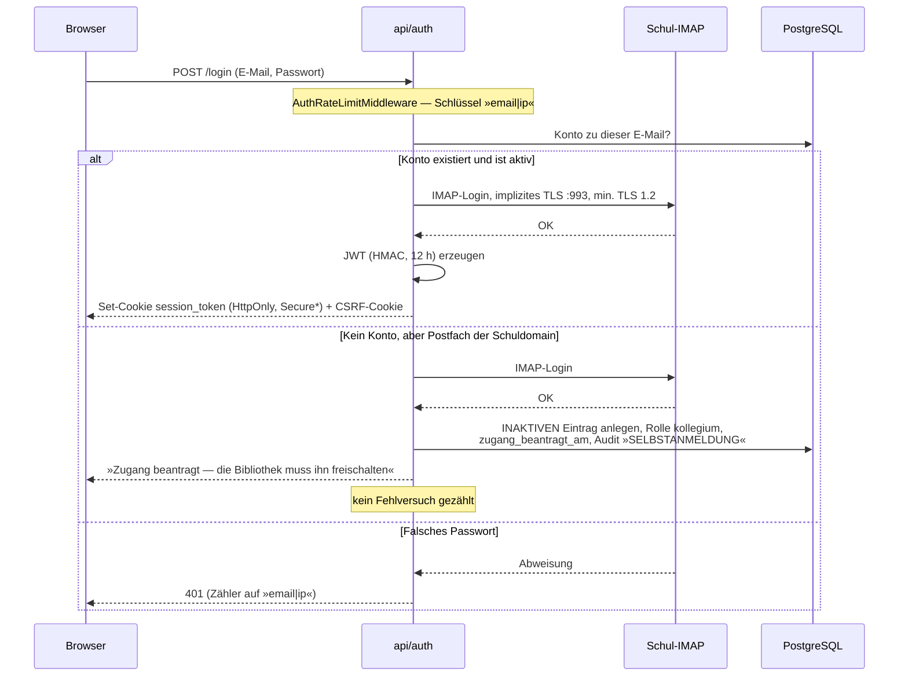
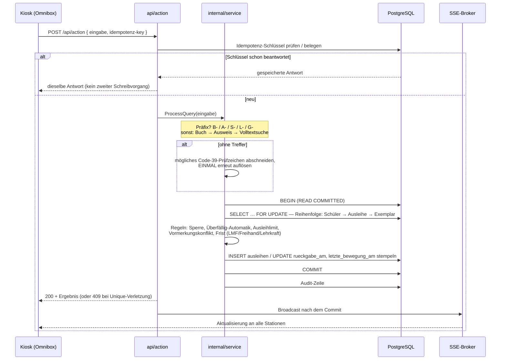
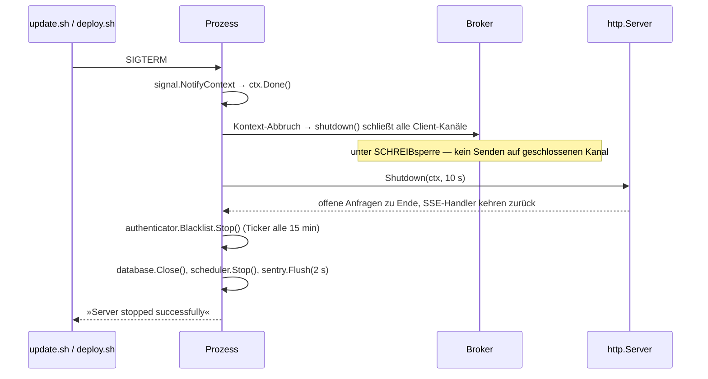

# 6. Laufzeitsicht

Stand: 26.09.2026

Zehn Szenarien, ausgewählt nach einem Kriterium: **Wo ist die Architektur an der
Arbeit?** Der Normalfall („Liste laden, JSON zurückgeben") kommt nicht vor — er erklärt
nichts.

| #  | Szenario                                                     | Zeigt                                                       |
| -- | ------------------------------------------------------------ | ----------------------------------------------------------- |
| 1  | [Anmeldung](#61-anmeldung-imap--jwt--csrf)                   | Identität, Sitzung, Rechteprüfung                            |
| 2  | [Scan am Tresen](#62-scan-am-tresen-der-kernablauf)          | Auflösung, Transaktion, Sperren, Konflikt, Echtzeit          |
| 3  | [Rückgabe mit Vormerkung](#63-rückgabe-mit-vormerkung)       | `SKIP LOCKED`, Nachrücken, Abholfach                         |
| 4  | [Doppelscan von zwei Stationen](#64-doppelscan-von-zwei-stationen) | Q1 im Ernstfall: warum der Index trägt                 |
| 5  | [Theke ohne Netz](#65-theke-ohne-netz--und-das-nachbuchen)    | Offline-Warteschlange, Uhrenversatz, neun Urteile            |
| 6  | [LUSD-Import](#66-lusd-import-zum-schuljahreswechsel)        | Zuordnung ohne Schlüssel, Karenz statt Sofort-Tilgung        |
| 7  | [Mahnlauf](#67-mahnlauf-und-die-mahnstufe)                   | Eine Schreibstelle, physischer Verwaltungsakt                |
| 8  | [Nachtlauf](#68-der-nachtlauf-dsgvo-backup-restore-probe)    | Reihenfolge, Verschlüsselung, Beweis statt Hoffnung          |
| 9  | [Bestellbestätigung durch den Händler](#69-bestellbestätigung-durch-den-händler) | Öffentlicher Token-Pfad, Atomarität      |
| 10 | [Deploy und Shutdown](#610-deploy-und-graceful-shutdown)     | Warum der Broker so gebaut ist                               |

---

## 6.1 Anmeldung (IMAP → JWT → CSRF)



\* `Secure` nach `ermittleCookieSecure()`: Vorgabe `true` außerhalb von
`local/development/test`; ein fehlender Wert warnt und wählt die **sichere** Richtung, ein
unlesbarer Wert bricht den Start ab.

**Bei jeder folgenden Anfrage** prüft `RequirePermission`:

1. Cookie lesen → JWT verifizieren (HMAC-only, `alg=none` ausgeschlossen),
2. Sperrliste (`revoked_tokens`),
3. **Kontostatus live in der DB** (aktiv, nicht gelöscht) — deshalb braucht es keine
   zusätzliche „Zombie-Session"-Prüfung,
4. Recht aus `role_permissions`, gecacht 60 s, abgesichert über den Epochenzähler,
5. UUID-Form der Pfadparameter.

Ein Datenbank-Aussetzer bei Schritt 3 ergibt **503**, nicht 401: Eine 401 würde den
Arbeitsplatz abmelden, obwohl die Sitzung gültig ist.

---

## 6.2 Scan am Tresen (der Kernablauf)



**Die vier Entscheidungen, die man an diesem Ablauf sieht:**

1. **Idempotenz vor Fachlogik.** Ein doppelt angekommener Scan darf keine zweite Buchung
   erzeugen — und keine zweite Sperrmeldung.
2. **Auflösung, dann Nachsicht.** Die Prüfzeichen-Korrektur greift nur, wenn der Scan *so
   wie er kam* nichts ergab, und nur einmal.
3. **Eine Tür für Ausleihe und Rückgabe.** Ist das Exemplar bereits ausgeliehen,
   entscheidet der Dienst selbst zwischen Rückgabe, Fremdrückgabe und Konflikt.
4. **Broadcast erst nach dem Commit.** Ein Broadcast davor würde einen Zustand verkünden,
   den ein Rollback gleich wieder einzieht.

---

## 6.3 Rückgabe mit Vormerkung

```
Rückgabe wird gebucht
   │
   ├─ SELECT … FROM vormerkungen v … FOR UPDATE OF v SKIP LOCKED
   │     └─ SKIP LOCKED, weil eine fremde Sperre auf einer ANDEREN Vormerkung
   │        den Rückgabevorgang sonst anhält — die Rückgabe darf nie warten
   │
   ├─ nächste wartende Vormerkung rückt nach → Status »abholbereit«, Abholfrist gesetzt
   ├─ Exemplar geht NICHT in den freien Bestand (reserviert liegt im Abholfach)
   └─ Theke bekommt den Abholfach-Hinweis: Titel + Frist, bewusst ohne IDs
```

Läuft die Abholfrist ab, räumt der stündliche Lauf (`23 * * * *`) die Reservierung ab. Ein
abholbereit reserviertes Exemplar geht in der Zwischenzeit nicht an Dritte — geprüft in
`pruefeVormerkungKonflikt`, mit einem eigenen PG-Test.

---

## 6.4 Doppelscan von zwei Stationen

Das ist der Fall, für den Q1 gebaut ist — und der Fall, über den die Dokumentation bis zum
11.08.2026 falsch informierte.

```
Station 1: Exemplar X → Schüler A        Station 2: Exemplar X → Schüler B
      │                                        │
      ├─ FOR UPDATE auf Schüler A              ├─ FOR UPDATE auf Schüler B
      │  (verschiedene Zeilen!)                │  (verschiedene Zeilen!)
      │                                        │
      ├─ keine gemeinsame Sperre ──────────────┤   ← hier trägt KEINE Zeilensperre
      │                                        │
      ├─ INSERT ausleihen (X, A) ✓             ├─ INSERT ausleihen (X, B)
      │                                        │      └─ uniq_ausleihen_aktiv_exemplar
      │                                        │         verweigert → SQLSTATE 23505
      └─ 200                                   └─ mapLoanCreateErr → 409 Conflict
```

**Der Scan eines Exemplars sperrt nicht das Exemplar, sondern die aktive Ausleihe.** Zwei
Stationen, die dasselbe Exemplar für **verschiedene** Leser scannen, greifen daher auf
keine gemeinsame Zeile — der partielle Unique-Index ist an dieser Stelle **der einzige**
Schutz, nicht der Hosenträger zum Gürtel. Wer ihn entfernt, verliert die Zusage.

Welcher Pfad welche Zeile sperrt:

| Pfad                       | gesperrte Zeile                                                            | Fundstelle                                                     |
| -------------------------- | -------------------------------------------------------------------------- | -------------------------------------------------------------- |
| Scan eines Exemplars       | die **aktive Ausleihe** (`ausleihen`)                                      | `GetActiveLoanByCopyIDTx` (`repository/loan.go`)               |
| Ausleihe an einen Leser    | die **Leser**-Zeile, über die Sicht `schueler`                             | `internal/service/loan_checkout.go`                            |
| Rückgabe mit Vormerkung    | die **Vormerkung** — `FOR UPDATE OF v SKIP LOCKED`, damit der JOIN nicht auch die nur gelesene Leser-Zeile sperrt (das könnte sich mit der Ausleih-Logik verklemmen) | `internal/service/loan_return.go`, `repository/vormerkung_nachruecken.go` |
| Geräte-Ausleihe            | die aktive Geräte-Ausleihe                                                 | `internal/service/device_service.go`                           |
| Nachbuchen                 | **zwei** Sperren in der festgelegten Folge: `leser`, dann `buecher_exemplare` | `internal/service/nachbuchen.go`                            |
| Schaden erfassen           | die **Ausleihe**-Zeile — der Schuldner wird aus ihr gelesen, nicht aus dem Request | `repository/schaden_melden.go`                          |
| Rückgabe (Trigger, seit Migration 137) | die **Leser**-Zeile des Ausleihers, **nach** der Ausleihe — gegen die festgelegte Folge ([Kapitel 11](11-risiken-und-technische-schulden.md), R2) | `trg_leser_stempel_rueckgabe` (`schema.sql`)          |
| Verlängerung (seit 24.09.2026) | die **Ausleihe**-Zeile; die neue Frist rechnet Go, nicht mehr SQL      | `handleExtendLoan` (`api/ausleihe.go`)                         |
| Sperren und Aufheben am Leser | die **Leser**-Zeile                                                     | `LockStudentHandler` (`api/student_lock.go`)                   |
| Auflagen zusammenfassen und lösen | erst die Advisory-Sperre der Auflagen, dann die **Titel**-Zeilen, nach `id` geordnet | `sperreAuflagen` (`repository/auflagen.go`)   |
| Schlagworte eines Titels, Schlagwort-Pflege | die **Titel**-Zeile bzw. die **Schlagwort**-Zeilen, mehrere nach `id` geordnet | `SetzeSchlagworte` (`repository/schlagworte.go`), `sperreSchlagwort` und `LoescheSchlagworte` (`repository/schlagworte_pflege.go`) |
| Bescheid, Inventur-Abschluss, Zusammenführen, Bestellmittel, Audit-System | jeweils die betroffene Zeile                  | `repository/bescheid_*.go`, `inventur_session_finish.go`, `schueler_zusammenfuehren.go`, `bestellung_mittel.go`, `audit_system.go` |

> **Warum hier die Ausleihe-Zeile steht:** Die frühere Kurzfassung `ARCHITECTURE.md` (bis
> 18.09.2026) nannte für „Schaden erfassen" die Exemplar-Zeile (`buecher_exemplare`,
> Fundstelle `damage.go`); `damage.go` enthält kein `FOR UPDATE`. Am 17.09.2026 am Code
> nachgemessen sperrt dieser Pfad die **Ausleihe**-Zeile
> (`SELECT schueler_id FROM ausleihen WHERE id = $1 FOR UPDATE` in
> `repository/schaden_melden.go`) — und zwar mit Absicht: Zwei parallele
> „Schaden melden"-Klicks würden sonst beide den Prüfschritt passieren und je einen
> Schadensfall anlegen; der Schüler würde für dasselbe Buch doppelt belastet. Im
> Produktivcode stehen am 26.09.2026 **20** `FOR UPDATE`-Anweisungen in 18 Dateien
> (Kommentare nicht mitgezählt; am 17.09.2026 waren es 14 in 13).

---

## 6.5 Theke ohne Netz — und das Nachbuchen

```mermaid
sequenceDiagram
    participant K as Kiosk (offline)
    participant IDB as IndexedDB
    participant N as POST /api/action/nachbuchen
    participant DB as PostgreSQL

    Note over K: Netz weg. Die Vorsilbe entscheidet jetzt allein,<br/>ob ein Scan Buch oder Ausweis ist — es gibt niemanden zu fragen.
    K->>IDB: Scan + gescannt_am + performance.now()-Marke
    Note over K: Netz zurück
    K->>N: Portion von 1–50 Einträgen (gescannt_am, gesendet_am, Schlüssel)
    N->>N: Uhrenversatz messen; ab Schwelle Logzeile »Uhr stellen«
    N->>DB: je Eintrag: Wirklichkeit buchen, Schlüssel genau einmal
    DB-->>N: je Eintrag ein Urteil
    N-->>K: 8 endgültige Urteile + »wiederholen«
    K->>IDB: nur endgültig beurteilte Einträge entfernen
    Note over K: Abweichungen bleiben als Nachbuch-Meldung am Server,<br/>bis jemand sie quittiert — nichts verschwindet still.
```

**Die Uhr ist hier kein Randfall.** Die Uhr eines Theken-Rechners wird oft genau in dem
Moment korrigiert, in dem das Netz zurückkommt — also *zwischen* Scan und Versand.
`gescannt_am` und `gesendet_am` müssen aber von derselben Uhr kommen, sonst rechnet der
Server den Versatz falsch. Deshalb wird der Scan-Zeitpunkt aus `performance.now()`
(springt nicht) und der Wanduhr von *jetzt* neu bestimmt, solange der Eintrag aus demselben
Seitenaufruf stammt.

**Die neun Urteile.** Endgültig sind `ausgeliehen`, `umgebucht`, `bereits_ausgeliehen`,
`zurueckgegeben`, `nur_reaktiviert`, `nicht_gebucht`, `veraltet`, `bereits_gebucht` — in
allen acht Fällen hat der Server den Fall abschließend behandelt. Das neunte,
`wiederholen`, heißt das Gegenteil: Der Server war nicht erreichbar, oder derselbe
Schlüssel wird gerade gebucht. Dann bleibt der Eintrag liegen und die Runde endet, statt
gegen dieselbe Wand zu laufen.

**Ein Schlüssel, den der Server gar nicht beantwortet hat, bleibt ebenfalls liegen.**
Schweigen ist kein Erfolg — bis zum 15.09.2026 galt es als erledigt.

---

## 6.6 LUSD-Import zum Schuljahreswechsel

```
Datei (xlsx ODER Semikolon-CSV mit BOM)
   │
   ├─ Kopfzeile SUCHEN (bis 10 Zeilen Titel/Schuljahr darüber), nicht voraussetzen
   │
   ├─ Zuordnungsstufe aus der Datei ableiten und im Banner NENNEN:
   │     LUSD-ID  >  Name + Geburtsdatum  >  nur Name (Notweg)
   │     Namensschlüssel ist die Normalform »suchnorm« (Müller ≡ Mueller ≡ MÜLLER)
   │
   ├─ Vorschau: neu · geändert · »vermutlich dieselbe Person« (Umbenennungspaare)
   │     └─ mehrdeutig in der Normalform (Bauer/Baur) → gemeldet, NICHT angefasst
   │
   ├─ Anwenden: jede wiedergefundene/angelegte Zeile stempelt lusd_bestaetigt_am
   │
   └─ Abgänger = war bestätigt, fehlt jetzt
         ├─ offene Ausleihe oder unbezahlter Schaden → gesperrt, Name/Anschrift bleiben
         ├─ nichts offen, Karenz > 0  → NUR gesperrt; abgaenger_seit startet die Uhr
         └─ nichts offen, Karenz = 0  → sofort anonymisiert
```

Import, nächtlicher Job und Selbstprüfung lesen **denselben** Einstellungsschlüssel
(`abgaenger_karenz_tage`, Vorgabe 90 Tage) und rechnen mit **demselben** Prädikat
(`repository.PredikatAnonymisierung`). Drei Rechner mit derselben Frage müssen dieselbe
Antwort geben — sonst anonymisiert der eine, was der andere noch für reparierbar hält.

Handanlagen, die nie in einem Export standen, bleiben unangetastet („nicht im Export").
Details: [LUSD.md](../LUSD.md).

---

## 6.7 Mahnlauf und die Mahnstufe

```
Überfällige ermitteln  →  Mahnliste je Klasse
        │
        ├─ Mail an die Klassenleitung        → Mahnstufe bleibt unverändert
        └─ PDF-Druck (api/mahnwesen_bulk.go) → Mahnstufe steigt, genau hier
```

Die Mahnstufe steigt **nur** beim PDF-Druck, weil der Druck der physische Verwaltungsakt
ist: Was nicht gedruckt wurde, ist nicht gemahnt. `mahnstufe` wird deshalb an genau
**einer** Stelle geschrieben — am 11.08.2026 zeilenweise nachgeprüft. Mahnlisten gehen an
die Klassenleitung, **nie** an Schüler.

---

## 6.8 Der Nachtlauf: DSGVO, Backup, Restore-Probe

```
00:00 UTC  RunNaechtlicheDSGVO
             1. RunGDPRAnonymizeLoans      bearbeiter_id nach 14 Tagen entfernen
             2. RunGDPRAnonymizeOldData    fällige Schüler-PII inkl. Audit-Spuren tilgen
             3. RunGDPRDeleteAbgaenger     Hard-Delete ab 30. Januar des Folgejahres,
                                           NUR anonymisierte Zeilen
             4. Lesehistorie   5. Anliegen
           └─ Die Reihenfolge ist die Zusage: Löschung NACH Anonymisierung, damit die
              Karenz für beides gilt.

02:30      Backup   pg_dump → gzip → AES-256-GCM (scrypt-Schlüssel)
                    → Volume /app/backups  → optional S3
                    Ohne BACKUP_ENCRYPTION_KEY überspringt sich der Job —
                    und die Selbstprüfung meldet genau das.

03:00      Audit-Aufbewahrung: Einträge jenseits der Frist löschen (Vorgabe 24 Monate)

So 03:30   Restore-Probe: jüngstes Backup in eine WEGWERF-Datenbank einspielen.
           Ergebnis wird Befund der Betriebsbereitschaft — ein Backup, das nie
           eingespielt wurde, ist eine Hoffnung, keine Sicherung.
```

Der Zeitplan ist auf **UTC** genagelt (`cron.WithLocation(time.UTC)`). Mit
`TZ=Europe/Berlin` und lokaler Zeitrechnung hätte die Nacht der Sommerzeit-Umstellung den
02:30-Job verschluckt — die Uhrzeit existiert dann nicht.

---

## 6.9 Bestellbestätigung durch den Händler

```
Bestellung abschicken
   │
   ├─ Bestellmail an den Händler: Positionsliste + Barcodebogen als PDF
   └─ Bestätigungslink /bestellung/<token>   ← Token im PFAD, für Händler ohne Konto
         │
         ├─ gespeichert wird nur der HASH des Tokens
         ├─ die Logzeile maskiert den Token (maskiereToken) — sonst stünde jeder
         │  verschickte Link im Klartext in einem Logfile, das in Tickets wandert
         │  (und die Hash-Speicherung wäre entwertet)
         └─ Bestätigen ist atomar: UPDATE … WHERE bestaetigt_am IS NULL
```

Der Händler druckt über denselben Link seine Etiketten und bestätigt die Bestellung selbst.
Das ist der einzige schreibende Pfad ohne Anmeldung — und er steht als solcher in der
Allowlist von `routes_authz_coverage_test.go`.

---

## 6.10 Deploy und Graceful Shutdown



**Warum das ein Architekturthema ist:** In der alten Broker-Bauweise blieb jeder
SSE-Handler in seinem `defer b.unregister <- …` stehen, sobald `Start` zurückgekehrt war.
`Shutdown` wartete auf eben diese Handler bis zum Timeout, und `main` endete mit
`os.Exit(1)`. Bei dauerhaft verbundenen Arbeitsplätzen war das **jeder** Deploy. Die
Migrationen laufen beim Start des neuen Containers von selbst; das Zeitfenster von 10 s ist
kürzer als der Heartbeat-Abstand und länger als jede normale Anfrage.
