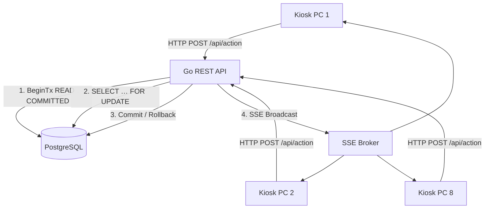

# Systemarchitektur & technische Konzepte

> Zuletzt aktualisiert: 2026-06-24

---

## Schichtenarchitektur (Go Backend)

```
HTTP Request
     │
     ▼
┌─────────────────────────────────────┐
│  Middleware-Kette (api/)            │
│  Rate-Limiter → Auth (JWT) →        │
│  CSRF → RBAC → Security-Header      │
└─────────────────┬───────────────────┘
                  │
                  ▼
┌─────────────────────────────────────┐
│  Handler / Router (api/)            │
│  HTTP-Parsing, Validierung,         │
│  JSON-Response                      │
└─────────────────┬───────────────────┘
                  │
                  ▼
┌─────────────────────────────────────┐
│  Service-Schicht (internal/service) │
│  Geschäftslogik, Orchestrierung,    │
│  PDF, E-Mail, Event-Dispatch        │
└─────────────────┬───────────────────┘
                  │
                  ▼
┌─────────────────────────────────────┐
│  Repository-Schicht (repository/)   │
│  SQL, pgx/v5, Mapping → Go-Structs  │
└─────────────────┬───────────────────┘
                  │
                  ▼
           PostgreSQL 15/16
```

---

## ⚡ Concurrency-Modell (8-PC-Lastverteilung)

Bis zu 8 Kiosk-Stationen arbeiten zeitgleich. Das System verhindert Race Conditions, Doppel-Scans und Inkonsistenzen durch drei Schichten:

### 1. Transaktions-Isolation & Row-Level-Locking
- **READ COMMITTED** (PostgreSQL-Standard): hoher Durchsatz bei parallelen Zugriffen
- **`SELECT … FOR UPDATE`** auf `buecher_exemplare` und aktive Ausleihe: ein zweiter paralleler Scan wartet, liest den aktuellen Zustand, bricht sauber ab

### 2. Datenintegrität durch Unique-Partial-Index
```sql
-- Migration 033 — verhindert zwei aktive Ausleihen auf demselben Exemplar
CREATE UNIQUE INDEX unique_active_loan
    ON ausleihen (exemplar_id)
    WHERE rueckgabe_am IS NULL;

CREATE UNIQUE INDEX unique_active_device_loan
    ON geraete_ausleihen (geraet_id)
    WHERE rueckgabe_am IS NULL;
```
- Schützt auch gegen TOCTOU-Race bei Idempotenz-Keys (atomare DB-Ebene, nicht nur Applikationsebene)
- Unique-Verletzung wird zu HTTP 409 Conflict gemappt (`mapLoanCreateErr`)

### 3. Echtzeit-Synchronisation (SSE Broker)
Nach jedem DB-Commit sendet der Server über Server-Sent Events (SSE) ein Update an alle verbundenen Clients. Alle Kiosk-PCs sehen denselben Zustand in Echtzeit.



---

## 🔄 Idempotenz-Keys

Jeder Scan-Request trägt einen `item.id`-basierten Idempotenz-Key:
- Doppelter Key → gespeicherte Antwort wird zurückgegeben (kein zweiter DB-Write)
- 5xx-Fehler werden nicht gecacht (Retry möglich)
- TTL-Cleanup läuft täglich (24h-Cron)
- **Zusätzliche Absicherung durch DB-Unique-Index** (Migration 033): selbst wenn zwei Requests mit gleichem Key gleichzeitig die Idempotenz-Prüfung passieren, verhindert der Index eine zweite aktive Ausleihe

---

## 🗄️ Datenbankdesign

### Katalog vs. Bestand (strikte Trennung)
- **`buecher_titel`** — Metadaten (ISBN, Titel, Autor, Verlag, Ziel-Jahrgang, LMF-Flag)
- **`buecher_exemplare`** — physische Instanzen (Barcode, Zustand, `ist_ausleihbar`)
- **`ausleihen`** — aktive und historische Ausleihen (verknüpft mit Exemplar + Schüler)

### JSONB-Erweiterbarkeit
Haupttabellen haben `erweiterte_eigenschaften JSONB DEFAULT '{}'` für ad-hoc-Attribute (Regalposition, Antolin-Punkte, externe IDs) ohne Schema-Migration:
- `buecher_titel.erweiterte_eigenschaften`
- `buecher_exemplare.erweiterte_eigenschaften`
- `audit_logs.details`

GIN-Indizes können bei Bedarf auf diese Spalten gelegt werden.

### Enum-Casing
`benutzer_rolle` ist ein PostgreSQL-ENUM mit lowercase-Werten: `admin`, `lehrer`, `mitarbeiter`.
SQL-Vergleiche müssen `LOWER(rolle::text)` verwenden (kein `= 'LEHRER'`).

### Migrations-Hygiene
- Migrationen sind nummeriert (`NNN_beschreibung.sql`) und werden via `schema_migrations`-Tabelle dedupliziert
- Die Seed-Liste in `schema.sql` muss exakt mit den Dateien in `migrations/` übereinstimmen (kein Phantom-Eintrag, kein fehlender Eintrag)
- Doppelte Zahlenpräfixe (003, 008, 021, 022) sortieren deterministisch und haben keine Reihenfolge-Abhängigkeit — Style-Smell, aber funktional korrekt
- **Idempotenz**: Alle Migrationen müssen `IF NOT EXISTS` / `IF EXISTS` / `DO $$ BEGIN … EXCEPTION WHEN …` verwenden

---

## 🏗️ Repository-Schicht — Fehlerbehandlung

Alle `rows.Next()`-Schleifen enden mit einer `rows.Err()`-Prüfung:
```go
for rows.Next() {
    // scan …
}
if err := rows.Err(); err != nil {
    return nil, fmt.Errorf("…: %w", err)
}
```
**Warum kritisch:** Ohne `rows.Err()` würde ein Verbindungsabbruch mitten in der Iteration als Erfolg behandelt — die zurückgegebene Liste wäre still unvollständig. In `audit_books.go` hätte dies dazu führen können, dass ein Titel trotz aktiver Ausleihen als "ausleihbar" behandelt wird.

---

## 📡 SSE Broker (Real-Time)

- Zentraler Event-Loop, keine Goroutine pro Client
- `RLock`/`Lock` verhindern Send-on-Closed
- Non-blocking Broadcast (gepufferter Channel) — ein langsamer Client blockiert andere nicht
- Heartbeat + Context-Abbruch bei Graceful Shutdown

---

## ⚙️ Background Jobs

| Job | Zeitplan | Funktion |
|---|---|---|
| GDPR Anonymisierung | Startup + täglich | `RunGDPRAnonymizeLoans` — löscht `bearbeiter_id` nach 14 Tagen |
| GDPR Abgänger-Löschung | Startup + täglich | `RunGDPRDeleteAbgaenger` — Hard-Delete nach Karenzzeit |
| DB-Backup | täglich 02:30 | `pg_dump` → gzip → AES-GCM |
| Idempotenz-TTL | täglich | Bereinigt abgelaufene Idempotenz-Keys (24h) |
| Cover-Sync | on-demand + täglich | Worker-Pool (8), Re-Entrancy-Guard, FAILED-Retry |

---

## 🔌 Externe Abhängigkeiten

| Paket | Zweck |
|---|---|
| `jackc/pgx/v5` | PostgreSQL-Treiber (Connection Pool, typsichere Queries) |
| `golang-jwt/jwt` | JWT-Signierung und -Verifikation (HMAC-only) |
| `chai2010/webp` | WebP-Dekodierung für Cover-Bilder (CGO) |
| `go-playground/validator/v10` | Struct-Validierung aller API-Payloads |
| `getsentry/sentry-go` | Error Tracking (optional via `SENTRY_DSN`) |
| `jung-kurt/gofpdf` | PDF-Generierung (Mahnwesen, Abgänger, Schäden) |
| `emersion/go-imap` | IMAP für E-Mail-Eingang |

### Build-Tags
- `//go:build odbc` — isoliert die `cmd/littera_migration`-ODBC-Abhängigkeit; Standardbuild (`go build ./...`) benötigt kein `unixODBC`

---

## 🎨 Frontend-Architektur (Svelte 5 Runes)

### Designsystem: Flat & Edge-to-Edge
- Kein Karten-/Kachel-Anti-Pattern auf Layout-Ebene
- Trennung durch `border-b border-gray-200` statt Box-Shadow
- Container: `max-w-5xl` bis `max-w-6xl`, `w-full`
- Labels: `text-sm font-medium text-gray-600`
- Wichtige Felder/Werte: `text-lg font-medium`
- **Bewahrt** als Karten: Modals, Toasts, Dropdowns, Cover-Galerie-Kacheln

### Komponenten-Regeln
- ≤ 200 Zeilen pro `.svelte`-Datei
- Logik-freie Teilkomponenten mit `{#snippet}` / `{@render}` für DRY
- Daten-Arrays in `.js`-Metadatendateien auslagern (z. B. `permissionMetadata.js`)

### State Management
- Svelte 5 Runes (`$state`, `$derived`, `$props`, `$bindable`) — lokal, kein globaler Store
- SSE-Reconnect mit Guards (`isLoggedIn`, Timeout)
- Offline-Queue: Items nur bei 2xx/permanentem 4xx entfernt; bei 5xx/Netzwerkfehler erhalten

### RBAC im Frontend
- Menü-Items werden client-seitig per Permission-Map geblendet
- **Die Autorität ist ausschließlich das Backend**: jede Datenabfrage ist permission-gated (`RequirePermission`)
- Erzwungene View ohne Berechtigung → 403, kein Datenleck
